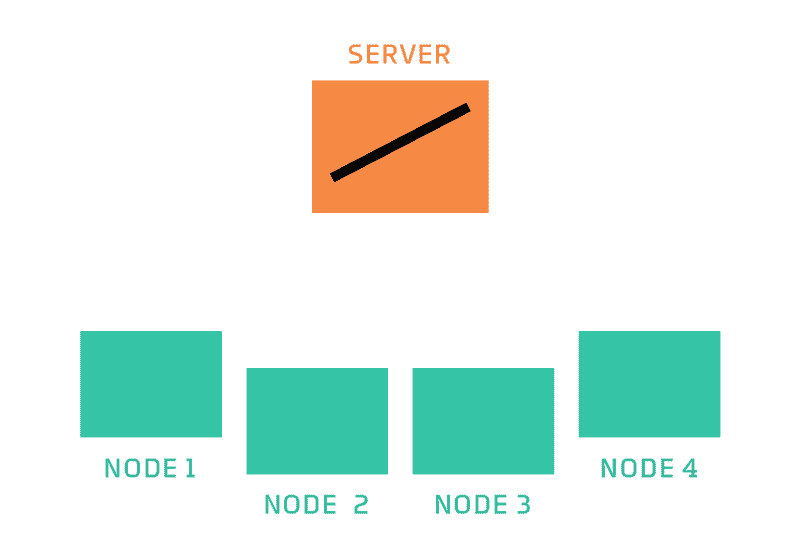

# 联邦学习:人工智能的未来

> 原文：<https://medium.com/analytics-vidhya/federated-learning-the-future-of-artificial-intelligence-41ddc6f2fd56?source=collection_archive---------17----------------------->

深度学习和人工智能领域的最新发展之一是“**联邦学习**的概念。

2017 年 4 月 6 日，星期四，谷歌人工智能在他们的博客中宣布了联邦学习的概念，这简直让机器学习爱好者、数据科学家和研究人员大吃一惊，并让他们相信这样的去中心化人工智能模型确实是可能的。

 [## 联合学习:没有集中训练数据的协作机器学习

### 标准的机器学习方法需要将训练数据集中在一台机器或数据中心。还有…

ai.googleblog.com](https://ai.googleblog.com/2017/04/federated-learning-collaborative.html) 

如上所述，联合学习的概念是 Google 在这篇博客中提出的。

***什么是联邦学习？***

我们中的许多人仍然想知道什么是联合学习。嗯，联合学习是一个涉及**设备上人工智能、区块链和边缘计算/物联网的交叉概念。**与其他传统的机器学习算法不同，联邦学习相信各种服务器的训练样本。

这意味着这是一种在多个分散的设备或服务器上训练算法的技术，这些设备或服务器具有它们自己的数据样本(本地数据样本),而不交换它们的数据。在来自本地数据的训练过程完成之后，修改的模型从这些本地服务器上传到一个集中式全局服务器，在那里根据从本地服务器接收的信息将改变应用到主模型。

那么它和传统的机器学习有什么不同呢？与在单个服务器中进行训练的机器学习技术不同，联合学习与这一概念形成鲜明对比，因为它将数据样本相同地分布在各个本地服务器上，并在训练完成后从这些服务器收集数据。

联邦学习概念

上图解释了联邦学习的概念。这里我们有两个组件:全局服务器(在上图中称为服务器)和本地服务器(称为节点)。

第一步涉及在各种数据样本上训练算法，以在全局服务器中生成模型。然后，这个模型分布在不同的本地服务器上。

本地服务器基于设备上存在的本地数据样本训练该模型，并相应地更新该模型。然后，全局服务器计算这些更新的本地服务器模型的平均值，并根据接收的信息训练全局模型。

这个过程被一次又一次地重复，直到产生具有最小误差和高精度的最佳模型，并且服务于有效地构建它的目的。

然而，在少数情况下，也可以看到整个过程是无编制的。这意味着没有中央服务器或全局服务器。每个本地节点将其输出发送到几个随机选择的其他节点，这些节点在本地汇总它们的结果。这减少了事务的数量，从而大大减少了时间和计算成本。

**联邦学习中训练算法的类型**

到目前为止，在本地全局服务器上进行的训练过程主要遵循两种算法:

*联邦随机梯度下降(FedSGD)和联邦平均(FedAvg)。*

**联邦随机梯度下降**

随机梯度下降

FEDSGD 的概念基于随机梯度下降，其中仅使用一个数据来近似全局最优，节省了大量时间和计算能力。

FEDSGD 是使用随机分数 C 和单个节点中存在的所有数据对该算法的直接变换。参数 C 被优化以选择该节点，然后梯度被服务器与每个节点上的训练样本的数量成比例地平均，并被用于进行梯度下降步骤。

**联邦平均法**

与 FEDSGD 不同，这里允许不止一次批量更新，因此更新的是权重而不是梯度。平均调整后的权重用于更新全局服务器中的模型。

**联合学习的应用**

联合学习确实是一个全新的概念，这些工作只是触及了可能的表面。

然而，谷歌键盘是联邦学习最著名的应用。

谷歌键盘

以前不可能上传每个用户的短信来训练单词猜测的预测算法。此外，这样的过程会劫持太多的用户数据。所以 Google Keyboard 提出了联合学习的新概念，这使得学习过程更加有效。

到目前为止，联合学习的应用还很有限，但是据说在不久的将来，随着越来越多的概率和可能性被发现，联合学习将会势不可挡。现在我们唯一能做的就是分析概念，等待和发现。正如一位智者曾经说过的那样:“*学习永不停止*”