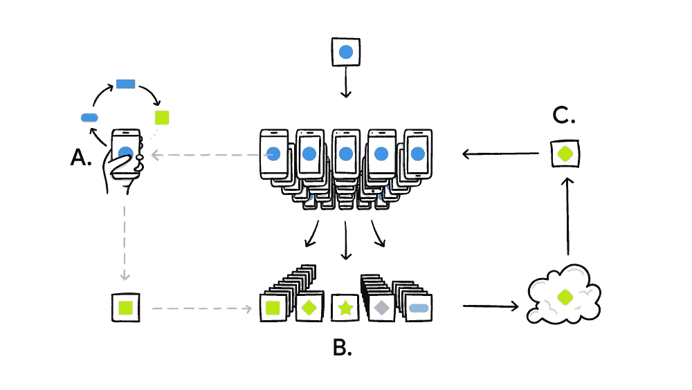

# 联邦机器学习

> 原文：<https://medium.com/analytics-vidhya/federated-machine-learning-c99dd5dec201?source=collection_archive---------1----------------------->

卢卡·布拉沃在 [Unsplash](https://unsplash.com?utm_source=medium&utm_medium=referral) 上的照片

这篇文章是关于联邦机器学习的，这是机器学习领域正在探索的最新和最著名的方法之一，它专注于利用分布式系统的力量来训练和增强机器学习模型。

随着物联网的出现和智能手机使用的增加，拥有数据的终端数量呈指数级增长。然而，传统的机器学习方法无法处理如此大规模分布的数据和训练模型。

传统的机器学习方法包括一个中央服务器来存储数据和训练模型。有两种方法可以使用这些训练好的模型。

1.建立数据管道，使所有数据通过中央服务器，该服务器托管用于进行预测的训练模型。预测结果然后通过仪表板共享或用于启动服务。这种模型在工业中被大量用于监控产品、提供推荐和其他类似的服务。该方法的缺点在于，由环境中存在的传感器/设备收集的所有输入都将被发送回中央服务器，然后处理后的结果将被发送回。这阻碍了模型根据环境快速学习和适应并提供实时结果的能力。

2.第二种方法是将训练好的模型发送到环境中直接交互的设备。随着硬件技术的进步，已经有可能拥有足够的处理能力来运行这样的预测模型。这种方法的一个好处是，预测发生在与收集输入相同的环境中，并且速度更快。然而，即使在这种用于持续学习的模型中，训练数据也要在每个设备上收集，然后发送回服务器，在那里模型被重新训练。

联合机器学习是一种方法，它使我们能够通过在设备本身训练模型来摆脱这种复杂性。这些经过训练的模型然后被发送回中央服务器，在那里它们被聚集(基本上它们的权重被调整)，然后一个合并的模型被发送回设备。它利用分布式计算的概念来保持对设备处的每个模型的跟踪、每个设备处的模型的聚集和重新分布。该方法非常有利于在手机、传感器等小型设备上运行低成本的机器学习模型。它确实是发展一个更美好的互联世界的门户。

下图给出了联邦机器学习方法的概述。

**联邦机器学习是如何工作的？**

联邦机器学习大致通过这些简单的步骤来工作:

1.将预测模型发送到设备

2.消费输入并做出预测。观察用户采取的行动，并将差异存储为训练数据

3.使用这些训练数据来改进预测模型。

4.将这些重新训练的模型从多个设备发送到中央服务器

5.重新分配和聚集所有不同模型的权重以创建一个模型

6.将重新训练的模型发送回所有设备

这些步骤循环重复，以实现持续学习的过程。

**联邦机器学习的好处**

联邦机器学习的一些主要好处是

1.**数据安全&隐私**:由于训练是在设备上进行的，只有模型被传输回来，这就避免了在一个中心位置存储大量高度敏感或个人数据的主要问题之一，而这些数据容易受到黑客的攻击。

2.**实时预测**:由于预测发生在设备本身，这种方法还消除了由于将输入传输回中央服务器然后将结果发送回设备而产生的时间延迟

3.**离线预测**:由于模型存在于设备上，即使没有可用的互联网连接，预测也能工作。只要设备能够获得输入，就可以利用预测模型来完成工作。

4.**最少的基础设施**:这种方法需要最少的硬件(我们的移动设备中可用的硬件已经足够)来运行机器学习模型，并真正将机器学习的力量发挥到极致。

**使用联邦机器学习**

这种方法很新，虽然使用范围有限，但已经在一些关键的地方使用。Google keyboards 是使用这种方法的主要例子之一。该技术非常强大，还有许多其他使用案例可以利用它，例如工业矿山、大型农场、穿越沙漠，在这些情况下，确保持续的互联网连接在基础设施和相关成本方面都是一项挑战。

**挑战**

一些主要挑战是

1.维护大规模分布式系统

2.始终与所有设备保持有限的连接

3.偏差或反馈方面的不平衡数据。然而，通过智能地选择在给定时刻从中获得反馈的设备，可以有效地减少这个问题

4.开发一种基础设施或模型，能够跟上该方法中包含的动态和持续学习的步伐

5.在高度分布的数据集上运行优化算法

**未来步骤**

目前，模型在设备上得到训练，并利用本地数据进行改进。下一个明显的步骤是开发跨设备训练模型的能力，以便每个模型可以从所有附近的设备学习。这仍在未来，但我们只能想象一旦这种方法开发出来，机器学习可以产生的效率和有用性。

**参考链接**

 [## 联合学习:没有集中训练数据的协作机器学习

### 标准的机器学习方法需要将训练数据集中在一台机器或数据中心。还有…

ai.googleblog.com](https://ai.googleblog.com/2017/04/federated-learning-collaborative.html)