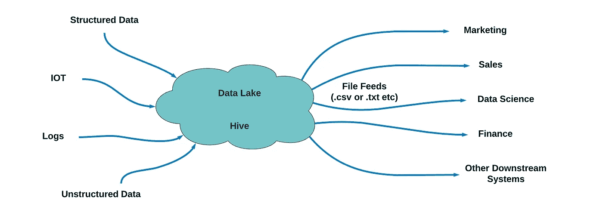
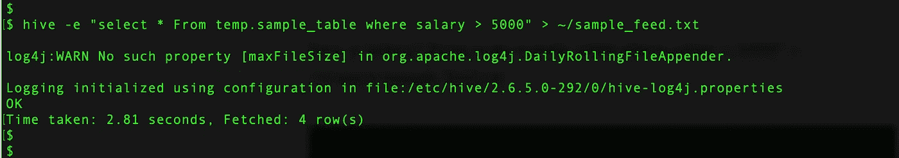
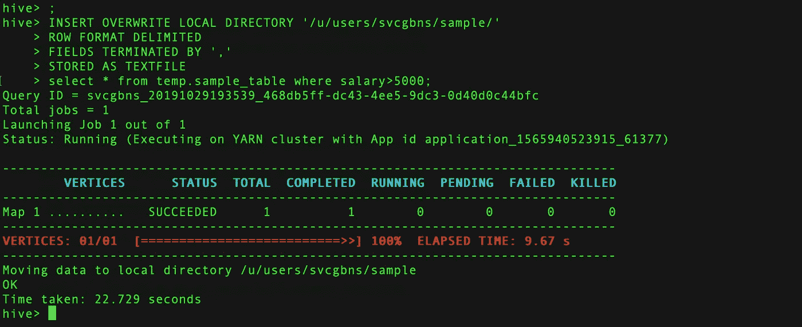

# 从存储在 HDFS 并使用 Hive 公开的数据生成 Feed 文件

> 原文：<https://medium.com/analytics-vidhya/feed-file-generation-from-data-stored-in-hdfs-and-exposed-using-hive-b19f68f2b3a1?source=collection_archive---------17----------------------->

# **问题陈述:**

作为分析的一部分，我们可能经常需要发送多个文件馈送(无论是在。txt 或者。csv 格式等)传送到下游系统用于不同的分析目的。
这可能是为了营销团队找出目标客户，或者是为了数据科学团队的机器学习模型等等。

在本文中，我们将探讨从存储在 HDFS 中的数据生成提要的一些选项，以便与第三方下游应用程序共享:

> **先决条件:** 数据已经存储在 HDFS，并使用 Hive 表向最终用户公开。
> 
> **注意:**我们也可以使用 MapReduce/Spark 来生成 feed 文件，但这需要编码技巧，因为它涉及大量的编码，而且代码的维护也不仅仅是 hive。
> 
> 因为我们已经将数据公开为 hive 表，所以我们可以直接使用 Hive 来生成提要文件。

在 Hive 中，有多种方法可以从可用信息生成文本或 csv feed 文件:

*   **使用 hive -e 的“查询”选项**
*   **使用 hdfs cat 选项**
*   **和我个人最喜欢的(我在用例中使用的)——使用插入覆盖本地目录选项**

让我们逐一讨论它们，并举例说明利弊:

1.  **使用 hive -e 的“查询”选项**

HIVE-e " HIVE _ QUERY " >/FEED _ LOCATION/sample _ FEED . txt

> 配置单元的“-e”选项用于从命令行运行 SQL，然后查询结果被重定向到输出文件，如下面的代码片段所示

可以在下面的代码片段中看到提要的内容:

该命令可以从命令行运行，不需要用户登录到 hive cli，并且输出文件也将在客户端节点上生成。

**优点:**

*   易于使用和列标题可以包括在文件饲料

**缺点:**

*   输出文件用制表符定界符生成，需要将制表符定界符转换成逗号定界符，这在生成大文件时会花费很多时间
*   如果属性需要用引号括起来，则没有规定

**2。使用 hdfs cat 选项**

Hadoop fs-cat HDFS://servername/user/hive/warehouse/databasename/table _ CSV _ export _ data/* > ~/output . CSV copy

我们可以从客户端节点发出该命令，输出文件将在本地生成，如下面的代码片段所示:

优点:

*   简单，在 CSV 输出中用逗号作为分隔符。

缺点:

*   无法生成列标题。
*   生成源时无法执行任何转换或过滤

**3。使用插入覆盖本地目录选项**

插入覆盖本地目录' FEED_LOCATION'
行格式分隔的
字段以'，'
结尾存储为文本文件
SELECT * FROM TABLE；

> OVERWRITE-该关键字用该命令生成的文件覆盖“FEED_LOCATION”中的所有内容
> 
> LOCAL-本地关键字的使用是可选的，如果输出文件预期在 HDFS 目录中生成，则不使用“本地”关键字，否则如果文件预期在本地目录中生成，则使用“本地”关键字

示例查询可以在下面的代码片段中看到:

输出提要文件可以在下面的代码片段中看到

**优点:**

*   在生成输出文件时，可以对 hdfs 中存储的数据应用任何转换或过滤
*   根据我们的用例，我们可以在 HDFS 目录或本地目录中生成输出文件
*   并不是所有的输出文件都需要用逗号分隔符来生成，我们可以在生成输出文件时定义自定义的分隔符
*   不需要额外的开销来将结果重定向到输出文件，我们只需要定义输出位置

**缺点:**

*   将生成名为“000000_0”的文件，可能需要额外的步骤将文件重命名为所需的名称

# 生成提要之前需要记住的其他提示

*   Hive 加载到表中时默认压缩数据，由于我们需要生成未压缩的数据，需要设置下面的 hive 参数
    SET hive . exec . compress . output = false；
*   您总是可以通过在 hive
    **SET hive . execution . engine = tez；上使用 tez 引擎来加速提要的生成。**
*   如果提要的属性需要用引号括起来，那么您可以将 **OpenCSVSerde** 与下面的命令一起使用:
    ***INSERT OVERWRITE LOCATION ' FEED _ LOCATION '
    ROW FORMAT SERDE ' org . Apache . Hadoop . hive . SERDE 2 . OpenCSVSerde '
    WITH SERDEPROPERTIES(
    ' separator char ' = '，'，
    ' quotech***

> SerDe 是 Serializer/Deserializer 的缩写。Hive 为 IO 使用 SerDe 接口。该接口处理序列化和反序列化，并将序列化的结果解释为要处理的单个字段。