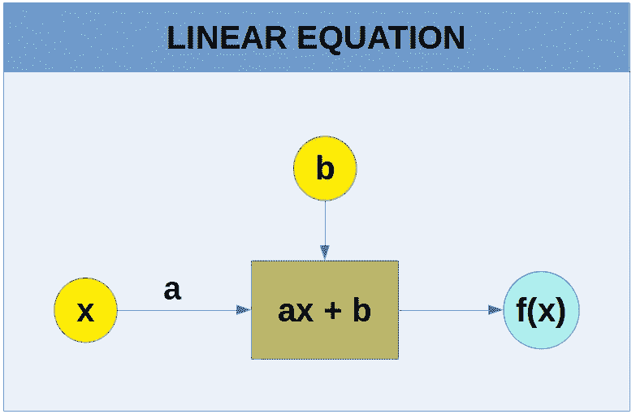
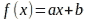
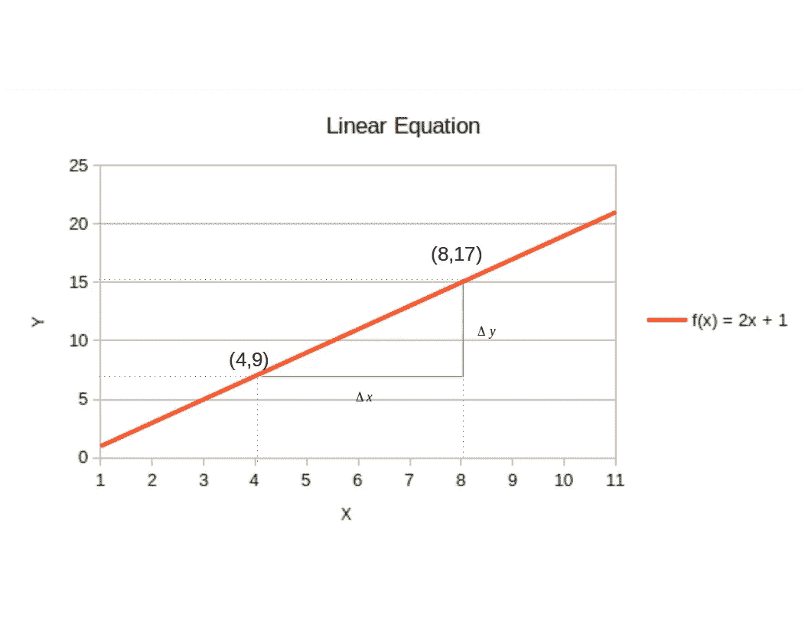
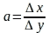
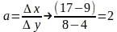
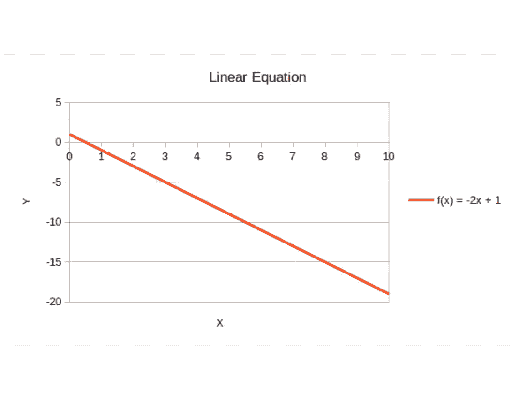
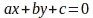
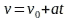

# 前向和反向连续传播—第 1 部分(作为神经网络构建模块的线性方程)

> 原文：<https://medium.com/analytics-vidhya/feed-forward-and-back-propagation-back-to-back-part-1-linear-equation-4f98abbd0d14?source=collection_archive---------22----------------------->

# 前言

理解什么是前馈和反向传播是掌握神经网络如何工作的关键。虽然这两个概念很简单，但我们很多人都在纠结数学，尤其是反向传播背后的那个概念。如果这是你的情况，就像我的情况一样，这一系列的文章就是为你准备的！

首先给最终读者一个安慰。我不会让梯度和梯度下降，微积分和多元微积分，导数，链式法则，线性组合，线性方程这些术语成为挡住你去路的巨石。希望在本系列结束时，这些术语将被读者视为强大的工具，以及它们如何简单地应用于构建神经网络。

# 线性方程

如果你记得你在最后几年的 K12 数学课上画了很多次的线的图形，你就知道什么是线性方程。如果你不记得了，我来帮你回忆一下。

一条直线的方程通常写成如下。

方程 1:2 维空间中的线性方程

方程 1 在 2 维空间是因为有两个变量: ***x*** *，*称为自变量；还有 ***f(x)*** *，*即因变量，因其值取决于 ***x*** *。*这条线画在一个平面上，平面有两个维度:宽和高，因此是二维空间。

下面的图 1 包含了线性方程 ***f(x) = 2x + 1*** 的图表。同一个方程的另一个常见符号是****y = 2x+1***。这暗示着 ***y = f(x)*** *。*如果我们给 ***x*** 赋值 4， ***y = 2*4 + 1*** ，则在 ***中产生 y = 9*** 。我们可以说点(4，9)正好在直线上。对***作类似的计算，x = 8*** *，*得出 ***y=17*** *，*换句话说*，*点(8，17)也在直线上。这两点都标绘在图 1 中。*

**

*图 1:公式 f(x) = 2x + 1 的曲线图*

*线性方程中 ***a*** 的值有什么解释？它是沿线点的变化率。通俗地说:随着我们改变 ***x*** 、 ***y*** 的值，成比例地改变*。变化率 ***a*** 又称为线的角度系数。角度系数？什么角度的？**

**还记得在直角三角形中，一个角的切线是三角形的对边除以邻边吗？因此，角度系数 ***a*** 是直线本身与 x 轴之间角度的正切，在几何学上解释为直线的倾斜度。所以 ***一*** 就是:**

****

**等式 2:角度系数或变化率**

**符号**δ**是希腊字母 Delta，人们应该把它解释为代表两个数字之差的符号。所以*之比就是 ***x*** 坐标之差除以 ***y*** 两个给定点的坐标之差。回到图 1(我发现这有助于理解这些概念的几何解释)，验证标有绿色***δx****的线段平行于 x 轴，而同样是绿色的***δy***平行于 y 轴。有了里面标绘的点，我们计算出 ***a*** 如下图。****

****

**图 2:角度系数示例**

**图 3 包含了另一个线性方程的例子，只是这次 ***a = -2*** 。**

****

**图 3:公式 f(x) = -2x + 1 的曲线图**

**如果我们从左向右走，一个正的 ***一个*** (如图 1)表示我们在上山。相反，如果 ***a*** 的值是负的(如图 3 所示),我们就要下山了。**

**这个简单的解释将是定义如何轻推*(神经网络术语中的 ***权重*** )和 ***b*** (神经网络术语中的*)以最小化***【f(x)***的输出误差的关键。 ***的错误 f(x)*** ？是啊！点坐标(神经网络术语中的数据)如图 1 所示，给了神经网络，而 ***a*** 和 ***b*** 则没有。因此，基于这些点，并且利用对*和*b 的初始猜测，网络通过最小化误差来学习它们的近似值，该误差是真实的***【f(x)***和计算值之间的差。******

**表达直线方程的另一种方法是使用所谓的“一般形式”，如下所示:**

****

**方程 3:线性方程的一般形式**

**所以***y******= 2x+1***的一般形式是 ***2x — y + 1 = 0*** 。将 ***x*** 和 ***y*** 代入图 1 中绘制的点(4，9)的坐标，我们得到:2 * 4–9+1 = 0，得出 8–9+1 = 0 为真。这同样适用于第(8，17)点。**

**现在让我们来代入，例如在 ***2x-y+1 中具有以下坐标的两个点:*** (5，5)和(5，15)。我们得到:第一点大于 0 的 2 * 5–5+1 = 6，小于 0 的 2*5 -15 +1 = -4。如果你回到图 1，很明显第一点在线下，而第二点在线上。**

**如果我们在图 3 的直线上替换点(5，-9)和(0，1)的坐标，我们得到:-2*5 +9+1 = 0 和-2 * 0+1–1 = 0，意味着这些点在直线上。而第(6，-5)点和第(6，-15)点呢？让我看看。对于第一个小于零的-2*6+5+1 = -6。对于第二个:-2*6+15+1 = 4，大于零。回到图 3，您将验证第一个在直线上方，而第二个明显在直线下方。**

**从这些例子中我们可以得出结论，利用线性方程的一般形式，所有应用于它的点产生一个负数意味着这些点在线上。应用于产生零的方程的所有点意味着这些点在线上，应用于产生正数的方程的所有点意味着该点在线下。这个概念是分类的基础。**

****实际应用——非匀速运动****

**在牛顿力学中，直线运动的速度由以下公式给出:**

****

**图 4:直线非匀速运动的速度**

**在上面的公式中 ***v*** 是我们要计算的速度(因变量)， ***t*** 是我们要计算的时间(自变量)，***【v₀】***是速度*= 0， ***a*** 是加速度。所以 ***a*** 就是速度在时间上的变化率(或者是它的几何解释的角度系数)。***

# **b 呢？**

**使上述任一等式中的 ***x*** = 0。这就产生了***f(x)***=***b***。所以点(0，b)是直线与 y 轴相交的地方。**

**结案了。**

# **第一部分的结语**

**在这一部分，我们了解了什么是线性方程。这不是很简单吗？是啊！这个简单而强大的概念是构建神经网络的基础之一。我们将在本系列的[第 2 部分](https://medium.com/p/585f7d137be1/edit)中看到如何组合一个或多个线性方程，就像我们在这里看到的那样，压缩***【f(x)】***的结果值，使其适合某个范围，比如 0 到 1 之间，以执行神经网络的前馈传递。**