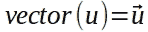

# 前向和反向背靠背传播—第 2 部分(多维空间中的线性方程)

> 原文：<https://medium.com/analytics-vidhya/feed-forward-and-back-propagation-back-to-back-part-2-linear-equation-in-multidimensional-space-585f7d137be1?source=collection_archive---------21----------------------->

# 前言

在本系列的第 1 部分([作为神经网络构建模块的线性方程](/@brunoosiek/feed-forward-and-back-propagation-back-to-back-part-1-linear-equation-4f98abbd0d14))中，我们看到了什么是线性方程，也对它们在构建神经网络中的重要性有所了解。

虽然有一点简化。我们只在二维空间中看到过线性方程。为什么这是一个问题？

答案是，世界上很多问题的自变量都不止一个。例如，考虑一个将症状映射到疾病的函数。通常情况下，患者必须表现出一种以上的症状才能被诊断为患病。以流感为例。发烧本身并不能导致流感的诊断。但是，体温加上头痛、流鼻涕、湿咳和疲劳等症状足以让医生诊断出流感病例。在这个假设函数中，症状是自变量，疾病是因变量。因此，如果我们想让我们的线性方程解决现实世界的问题，我们需要增加它的维度。这就是为什么我们需要把要定义的线性方程推广到 2 维以上的空间的原因。我们需要在 *n* 维空间中定义线性方程，其中**n为任意正整数。**

2 维以上线性方程组的几何解释不是一条线。在 3D 空间中它是一个平面，在 n 维空间中它是一个超平面。但是我们仍然希望定义一条线。这就是线性代数拯救我们的地方！OMG，线性代数？

如果您碰巧正在阅读这个故事，而没有阅读第 1 部分，请不要担心。在这一系列中，我与读者有如下约定:

# 契约:给最终读者的安慰

我不会让梯度和梯度下降、微积分和多元微积分、导数、链式法则、线性代数、线性组合和线性方程等概念成为阻碍你理解掌握神经网络所需数学的巨石。希望在本系列结束时，这些概念将被读者视为强大的工具，以及它们如何简单地应用于构建神经网络。

# 三维线性方程(3D)

其中 ***a*** 、 ***b*** 或 ***c*** 之一不为零的三维线性方程的一般形式为:

方程 1:三维线性方程的一般形式

这个方程的几何解释是一个平面。图 1 包含了方程定义的平面的标绘:***-4x+y-10z =-20***，其中点 A= (-2，2，3)，B= (3，2，1)，C= (-4，4，4)。

图 1:方程**定义的平面: -4x + y -10z = -20**

在三维空间中，直线由两个平面的交点定义。 ***-4x + y -10z = -20*** 和 ***x + 5y = 8*** 平面的交点如图 2 所示:

图 2:**--4x+y-10z =-20**与 ***x + 5y = 8*** 的交点

结论是，一个点要在线上，它必须满足两个方程。这种点的一个例子是点 a。

等一下。对我来说，理解正在发生的事情开始变得有点复杂。试图澄清可能会变得更糟。要处理这条线，我们必须处理它在 XY，XZ 和 YZ 平面上的投影，这些平面就是线。这些投影如图 3 所示。

图 3:XY、XZ 和 YZ 平面上的直线投影

一个观察。这篇文章中的所有数字都是用 [GeoGebra](https://www.geogebra.org/3d?lang=en) 绘制的。

是的。事情开始变得对我来说太复杂了。别担心，以防万一。我不会走这条路。为什么？因为这不是神经网络算法的基础。它们基于线性代数，这给了我们一种更简单的方式来表示和描述任意维数的直线，正如我们将会看到的，在这个故事的结尾，我希望，你们会同意。

# 线性代数

线性代数是数学的一个分支，涉及线性方程(作为上述平面的方程)、线性方程组的解、线性映射及其在向量空间和矩阵中的表示。

平面线性方程的解是满足它的无穷点集。因此，三维欧几里德空间(我们到目前为止一直在研究的空间)中的一条线是满足两个平面方程的解集。线性代数帮助我们处理我上面提到的复杂性。

我现在要做的是定义什么是向量，以及如何在向量空间中表示一条线。

简单地说，欧几里得空间中的矢量是一个有大小和方向的物体。图 4 显示了它的几何表示。

图 4:2D 的一个向量

在向量空间中，向量只是一个数字数组，正如我们在下面的等式 3 中所看到的。这里我将采用以下约定:数组将是一个列数组，如下所示。

以及:

***矢量(u)*** (黄色)有一个量级，即 a 点 ***=(0，0)*** 和 b 点 ***=(2，2)*** 之间的距离，以及一个由角度 ***α*** 给出的方向。

等式 2: **向量(u)**

考虑到上述给定点和等式，我们有:

等式 3: **向量**(**u)=向量空间**中的 b-a

应该把 ***读成 vector(u)*** as，从点 ***a*** 开始，在 ***x*** 维度上推一个对象 2 个单位，在*维度上也推两个单位，到达点 ***b*** 。*

*在图 5 中，再次绘制了上面绘制的相同的 2D 向量，只是这次是 3D 的。*

**

*图 5:3d 矢量*

*下面的等式 4 与上面的等式 3 相同。不同的是，后者在 2D，而前者是 3D 的。*

**

*等式 4: **矢量** ( **u)=b-a***

*很酷不是吗？在向量空间中，代数大大简化了，因为它与维数无关。*

*让我们考虑点 c=(5，3)并计算 ***向量(v)*** 如下所示:*

**

*图 6: c = b +矢量(v)*

**

*等式 5:计算**向量(v)** 的值*

****vector(w)*** 在 2D 和 3D 中都是 ***vector(u)*** 加 ***vector(v)*** 的值是多少？*

**

*方程式 6:**2D 向量(w) =向量(u) +向量(v)***

**

*等式 7:**3D 中的矢量(w) =矢量(u) +矢量(v)***

*2D 和 3D 中的 ***矢量(w)*** 的几何表示如下:*

**

*图 7:**2D 矢量(w)***

**

*图 8:**3D 中的矢量(w)***

*为了定义向量空间中一条直线的方程，我们还需要一个运算，即标量乘法。*

*标量乘法就是将一个矢量的所有坐标乘以一个数。形式上:*

**

*等式 8:标量乘法*

*在图 9 的例子中，其中产生的矢量，即 ***【矢量(u)*** 乘以 ***λ=2*** 和**λ= 0.5，* 的标量相乘的结果是红色的:**

**

*图 9:标量乘法示例*

*当我们把一个矢量乘以一个标量时，这个新矢量方向相同，大小不同。现在我们有了定义向量空间中直线方程的所有工具。这个等式是:*

**

*方程 9:向量空间中一条直线的方程*

*其中 ***a*** 是直线上的已知点，而 ***矢量(u)*** 给出了它的方向。通过使 ***λ*** 的范围从-∞到+∞，我们可以在向量空间中表示直线上的任意无穷多个点。*

*几何上，考虑到点 O=(0，0)，点 A=(2，2)，点 B=(6，4)，点 C=(10，6)和点 E=(-2，0)，我们有:*

**

*图 10:一条线作为矢量和的几何可视化*

*乍一看，上面的数字似乎令人困惑。所以让我们补救一下。 ***矢量(w)*** 是图 7 中绘制的同一个矢量，即 ***矢量(u)*** 【黑色箭头】加上 ***矢量(v)*** 【红色箭头】之和。*

**

*方程式 10: **向量(w)***

****【vector(w₁】)***【蓝色虚线箭头链接点 o 到 c】是 ***矢量(u)*** 加 2 * ***矢量(v)*** 【黄色箭头链接点 a 到 c】之和。本例中 ***λ = 2*** 。*

**

*方程式 11: **向量(w *₁* )***

****【vector(w₂】***【蓝色虚线箭头链接点 o 到 e】是 ***矢量(u)*** 减去 ***矢量(v)*** 【黄色箭头链接点 a 到 e】之和。在这种情况下 ***λ = -1****

**

*方程式 11: **矢量(w *₂* )***

*我们现在可以按照上面等式 9 所示的一般格式来定义上面的线的等式:*

**

*等式 12:向量空间中的等式*

*但是还缺少一样东西。从上面的方程和图 10 中红色虚线绘制的线 ***y = 1/2x+1*** 的方程是什么关系？换句话说，我们如何从向量空间的方程转换到欧几里得空间的方程？*

*让我们制作:*

**

*然后:*

**

*这需要:*

**

*由于 **λ** 必须相等:*

**

*导致:*

**

*为了形式化 n 维向量空间中的直线方程，我将稍微改变一下符号。不使用字母作为坐标，像 ***x*** 和 ***y、*** 我将使用字母*加上下标，像 ***x₁*** 和 ***x₂.*****

****

**等式 13:n 维直线的等式**

**因此，等式 9 是等式 13 的简化形式。它们的意思是一样的。**

# **第二部分的结语**

**当我们开始处理许多特征，换句话说，许多独立变量时，我们看到在向量空间中处理大大简化了数学。所以要定义一条直线，我们只需要知道直线上的一个点和定义它在空间方向的向量。**

**在本系列的第 3 部分中，我们将看到如何将 n 维线性方程组合在一起，以构建我们都知道的神经网络。**

**当我发布第 3 部分来更新这个系列时，请在这里查看。到时候见！**