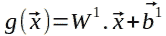
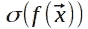

# 背对背前馈和反向传播—第 3 部分(神经网络的正向传递)

> 原文：<https://medium.com/analytics-vidhya/feed-forward-and-back-propagation-back-to-back-part-3-neural-networks-forward-pass-559f57a437f2?source=collection_archive---------9----------------------->

# 前言

在本系列的第 1 部分([作为神经网络构建模块的线性方程](/@brunoosiek/feed-forward-and-back-propagation-back-to-back-part-1-linear-equation-4f98abbd0d14))中，我们看到了什么是线性方程，也对它们在构建神经网络中的重要性有所了解。

在第 2 部分([多维空间中的线性方程](/analytics-vidhya/feed-forward-and-back-propagation-back-to-back-part-2-linear-equation-in-multidimensional-space-585f7d137be1))中，我们看到了如何处理向量空间中的线性方程，这方便了我们处理许多变量。

现在，我将向您展示如何将一个线性方程嵌入另一个线性方程(数学上称为函数合成)来构建神经网络。然后，我将继续讲述权重矩阵和特征向量的线性组合如何帮助我们解决前馈过程中涉及的所有数学问题，并以一个工作示例结束本文。

本系列有一个咒语(安慰的话)，我将在下面重复一遍，以防最终读者没有阅读第 1 部分。

# 咒语:给最终读者的安慰

我不会让梯度和梯度下降、微积分和多元微积分、导数、链式法则、线性代数、线性组合和线性方程等概念成为阻碍你理解掌握神经网络所需数学的巨石。希望在本系列结束时，这些概念将被读者视为强大的工具，以及它们如何简单地应用于构建神经网络。

# 功能组成

如果线性方程是神经网络的构建模块，那么函数组合就是将它们绑定在一起的东西。太好了！但是什么是函数构成呢？

让我们考虑下面的两个线性方程:

等式 1:函数组合

这里有什么不同？不同的是，为了计算 ***f(x)*** 的值，对于任意给定的 ***x*** ，我们首先需要计算 ***g(x)*** 的值。这个简单的概念被称为函数组合。

上面的定义和符号虽然正确，但不是常用的。函数合成通常被定义为将函数***【g(x)***的结果应用于函数***【f(x)***的运算，产生函数***【h(x)***。于是: ***h(x) = f(g(x))。*** 另一种批注是:***(f ∘g)(x)=f(g(x))***。并且上述等式被写成如下:

等式 2: **h(x)** 写成 **f(x)** 和 **g(x)** 的合成

示意性地，上述函数组合可以如图 1 所示绘制。

图 1:描述为网络的功能组合

上图中的 ***x*** 是输入，或者自变量。该输入乘以角度系数 ***a* ₂** ，再加上 ***b* ₂** 得到 ***g(x)*** 。依次， ***g(x)*** 乘以*再加到*得出 ***f(x)*** 。**

**我觉得这真的很酷！我们不是离神经网络越来越近了吗？**

**相信我。如果你理解了这两个概念(线性方程和函数组合)是什么，那么你在数学上就理解了 80%的前馈神经网络是什么。剩下的就是理解如何添加额外的独立变量(***x₁******x₂***，…， ***xₙ*** )来使我们的神经网络能够处理许多(可能是大多数)真实世界的问题。**

**在本系列的第 2 部分中，我们看到了在处理 n 维线性方程时，在向量空间中工作是多么容易。为此，我们需要两个额外的简单向量操作:向量和矩阵转置；还有向量和矩阵的点积。**

# **线性代数:向量和矩阵转置**

**向量转置是列向量到行向量的变换，反之亦然，即行向量到列向量的变换。形式上:**

****

**等式 3:向量转置**

**类似地，矩阵转置包括将行变为列，反之亦然，如下所示。**

****

**等式 4:矩阵的转置**

# **线性代数:点积**

*****【vector(u)=(u₁、u₂,…、uₙ)*** 与***【vector(v)=(v₁、v₂,…、vₙ)*** 的点积由下式给出:**

****

**等式 5:两个向量的点积**

**而矩阵****【矢量(u)*** 之间的点积是:***

****

**等式 6:矩阵和向量之间的点积**

**从上面的公式我们可以看出，两个向量需要有相同的维数 ***n*** 。两个向量的点积是一个实数(一个标量)。在矩阵和向量的情况下，矩阵的行数必须等于向量的列数。后者的点积产生一个列向量。**

# **二维函数合成**

**图 2 是图 1 中包含的模式，增加了 ***、x₂*** 。**

****

**图 2:一个二维函数组合**

**数学上:**

****

**现在让我们考虑函数***【g(x₁】***的角度系数的向量为***【vector(aᵍ)=(a₂，a₃)*** 并且输入的向量为 ***向量(x) = (x₁，x₂)*** 我们可以将函数 ***g(x₁，x \8307; 18】***重写为:**

****

**考虑到***【vector(aᶠ)=(a₁】0)***我们可以把***【f(x₁】【x₂】***改写为:**

****

**在上述两个方程中，矢量的乘法实际上是这些矢量的点积，产生如上所述的标量。**

# **神经网络前馈通路**

**要达到神经网络前馈传递几乎没有什么需要添加的。它只是将输入向量提交给***(∘g)(x₁、x₂)=f(g(x₁、x₂)，*** 计算结果，如上面图 5 所示。**

**在真实的神经网络中，仍然存在附加的函数组合，即将函数***【g(x)】***和 ***f(x)*** 的输出提交给挤压函数。最常见的一种是下面描述的 Sigmoid 函数(σ(x))，它将所有输出转换到(0，1)范围内:**

****

**等式 7: Sigmoid 函数**

**对这种挤压功能的需要，在神经网络术语中称为激活功能，将在本系列的另一篇文章中阐明。现在可以说，这种组合使网络能够学习非线性模式。**

# **一个例子**

**在本例中，我们将使用 2 层网络。第一层是隐藏层，第二层是输出层。在网络的层数中，我们不考虑输入层。网络如下图所示。**

****

**图 3:一个两层神经网络**

**在这里，我们改变了我们正在使用的术语，使之更接近我们通常在神经网络文档中找到的术语。我们使用字母*作为角度系数。现在我们就用字母 ***w*** (重量)。***

**上述网络接收两个输入: ***x₁*** 和 ***x₂.*** 隐藏层有两个节点( ***H1*** 和 ***H2*** )，而输出层有一个节点( ***O1*** )。所有节点都有一个名为 bias 的固定输入，如图 6 用**和 ***b₃.来表示*******

**在输入层和隐藏层之间有 4 个权重。w 中的上标 1 是对这些权重的引用，因为 w 是对隐藏层和输出层之间的权重的引用。下标 ***w ₁₁*** 是对***【x₁】***和 ***H1 之间的权重(或角度系数)的引用。*** 重量 ***w ₂₁*** 是指 ***x₂*** 和 ***H1 之间的角度系数。*** 同样地我们有 ***w ₁₂*** 作为重量介于****H2***和 ***w ₂₂*** 之间的重量*和 ***H2。*******

**当我们在向量空间中工作时，我们可以用矩阵 ***W*** 来表示所有提到的权重，如下所示:**

****

**有了这个***【g(x)***就变成了下面的等式其中**w 和 ***矢量(x)*** 实际上是它们和 ***矢量(b)***=(***b₂***，***b₃*******

********

****节点 ***H1*** 的结果是这样的:****

********

****考虑到 ***向量(b ) = (b₁，0)，*** 同样，我们得到的是*隐藏层和输出层之间的权重矩阵，为:*****

**********

********f(x)*** 中的屈服等于:*****

********

****网络的输出为:****

********

# ****结论****

****我们看到，神经网络的前馈过程基本上由向量空间中的线性方程的函数组合组成。示例的图 3 中所示的网络也被称为多层感知器(MLP ),在图像和文本分类中具有有趣的结果。****

****在本系列的第一部分中，我们学习了如何在二维空间中找到线性方程的角系数。在具有许多层和多个维度的神经网络中，计算所有权重(角度系数)和偏差的过程称为反向传播，这是本系列的主题。****

****请关注此空间的更新！****