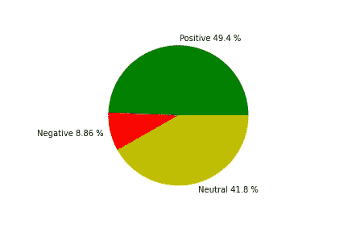

# 使用 Tweepy 和 TextBlob 在 Python 中进行反馈分析

> 原文：<https://medium.com/analytics-vidhya/feedback-analysis-in-python-with-tweepy-and-textblob-ff4d7f39ff99?source=collection_archive---------16----------------------->

产品或服务的反馈对任何组织的发展都是至关重要的。最终用户对我们产品的评价让我们了解到在哪些地方和哪些方面需要改进。这有助于产品和服务的改进，而产品和服务是任何行业发展的支柱。

反馈分析是一个宽泛的术语——反馈分析采用了许多方法。一种这样的方法是情感分析。情感分析显示了一个特定的句子有什么情感。对于这种应用，它们被分为三个主要类别——阳性、阴性和中性。

# 履行

这个项目分为 4 个部分——导入库，实例化一个类，最后执行分析。让我们详细探究每一部分。

## 第 1 部分—导入必要的库

让我们开始实施我们的项目。这里的任务是从标签下的用户那里提取反馈，看看大多数用户对这个话题的看法——积极的、消极的或中立的。我们这里使用的数据库是 Twitter 数据库，我们使用 Twitter API 来访问它。

让我们从导入必要的库并理解每个库的作用开始。

```
import re
import tweepy
from tweepy import OAuthHandler
from textblob import TextBlob
import datetime
import matplotlib.pyplot as plt
from decimal import *
```

re 是一个 python 库，用于处理正则表达式。我们在这里使用它通过删除不需要的符号来清理推文。

**tweepy** 包含 twitter API 来验证您的 twitter 账户，并从特定的标签中获取推文。

**texblob** 是一个自然语言处理库，它返回我们传递给它的语句的极性或情绪。

**matplotlib** 用于绘制和可视化最终结果。

**十进制**用于处理十进制数。在这里，它被用来设置每一类情感的百分比值的精度，使其更有意义。

## 第 2 部分—实例化一个类

下一步是建立一个类，该类将验证 twitter 帐户，并提供获取、清理和分析数据的功能。

```
class SentimentAnalysis(object):p_tweets=0     #count of positive tweets
  n_tweets=0     #count of negative tweets
  neu_tweets=0   #count of neutral tweets
  total_tweets=0 #count of total tweets#initialize the object with user credentialsdef __init__(self):consumer_key = ‘your_consumer_key’
    consumer_secret = ‘your_consumer_secret’
    access_key = ‘your_access_key’
    access_secret = ‘your_access_secret’try :self.auth = OAuthHandler(consumer_key,consumer_secret)
       self.auth.set_access_token(access_key,access_secret)
       self.api = tweepy.API(self.auth)except : 
       print(“Authentication failed\n”)#clean the tweet by removing unwanted symbols
  def clean_tweet(self, tweet):
    return ‘ ‘.join(re.sub(“(@[A-Za-z0–9]+)|([0-9A-Za-z \t]) |(\w+:\/\/\S+)”, “ “, tweet).split())#fetch the tweets and store them
  def fetch_tweets(self,query):startdate = datetime.date(2020,3,24)
    enddate = datetime.date(2020,4,24)try:fetched_tweets = tweepy.Cursor(
      self.api.search,q=query + “ -filter:retweets”,
      lang=”en”,
      since=startdate,
      tweet_mode=’extended’,
      until=enddate).items()

      for tweet in fetched_tweets :
          self.total_tweets = self.total_tweets + 1
          self.AnalyseTweet(tweet.full_text)except tweepy.TweepError as e:
       print(str(e))def AnalyseTweet(self,tweet):
      res = TextBlob(self.clean_tweet(tweet))if res.sentiment.polarity > 0:
         self.p_tweets = self.p_tweets + 1if res.sentiment.polarity == 0:
         self.neu_tweets = self.neu_tweets + 1if res.sentiment.polarity < 0:
         self.n_tweets = self.n_tweets + 1
```

类的构造函数(__init__())执行授权过程。要成功授权一个账户，需要有 4 个与你的 Twitter 账户相匹配的凭证。这些可以通过登录你在 developer.twitter.com[的账户并创建一个应用程序来获得。创建应用程序后，将向您显示凭据。回到程序，如果授权成功，您可以继续从数据库获取 tweets。](http://developer.twitter.com)

fetch_tweets()方法获取用户作为参数传递的 hashtag 下的 tweets。推文可以根据日期和数量进行过滤。

开始和结束日期可以在函数调用中提供，它返回该日期范围内的所有 tweets。为了限制收集的 tweet 的数量，方法 items()接受一个数值作为参数，该参数将只获取指定数量的 tweet。该函数在 JSON 对象中返回结果。

遍历每个 JSON 对象，增加 tweet 的总数，并发送每条 tweet 以分析其情绪。full_text 属性将包含获取的完整 tweet，其他属性包含关于获取的 tweet 的元数据。

这就把我们带到了 AnalyzeTweet(tweet)方法。每个 tweet 都作为该方法的一个参数被接收，并被发送到 TextBlob 以对其极性进行分类。极性是表述观点的专业术语。

在它被发送到 TextBlob API 之前，使用正则表达式进行一个小的清理，以删除 tweet 中使用的不需要的符号。推文的文本部分最为重要。

极性> 0 表示陈述有积极的情绪

极性< 0 implies statement has a negative sentiment

Polarity == 0 implies the statement has neutral sentiment

For the occurrence of each case, respective variables for positive, negative, or neutral are updated to keep track of the count of each case. These are later used in measuring the distribution of each among the results.

## Part 3 — Generating results and Visualisation

Now we have the functionality required for generating results, let us make an instance of the SentimentAnalysis class and invoke each method to generate the result.

```
getcontext().prec=3sa = SentimentAnalysis()sa.fetch_tweets(“#Google”)tweets_count = [ sa.p_tweets,
                 sa.n_tweets,
                 sa.neu_tweets ]labels = [ “Positive “ + str(Decimal((sa.p_tweets /sa.total_tweets)) * 100) + “ %”,
“Negative “ + str(Decimal((sa.n_tweets / sa.total_tweets)) * 100) + “ %” ,
“Neutral “ + str(Decimal((sa.neu_tweets / sa.total_tweets)) * 100) + “ %” ]plt.pie( tweets_count,
labels=labels,
colors=[‘g’,’r’,’y’]
)plt.show()
```

The getcontext().prec = 3 sets the precision of percentage values of the sentiment distribution to 3 to make it look more meaningful. For a large number of fetched tweets, the percentage presence of each sentiment can be shown as a high precision floating point number ( Eg: 45.349832938 %). Reducing this to 3 digits will make it was 45.3 %.

Rest steps involve making an instance of the SentimentAnalysis class and invoking the fetch_tweets() method by passing the required hashtag as the parameter. The distribution of each sentiment will be stored in the data members ***p_tweets*** (正极) ***n_tweets*** (负极) ***neu_tweets*** (中性)。

***total_tweets*** 数据成员存储获取的 tweets 总数。

***标签*** 是一个列表，以 ***情感<空间>百分比 _ 分布*** 的格式存储饼状图中要显示的文本

最后，绘制饼图来可视化分布并得出结论。下面是一个生成可视化的例子。



生成的可视化

绿色对应积极的推文，红色对应消极的推文，黄色对应中性的推文。

对于上述情况，积极和中立似乎就在附近，需要改进产品/服务，由于负面推文数量较少，一旦主要问题得到解决，就可以对其进行调查。

# 缺点

我们制作的系统非常简单，而且关于最终用户的反馈信息非常丰富。这个系统的后备是它没有定义问题是什么——它只描述了用户如何看待产品/服务。这仅提供了对产品/服务“状态”的基本了解。因此，系统本身并不能保证完整的分析报告。

类似地，当有大量推文时，仔细检查每个用户的反馈并确定需要改进的地方变得不切实际。这种情况需要使用语言模型来检测与特定产品/服务相关的改进领域。因此，这两个系统结合起来可以给出完整的分析报告。

感谢阅读！

在 GitHub 上找到这个项目:[https://GitHub . com/Vishnu-u/Feedback-Analysis-in-Python-with-Tweepy-and-text blob](https://github.com/vishnu-u/Feedback-Analysis-in-Python-with-Tweepy-and-TextBlob)

在 LinkedIn 上找我:【https://www.linkedin.com/in/vishnuu0399/ 

更多地了解我:https://bit.ly/vishnu-u

# 参考

【www.geeksforgeeks.com 

[www.developer.twitter.com](http://www.developer.twitter.com)

[www.stackoverflow.com](http://www.stackoverflow.com)

[www.pypi.org](http://www.pypi.org)