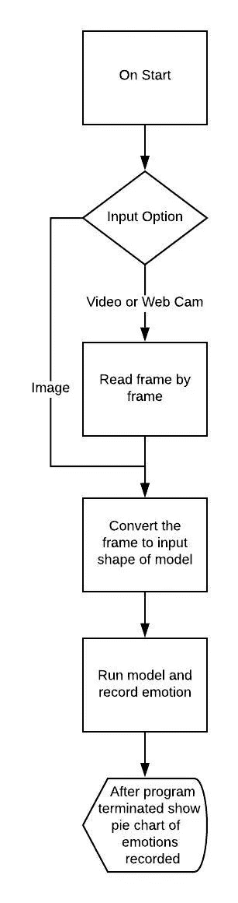
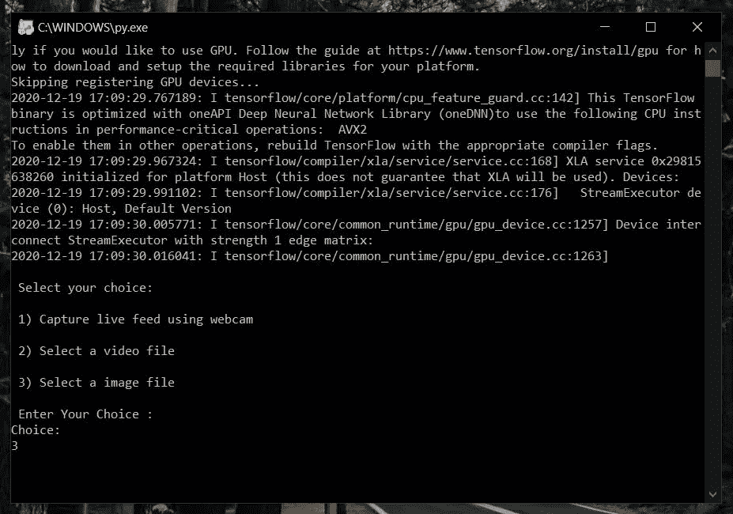
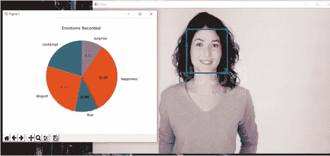

# 使用面部情感识别的反馈系统

> 原文：<https://medium.com/analytics-vidhya/feedback-system-using-facial-emotion-recognition-e4554157a060?source=collection_archive---------16----------------------->


# **简介:**

> 反馈是现代教育的重要组成部分之一，它不仅有助于教师的成长，也有助于学生提出自己的观点，要求改进。通过对同一主题的用户调查，我们得到了一些截然不同的答案。由于各种原因，学生害怕给出诚实的反馈。因此，在做文献调查时，我们了解到反馈的范围是可以改变的，随着在线课程的进行，我们需要教师的实时反馈，因为在线课程提出了一个新的问题，即教师和学生之间的互动很少，所以所有这些研究都给我们带来了通过情绪检测进行反馈的想法。

下面是如何实现一个基本的情绪检测系统的过程。

项目可在 GitHub 获得，下面是 [**链接**](https://github.com/madhurchhajed/Facial-Emotion-Recognition) 。

# **目标:**

1.  使用 Haar 级联正面 XML 文件检测人脸。
2.  在 CK 数据集上训练卷积神经网络模型。

然后我们就可以用人脸检测部分来实现训练好的模型。

# 我们系统的流程:



流程图

# **技术和工具实施于:**

**操作系统:**

1.  Windows 10

**工具:**

1.  Jupyter 笔记本版本 6.1.5
2.  Python 3.7

**库:**

1.  开放式 CV 版本 4.4.0.44
2.  熊猫 0.23.0 版
3.  Numpy 版本 1.18.2
4.  Matplotlib 版本 3.2.1
5.  TensorFlow 版本 2.3.1
6.  简易图形用户界面版本 0.98.1

# **第 1 部分:从网络摄像头直播中检测人脸**

首先你要在 opencv GitHub 下载[*Haar cascode _ frontal face _ default . XML*](https://github.com/opencv/opencv/tree/master/data/haarcascades)*。这里是完整的 Python 代码，关于如何使用网络摄像头实时检测人脸 *:**

```
*import pandas as pd
import numpy as np
import cv2face_cascade = cv2.CascadeClassifier(cv2.data.haarcascades + 'haarcascade_frontalface_default.xml')cap = cv2.VideoCapture(0, cv2.CAP_DSHOW)while cap.isOpened():
    ret, frame = cap.read()
    if ret:frame = cv2.flip(frame, 1)
        gray = cv2.cvtColor(frame, cv2.COLOR_BGR2GRAY)
        # print('frame shape', frame.shape)faces = face_cascade.detectMultiScale(gray, 1.1, 4)for (x, y, w, h) in faces:
            cv2.rectangle(gray, (x, y), (x + w, y + h), (255, 0, 0), 2)cv2.imshow('frame', gray)if cv2.waitKey(1) == 27:  # press ESC to break
            breakelse:
        breakcap.release()
cv2.destroyAllWindows()* 
```

# *第 2 部分:训练 CNN 模型*

*人脸检测已经完成，现在我们可以训练我们的模型来检测情绪。*

# ***关于数据集:CK 加***

*CK plus 是具有 7 类情绪的数据集，即愤怒、蔑视、厌恶、恐惧、快乐、悲伤和惊讶。数据大小约为 3.8MB。可通过 Kaggle 上的[链接](https://www.kaggle.com/shawon10/ckplus)获得数据集的链接。*

# *训练 CNN 模型:*

*在这里，我们可以使用上面提到的数据集训练我们自己的 CNN 网络。我们可以在这里训练我们的模型，并保存模型以便以后集成它。*

*要访问用于训练模型的 **jupyter 笔记本**点击此 [**链接**](https://github.com/madhurchhajed/Facial-Emotion-Recognition/blob/main/model_training.ipynb) 。*

*训练好的**模型**也可以通过这个 [**链接**](https://github.com/madhurchhajed/Facial-Emotion-Recognition) (model.h5 文件)直接使用。*

# *测试:*

*运行最终的 python 文件。*

1.  *从可用选项中选择:*

**

*2.选择**实时反馈**选项时，网络摄像头将用于记录您的面部表情。如果您选择**图像或视频**选项，将会打开一个窗口来选择文件。*

*3.如果是视频，它将逐帧读取，直到视频结束，如果是摄像头，我们必须终止记录。*

*4.程序终止后，可以看到记录的情绪的饼状图输出。*

**

*图像输出*

**

*视频输出*

# ***结论:***

*在这个尖端技术的时代，没有自动化是无法想象的。某人想象的第一件事:除了逻辑推理，任何计算机如何可视化他们附近的事物，这回答了那种想象。这个项目的各种应用可以是普通公众所拥有的安全威胁，在旅馆、餐馆和其他盈利企业接收来自顾客的反馈。它也可用于改进算法。*

*该项目可在 GitHub 上的 [**链接**](https://github.com/madhurchhajed/Facial-Emotion-Recognition) 获得。*

*感谢阅读。*