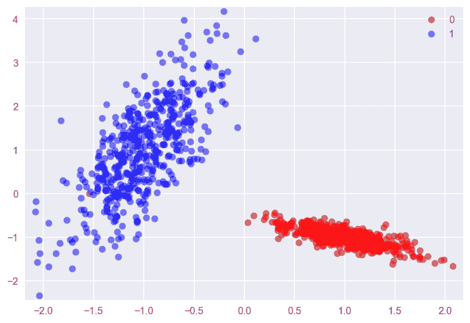
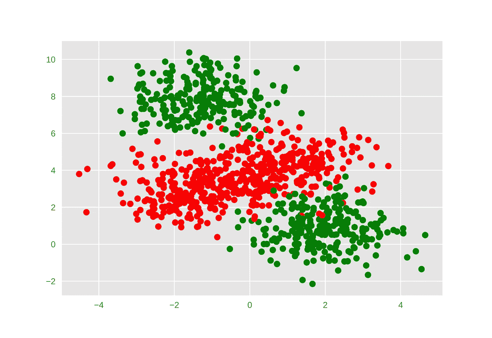
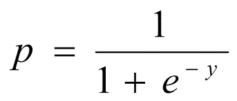
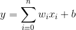
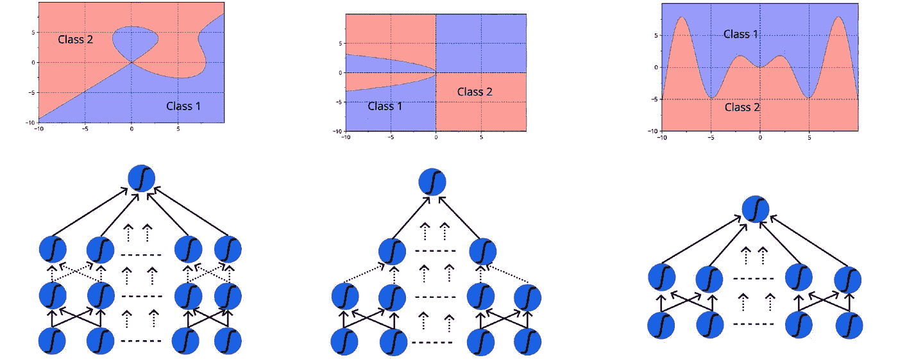
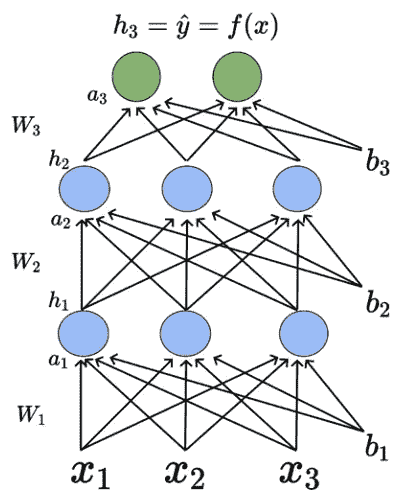

# 前馈神经网络

> 原文：<https://medium.com/analytics-vidhya/feedforward-neural-networks-13d26650e8c0?source=collection_archive---------17----------------------->

*引用说明——本文中的一些内容和例子摘自四分之一实验室的深度学习课程——pad hai*

前馈神经网络(也称为 FNN 神经网络)是一种简单类型的神经网络，其中数据从输入到输出仅沿一个方向流动，中间有一个或多个隐藏层。前一个隐藏层的输出作为前馈神经网络中下一层的输入。每层由一个或多个 sigmoid 神经元组成(可以是任何非线性函数，如 tanh、ReLU、leaky ReLU 等..在本文中，我们将考虑 sigmoid 函数，它构成了这种神经网络的构建模块。简单地说，FNN 借助于位于多层的多个 sigmoid 神经元来确定输入‘x’和输出‘y’之间的关系， *y = f(x)* 。(层数和每层乙状结肠的数量可以变化，并被视为超参数，本文将不解释调整它们的方法)

图一。前馈神经网络

好的。让我们从基础开始，了解两件事。

1.  需要深度神经网络/ FNN 氏症
2.  什么是乙状结肠神经元，它与深度神经网络有什么关系。

一般来说，任何机器学习模型都会学习最能确定输入 x 和输出 y 之间关系的函数 *f* 。不幸的是，这种关系在大多数情况下是非线性的，因此我们需要复杂的数学函数来计算 x 和 y 之间的关系

图二。线性可分数据

图三。线性不可分数据

由于人类几乎不可能尝试不同的数学运算并找出它们之间的关系，因此需要一个通用的范例来确定它们之间的关系。这就是深度神经网络的用武之地，它们被用来对一组输入和输出之间的几乎任何复杂关系进行建模。神经网络是一种模拟人脑活动的技术。(如需进一步阅读，请查看人类大脑中的视觉皮层是如何工作的——[https://www . neuroscifically challenged . com/blog/know-your-brain-primary-visual-cortex](https://www.neuroscientificallychallenged.com/blog/know-your-brain-primary-visual-cortex))

图 4。乙状结肠神经元与脑神经元的比较

现在让我们了解一下，乙状结肠神经元是如何工作的。可用于解决二进制和多类分类问题的 sigmoid 神经元使用以下函数来模拟输入-输出关系。

Sigmoid 方程

图五。乙状结肠神经元

其中 *x* 为输入， *p* 为预测输出。一个 sigmoid 给出一个如下图所示的图形。可以看出，sigmoid 不具有急剧的过渡(如在直线/平面中),并且在 sigmoid 方程中可以有两个我们可以控制的参数， *w* 和 *b* ,它们分别控制陡度和过渡开始的点。对于给定的训练数据集，有几种学习算法可以帮助您计算出 *w* 和 *b* 的最佳值。(我不会深入讨论超参数，如学习率和迭代次数以及调整它们的方法)。在这一点上，您需要理解的是，单个 sigmoid 会给出一条类似于下图中的曲线，您可以使用该曲线来分离输出类。

图六。二维 sigmoid 图

现在，FNN 在不同的层上组合了多个这样的 s 形曲线，因此通过连接多个这样的 s 形曲线，你几乎可以找出输入和输出之间的任何复杂关系。[通用近似定理](https://en.wikipedia.org/wiki/Universal_approximation_theorem)给出了多个 sigmoids 如何导致几乎任何关系的详细证明

图 7。FNN 的各种层和 sigmoids 导致多个复杂的功能

现在让我们做一些数学。FNN 中的每个神经元包括两个功能，由 *a* 表示的预激活功能和由 *h* 表示的激活功能。让我们考虑一个神经网络，它有一个输入层(*有输入，x1，x2，x3* )，一个输出层(下面用绿色标出)，2 个隐藏层，每个隐藏层中有 3 个 sigmoids。有 3 个输入 *x1、x2 和 x3* ，并且每一层将具有 m*n 个权重向量，其中 m 是来自前一层的输入的数量，n 是当前层中神经元的数量(对于第一层，它将是 9，因为在层 1 中有 3 个输入值和 3 个神经元)和 1 个大小为 n 的偏置向量

图 7。深度神经网络

让我们从第一层的第一个神经元开始(预激活为 *a1* ，激活为 *h1* )。预激活函数是偏置和所有输入的总和乘以层中每个神经元各自的权重。因此，第一隐藏层中的第一神经元的激活函数将是

*a11 = w111 * x1+w121 * x2+w131 * x3+b11*其中，

*a11* =第一层第 1 个神经元的预激活功能，

*w111* =第一层(输入层)的权重，连接第一个输入和隐藏层中的第一个神经元，

通常，权重表示为 *w(ijk)* 其中，

*i* 代表前一层编号(1 代表输入层)，以及

*j* 表示当前层中的目标神经元数量

*k* 代表前一层的源神经元/输入数。

*b11* =连接第一个神经元的第一层的偏置分量

类似地，第二隐藏层中第一个神经元的预激活函数(预激活为 *a2* ，激活为 *h2* )将为

*a21 = w211 * x1+w221 * x2+w231 * x3+b21*(此处所有权重用 w2 表示..因为它们都是连接到第二层的权重)

让我们继续计算激活函数。激活函数可以是任何连续的非线性函数(它应该在所有点上都是可微分的，因为我们将计算导数来调整每次迭代的权重和偏差)。在一般的激活函数中， *h(ij)* 可以表示为:

*h(ij) = f(a (ij))* 其中，

*i* 表示层数， *j* 表示该层的神经元数。

如果我们认为函数 *f* 是一个 sigmoid 函数，

*h(ij)= 1/(1+e ^-(a(ij))】*

在概率模型的情况下，输出层可以使用 [softmax](https://en.wikipedia.org/wiki/Softmax_function) 函数作为激活函数

使用上述函数，我们将能够构建一个从输入层到输出层的完整的正向传递。在每次向前传递后，我们需要理解损失值(通过使用交叉熵或均方误差损失)并调整权重和偏差，以确保下一次迭代中的损失小于当前值。计算权重和偏差调整最常用的算法之一是梯度下降，我会在另一篇文章中解释，因为它太复杂了:)

与前馈神经网络相关的进一步阅读主题

1.  梯度下降算法及其变体(随机、批量、小批量)。
2.  深度学习中的优化算法