# 使用脑电波(EEG)将感觉/思想转换成文本

> 原文：<https://medium.com/analytics-vidhya/feeling-thought-to-text-using-brain-waves-eeg-4ba8ba0565ac?source=collection_archive---------13----------------------->

在这篇中型文章中，我将向你展示如何将感觉转化为文本，也就是说，如果你向前思考，向前就会到来，向后左右也是如此。让我告诉你，这是一个个性化的事情，因为你可能会和我想的不一样，例如，向前想，一个人可能会认为他要去撞他面前的墙:P，一个人可能会认为他在开车。两者都不一样。这仍然是一个研究项目，达到的精度并不令人满意。我们将研究 4 通道脑电图设备 muse。

> 在这里，我需要你理解并承认这个项目有多大，它还处于研究阶段，就像用你的思想控制事物一样，而且它仍然是以人为中心的。

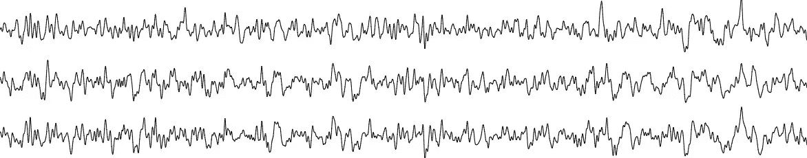

脑电图！脑电图！脑电图！

想象你坐着，只是想着往前走，而你实际上往前走了，这不是很有趣吗？

# 五金器具

我们将使用 4 通道脑电图设备 muse 来完成这项任务。

司文艺、音乐、美术的女神缪斯

出于实时目的，您需要在手机中安装一个 muse monitor 应用程序，您可以通过 OSC 流从手机中提取数据到 PC，然后将其馈送到您的模型，结果可以发送到任何微控制器，以运行电机，使其按照您认为的指定方向移动。

## 应用

它具有多种应用，例如为患有闭锁综合症或全身瘫痪人移动轮椅。它为思维到文本和无声交流提供了更广阔的研究机会。

## 有关 EEG 设备提取值的信息

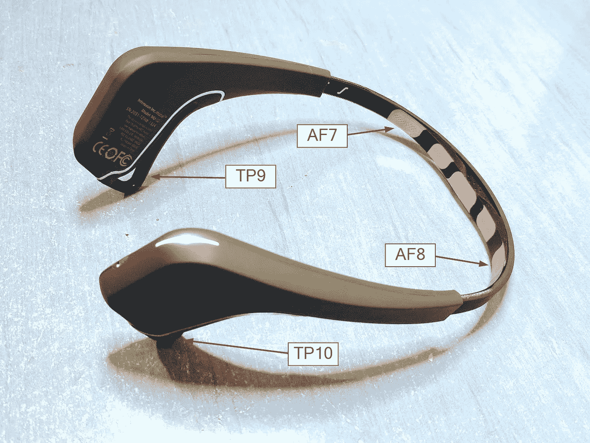

它从我们大脑的 4 个节点 TP9，AF7，AF8，TP10 收集数据。通过从 muse monitor 中提取特征，它给出了许多值，有 20 个相关值。Delta_TP9，Theta_TP9，Alpha_TP9，Beta_TP9，Gamma_TP9。这 5 个值是给定的，其中 4 个节点给出这些值，因此 4*5=20 个特征。我们考虑所有这些的平均值，并使用 4 个特征。

## 资料组

我们将在这里查看数据集。

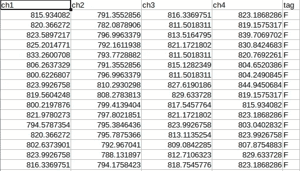

这些 ch1、ch2、ch3 和 ch4 是上面提到的节点。标签是我当时想的。我捕获了 2500 个值，包括 4 个标签，即 F，B，L，r。

## 数据预处理

实施了许多预处理技术，但结果恶化。

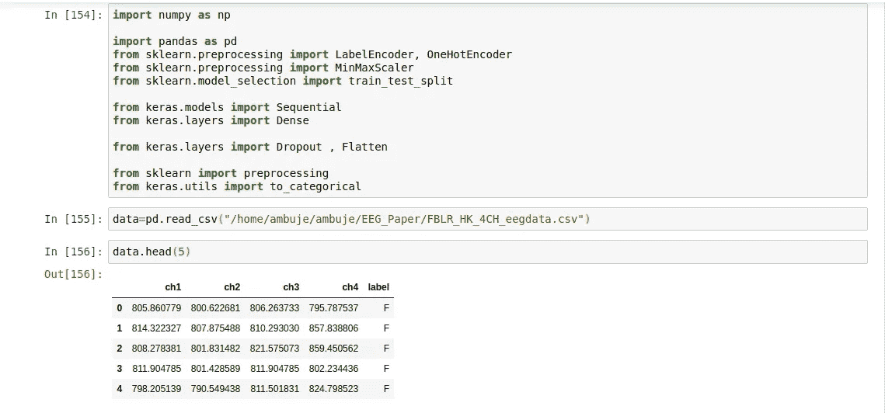

导入重要的库和数据集视图

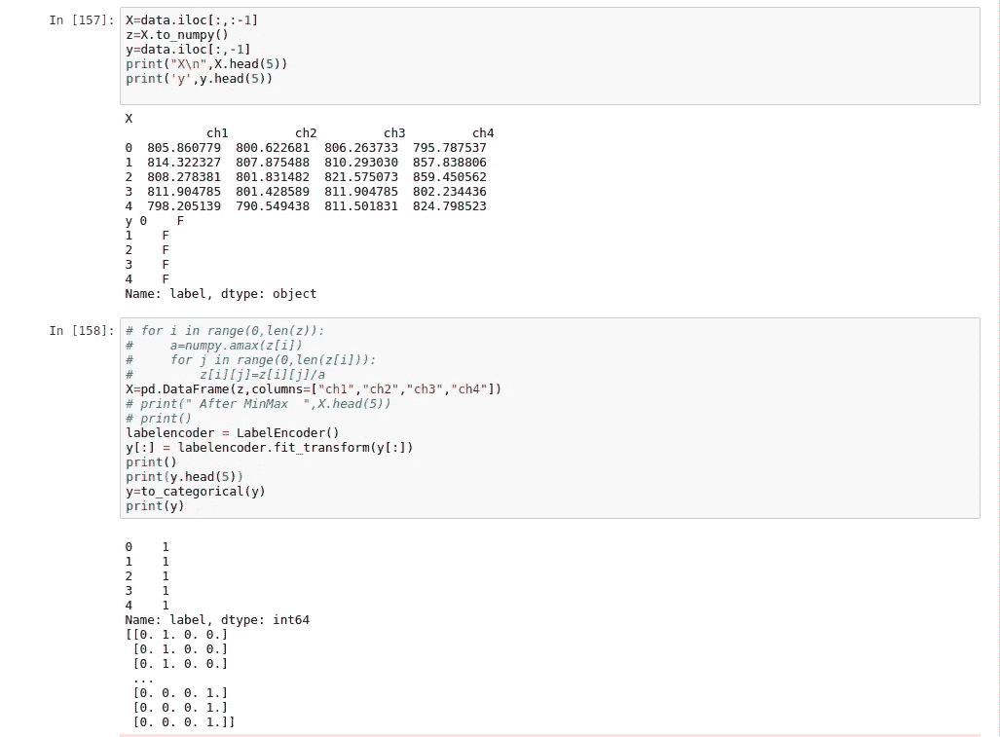

1.  微分自变量和因变量
2.  由于标签是 F，B，L，R，我们需要将其转换为数字进行处理，标签编码器用于此，然后一次性编码/分类完成。从现在起，我们将在 0，1，2，3 中讨论，而不是在 F，B，L，R 中讨论，供您参考 B=0，F=1，L=2，R=3。标签编码器按字母顺序对数据进行编码。

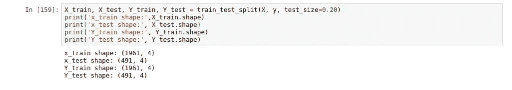

这里，数据集以 80/20 的比例分割。

# **分类** **技法**

我将很快向你解释我尝试的技术，并展示它们的结果。

1.  **决策树**
2.  **随机森林**
3.  **KNN**
4.  **神经网络— LSTM**

出于评估目的，我们将使用混淆矩阵和混淆矩阵的度量标准及其相关术语参考-

 [## 简化混淆矩阵

### 知道机器学习领域是非常广阔的，它有各种各样的概念要理解，一个非常罕见的和…

medium.com](/datadriveninvestor/simplifying-the-confusion-matrix-aa1fa0b0fc35) 

有关分类技术的更多信息

 [## 机器学习中的分类算法…

### 什么是分类？

medium.com](/datadriveninvestor/classification-algorithms-in-machine-learning-85c0ab65ff4) 

## 1-随机森林

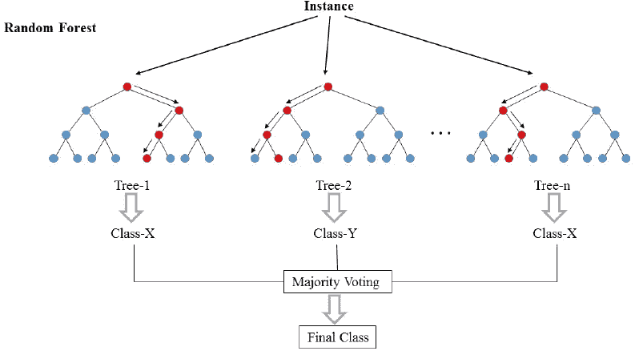

> [随机森林](https://www.stat.berkeley.edu/~breiman/RandomForests/cc_home.htm)是由许多决策树组成的模型。这个模型不是简单地平均预测树木(我们可以称之为“森林”)，而是使用了[的两个关键概念](https://www.stat.berkeley.edu/~breiman/randomforest2001.pdf)，因此得名*随机*:

1.  构建树时对训练数据点进行随机采样
2.  分割结点时考虑的随机要素子集

有关随机森林回归的更多信息

决策树将在这之后讨论

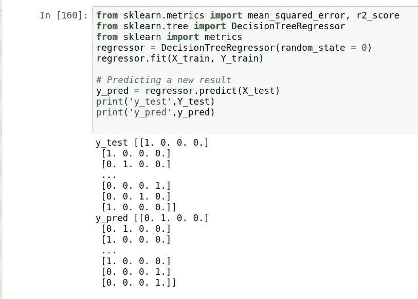

导入重要的库，我们可以在这里看到 y_test 和 y_pred 的一些结果。结果是这样的，因为我们转换成了分类。

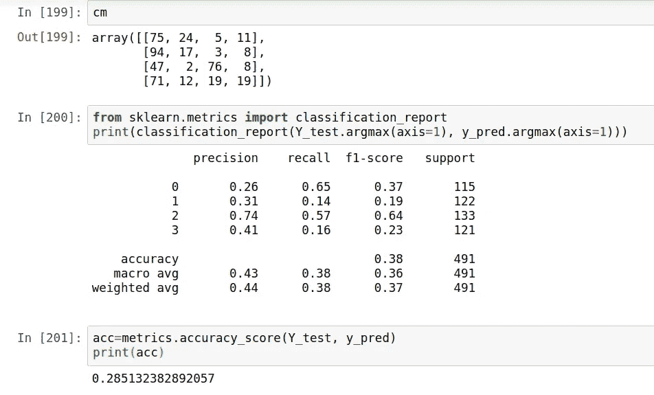

所以它的准确度是 0.28，你可以清楚地看到混淆矩阵，精确回忆和 f1 分数

有关随机林的详细信息:

 [## 了解随机森林

### 一次一个算法 Harshdeep Singh

medium.com](/@harshdeepsingh_35448/understanding-random-forests-aa0ccecdbbbb) 

## 2-K 最近邻

> *对象通过其邻居的多数投票进行分类，对象被分配到其 k 个最近邻居中最常见的类别(k 是正整数***，通常很小)。如果 k = 1，那么该对象被简单地分配给该单个最近邻的类。**

*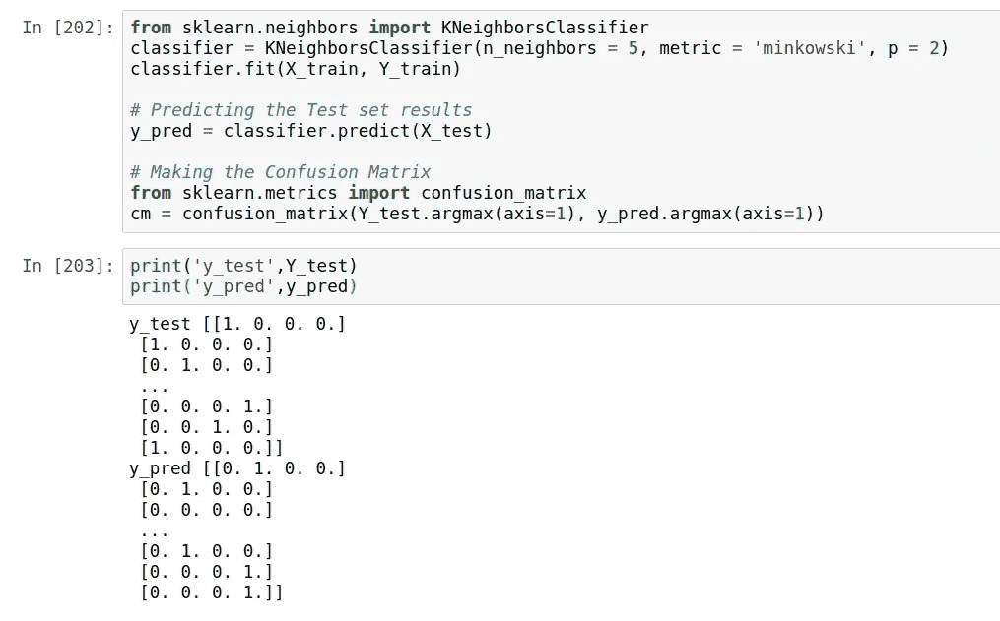*

*导入重要的库，我们可以在这里看到 y_test 和 y_pred 的一些结果。*

*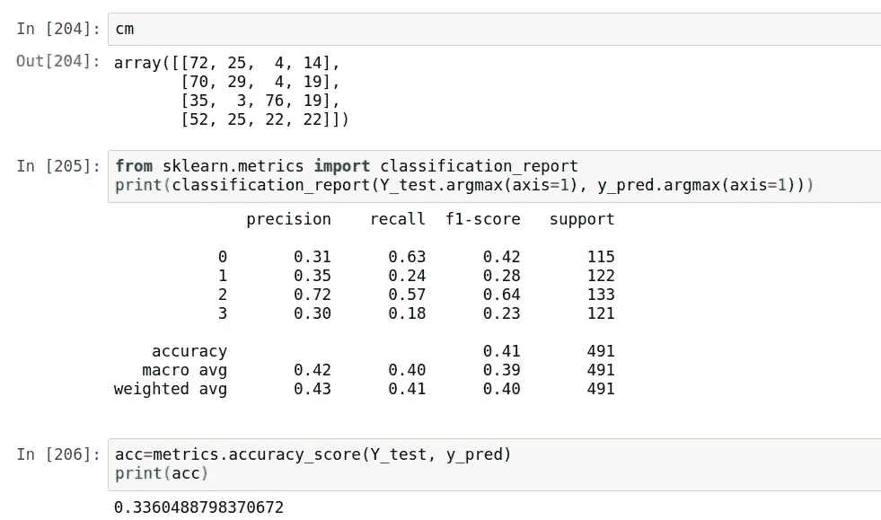*

*所以它的准确度是 0.33，你可以清楚地看到混淆矩阵，精确回忆和 f1 分数*

*更多关于 KNN 的信息，请参考—*

* [## 介绍 k-最近邻:一个强大的机器学习算法

### 注意:本文最初发布于 2014 年 10 月 10 日，更新于 2018 年 3 月 27 日概述了解 k 最近…

www.analyticsvidhya.com](https://www.analyticsvidhya.com/blog/2018/03/introduction-k-neighbours-algorithm-clustering/) 

## 3 —决策树

> 决策树是使用分支方法来说明决策的每一个可能结果的图形。

导入重要的库，我们可以在这里看到 y_test 和 y_pred 的一些结果。

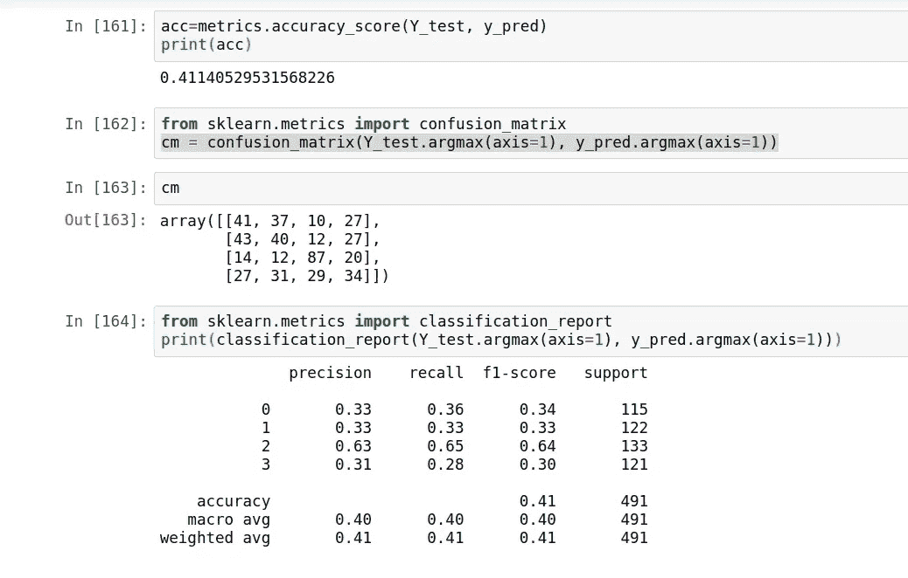

所以它的准确度是 0.4，你可以清楚地看到混淆矩阵，精确回忆和 f1 分数

有关决策树的更多信息-

 [## 决策树——可视化决策的简单方法

### 决策树介绍:

medium.com](/greyatom/decision-trees-a-simple-way-to-visualize-a-decision-dc506a403aeb) 

## 4 —神经网络

我也尝试了深度学习即 LSTM 来解决这个问题。我可以达到 55%的准确率，并且还在继续努力。

一篇关于 LSTM 的好文章会澄清你的概念-

 [## 深度学习精要:长短期记忆导论

### 引言序列预测问题由来已久。他们被认为是最难的…

www.analyticsvidhya.com](https://www.analyticsvidhya.com/blog/2017/12/fundamentals-of-deep-learning-introduction-to-lstm/) 

在我的 LSTM 代码中，我使用了 [**RAdam()**](/@lessw/new-state-of-the-art-ai-optimizer-rectified-adam-radam-5d854730807b) 作为优化器，分类交叉熵用作损失函数。

## 准确(性)

为什么我的准确率这么低？

我必须为我的问题类型找到一些数据预处理的方法。迄今为止应用的数据预处理技术-

1.  最小-最大缩放器
2.  标准化
3.  均值归一化

没有各种数据

我必须增加我的数据集才能成功。

**感谢并快乐学习:)***