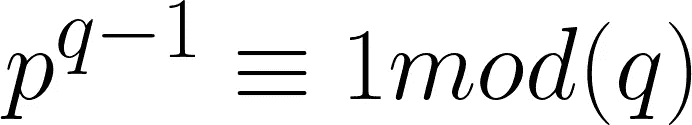
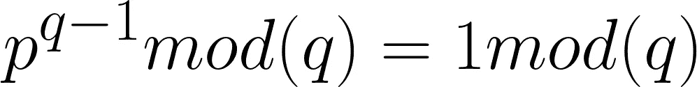
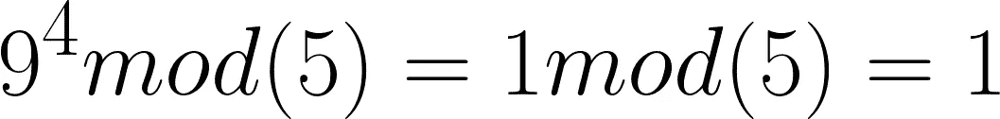

# 费马大定理在其核心！

> 原文：<https://medium.com/analytics-vidhya/fermats-theorem-in-its-core-82e00966c6a8?source=collection_archive---------17----------------------->

## 在密码学中，存在基于欧拉函数的费马定理，它也是欧拉定理的一个具体版本，我在以前的博客中已经提到过。这个博客旨在解释费马的核心理论。

[**来源**](https://www.google.com/url?sa=i&url=https%3A%2F%2Fwww.information-age.com%2Ffour-reasons-why-cryptography-is-so-hard-to-get-right-and-four-solutions-123484516%2F&psig=AOvVaw1Qpwq_M8ifSZtViHSVk26Q&ust=1602504053669000&source=images&cd=vfe&ved=0CAIQjRxqFwoTCJD8w4S_rOwCFQAAAAAdAAAAABAD)

我建议在阅读这篇文章之前，先浏览一下我的关于欧拉函数和欧拉定理的博客，因为费马定理完全基于它们。因此，为了更好的理解，如果你还没有读过我以前的关于欧拉函数的博客的话，先读一读吧。

 [## 欧拉函数在其核心！

### 这个博客旨在解释关于欧拉函数的一切，从它的内部覆盖每个概念…

medium.com](/@harshitdawar/euler-totient-funciton-in-its-core-e1f1a661098f)  [## 核心是欧拉定理！

### 在密码学中，有一个基于欧拉函数的欧拉定理，我已经在我的文章中介绍过了

medium.com](/@harshitdawar/euler-theorem-in-its-core-9ae020fd1a41) 

# 费马大定理的定义和意义！

这是欧拉定理的具体版本，也就是说，如果两个互质数中有一个数是质数，那么应用这个定理&它将非常有效地返回输出。

它指出，如果有两个互质数，比如说 p & q，q 本身也是一个质数，那么，

**【作者图片】**

上述方程的简化方程为:

**【图片作者】！**

费马定理涉及素数、模数/余数和同余的概念。*它旨在提供一个概念，互质数可以以某种方式相关联，以提供一个值，该值可以在以后用作哈希值或密码学中的加密密钥。*

# 费马定理的解决例子！

让我们取两个数 9 和 5，因为它们互为质数，而且 5 本身也是一个质数。设 p = 9 & q = 5。

**费马大定理的例题方程！【作者图片】**

上述等式的 LHS 可以简化为:

(9 ^ 4) mod(5)= (6561) mod(5) = 1

因为它是 1，也是 1 mod(5)也是 1，因此，LHS = RHS，因此定理得到验证。

***我希望我的文章用所有深刻的概念和解释来解释与主题相关的每一件事。非常感谢你花时间阅读我的博客&来增长你的知识。如果你喜欢我的作品，那么我请求你为这个博客鼓掌！***