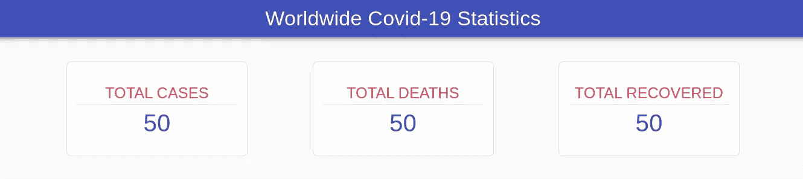
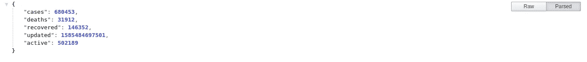
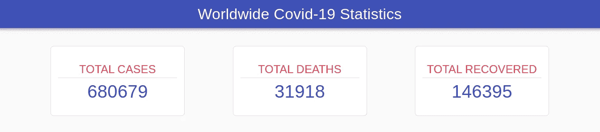
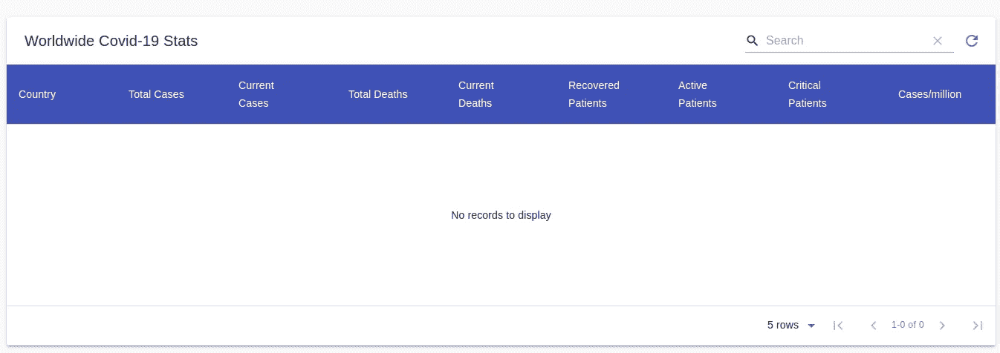
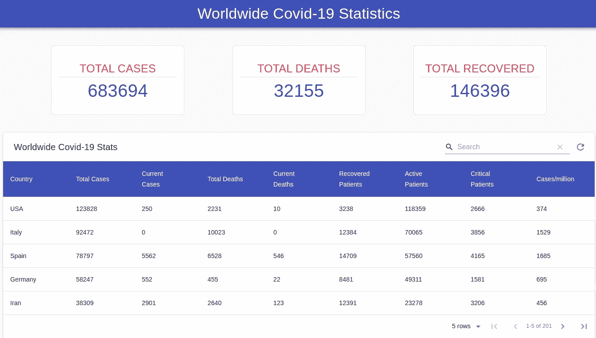

# 使用 React.js、Material UI 和 Material-Table 第 2 部分获取新冠肺炎数据

> 原文：<https://medium.com/analytics-vidhya/fetching-covid-19-data-using-react-js-material-ui-and-material-table-part-2-8a1f88a954ba?source=collection_archive---------1----------------------->


由 [Unsplash](https://unsplash.com/@fusion_medical_animation?utm_source=unsplash&utm_medium=referral&utm_content=creditCopyText) 上的[融合医学动画](https://unsplash.com/@fusion_medical_animation?utm_source=unsplash&utm_medium=referral&utm_content=creditCopyText)拍摄的照片

在第 1 部分中，我们着重于设置我们的开发环境，在那里我们安装了 create-react-app、Material UI 和 Material-table。我分享了我们将在本节中使用的资源。如果你没有机会阅读第 1 部分，请点击 [***这里***](/@zudemwango/fetching-covid-19-data-using-react-js-material-ui-and-material-table-d41314706b59) ***。***

这部分，全是技术！我们将为 Cards(功能组件)和 WordTable(类组件)组件编写代码。除此之外，我们将实现效果钩子(useState 和 useEffect)和 Fetch API。

我们来编码吧！首先，我们将把 react 导入到我们在第 1 部分中创建的 card 功能组件中。

```
import React from 'react'
```

现在让我们创建我们的函数

```
export default function Cards() {  
 const greeting = 'Hey Functional Component!';  
 return(    
       <p>{greeting}</p>;
      );
}
```

我们的卡组件应该看起来像下面的代码片段

我们将使用材质 UI 创建卡片。Material UI 为其用户提供了一个模板示例，就像 bootstrap 等，使工作变得更加容易和快速。对于我们的卡，我们需要导入卡、卡内容和卡媒体。

```
import Card from '@material-ui/core/Card';import CardContent from '@material-ui/core/CardContent';import CardMedia from '@material-ui/core/CardMedia';
```

注意！材质 UI 中提供了样式，您可以自由更改它们。下面是我们将要使用的样式。在一个功能组件中，总是把样式放在我们的主函数之上，导入之下。

用下面的代码替换段落标记。造型就不用担心了！材质 UI 会为您做到这一点。样式是在您工作的同一个文件中完成的，而不是从外部源完成的(内联和内部 CSS 应用于材质 UI)。

很好，复制并粘贴卡片两次。第一张卡的标题应该是总病例数，第二张卡应该是总死亡数，第三张卡应该是总恢复数，如下图所示，带有占位符数字。



下面代码片段中完整的 Cards 组件。

你期待已久的时刻！让我们从 API 获取数据，但在继续之前，我们将从 react 导入 useState 和 useEffect。查看下面的示例

```
import React, { useState, useEffect } from 'react';
```

太棒了。让我们创建一个应该初始化为空数组的状态。状态是来自 API 的数据将被存储的地方，应该在主函数中。**使用状态帮助我们将状态带入功能组件**。

```
const [stats, handleStats] = useState([]);
```

在继续之前，让我们检查一下我们的 API 返回了什么，那么**我们该怎么做呢？如果没有邮差，只需复制网址([**【https://corona.lmao.ninja/all】**](https://corona.lmao.ninja/all)’)并粘贴到浏览器中，然后点击回车键。**



返回的数据

太棒了。我们将创建一个从 API 获取数据的函数。该函数将被命名为 **FetchData** ，async-await 的概念将在我们的函数中实现，以处理异步请求。点击 了解更多关于 async await [***的信息。***](https://blog.pusher.com/promises-async-await/)

```
const FetchData = async () => {
     const data = await fetch('https://corona.lmao.ninja/all');
     const stats = await data.json();
     handleStats(stats)  
}
```

组件更新时总会调用 **useEffect** ,它执行组件内部的函数，并有一个可选的第二参数数组。在我们的例子中，将在 useEffect 内部调用 FetchData()。查看下面的代码片段

```
useEffect(() => {FetchData()// the function fetching the data}, [])
```

**我们如何在之前创建的卡片中显示提取的数据**？嗯，这很简单明了。记住，我们获取的数据以我们之前创建的状态存储在一个数组中。我们只抓取病例、死亡病例和痊愈病例，例如{(*)**(***抓取数据*** )}。用下面的代码替换我们添加到卡中的静态数字。***

```
***{stats.cases} //will fetch cases (first card)
{stats.deaths} //will fetch deaths (second card)
{stats.recovered} //will fetch recovered (Third card)***
```

***最终卡组件***

******

***数据提取后我们的卡***

***让我们开始拼图的最后一块吧！该表将用 Material-Table 实现。这将是一个类组件，不像卡组件是一个功能组件，原因是我们需要有使用前类和功能组件的经验。***

***打开 WorldTable.js 组件，导入 React 和 MaterialTable。***

```
***import React from 'react';import MaterialTable from 'material-table';***
```

***厉害！现在让我们创建基于类的组件。***

```
***class WorldTable extends Component {constructor(props) {super(props);render() {return (<div></div>)}}
export default WorldTable;***
```

***让我们创造国家！用空数组初始化它，并将 loading 设置为 false。***

```
***state = {loading:false,stats: [],}***
```

***Material-Table 提供了不同的表格，您可以随意使用。这里说的是我们的桌子，我们放置在***

***和******之间。然后将替换为<react.fragment></react.fragment>

```
<MaterialTable style={{marginLeft:'10px', marginRight:'10px'}}title="Worldwide Covid-19 Stats"columns={[{ title: 'Country', field: 'country' },{ title: 'Total Cases', field: 'cases' },{ title: 'Current Cases', field: 'todayCases' },{ title: 'Total Deaths', field: 'deaths', type: 'text' },{ title: 'Current Deaths', field: 'todayDeaths' },{ title: 'Recovered Patients', field: 'recovered' },{ title: 'Active Patients', field: 'active' },{ title: 'Critical Patients', field: 'critical' },{ title: 'Cases/million', field: 'casesPerOneMillion' },]}
```

使用 Material-Table 的最大好处是你可以添加动作和选项，比如在表中刷新等等。您还可以在 options 对象中添加样式。

```
actions={[{icon: 'refresh',tooltip: 'Refresh',isFreeAction: true,onClick: () => this.tableRef.current && this.tableRef.current.onQueryChange(),},]}options={{headerStyle: {backgroundColor: '#3f51b5',color: '#FFFF'}}}
```

向上滚动，将下面代码片段中的代码放入构造函数中。" **Refs 提供了一种方法来访问在 render 方法中创建的 DOM 节点或 React 元素。**

```
this.tableRef = React.createRef();
```

这是我们表的当前状态表。酷吧？



桌子

酷！是时候创建一个获取数据的函数了。我们将使用**componentidmount()**和**获取 API** 。我相信您已经注意到了我们的 Cards 和 WorldTable 组件在获取数据时的区别。首先，将 loading 设置为 true，因为我们正在获取数据。获取数据集后，stats 状态为我们正在获取的数据。

```
componentDidMount() {this.setState({ loading: true })fetch('https://corona.lmao.ninja/countries') //data source.then(response => response.json()).then(res => {this.setState({ stats: res, loading: false }, () => console.log(res))}).catch(error => {console.log(error)})}
```

休息一下！


我们差不多完成了。要显示我们表中的数据，请在列下面的表中调用我们的 state。我们如何实现这一点？好吧，看看下面的代码片段。

```
data={this.state.stats}
```

这就是我们的组件现在应该的样子，干得好！

最后一步是在 App.js 中导入 Cards 和 WorldTable 组件，这将呈现我们所有的组件。

```
function App() {return (<div className="App"><Navbar/><Cards/><WorldTable/></div>);}export default App;
```

这是我们写完所有这些代码行并修复错误后的最终产品…..恭喜你。



感谢你花时间阅读我的文章，我希望你学到了一些新的东西。如果你理解一些正常的概念有困难，不要气馁，继续学习。***