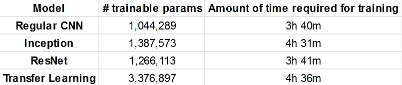

# 少数镜头学习——案例研究(2)

> 原文：<https://medium.com/analytics-vidhya/few-shot-learning-a-case-study-2-805f5642acaf?source=collection_archive---------22----------------------->

在[之前的博客](/@patel.maitreya57/few-shot-learning-a-case-study-1-d71eb06a33df)中，我们研究了为什么少投学习是必要的，以及它的应用是什么。在这篇文章中，我将以最简单的方式解释少镜头分类(尤其是图像分类)的关系网络。此外，我将从以下方面分析关系网络:

1.  不同架构的有效性，如剩余网络和初始网络
2.  ImageNet 数据集上预训练分类器对迁移学习的影响

此外，有效性将根据准确性、培训所需的时间以及所需培训参数的数量进行评估。

请观看 [GitHub 库](https://github.com/Maitreyapatel/Few-Shot-Learning-A-Case-Study)来检查实现并通过进一步的实验保持更新。

# 少数镜头分类介绍

在少镜头分类中，我们的目标是设计一种方法，可以通过分析同一类的少量样本图像来识别任何目标图像。让我们举一个例子来理解这一点。假设 Bob 有一个客户项目，要设计一个 5 类分类器，其中 5 类可以是任何东西，这 5 类甚至可以随时间变化。正如在以前的博客中所讨论的，收集大量的数据是非常繁琐的任务。因此，在这种情况下，Bob 将依赖于少数镜头分类方法，其中他的客户可以为每个类别给出几组示例图像，之后他的系统可以在需要或不需要额外训练的情况下对这些示例执行分类。

通常，在少数镜头分类中，使用四个术语(N 路、K 镜头、支持集和查询集)。

1.  **N 种方式:**这意味着我们将使用总共 N 个类进行训练/测试，就像上面例子中的 5 个类。
2.  **K shot:** 这里，K 表示在训练/测试期间，我们只有 K 个示例图像可用于每个类别。
3.  **支持集:**它代表来自每个类的所有可用 K 个示例图像的集合。因此，在支持集中，我们总共有 N*K 个图像。
4.  **查询集:**该集将包含我们想要预测其各自类别的所有图像。

在这一点上，对这个概念不熟悉的人会对支持和查询集的需求产生疑问。所以，我们来直观的了解一下。每当人类第一次看到任何物体时，我们都会对该物体有一个大致的了解。现在，将来如果我们第二次看到同一个物体，我们会将它与我们第一次看到它时存储在内存中的图像进行比较。这适用于我们周围的一切事物，无论是我们看到的、读到的还是听到的。类似地，为了从查询集中识别新图像，我们将为我们的模型提供一组示例，即支持集以进行比较。

这也是关系网络背后的基本概念。在接下来的部分中，我将给出关系网络背后的粗略想法，并且我将在 102 朵花的数据集上进行不同的实验。

# 关于关系网络

关系网络背后的核心思想是使用支持集来学习每个类的广义图像表示，以便我们可以将查询图像的低维表示与每个类表示进行比较。并且基于该比较来决定每个查询图像的类别。关系网络有两个模块，允许我们执行上述两项任务:

1.  **嵌入模块:**该模块将从每个输入图像中提取所需的底层表示，而不考虑它们的类别。
2.  **关系模块:**该模块将对查询图像的嵌入与每一类嵌入的关系进行评分。

**培训/测试程序:**

我们可以用 5 个步骤来定义整个过程。

1.  使用支持集并使用嵌入模块获得每个图像的底层表示。
2.  取每个类图像之间的平均值，并获得每个类的单一底层表示。
3.  然后获得每个查询图像的嵌入，并将它们与每个类的嵌入连接起来。
4.  使用关系模块获得分数。并且具有最高分数的类将是相应查询图像的标签。
5.  [仅在训练期间]使用 MSE 损失函数来训练两个(嵌入+关系)模块。

在培训期间需要知道的几件事是，我们将只使用来自选择性类集合的图像，而在测试期间，我们将使用来自看不见的类的图像。例如，从 102 朵花的数据集，我们将使用 50%的类进行训练，其余的将用于验证和测试。而且每集我们会随机选取 5 个类来创建支持和查询集，按照上面的 5 个步骤来做。

这是所有需要知道的关于实现的观点。虽然整个过程简单易懂，但我还是会推荐阅读已经发表的研究论文，[学习比较:少拍学习的关系网络，](https://arxiv.org/abs/1711.06025)更好理解。

# 结果和分析

初始实验是针对 5 路和 1/3/5/10 镜头分类问题进行的。此外，本文中描述的相同架构也用于这两个模块。每个历元后的验证准确度图表如下所示。

n 路-验证集上的 K 次射击精度

从上图中，我们可以观察到，对于单镜头分类，我们获得了几乎 50 %的准确性，这是非常好的，因为我们只使用了一张图像进行比较。此外，我们可以观察到，通过将 K 从 1 增加到 10，我们变得更加精确。

有人可能会问，什么类型的架构将有助于提高性能。例如基于 Inception 和 ResNet 的体系结构已经显示出对于分类任务的优异性能。因此，为了扩展这个分析，我在嵌入模块中使用了 Inception 和 ResNet。下图显示了 1/5 镜头分类的修改结果。

左:右:5 路 1 枪

在这里，我们可以观察到基于先启的模型表现得相当好，并且显示了大约 10%的改进。此外，精确度的增加量随着 K 的增加而减少。然而，我们可以观察到，与基线相比，基于 ResNet 的架构表现不佳。Inception 性能更好的原因是它可以在单层中提取不同稀疏度的特征，因为在每层中使用不同大小的核来提取稀疏特征。

此外，一个有迁移学习策略经验的人可能会怀疑它是否能改善结果或至少在更短的时间内获得类似的表现。上图还显示了该实验的结果，其中使用了预训练的 DenseNet161。这里，我们可以观察到，基于迁移学习的模型在开始时表现很差，并且花费太多时间来获得足够好的准确度，而不管 k 的值如何。

此外，下表显示了计算复杂性和训练模型所需的时间。在观察了每一个细节之后，我们可以说基于先启的关系网络总是一个更好的选择。

* *训练完毕唱 GTX 1070ti。和时间量会根据不同的系统而变化。

# 结论

以下是需要记住的几点结论:

> 关系网络主要依靠嵌入模块来提取每幅图像的相关底层表示。
> 
> 基于初始的嵌入模块由于能够提取稀疏特征而表现良好。
> 
> 当应用时间约束时，基于迁移学习的嵌入模块确实表现得足够好，因为这些模型仅出于分类目的而被训练，而不是提取少量镜头分类所需的图像的较低维度表示。

关于上述所有实验的实现以及不同的结果图在 [GitHub 库](https://github.com/Maitreyapatel/Few-Shot-Learning-A-Case-Study)中提供。

下周我将为文本分类任务实现相同的关系网络。此外，我将分析不同的策略，以了解相同的所需嵌入。使用基于 BERT 的嵌入及其实现的初步结果可以在相同的 GitHub 存储库中找到，以供早期参考。

**敬请期待！**订阅[此处](https://maitreyapatel.github.io/blog-home.html)获取即将发布的新文章通知，跟上当前的研究趋势。

# 参考资料:

1.  宋，洪水，杨永信，张丽，向涛，菲利普 HS 托尔，和蒂莫西 m。"学习比较:少量学习的关系网络."在*IEEE 计算机视觉和模式识别会议记录*，第 1199–1208 页。2018.
2.  塞格迪，克里斯蒂安，文森特·万霍克，谢尔盖·约菲，乔恩·施伦斯和兹比格涅夫·沃伊纳。"重新思考计算机视觉的初始架构."在*IEEE 计算机视觉和模式识别会议记录*中，第 2818–2826 页。2016.
3.  何、、、任、。"图像识别的深度剩余学习."在*IEEE 计算机视觉和模式识别会议记录*中，第 770–778 页。2016.