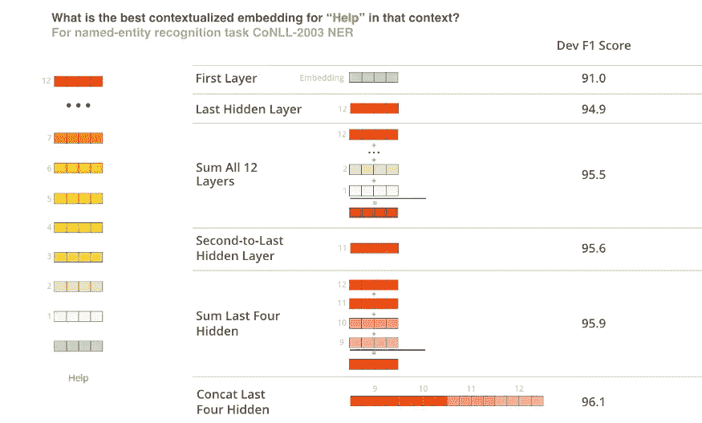
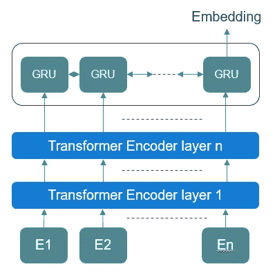
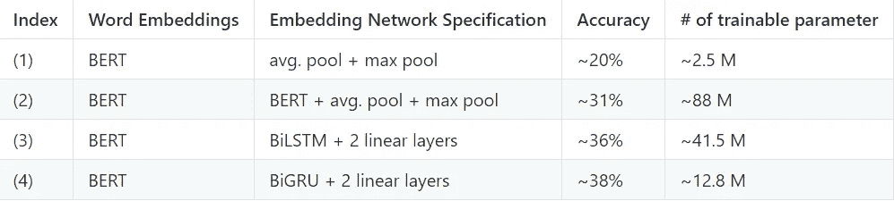

# 少数镜头学习——案例研究(3)

> 原文：<https://medium.com/analytics-vidhya/few-shot-learning-a-case-study-3-84f6ea3cb322?source=collection_archive---------17----------------------->

在[上一篇文章](/analytics-vidhya/few-shot-learning-a-case-study-2-805f5642acaf)中，我们通过关系网络深入研究了少数镜头分类。此外，我们分析了图像分类任务的关系网络。在这篇文章中，我将分析文本分类的关系网络。在这里，我将进行大量的实验来评估具有各种**嵌入网络**的关系网络的有效性。

**本文的流程:**

1.  关系网络的修正
2.  不同类型的可能嵌入网络
3.  结果和分析
4.  结论

来源: [Moosend](https://medium.com/u/db27b1ee40a3?source=post_page-----3df4f4f9570b----------------------)

# 修订本

在继续之前，让我们快速修改一下关系网络(更多细节请阅读[之前的博客](/analytics-vidhya/few-shot-learning-a-case-study-2-805f5642acaf)):

1.  关系网络包含两个子网络。
2.  第一个是嵌入网络，它将提取每个输入的底层表示，而不管它属于哪个类。
3.  嵌入网络将用于从支持和查询数据集提取特征。
4.  并且第二网络将来自支持集的每个嵌入与查询集进行比较，并且将基于该比较给出结果。

# 文本嵌入网络

每当有人听说单词嵌入、word2vec、GLoVe、语言模型(即 BERT、RoBERTa 等。)是脑海中浮现的关键技术。因此，在本节中，我将使用最先进的方法，即 BERT，作为迁移学习和预训练的基础模型，为一些镜头文本分类设计各种嵌入网络。此外，我将从**准确性和计算复杂性**方面分析这些可能的网络。[ [GitHub](https://github.com/Maitreyapatel/Few-Shot-Learning-A-Case-Study) ]

BERT 是最容易获得和最流行的语言模型之一。在 BERT 的基础架构中，总共有 12 层，这些层的每一层输出都可以用作字嵌入。可以从 BERT 中提取的所有不同类型的可能单词嵌入如下图所示:

图(1):不同类型的可能单词嵌入。资料来源:http://jalammar.github.io/illustrated-bert/

现在，为了试验不同设置的关系网络，我将使用 BERT 来设计几个不同的嵌入网络，以找出最适合少量文本分类的嵌入提取方法。

1.  **仅预训练 BERT:** 这里将从预训练 BERT 的最后一层取每个词表示的平均值和最大值池来提取句子嵌入。
2.  **微调 BERT 本身:**在这种方法中，我们将根据少拍设置和数据集来微调 BERT，而不是依赖于方法 1 中预先训练的 BERT。

虽然我们有用于提取单词嵌入的 SOTA 方法(BERT ),但是有两个主要问题与之相关。第一，BERT 的高计算复杂度。第二，从核心层面修改单词表示的能力。为了避免这些问题，我们可以引入一个顶层，使用它我们可以根据需求修改单词嵌入。因此，我们将执行另外两个实验:

1.  **预训练的 BERT + BiLSTM:** 这里，我们将在预训练的 BERT 之上应用双向 LSTM 来修改单词嵌入，使得来自 LSTM 的单个输出可以从 BERT 捕获相关信息用于文本分类。
2.  **预训练 BERT + BiGRU:** 这个实验和上面那个一样。然而，我们只是用 BiGRU 替换了 BiLSTM。这里，在一个理想的情况下，GRU 应该以较少的可训练参数比 LSTM 略胜一筹。

图(2):基于实验的预训练伯特+ LSTM/GRU 的架构设计。

# 结果和分析

为了执行上述实验，使用了 Kaggle [新闻类别数据集](https://www.kaggle.com/rmisra/news-category-dataset)。在实验设置中，50%的新闻类别用于训练，20%和 30%的类别用于验证和测试目的。此外，这种分析是用 5 路 2 镜头分类设置来执行的。

表(1):不同实验中关系网络的准确性和计算复杂性。

从上表中，我们可以观察到微调后的 BERT 的性能远远优于预训练的 BERT。此外，在 BERT 的基础上添加 BiLSTM 和 BiGRU 可以大大改善结果。此外，我们可以看到，BERT 的计算复杂度最高，其性能不佳的原因是所使用的预训练策略。因此，BERT 需要修改它的大量参数。然而，LSTM/GRU 从单词嵌入中提取所需的信息，用于少量的文本分类。

# 结论

以下是需要记住的几点结论:

> 即使对于少量文本分类，嵌入网络也是关键的组成部分。
> 
> 微调 BERT 以计算复杂性为代价改善了结果。
> 
> 此外，在预训练的 BERT 之上的基于 LSTM/GRU 的层显著优于唯一的基于 BERT 的嵌入网络，并且具有**非常低的计算复杂度**。

在 [GitHub 库](https://github.com/Maitreyapatel/Few-Shot-Learning-A-Case-Study)中提供了所有上述实验的实现以及不同的结果图。

接下来，我将为语音分类任务实现相同的关系网络。**敬请关注！**订阅[此处](https://maitreyapatel.github.io/blog-home.html)获取即将发布的新文章通知，跟上当前的研究趋势。

# 参考资料:

1.  宋，洪水，杨永信，张丽，向涛，菲利普 HS 托尔，和蒂莫西 m。"学习比较:少量学习的关系网络."在*IEEE 计算机视觉和模式识别会议记录*中，第 1199–1208 页。2018.
2.  伯特:用于语言理解的深度双向转换器的预训练。 *arXiv 预印本 arXiv:1810.04805* (2018)。