# “少拍 vid2vid”，可以用几个图像转移动作的 GAN

> 原文：<https://medium.com/analytics-vidhya/few-shot-vid2vid-the-gan-that-can-transfer-motion-with-several-images-debe32d5c426?source=collection_archive---------9----------------------->

这篇文章解释了 2018 年 8 月 20 日在 arXiv 上发布的视频到视频合成[1]和 2019 年 10 月 28 日发布的少数镜头视频到视频合成[2]。

*   前者是一篇关于一个叫 vid2vid 的 GAN 的论文，它可以根据区域划分遮罩等语义图像合成似是而非的视频。
*   后者是一篇关于 GAN 的论文，名为少拍 vid2vid，它进一步发展了前者，可以基于少量参考图像和一个语义图像组成一个视频。

# **视频到视频合成**

## 摘要

本文通过一个名为 vid2vid 的 GAN，基于区域划分遮罩、线条画草图等语义图像，生成逼真的高分辨率视频。本文摘要如下。

> ***他们提出一个叫 vid2vid 的 GAN 来合成视频。与之前研究中的 pix2pixHD 和 COVST 相比，生成的视频受干扰更小，因为它是利用前一帧的条件概率生成的。他们以“时空渐进”的方式训练模型，这种方式交替执行时间渐进训练和空间渐进训练，时间渐进训练随着学习的进行增加用于合成的帧数，空间渐进训练像 PG-GAN 一样逐渐增加分辨率。***

在下面的示例中，两个高分辨率视频是基于左下区域划分遮罩生成的。

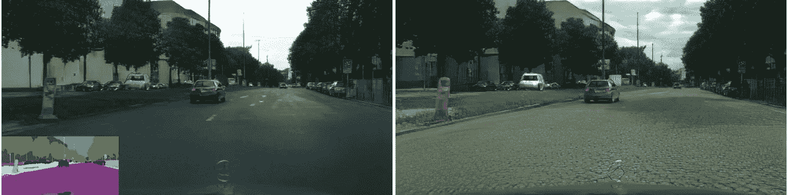

## **问题表述**

考虑生成一个视频，它由一组生成的图像组成，生成的图像从时间 ***1*** 到 ***T*** 和语义图像从时间***1****T***到时间 ***s*** 。**

然后，在每个时间 t 的图像生成被公式化为从时间 ***t-L*** 到***t-1****和语义图像 ***s*** 从 ***t-L*** 到 ***t*** 的生成图像的联合概率*

*整个图像序列(视频)的公式如下。*

*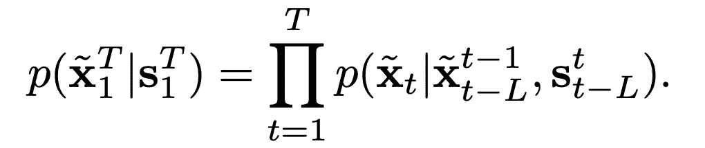*

## *发电机(F)*

*发电机 ***F*** 的结构如下图所示。*

*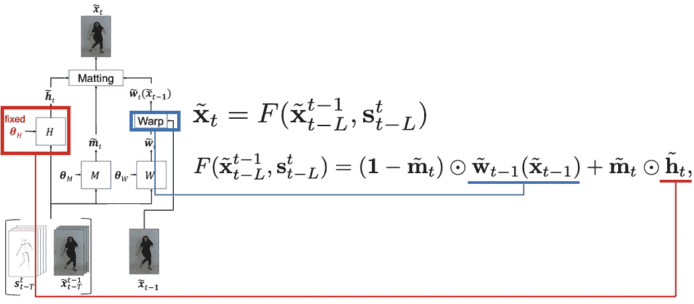*

*大致解释一下，它由两幅图像相乘得到的蒙版 ***m*** 组成。第一部分是前一次( **t-1** )被光流扭曲的图像(蓝色)。第二部分是合成另一部分(红色)的中间图像。屏蔽 ***m*** 具有从 **0** 到 **1** 的时间连续值。使用掩模 ***m*** 为每个位置分配两幅图像。由于视频是时间连续的，所以有一个自然的假设，即图像被分成可以使用光流表达的图像和不能使用光流表达的图像。*

*后面的中间图像 ***h*** 可以进一步分解如下:下标 B 表示背景，下标 F 表示前景。*

*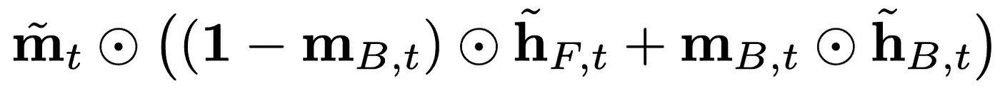*

*遮罩****m _ B***指示背景在时间 **t** 的位置，并决定哪一部分将由前景函数 ***h_F*** 或背景函数 ***h_B*** 生成。**

**前台函数 ***h_F*** 负责难以用光流表达的激烈运动的结构，后台函数 ***h_B*** 负责可以用光流表达的运动不大的部分。其实 ***F*** 的第一项就包含了一个利用光流扭曲图像的项，所以 ***h_B*** 负责的是时间*处新出现的背景等仅用光流无法表现的部分。***

***重写 F 包括这些结果如下。***

***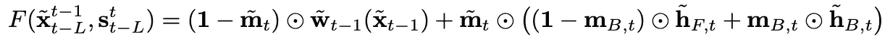***

## ***鉴别器***

***vid2vid 模型引入了两个鉴别器，图像鉴别器和视频鉴别器。***

1.  ***前者是区分(真实图像，对应语义图像)或(生成图像，对应语义图像)的鉴别器，考虑从语义图像生成的图像是否似是而非。***
2.  ***后者区分(真实图像，前一时刻对应的光流)或(生成图像，前一时刻对应的光流)，确定视频的运动是否自然。***

***此外，已知应该在多个尺度上引入鉴别器以防止模式崩溃。在 vid2vide 模型中，在多个尺度上引入了图像鉴别器。***

***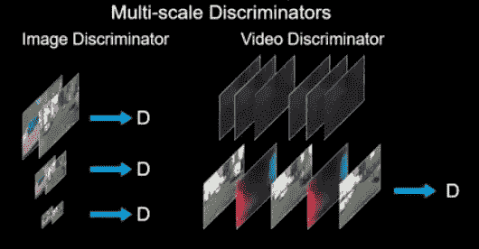***

## ***目标函数***

***优化发生器( **F** )和鉴别器的目标函数如下。***

***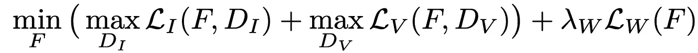***

***括号中的第一项 ***L_I*** 和第二项 ***L_V*** 是生成器 ***F*** 和鉴别器的极大极小公式化，如在正常的 GAN 目标函数中一样。下标 I 代表图像鉴别器，下标 V 代表视频鉴别器。***

**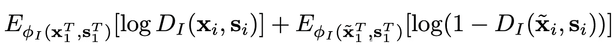****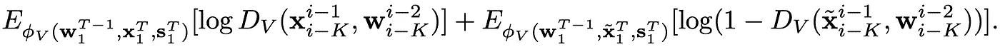**

**第三项 ***L_W*** 与光流有关。第一项是真实光流和预测光流之间的差异，第二项是在时间 t 由光流扭曲的图像和一个时间之前的图像之间的差异。**

**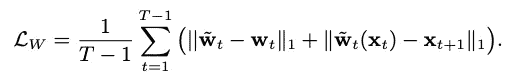**

## **训练方法**

**训练是以“时空渐进的方式”进行的。简单来说就是从小帧数和粗分辨率开始学习，逐渐交替增加帧数和分辨率的学习方法。**

**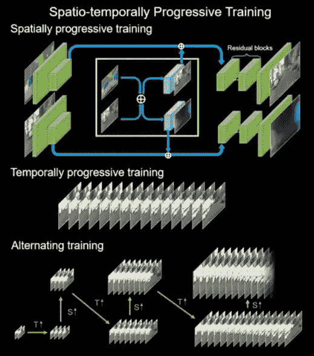**

**时空渐进方式**

## **结果**

**我介绍一部分结果。首先，使用相同的分割掩模生成两个视频的例子。由于遮罩是相同的，汽车和背景(行道树和建筑物)的位置是不变的，但您可以看到建筑物和行道树以及汽车的类型可以自由转换。**

**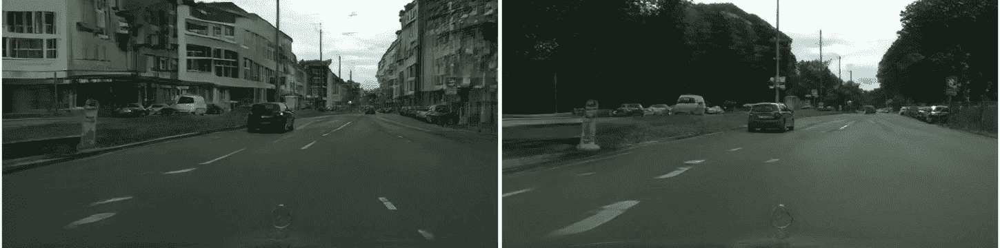**

**由 vid2vid 生成的视频**

**接下来是与其他方法的比较。由于图像是用前一次的条件概率生成的，所以与其他方法相比，可以生成自然的视频。**

**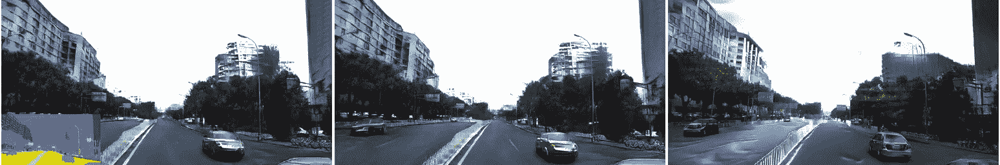**

**(左下)分割蒙版，(左) *pix2pixHD，(中)COVST，(右)vid2vid***

# **少镜头视频到视频合成**

## **摘要**

**该论文于 2019 年 10 月 28 日提交给 arXiv。本研究在 vid2vid 的基础上提出了“少镜头 vid2vid”模型。在 vide2vid 中，只能在学习过的视频中进行合成，但使用“很少拍摄的 vide 2 vid”，即使在培训中没有看到的视频中也可以进行视频合成。**

**总结如下。**

> *****他们提出了 GAN，称为“少镜头 vid2vid”，用少镜头合成视频。虽然它是基于 vid2vid，但他们使用修改的 SPADE[4]将样式插入到要通过少量镜头合成的样本中。结合下面的 2 个步骤，组成一个新的时间帧图像。*****
> 
> *****1。从合成图像(视频)和诸如关键点和区域划分掩模的语义图像中提取光流 W 和遮挡图 M。*****
> 
> ****2*2。提取你想要用编码器 e 合成的图像的特征，并用作可变风格参数，将其与语义图像一起放入修改的 SPADE ResBlock。*****

**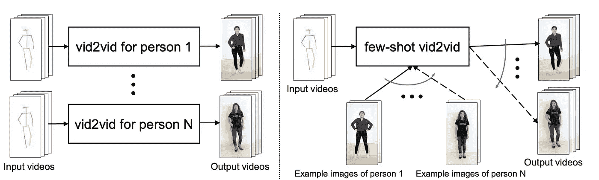**

**视频 2 视频(左)对少数镜头(视频 2 视频)**

## ****改进了少量镜头学习的架构****

**基本上，它遵循 vid2vid，但为了实现少镜头学习，他们修改了一个产生中间生成图像的模块 ***H*** 。在 vid2vid 中，模块 **H** 的参数是固定值，与输入数据无关。但少拍 vid2vid 允许模型根据你想要合成的输入样本( ***e_K，s_K*** )动态改变参数。**

**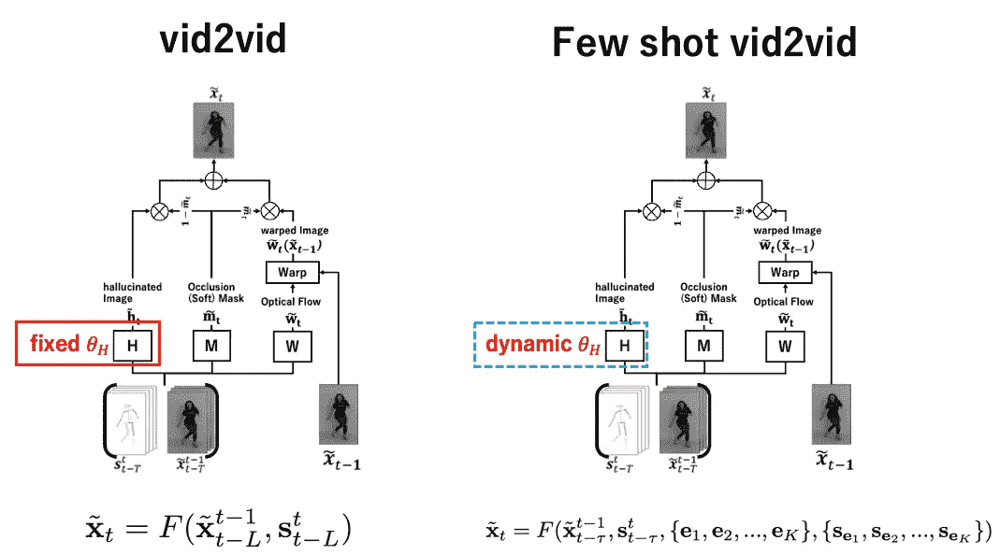**

**那么，我们如何使动态改变参数成为可能呢？有三个主要步骤。**

1.  **使用编码器( ***E_P*** )从( ***e_K，s_K*** )中提取每帧的特征，并计算每层编码器的特征***q ^ l***(***l***为层 ID)。**
2.  **计算每帧的注意力权重，并计算注意力加权的 ***q*** 。**
3.  **用 SPADE 将注意力加权的 ***q*** 和语义图像 ***s*** 插入生成器 ***H*** 中，并修改 SPADE 以处理动态参数。**

**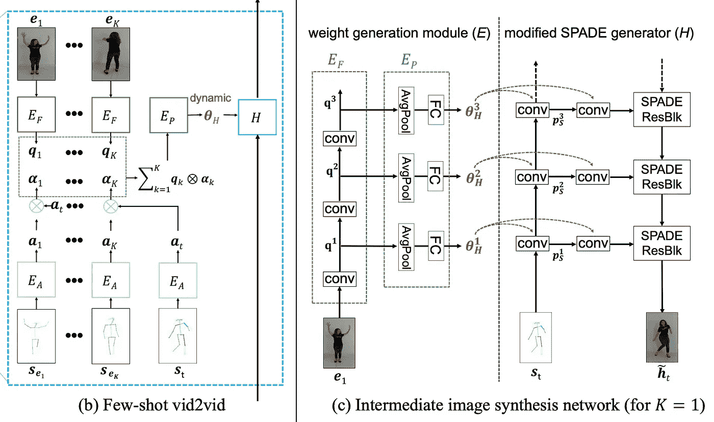**

**很少拍摄 vid2vid 的生成器架构**

**首先，在步骤 1 和 2 中，帧图像 E 和语义图像 ***s*** 分别由 ***E_F*** 和 ***E_A*** 处理。使用编码器 ***E_F*** 从帧图像 E 计算特征 ***q*** ，使用编码器 ***E_A*** 从语义图像 ***s*** 计算注意力权重。注意，针对编码器 ***E_F*** 的每一层提取特征 q。**

**在第三步，他们使用标准化层称为铲[4]，这是用于风格转移。GauGAN 使用 SPADE 可以从简单的线条和颜色绘制的插图中生成逼真的图像。**

****

**高根。[https://www.nvidia.com/en-us/research/ai-playground/](https://www.nvidia.com/en-us/research/ai-playground/)**

**原始论文中提出的 SPADE 的结构如下。每个卷积图都作为系数和偏差输入到每个批次的归一化特征值中。**

**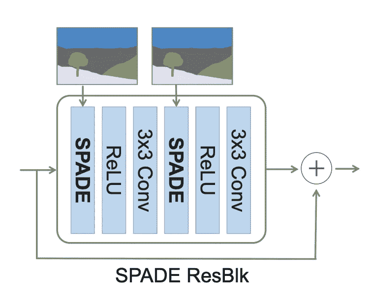****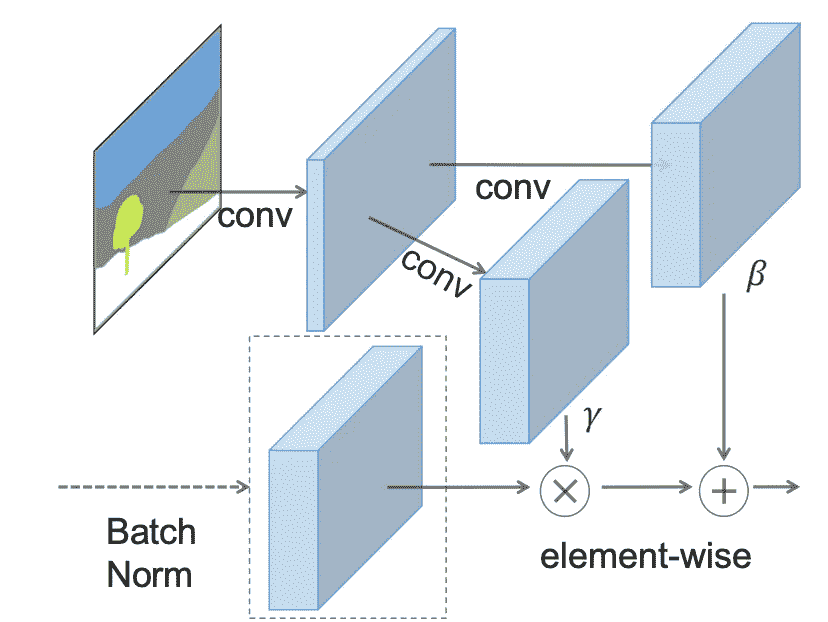**

**(左)SPADE ResBlock(右)SPADE 架构**

**在原始 SPADE 中，*和*使用固定值滤波器进行卷积。但是由于 SPADE in won shot vid 2 vid 需要动态改变参数，所以使用编码器 ***E_P*** 和 ***E_A*** 处理的权重 ***θ_H*** 对帧图像进行卷积。****

**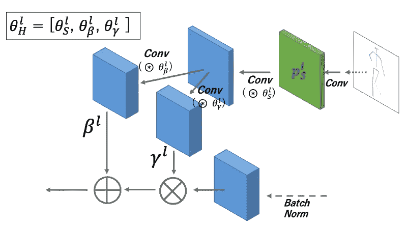**

**改进的黑桃在少数镜头视频 2 视频**

*****θ_H*** 分为 ***θ_S*** 、 ***θ_β*** 、 ***θ_γ*** ，在不同的部位进行卷积处理。用数学公式写成如下:**

**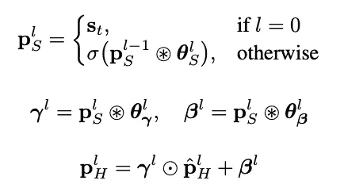**

**数学表达式中的黑桃**

## **结果**

**下面是一个用少拍 vid2vid 进行少拍学习的例子。首先，这里有一个例子，使用正在跳舞的人的关键点，用几个镜头转移舞蹈。可以看到转移非常成功。**

**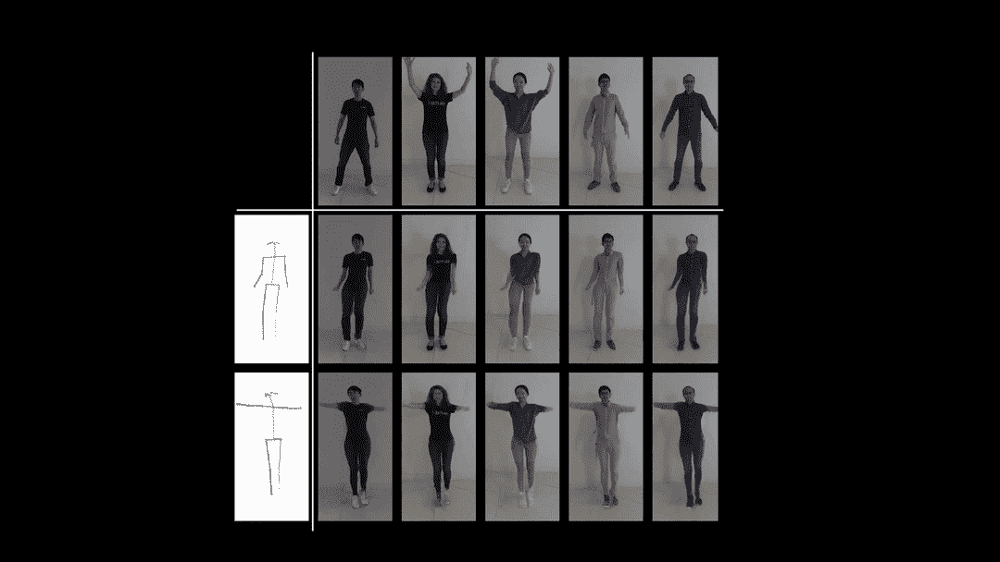**

**顶部 raw 是样本，左栏是舞蹈语义图像**

**接下来是一个道路和城市的示例(城市空间数据集)。同样，使用遮罩图像，可以按照您想要传输的示例图像的样式来生成电影。**

**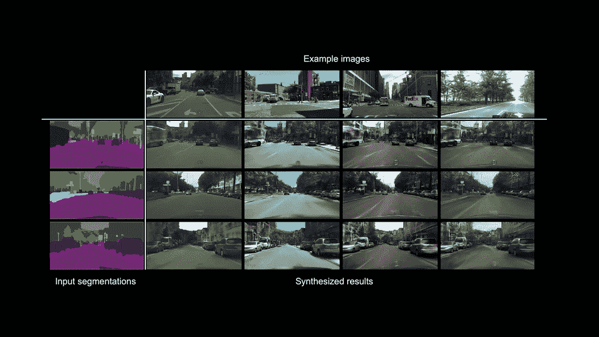**

**城市空间数据集中生成的视频**

**与其他方法相比，这是一个例子。可以看出，与现有方法相比，该方法可以很好地转移姿态。**

**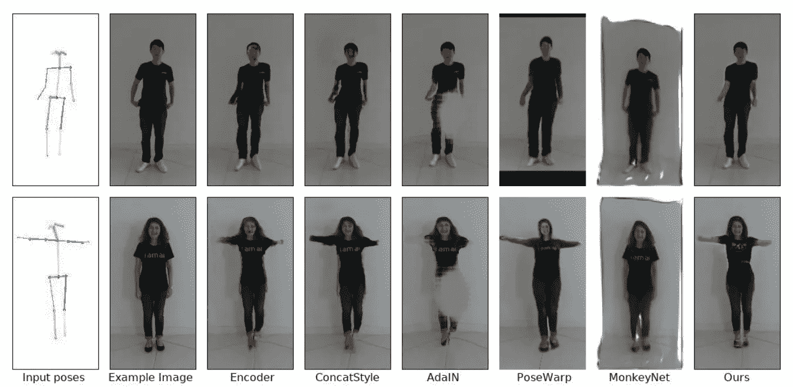**

**与其他方法比较。最右列的“出局”表示很少拍摄 vid2vid**

## **结论**

**在这篇帖子里，我介绍了可以合成自然视频的 vid2vid 和可以合成少镜头的少镜头 vid2vid。GAN 的进化真的很神奇，所以我真的很期待看到新的研究。**

** [## 阿基拉

### akira 的最新推文(@AkiraTOSEI)。机器学习工程师/数据科学家/物理学硕士/…

twitter.com](https://twitter.com/AkiraTOSEI)** 

# **每周机器学习时事通讯**

** [## 阿基拉的 ML 新闻杂志

### 关于我:制造工程师/机器学习工程师/物理学硕士/ ExaWizards Inc. _ _ _ _ _…

www.getrevue.co](https://www.getrevue.co/profile/akiratosei)** 

## **参考**

1.  **廷-王春等。视频到视频合成 arXiv:1808.06601，2018**
2.  **丁-王春等。少镜头视频到视频合成，arXiv:1910.12713，2019**
3.  **英伟达研究:视频到视频合成，[https://www.youtube.com/watch?v=GrP_aOSXt5U&feature = youtu . be](https://www.youtube.com/watch?v=GrP_aOSXt5U&feature=youtu.be)**
4.  **使用空间自适应归一化的语义图像合成。arXiv:1903.07291，2019**