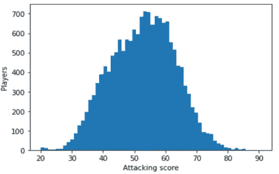
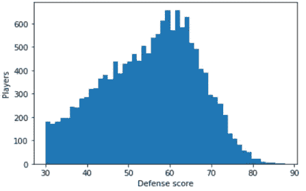
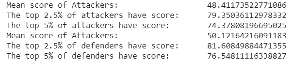
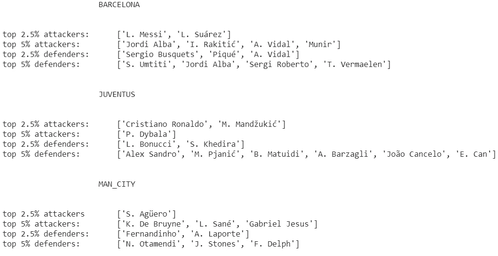
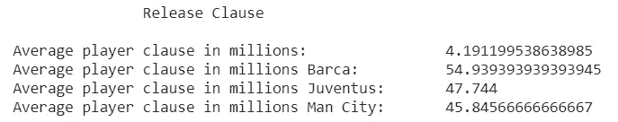

# 国际足联明星——深入了解三大事件。

> 原文：<https://medium.com/analytics-vidhya/fifa-stars-a-dive-into-3-biggies-979637072602?source=collection_archive---------29----------------------->

读者你好！几个月前，我发现了一件事，这让我在准备期中考试时经历了一段艰难的时间。作为一所工程学院的二年级学生，我们习惯于在考试前一周开始准备。故事从我的宿舍开始，在我们应该参加期中考试的前 10 天，我的**翅膀**让我沉迷于 FIFA-19。然而，尽管潜入过去的忧虑反射，让我们讨论我们是什么意思。今天，在浏览 Kaggle 数据集时，我发现了一些有趣的东西。首先让我们谈谈数据。

数据集包括 18207 名球员和 651 个俱乐部。这些球员由 40 个特征来代表，其中一些特征是——“姓名”、“年龄”、“俱乐部”、“传中”、“射门”、“头球准确性”、“短传”、“截击”、“运球”、“弧线”、“快速准确性”、“长传”等。玩了几分钟数据后(虽然我玩 FIFA 的兴趣不一样:-p)，我发现如此大的数据集使特征接近正态分布。虽然有一些**偏斜**存在。因此，我决定检查一下我最喜欢的 3 个团队有多少离群值。(巴萨、尤文图斯、曼城)。这些是我为了得到一些结果而采取的几个步骤。

1.  特征工程

我决定为 18207 名球员中的每一个计算 2 个新的数值——进攻和防守。这些功能是使用适当的类权重设计的。进攻——{射门、传中、头球精准……等等}，防守——{长传、盯人、铲球……等等}。

2.绘图和可视化

我可以推测，如此庞大的数据集很容易形成一个略微倾斜的**正态分布**。我使用箱号 *的各种值绘制了直方图。*我取了看似最好的，得到了攻守两个直方图。

攻击得分直方图

略微倾斜的防御得分直方图

3.从分布推断

将 **C.I** 设定在 90%和 95%。对于那些不是统计学家，但却是伟大的足球迷，并希望在名单中看到他们的明星的名字的人，我要道歉。供您参考，我所说的 90%和 95%的 CI 是指我将列出前 5%和 2.5%玩家的名字。这些是平均分数，以及顶级进攻者和防守者各自的分数。

满分为 100 分

4.结果

结果激励我去检查俱乐部整体的**释放条款**。难怪这些俱乐部中有如此多的局外人。检查这些大的每个球员释放条款。

价值以百万欧元计

尽管推论需要一些数据清理和预处理。有兴趣浏览代码的读者可以在我的[***github***](https://github.com/Saiyam1999/Statistical_Insights/blob/master/FIFA_data_analysis/FIFA.ipynb)***代码文件*** 中找到。祝你愉快。:-)