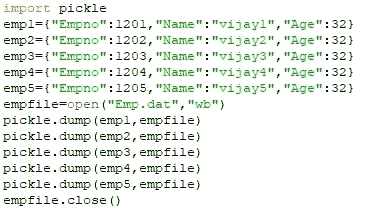
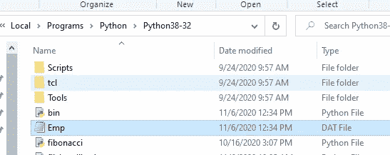
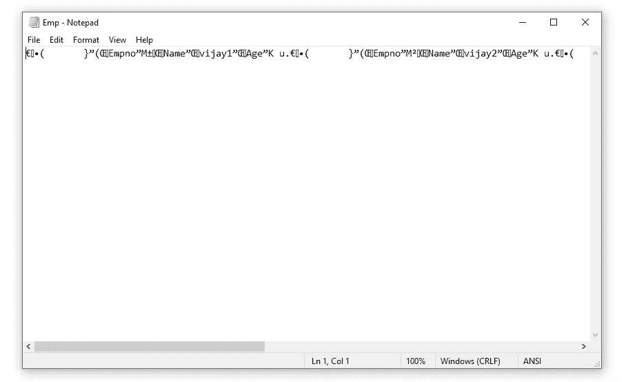
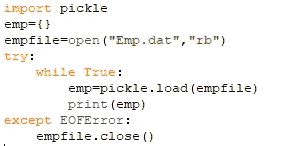
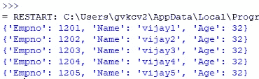
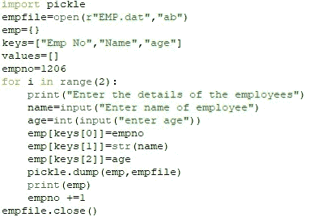
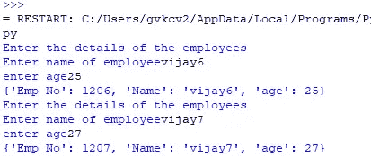
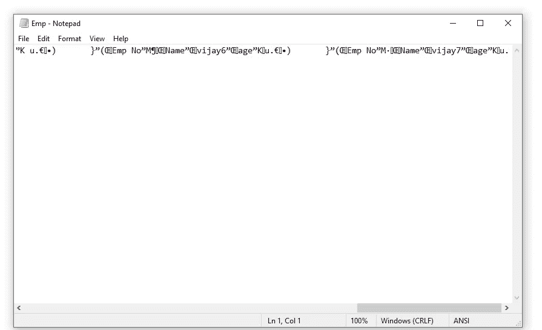
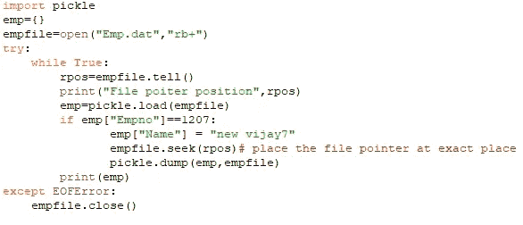
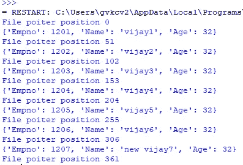

# 文件处理:二进制文件

> 原文：<https://medium.com/analytics-vidhya/file-handling-binary-files-656d9b6a702b?source=collection_archive---------10----------------------->

**序列化(也叫 pickle):**将 Python 对象层次结构转换成字节流以便写入文件的过程。

**反序列化(也叫拆包):**拆包的逆过程，将字节流转换成对象层次结构。取消拾取会产生原始对象的精确副本。

1.  第一个导入泡菜模块
2.  使用 pickle 模块的 dump()和 load()方法对二进制文件执行读写操作。

**文件打开模式:**

**wb** 只写。覆盖二进制文件(如果存在)。如果没有，则创建一个新的二进制文件进行写入。

**wb+** 既写又读。如果退出，则覆盖二进制文件。如果没有，则创建一个新的二进制文件进行写入。

**rb** 只读。在二进制文件的开头设置文件指针。

**rb+** 读写两不误。在二进制文件的开头设置文件指针

**ab** 用于追加。将文件指针移动到二进制文件的末尾。如果不存在，创建新的写入文件

**ab+** 用于追加和读取。将文件指针移动到末尾。如果二进制文件不存在，它会创建一个新文件进行读写。

1.  **写入二进制文件:酸洗**

输出:

2.编写程序打开文件 **EMP.dat** ( **在之前的程序**中创建)，读取其中写入的对象并显示。

输出:

3.编写一个程序，通过从用户处获取数据，将两个雇员记录追加到前面程序创建的文件中。

输出:

**访问和操作文件指针的位置:**

Python 提供了两个函数来操作文件指针的位置，因此用户可以从所需的位置进行读写。

**tell()函数:**

tell()函数返回文件指针在文件中的当前位置。

> <fileobject>。讲述( )</fileobject>

**seek()函数:**

seek()函数通过将文件指针放在打开文件中的指定位置来改变文件指针的位置。

> <fileobject>。搜寻(偏移[，模式])</fileobject>
> 
> 在哪里

offset ======= >是指定字节数的数字

mode ======= >是数字 0、1 还是 2

0 表示文件的开头

1 文件指针的当前位置

2 文件结尾

4.编写一个程序打开文件 **EMP.dat** (之前程序中创建的**)，读取 empno1207 的名字并修改为新的 vijay7 并显示。**

输出:

