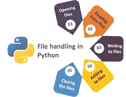
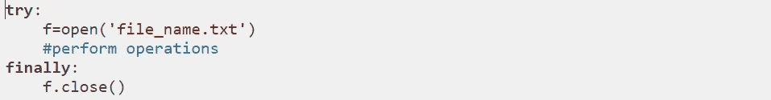
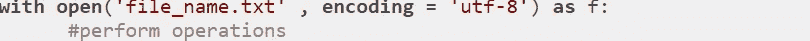
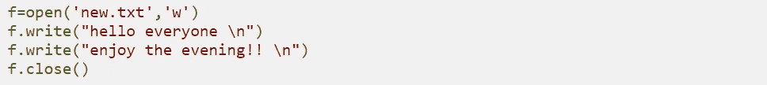
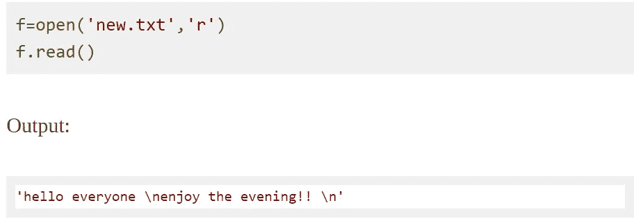
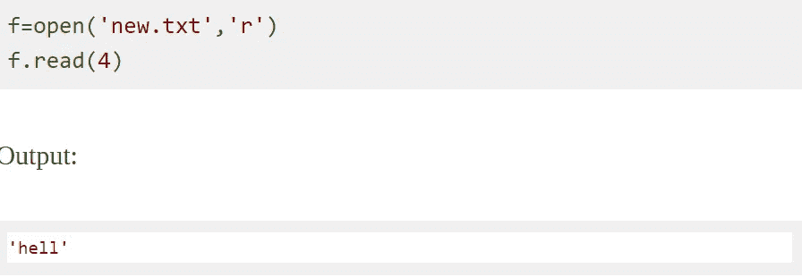
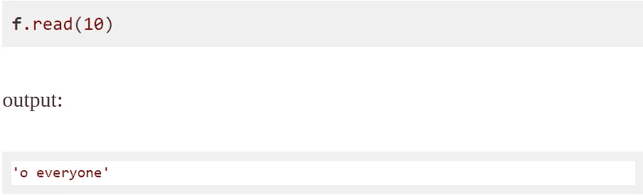
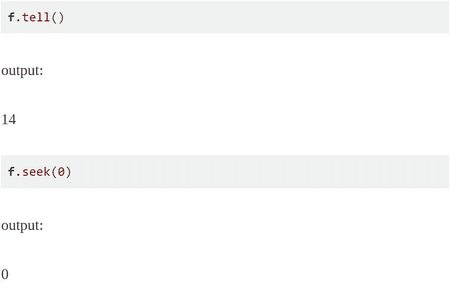
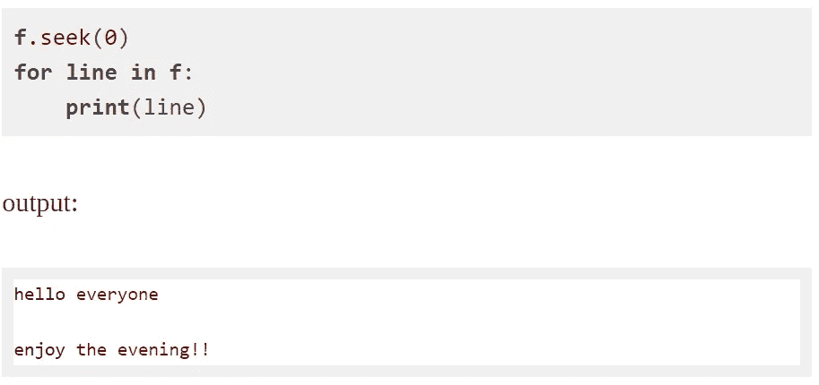
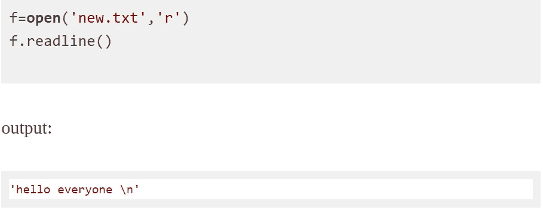

# PYTHON 中的文件处理

> 原文：<https://medium.com/analytics-vidhya/file-handling-in-python-673a484b34bb?source=collection_archive---------15----------------------->

让我们开始 python 中的文件处理之旅吧！！！

# 文件处理

Python 也像其他语言一样支持文件处理，包括不同的文件操作，如打开文件、读取、写入和关闭文件，但在深入研究之前，我们首先需要了解我们为什么要进行文件处理，什么是文件处理的需要。

文件是磁盘上存储信息的指定位置。它将数据存储在像硬盘一样的非易失性存储器中，因为我们知道随机存取存储器是易失性的，当计算机关闭时它肯定会丢失数据，所以我们使用文件来存储数据。

在文件处理中，当我们想先读一个文件或想先写一个文件时，我们需要先打开该文件，当我们完成时，它需要被关闭，以便与该文件相关的资源被释放。

# 文件操作



*   打开一个文件
*   读取和写入(执行操作)
*   关闭文件

# 打开文件

python 有打开文件的内置函数。这个函数返回一个文件对象，也称为句柄。我们称之为句柄，因为它用于相应地读取或修改文件。

f =打开('文件名. txt ')

我们还可以指定打开文件的模式。我们还可以指定我们是想以文本模式还是二进制模式打开文件。

## Python 文件模式

*   r '打开文件进行读取(默认)
*   如果它不存在，它将创建一个新文件；如果它存在，它将截断该文件。
*   x '以独占方式打开文件，但如果文件已经存在，操作将失败。
*   一个'打开附加在文件的末尾，不截断它，如果没有文件存在，然后它创建一个新的。
*   以文本模式打开文件(默认)
*   ' b '以二进制模式打开文件。我们可以使用二进制模式来存储矩阵或数据列表。
*   +'打开文件进行更新(读写)

例如:

```
f=open('file_name.txt')   #equivalent to readf=open('file_name.txt','r')f=open('file_name.txt','w')
```

默认编码依赖于平台，比如在 window 中是“cp1252”，但在 linux 中是“utf-8”。在 python 中，假设我们以读模式打开一个文件，那么首先 python 与操作系统对话文件操作，然后操作系统与文件对话。因此，建议使用文本模式来指定编码类型。

## 关闭文件

关闭文件主要是通过使用 close()方法来完成的。python 有一个垃圾收集器来清理被引用的对象，但是我们不能依赖它来关闭文件。

```
f=open('file_name.txt')f.close()
```

但是上面提到的方法并不那么安全，我们不能依赖它。假设考虑一种情况，如果在对文件执行某些操作时出现异常，那么代码在没有关闭文件的情况下存在。所以在这种情况下，我们应该使用 Try…Finally 块。在 python 中，当写入数据时，它首先进入 RAM，然后存储到硬盘，如果我们不关闭文件，数据将粘在 RAM 上，这是易失性的。



我们还有另一种方法，使用 with 语句。它确保当 with 内部的块退出时文件关闭，我们不需要显式调用 close()方法，它将在内部完成。



## 写入文件

我们可以通过在“w”、“a”或“x”模式下打开文件来写入文件。如果我们以“w”模式打开它，它会覆盖文件，如果它不存在的话，所有以前的数据都会被删除，所以我们在以“w”模式打开文件时必须更加小心。使用 write()方法写入字符串或字节序列。write()返回写入文件的字符数。



上面提到的代码将创建一个名为“new.txt”的新文件，如果它以前没有被创建。如果它已经存在，它将被覆盖。

**从文件中读取**

有多种方法可用于此目的。我们可以使用 read(size)方法来读取数据的大小。如果没有指定大小，那么它将返回到文件的末尾。



我们也可以从 read()方法中读取文件中的字符。



如果我们现在再次使用 read()方法，那么它将从光标的当前位置开始读取。



可以使用 seek()更改当前光标位置。

tell()方法用于知道光标的当前位置。



我们也可以使用 for 循环逐行读取文件。



我们也可以使用 readline()方法来读取文件的单个行。



如果我们现在再次使用 readline()，那么它将从当前光标位置开始读取，当到达文件末尾时，所有这些读取方法都返回空值。

## 在 Python 中重命名和删除文件

在 python 中进行重命名和删除时，我们需要首先在 python 脚本中导入操作系统模块，然后我们将使用 rename()方法。

```
f=open('new.txt','w')
f.write("hello everyone \n")
f.write("enjoy the evening!! \n")
f.close()f=open('new.txt','r')
f.read()
f.close()import os
os.rename("new.txt","sample.txt")
f=open('sample.txt','r')
f.readline()out[]: 'hello everyone \n'
```

我们可以使用 os.remove()方法删除文件。

```
f.close()
os.remove("sample.txt")
f=open("sample.txt",'r')
f.readline()
```

输出:

```
**FileNotFoundError**: [Errno 2] No such file or **directory**: 'sample.txt'
```

# Python 目录和文件管理

当我们必须处理大量文件时，我们可以将代码放在不同的目录中，使事情更容易管理。目录和文件夹是文件和子目录的集合。python 有操作系统模块，它为我们提供了许多使用目录的有用方法。

## 获取当前目录

我们可以使用 getcwd()方法获取当前目录，它以字符串的形式返回当前工作目录。

```
**os**.getcwd()**out**[]: '**C**:\\**Users**\\**DELL** **PC**'
```

## 更改目录

我们可以使用 chdir()方法改变当前的工作目录。新路径必须作为字符串提供给此方法。我们可以使用正斜杠或反斜杠来分隔路径元素。

```
**os**.chdir("/Users/DELL PC/desktop")**os**.getcwd()
```

我们可以使用 listdir()方法列出目录。

## 创建新目录

该方法接受新目录的路径，如果没有指定完整路径，则在当前工作目录中创建新目录。我们使用 os.mkdir()方法。我们也可以使用 rmdir()方法删除目录，但它只删除空目录。为了删除非空目录，我们可以在 shutil 模块中使用 rmtree()方法。

```
**os**.mkdir("hey")
**os**.rmdir("hey")import shutil
os.mkdir('simple')
os.chdir('./simple')
f=open('testfile.txt','w')
f.write("hello world")
os.chdir('../')os.rmdir('simple')out[]: **OSError**: [WinError 145] The directory is **not** empty: 'simple'f.close()
shutil.rmtree('simple') #non empty directory removal
os.getcwd()out[]: 'C:\\Users\\DELL PC'
```

在上面提到的例子中，我们首先创建了一个名为 simple 的目录。然后，我们使用 os.chdir(')将它作为当前目录。/simple ')方法在这里单个句号表示它是当前目录，而在 6 行中双句号用于当前目录的父目录。如前所述，我们不能用 os.rmdir()删除非空目录，因为它会给出 OSError，所以在上面提到的代码中提到了如何使用 rmtree()删除非空目录。

****************************************************************

玩得开心，不断学习，一直坚持编码。

*感谢您阅读本文！！！！！*