# 面向初学者的 python 文件处理

> 原文：<https://medium.com/analytics-vidhya/file-handling-in-python-for-beginners-b7f8504cd574?source=collection_archive---------16----------------------->

在编写代码时，我们将数据存储在变量中。存储在变量中的数据是不稳定的，即当计算机关闭时，我们会丢失数据。有时我们需要这些数据来做进一步的修改。因此，我们需要将它永久存储在内存中。

我们如何永久存储数据？

我们可以通过使用数据库来做到这一点，但是它以表格的形式存储数据。

如果我们想以简单的格式存储数据。这就是文件发挥作用的地方。

最简单的格式是。txt 文件。

让我们学习如何使用 python 创建、打开、写入和修改文件。

## 创建文件并写入文件:

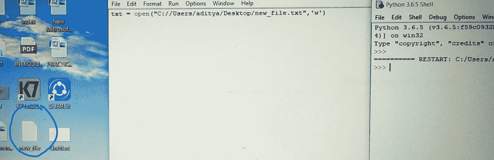

看看上面的代码，我们已经创建了一个名为 new_file.txt 的新文本文件。在 python 中,“open”关键字用于打开现有文件以及创建新文件。它需要两个参数:

1.  第一个参数告诉解释器打开哪个文件及其位置。
2.  第二个参数定义打开文件的模式或目的，即读、写、附加等。

我们使用' w '作为第二个参数，它告诉解释器打开文件进行写入。如果解释器找不到文件，那么它将使用第一个参数中指定的名称创建新文件。

我们已经打开了 new_file.txt 文件，现在我们想要写入一些数据，在 python 中将数据写入文件时，我们使用“write”关键字

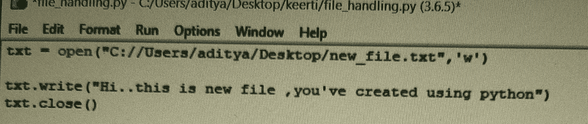

写完后不要忘记使用 close 关键字关闭文件。如果不关闭文件，文件中不会写入任何内容。现在 new_file.txt 会是这样的

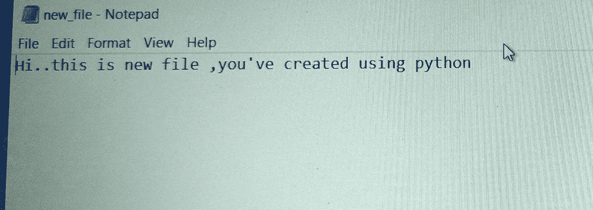

如果您想在现有文件中添加新数据，请在打开文件时使用' a '参数。这将告诉解释器以追加模式打开文件。所以无论我们写什么，都会被追加到文件中的现有数据。我们将在本文的后面了解这一点。

## 正在读取文件:

到目前为止，您已经在其中创建并写入了一些数据。现在你如何读取文件中的数据？

现在，在使用 python 读取文件之前，让我们将更多数据直接添加到文本文件中。打开文本文件，添加更多的数据并保存。

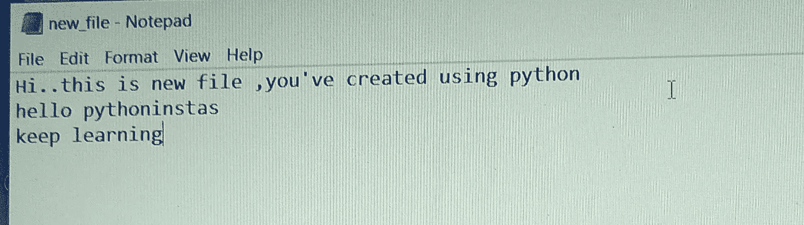

为了以读取模式打开文件，我们在打开文件时使用' r '参数。关键字' read '用于读取整个文件。

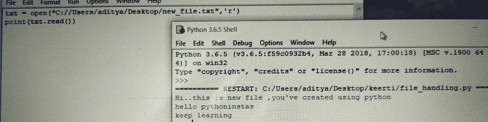

我们也可以使用 readlines 关键字进行阅读。但是 readlines 将一次返回一行。

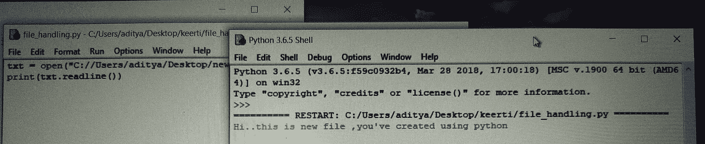

## 向文件中添加更多数据:

如果您使用' w '参数写入文件，它将清除文件中的所有现有数据，然后写入新数据。为了防止这种情况，我们可以使用' a '参数。它会将新数据追加到文件的现有数据中。

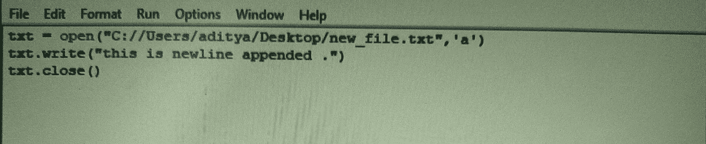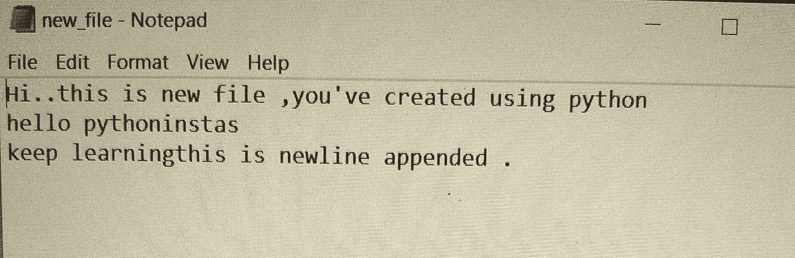

## 将一个文件的数据复制到另一个文件:

要将一个文件中的数据复制到另一个文件中，我们需要遵循以下两个步骤:

1.  读取第一个文件，并将其存储在变量。
2.  打开另一个文件，写入变量数据，最后关闭文件。

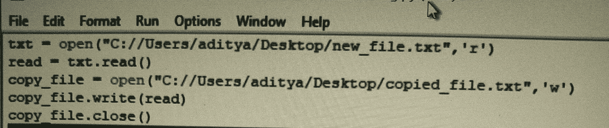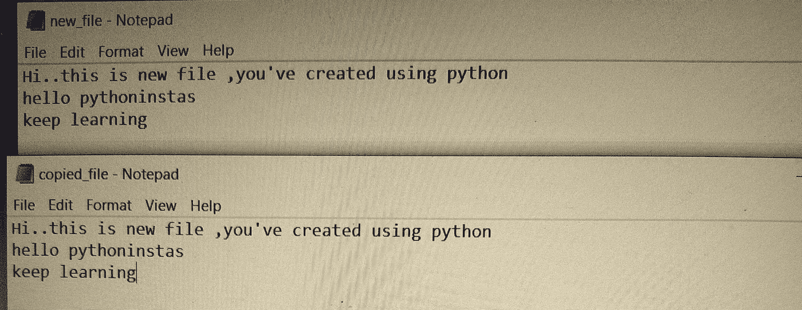

## 正在复制图像文件:

复制图像文件类似于复制文本文件。图像是一个二进制文件，所以我们将使用' rb '参数，而打开图像文件。

复制图像和文本文件的唯一区别是用于打开它的参数。

看下面的例子:

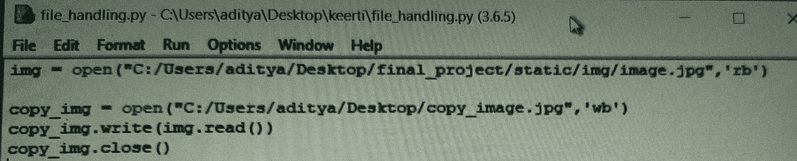