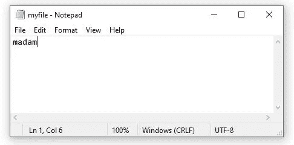
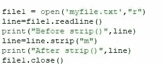
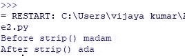
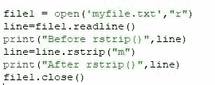
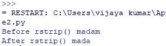
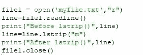
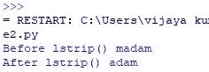

# 文件处理条()、rstrip()和 lstrip()

> 原文：<https://medium.com/analytics-vidhya/file-handling-strip-rstrip-and-lstrip-8bd2bedf10fc?source=collection_archive---------11----------------------->

*strip( )* 从两端删除给定的字符。

假设我们有以下文件，与 Python 位于同一个文件夹中:

程序:

输出:

*rstrip( )* 从尾端*即*右端删除给定字符。

输出:

*lstrip( )* 从前导*即*左端移除给定字符。

输出:

