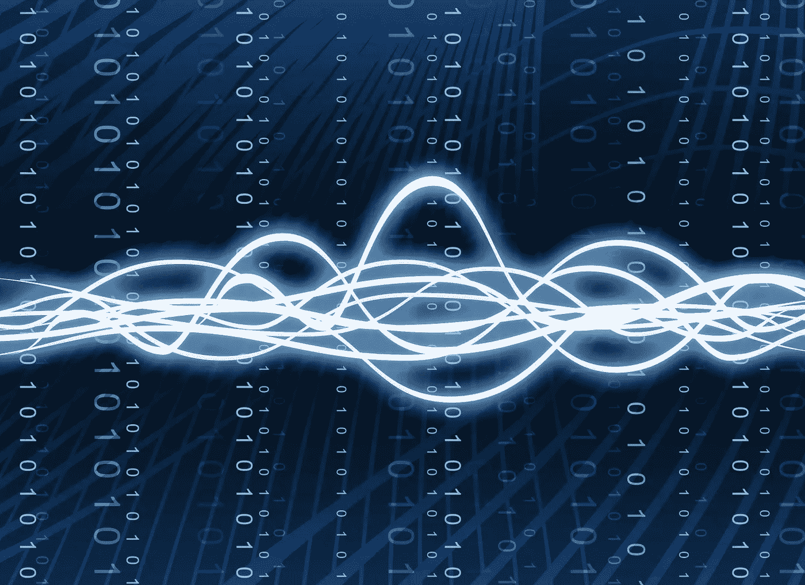
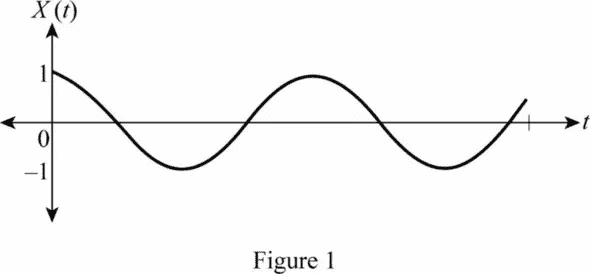
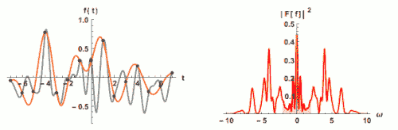
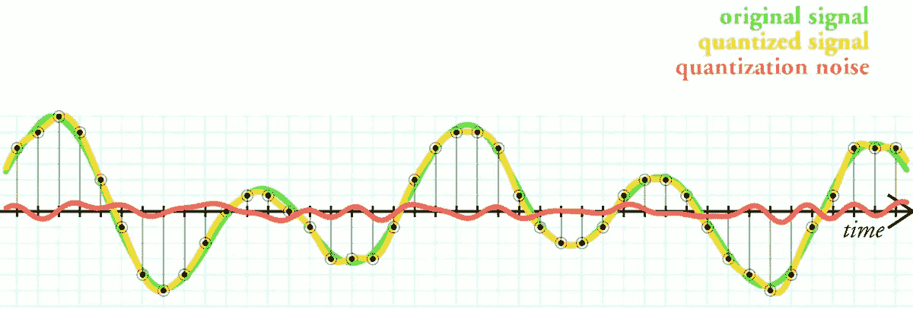
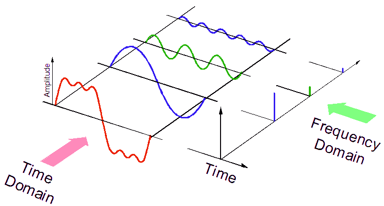
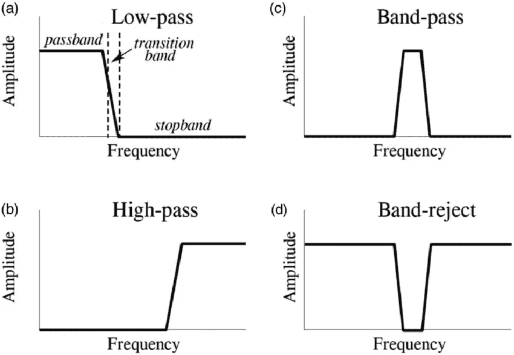
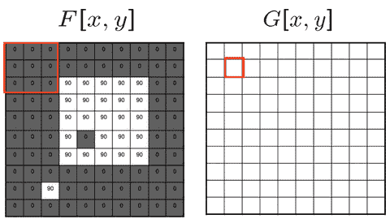
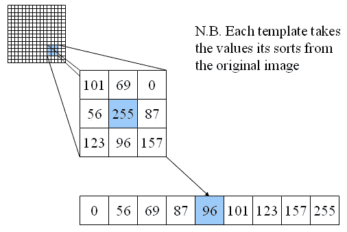
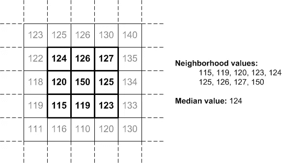
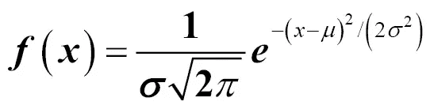

# 作为图像处理工具的滤镜—第 1 部分

> 原文：<https://medium.com/analytics-vidhya/filters-as-an-image-processing-tool-part-1-1700a925c105?source=collection_archive---------13----------------------->

[信号处理/通信](https://www.eng.ed.ac.uk/studying/postgraduate/msc-taught/msc-signal-processing-and-communications)

# 介绍

图像处理是计算机视觉方面的一个基本领域，它广泛涉及赋予机器理解图像的能力。有些图像我们确实希望机器能够理解，但在提取理解所需的基本特征之前，机器无法理解，而不通过某些图像处理技术，这是不可能发生的。

图像处理帮助机器实现的只是理解像素并做出更好决策的能力。这是通过增强图像以从图像中提取关键特征来实现的。

在我定义图像滤波之前，你需要了解什么是信号处理。信号处理是一个工程子领域，专注于分析、修改和合成**信号**，如声音、图像和科学测量。

图像滤波是一种关键的信号处理技术，包括图像中的平滑、锐化、去除噪声和边缘检测。当我们听到滤波器时，首先想到的是从系统特性中去除无用信号(成分)。

> 简单来说，滤波器是一种从信号中去除一些不需要的成分或特征的装置或过程。

信号可以是任何形式，可以是连续的**或离散的**。我说的连续信号和离散信号是什么意思。

连续信号*是相对于时间的*连续*振幅的信号*。连续信号称为**模拟信号**。处理这种形式的信号的行为被称为**模拟信号处理(ASP)** 。

连续信号

离散时间信号是一种具有在不同、分离的“时间点”出现的有效实数值的信号。离散信号被称为数字信号。处理这种形式的信号的行为被称为**数字信号处理(DSP)** 。

> 滤波器是从信号中去除一些不需要的成分或特征的装置或过程。

图像是信号数字表示的典型例子。下面我们就来深入探讨一下**数字信号处理(DSP)** 。

# 数字信号处理

用于 DSP 的工具包括卷积、拉普拉斯、z 变换、傅立叶变换、小波等。所有这些都是在时间和频率域内利用的。时域和频域基本上是监控信号或定义信号特征的手段。图像基本上是数字化信号，但相机/设备将信号作为模拟信号接收，但通过 DSP 将其记录为数字信号。这是可能的，因为在试图捕捉图像时，像素是离散采样的。由于被称为**的信号的采样速率(采样频率)，图像中存在最终的完美复制品。**

## **奈奎斯特定理**

**奈奎斯特定理是一个通过信号重采样频率关注信号再生的定理。该定理基本上说明，为了恢复信号中的信息，必须以两倍于该信号工作频率的频率对该信号进行采样。例如，如果信号 A 的工作频率是 30kHz 为了恢复这样的信号，我们必须以不低于 60kHz 的频率进行采样。这就是**奈奎斯特定理**。这基本上有助于我们解决电信领域沟通不完善的问题。举例来说，我可以在地点 B 用这个简单的定理在地点 A 和你交流。**

**当我们以低于奈奎斯特频率的频率对此类消息信号进行采样时，会发生什么情况呢？我们会遇到一种称为**混叠**的情况。混叠是重构信号中的失真效应，它产生与待采样信号完全不同的信号。**

> **混叠是重构信号中的失真效应，它产生与待采样信号完全不同的信号。**

**该图让我们了解了这一点的影响，下图显示了以稳定增加的采样密度/采样频率进行采样和重构(金色)的函数(灰色/黑色),而右图显示了灰色/黑色函数的频谱，该频谱没有变化。为了更好地理解这一点，在频率低于奈奎斯特频率的第一次仿真中，我们得到了一个与我们想要重构的波形完全不同的波形，但当我们提高该频率直到它达到奈奎斯特频率值时，我们就能够复制该波形(这就是奈奎斯特频率)。**

****

**[采样频率](https://en.wikipedia.org/wiki/Nyquist%E2%80%93Shannon_sampling_theorem#Aliasing)**

## **信号离散化**

**信号离散化是一种信号/波形再生的方法。通过使用奈奎斯特采样定理，我们能够从再生的信号中选择离散点，这样当我们将它们连接起来时，我们就能够生成原始信号。从上图可以看出，正在生成的波形中的黑点是我们信号再生的离散点。**

## **信号量化**

***量化*是将连续范围的值转换成有限范围的离散值的过程。**

****

**[信号的量化](https://en.wikipedia.org/wiki/Quantization_(signal_processing))**

## **图像处理中的滤波器**

**因为信号处理是一个广阔的领域。我将仅限于图像信号处理。在这里，我们将看到用于图像处理的各种滤波器，以及它们是如何实现的。**

**注意，**图像处理滤波器**主要是**用于**抑制**图像**中的高频，即平滑**图像**或者低频，即增强或者检测**图像**中的边缘。**图像**可以根据操作领域在频域或时域进行滤波。我们将看到的一些滤波器示例包括均值滤波器、中值滤波器、高斯滤波器。在本系列的第 2 部分中，我还将说明如何使用 [opencv](https://en.wikipedia.org/wiki/OpenCV) 以编程方式实现这一点。**

**首先，我想从频域中的滤波器图开始。**频域**是使用频率的信号表示/分析的域。这与通常的**时域**(信号相对于时间来表示)非常不同。**

****

**时域与频域**

**我们将研究如何将这些技术用于增强图像处理。原因是，图像处理在频域中似乎比在时域中容易得多。**

**用于频域模拟和数字信号处理的基本滤波器包括低通滤波器(LPF)、高通滤波器(HPF)、带通滤波器(BPF)和带阻滤波器(BSF)。将信号应用于基于频率的信号时，有 3 个集中区域。它们包括通带、过渡带和阻带。**

**通带描述了这种系统唯一允许的工作频率。过渡带是截止频率，阻带是需要抑制或滤除的频率范围。**

****

**[过滤器](https://www.researchgate.net/figure/The-four-common-filters-a-Low-pass-filter-passes-signals-with-a-frequency-lower-than_fig3_315801831)**

## **低通滤波器**

**低通滤波器是一种被设计成抑制高频信号而只给低频信号机会的滤波器。上图(a)简单说明了这一点。例如，在图像处理中，基本上在边缘处检测到频率的高变化，这表明在待处理的图像中噪声的高发生率。可以应用低通滤波器从真实图像信号中滤除图像中的噪声。用作图像处理工具的低通滤波器的例子包括:均值滤波器、中值滤波器、高斯滤波器等。所有这些都可以用 python 中的 scipy 库、opencv 和其他工具来简单说明。**

## **高通滤波器**

**高通滤波器基本上抑制低频信号，只允许高频信号通过。上图(b)简单说明了这一点。这通常用作图像处理技术，从图像中存在的高细节信息中过滤出图像中包含的低细节信息。这是卷积背后核心理论，当你在一组输入图像上卷积特定维度的典型核时。这有助于移除低细节信息，并帮助算法更多地关注高细节信息，这些信息可以增强算法的学习性能。它有助于图像获得清晰度。**

**这就是为什么当我们减小核的大小以使网络更深时，网络倾向于比以前的核维度更关注图像细节的根本原因。**

## **带通滤波器**

**这是低通和高通的结合，但方式独特。这种类型的滤波器是一种高级形式的滤波器，用作具有 2 个截止频率的图像处理技术。第一截止频率代表较低的频带频率(即小于该值的频率被衰减)，而第二截止频率代表较高的频带频率(即大于该值的频率被衰减)。因此，这给我们留下了一个允许的频率范围(通带)。如上图(c)所示。**

## **带阻滤波器**

**这也是低通和高通的组合，但与带通滤波器相反。它还有 2 个截止频率，第一个代表低频带，第二个代表高频带。较高和较低频段内的频率会被衰减，而超出该范围的频率是允许的频率(通带)。如上图(D)所示。**

# **过滤器在工作**

**现在，让我们来看看一些主要用于图像处理的滤镜。我们仍将深入研究它们在应用于图像时的实际作用。让我们先来了解一下它们是如何工作的。**

## **均值滤波器**

**均值过滤器基本上是一种滑动过滤器，它用窗口中所有像素值的平均值(均值)替换被覆盖窗口中的中心值。例如，在下图中，我们有一个 3 乘 3 维的过滤器，在 5 乘 5 维的零填充矩阵的窗口上移动。F[x，y]表示未滤波的图像，而 G[x，y]是平均滤波图像的结果运算。**

**请注意，在红框包围的第一个过滤器中，对于第一个条目，我们有:**

1.  **条目 1:得到 0 的(0，0，0，0，0，0，0)的平均值。**
2.  **条目 2 :( 0，0，0，0，0，0，0，90)的平均值，我们得到 10。**
3.  **条目 3 :( 0，0，0，0，0，0，90，90)的平均值，我们得到 20。**
4.  **条目 4 :( 0，0，0，0，0，90，90，90)的平均值，我们得到 30。**

**如此继续下去，直到实验矩阵被均值滤波。**

****

**移动平均数**

> **均值滤波器是一个简单的滑动窗口空间滤波器，它用窗口中所有像素值的平均值(均值)替换窗口中的中心值。窗口或内核通常是正方形的，但可以是任何形状。**

## **中值滤波器**

**这在操作上类似于均值过滤器，不同之处在于过滤操作符不寻找均值而是中值。下面是这种技术的一个示例。下图显示了从主图像中提取的 3 乘 3 部分。提取的部分具有(101，69，0，56，255，87，123，96 和 157)的像素值，找到这些值的中值给出了滤波图像的值 96。**

****

**说明 1**

****

**说明 2**

> **请注意，中值过滤器通过查找将被映射到过滤图像的所有像素条目的中值来处理由过滤器包围的像素的分配集合。**

## **高斯滤波器**

****高斯滤波器**是**滤波器**，其脉冲响应是**高斯**函数(或其近似函数，因为真实的**高斯**响应在物理上是不可实现的)。实施高斯滤波器有两个关键参数，它们都包括所考虑分布的均值和标准差。**

****

**一维高斯函数**

# **结论**

**现在，我们已经能够看到一些过滤器的典型例子。下一篇文章将基于我们如何将它们实现为一种图像处理技术。如果你有任何问题要问我，请在下面的评论区留言。要了解以上概述的更多研究，请查看参考链接。**

**请标记并与需要理解这一点的朋友分享。谢了。**

# **参考**

1.  **[https://medium . com/image-vision/noise-filtering-in-digital-image-processing-d12b 5266847 c](/image-vision/noise-filtering-in-digital-image-processing-d12b5266847c)**
2.  **[https://en.wikipedia.org/wiki/Digital_image_processing](https://en.wikipedia.org/wiki/Digital_image_processing)**
3.  **[https://www . cs . Auckland . AC . NZ/courses/compsci 373 S1 c/patrices lections/Image % 20 filtering _ 2up . pdf](https://www.cs.auckland.ac.nz/courses/compsci373s1c/PatricesLectures/Image%20Filtering_2up.pdf)**
4.  **【https://homepages.inf.ed.ac.uk/rbf/HIPR2/filtops.htm **
5.  **[https://衍射极限. com/help/maximdl/高通 _ 过滤. htm](https://diffractionlimited.com/help/maximdl/High-Pass_Filtering.htm)**
6.  **[https://north star-www . Dartmouth . edu/doc/IDL/html _ 6.2/Filtering _ an _ image hvr . html](https://northstar-www.dartmouth.edu/doc/idl/html_6.2/Filtering_an_Imagehvr.html)**
7.  **[https://en . Wikipedia . org/wiki/Nyquist % E2 % 80% 93 Shannon _ sampling _ theory # Aliasing](https://en.wikipedia.org/wiki/Nyquist%E2%80%93Shannon_sampling_theorem#Aliasing)**
8.  **[https://www.markschulze.net/java/meanmed.html](https://www.markschulze.net/java/meanmed.html)**
9.  **[https://www.southampton.ac.uk/~msn/book/new_demo/median/](https://www.southampton.ac.uk/~msn/book/new_demo/median/)**
10.  **[https://ai.stanford.edu/~syyeung/cvweb/tutorial1.html](https://ai.stanford.edu/~syyeung/cvweb/tutorial1.html)**