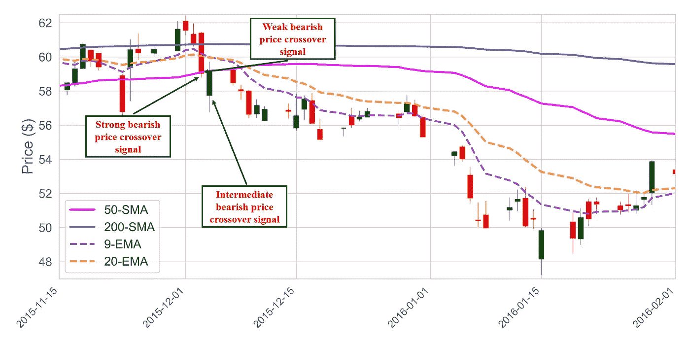

# 用 Python 处理金融数据

> 原文：<https://medium.com/analytics-vidhya/finance-data-with-python-29e02ce1fae0?source=collection_archive---------2----------------------->

## PYTHON 金融

## 让我们得到一些雅虎财务数据

**目的:**使用 Python 下载[雅虎财经](https://finance.yahoo.com/)历史股市数据。

**注意:**如果你是从零开始，我会建议你按照这篇[文章](https://towardsdatascience.com/installing-keras-tensorflow-using-anaconda-for-machine-learning-44ab28ff39cb)安装所有必要的库。

# 导入库