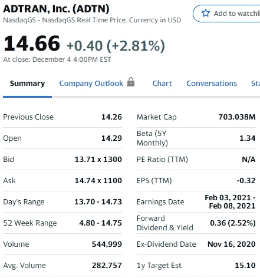

# 金融理论—市场微观结构—买卖价差

> 原文：<https://medium.com/analytics-vidhya/finance-theory-market-micro-structure-bid-ask-spread-f3bf4d153f8d?source=collection_archive---------19----------------------->

在这篇文章中，我将试着解释交易的一大成本——大买卖盘反弹，以及它如何影响交易决策和盈利能力。

# 限价订单簿

要知道买卖价差，我们需要知道买价和卖价。要知道买价和卖价，我们需要知道限价订单和限价订单簿。美国证券交易所组织[限价指令簿](https://www.investopedia.com/terms/l/limitorderbook.asp#:~:text=Key%20Takeaways-,A%20limit%20order%20book%20is%20a%20record%20of%20outstanding%20limit,record%20by%20the%20security%20specialist.)(你可以在这里找到更多信息[)。你可以在这里](/stabletrade/understanding-order-books-orders-b297ea51acff)找到关于 3 种基本订单类型(市价订单、止损订单和限价订单)[的信息。限价订单簿是由交易所建立，用来组织交易者发出的订单。订单被分成买入订单和卖出订单，并被排序，使得价格较好的订单被排序为较高(第一)，较早的订单被排序为较高(第二)。嗯，我说的“价格更好”是指非常昂贵的买入订单和非常便宜的卖出订单。](https://www.schwab.com/resource-center/insights/content/3-order-types-market-limit-and-stop-orders)

长话短说，在我们看到的所有算法交易文章中，人们通常假设可以在一个收盘价买入，在另一个收盘价卖出。为了确保您的交易能够以假设的收盘价成交，您必须下限价单，并在限价单簿中排名。然而，限价单不一定会被执行。原因如下。

看看下面比特币/美元的限价单簿。左边的数字(绿色阴影部分)是买入订单，右边的数字(红色阴影部分)是卖出订单。购买订单中指定的价格称为“出价”。询价单中指定的价格称为“要价”。

[https://www . Reddit . com/r/CryptoCurrency/comments/85 akqm/guys _ what _ does _ this _ bit coin _ order _ book _ at/](https://www.reddit.com/r/CryptoCurrency/comments/85akqm/guys_what_does_this_bitcoin_order_book_at/)

当您向该订单簿提交 7，500 美元的限价购买订单时，您的订单将排在第二位，因为之前已经有一个 7，500 美元的订单，但您仍然愿意以该订单簿上的最高价格购买。然而，如果你看看要价方，你会发现人们愿意购买的最低价格要高出 100 美元，为 7600 美元。因此，除非有人愿意以 7500 美元的价格出售，否则你的订单不会被满足。我想你明白了: ***为了以你想要的价格卖出，必须有人愿意以你想要的价格买入。***

总而言之，我们每分每秒观察到的市场价格只是 ***一个最近成交的买价或者一个最近成交的卖价*** 。你不一定得到我们观察到的价格，你得到的是买价还是卖价取决于交易的方向。

# 那么，如何确保我的订单得到满足？

为了确保你的交易能够成交，你必须下市价单或高于或等于 7600 美元的买入价单，因为这是人们愿意出售的价格。市价买入订单会为你选择最好的要价订单。也就是 7600 美元的订单。

这将使你交易的每笔 BTC 损失 100 美元的利润？也就是 1.3%左右？不仅如此。在这里卖，就得按出价卖。那会再拿走 100 美元。所以又是 1.3%。总的来说，当你在这里用 100 美元的 ***买卖价差*** 交易时，你的交易成本是 2.6%。

# 这能有多大？

实际上，我认为 2.6%非常大，因为如果你的算法有很高的换手率，例如一天交易超过 5 次，这 5 次交易的平均收益率必须超过 2.6%，你的策略才能盈利。如果你的策略侧重于小型股票或廉价的加密货币，那么影响将是巨大的。例如，ADTN 是一只罗素 2000 股票。(罗素 2000 由市值排名第 1001 至 3000 位的股票组成。所以这些都是很小的股票。)

买卖差价约为 1 美元，是当前要价的 7%。如果你买，你必须在 14.74 美元买。如果股票不动，你决定削减头寸，你必须在 13.71 美元卖出。你损失了 1 美元，而价格却没有变动！

# 能做些什么？

当买卖价差存在时，作为散户投资者，有两件事可以做——避开它或利用它。

为了避免成本，试着用市值或交易量大的股票来交易股票或构建你的算法。这种工具通常只有 1 美分的买卖差价，因为很多人都在交易。当你在构建一个涉及许多不同证券的多空头寸的算法时，你需要格外小心，因为通常这种成本不会在回溯测试中显示出来。

为了利用它，人们可以构建通过填补空白来获利的算法(即将到来的文章)。在混乱的市场中，我们实际上可以发出略高于现有出价的买价订单和略低于当前卖价的卖价订单。如果有人下市价单，我们的订单就会被执行。从这个意义上说，这种算法充当了“做市商”的角色。

这一个就到此为止。我希望这篇文章对你的交易和投资有所帮助。买卖价差很重要，但还有其他关于市场微观结构的重要话题。如果你喜欢这篇文章，会有更多关于这方面的文章。

谢谢大家！

