# 深度学习时代的金融酒吧

> 原文：<https://medium.com/analytics-vidhya/financial-bars-at-the-age-of-deep-learning-5228b99831f7?source=collection_archive---------9----------------------->

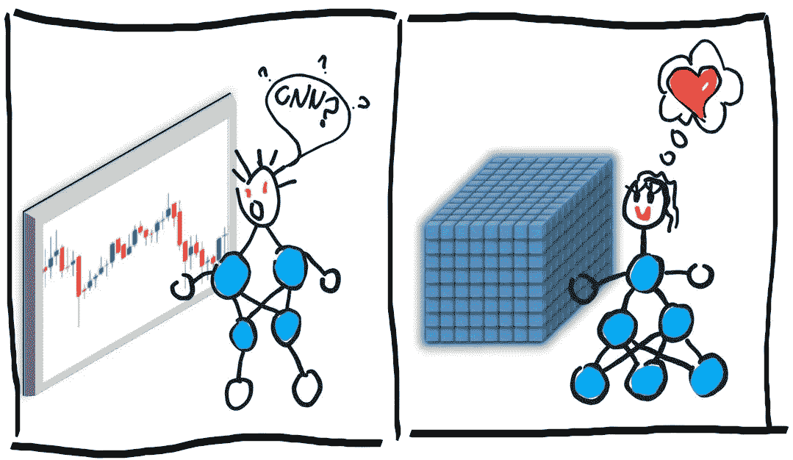

在机器学习和深度学习的时代，金融数据的表示需要新的方法。例如，烛台起源于日本米商，在 18 世纪首次使用。显然，它们不是为神经网络开发的。它们非常适合可视化价格运动，但隐藏了可能的重要信息。模型以不同的方式处理数据，它们可以“理解”人类难以大量理解的特征。

我们识别图像中的模式，神经网络识别多维数据集中的模式。我们可以使用相同的 OHLC 数据来显示一个条形图并反馈到我们的网络，但是除了采样棒线的开盘价、最高价、最低价和收盘价之外，我们还可以从价格变动中获得非常不同的附加信息。

我将分享关于神经网络的时间序列数据转换的想法，并在最后加入一些亵渎的味道，但还有许多其他选择值得研究。平稳性、同方差性或不相关特征对于一些预测方法来说是非常重要的，但神经网络不需要这么强的条件。这些条件可以提高一些模型的性能，而其他模型则是为了处理异方差数据而构建的，如我在早期文章中的[混合密度网络。](/analytics-vidhya/time-series-prediction-with-multimodal-distribution-building-mixture-density-network-with-keras-b1020d9de5a1)

我们将只使用要价。将它与出价、交易量或其他数据结合起来，可能会带来许多新功能。

这篇文章不是马科斯·洛佩兹·德·普拉多的[书中观点的实现。那是一本很棒的书，你可以在里面找到很多关于这个主题的文章。例如，](https://www.amazon.com/Advances-Financial-Machine-Learning-Marcos/dp/1119482089)[马克斯·伊万诺夫](https://towardsdatascience.com/financial-machine-learning-part-1-labels-7eeed050f32e)的这篇文章，解释了时间棒线、分笔成交点棒线、成交量棒线、美元棒线和不平衡棒线。

我们遵循一种不同的方法，但是我们可以将本文中的思想与上述技术结合起来。为简单起见，我们将使用时间棒，但对于大多数示例，可以使用上述任何替代棒采样方法。

代码，笔记本可以到这里:[https://github . com/sinus gamma/bars _ with _ deep _ learning/blob/master/ts _ bars . ipynb](https://github.com/sinusgamma/bars_with_deep_learning/blob/master/ts_bars.ipynb)

# 资料组

我们的原始数据是 2016 年的美元/日元分笔成交价格。我们将研究重采样和要素构建技术，但不会训练模型，因此我们不会使用大型数据集。滴答数据的来源是[dukascopy.com](https://www.dukascopy.com/trading-tools/widgets/charts/chart)。

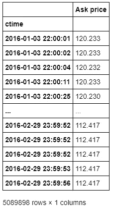

# 好的旧烛台

为什么我们需要酒吧？bar 的主要作用是过滤噪声、压缩信息，并将数据转换为人类或模型可理解的形式。这适用于所有类型的酒吧，不仅仅是烛台。噪音过滤和信息压缩帮助我们(或者没有帮助我们)看到价格运动，识别趋势，支撑位和阻力位，波动区域和烛台模式(在我看来是误导多于有用)。不幸的是，由于过滤和压缩，许多重要信息消失了，或者我们得到了错误的印象。例如，烛台状的尾巴比身体细得多，这在视觉上暗示了大多数价格行为发生在身体的区域，但并不总是如此，有时大多数价格行为发生在尾巴的上部或下部，或者具有多模态分布。

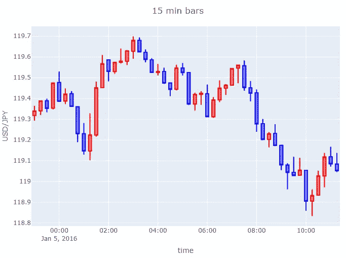

15 分钟棒线示例

# 条形张量

当我们为模型对“条”进行采样时，主要目标类似于为人类可视化对条进行采样。大多数情况下，我们想要更少的噪音数据，更少的数据来加速计算，以及我们希望能够提高模型性能的功能。当然，我们总是可以使用原始分笔成交点数据，在观察短期价格变动时，我更喜欢分笔成交点图而不是棒线。为什么在训练模型时要使用横条呢？

*   一个原因是所需的计算能力。根据条形的范围和参数的数量，条形数据可能只是原始分笔成交点数据大小的一小部分。
*   基于 LSTM 层的模型在长序列方面存在问题，如果目标预测时间范围相对较大，分笔成交点数据的频率对它们来说太多了。
*   我们可以从分笔成交点数据中生成能够提高模型性能的特征。

条形特征的数量是任意的。我们应该把这些杆看作张量。我们将使用一维向量作为条形，但是如果我们愿意，构建多维条形并不困难，我们的模型能够使用它们。仅举一个 2XN 尺寸条的例子:N 代表我们从分笔成交点数据中获得的特征的数量，两层是要价和出价数据。您需要一个合适的模型来使用这种数据排列，因为相同的数据可能具有 1X2N 维度，其中从报价和报价分笔成交点派生的特征沿着同一轴连接。但是，如果使用 2XN 尺寸输入，可以在其上使用 Conv1D 层，类似于 RGB 图像的 Conv2D 卷积。但是我们可以在一个非常不同的维度上扩展我们的功能。我们可以使用最后一个分笔成交点数据作为锚点，而不是仅从一个时间帧采样，我们可以使用在该锚点结束的不同时间帧的派生特征或统计数据。在使用深度学习模型时，我们应该在构建条形时考虑模型的层，因为不同的层可以探索不同的连接。

什么样的新功能可以添加到我们的酒吧张量？任何一种我们能想象并证明是有用的。开盘价，最高价，最低价，收盘价(代码中的 first，max，last，min)可以保留在我们的特性中，为什么不呢，但是如果你不在乎棒线之间的滑点，你甚至可以省略开盘价。如果你重新采样每日股价，你不应该放弃它，但是 1 分钟棒线的开盘价可能不那么重要。特征可以是条形范围内分笔成交点的平均值，也可以是分笔成交点的体积加权平均值。如果我们使用基于时间的棒线，那么时间范围内的分笔成交点数量可以是另一个特征。如果我们使用分笔成交点，那么分笔成交点的时间范围也是一个特征。我们可以使用棒线中分笔成交点的标准差来比较棒线的波动性，以及价格和时间轴之间的 Spearman 等级相关性来估计价格运动的单调程度。对数回报可以是另一个特性，我们将计算分位数来估计棒线中价格点所在的区域。我们可以创造其他特征。如果你有什么想法，可以在评论里或者 LinkedIn 上分享:)

好吧，让我们建造我们的“酒吧”！

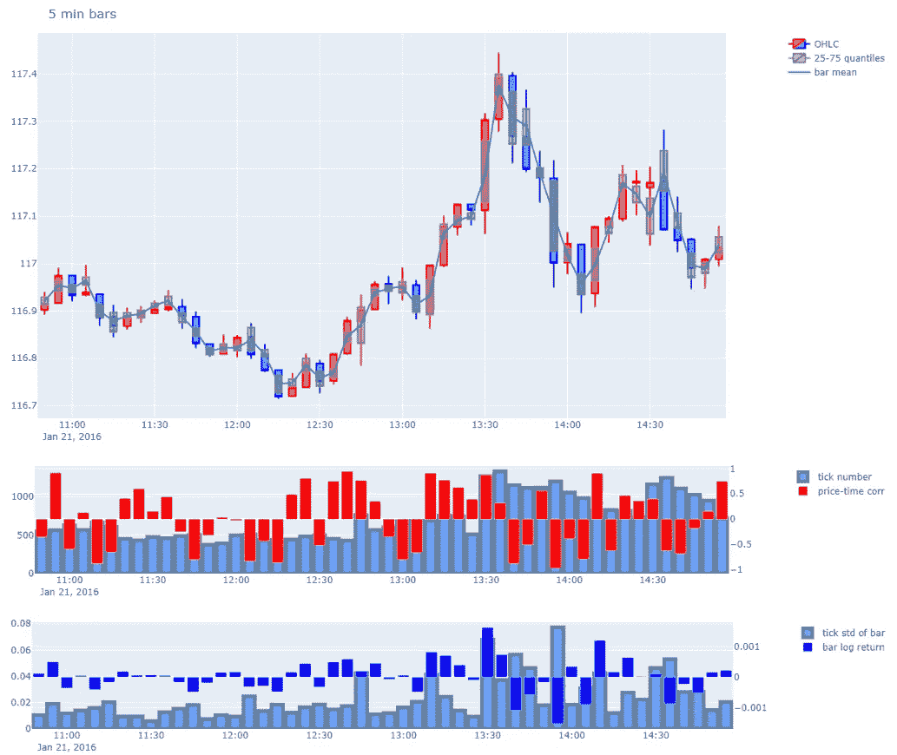

5 分钟棒线的特征

上面的图表显示了我们的一系列特征。一些观察:烛台的主体显示了不同于 Q1-Q3 系列的模式。对数收益随着 Spearman 等级相关性一起移动，价格的最高标准差更典型的是有更多分笔成交点的棒线。显示的序列很短，更深入地分析这些联系并不是笔记本的目标，但我们期望(/希望)新功能将提高我们模型的性能。

# 完善特征

在我们的特性中，我们有日志返回和价格信息。对于神经网络来说，所有这些都是有用的，并且取决于我们预测的特征，其中一个可能比另一个更重要。[本文](https://quantivity.wordpress.com/2011/02/21/why-log-returns/)解释了日志返回的优势。有了我们的数据集，这些优势可以得到扩展。在下表中，我们可以看到价格特征的相关性和标准差。相关性几乎是 1，直到小数点后第二位，标准偏差是相同的，因为相对于长期价格变化，棒线中的价格特征彼此非常接近。这意味着模型必须在非常相似的数字中找到有用的模式。

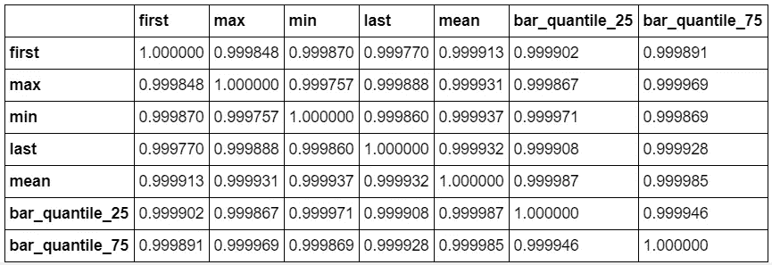

原始价格特征的皮尔逊相关性

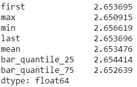

原始价格特征的标准差

我们如何帮助模型？我们可以“对数回归”大多数价格特征。

我们使用“平均价格”特征作为棒线内对数回报的基础，并计算相对于棒线平均价格的所有其他“价格特征”，但其他价格特征可能是一个合理的基础。当使用平均值作为计算的基础时，类似回报的高值和 Q3 将始终为正，低值和 Q1 为负。新特征的相关性要低得多。当缩放到与简单价格特征的标准偏差相同的数量级时，新特征的标准偏差变化更大，而聚集分位数特征的标准偏差比一个分笔成交点相关的开盘价、盘高、盘低和收盘相关特征的标准偏差小得多。这些统计数据意味着我们的新特性可以更容易地产生模型可识别的模式。

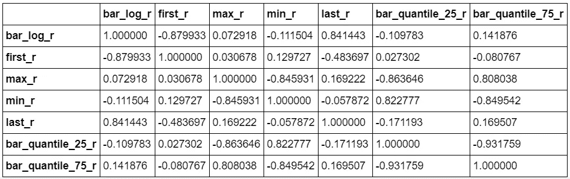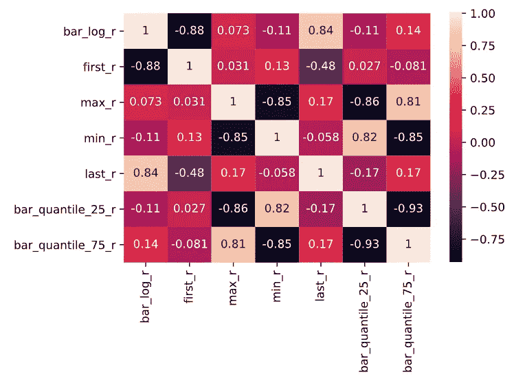

新价格特征的皮尔逊相关性

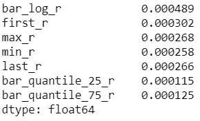

新价格特征的标准差

# 数据扩充

在时间序列上训练深度学习模型时，我们要面对两个问题。数据集可能太短，无法满足数据饥渴的神经网络的需求，而在太旧的数据上进行训练有时比丢弃数据更糟糕。

扩充数据有助于增加样本数量。有了分笔成交点数据，我们可以从任何分笔成交点采样棒线。例如，我们可以不使用 17:00-18:00 范围内的小时线，而是对小时范围从(xH:41 分钟)—(x+1H:41 分钟)甚至每个收盘点的小时线序列进行采样。

在下面的图表中，我们可以比较一个 5 分钟棒线序列和另一个移动了 2 分钟的 5 分钟棒线序列。这些图表起初是相似的，但是如果我们仔细观察它们，我们可以注意到差异，如果我们只比较蜡烛和蜡烛，这些差异会非常大。

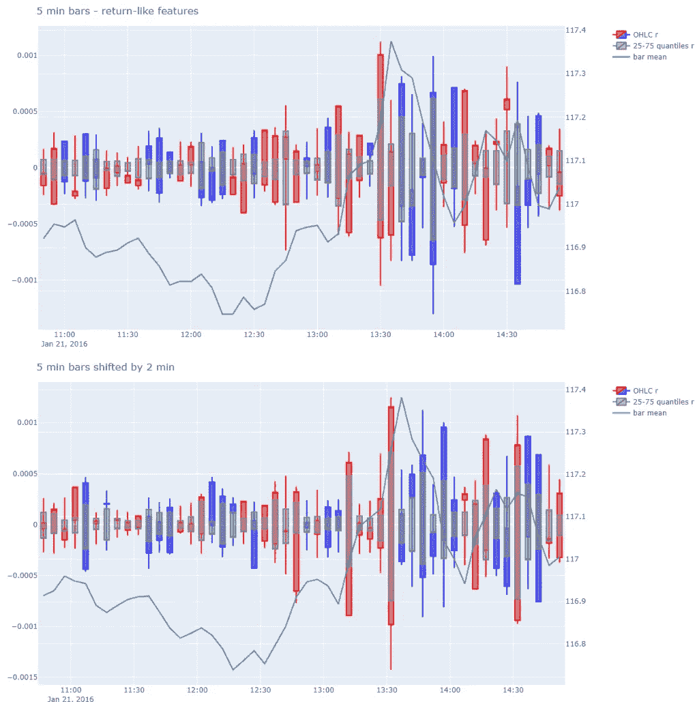

小节上的移动效果

# 亵渎神明！！！

让我们打破一些规则，或者至少牺牲一些在相同的时间段、特定的分笔成交点数量或预定义的成交量之后采样的棒线的优势。

让我们建立一个条形序列，其中过去的条形覆盖越来越大的范围。

但我们为什么要这么做？因为我们想让我们的模型能够处理一个很长时间的序列。如果我们使用同样取样的棒线，那么对于我们的预测来说，过去的最后一根棒线“t”是最重要的，而“t-1”的前一根棒线可能是非常重要的。“t-46”和“t-47”处的条形可能相对不重要，但“t-40”和“t-50”之间范围的一些特征可能对模型有用。我们可以将整个范围作为一个小节进行采样。

这样，完整输入序列的范围可以非常大。在下面的计算中，有一些简单的例子来说明这种技术可以处理多大的范围。例如，如果我们的最后一个小节是一分钟小节，而前面的每一个小节都长 1.1，那么 20 小节的序列几乎就是一个小时。我们可以只用 20 根不等长的棒线，而不是 60 根 1 分钟棒线。但是如果我们的序列是 100 巴长，那么我们的全序列的范围是 137796 分钟。这都超过 95 天了！

这些酒吧类型有其强烈的缺点。这些酒吧会扭曲甚至取消季节性。如果我们有季节性数据，也许我们应该使用其他的抽样方法。这些棒线比常规采样棒线需要更多的计算能力，因为我们需要计算更多不同范围的棒线。

不得不承认我之前没有用过这种杠型。这篇文章是我写的和将要写的一系列松散/紧密相关的文章的一部分，这个想法属于这里。在下面的代码中，我展示了这些条的简单实现。序列中的最后一根棒线是 5 分钟棒线，序列中的 50 根棒线覆盖了 2 天。模型培训的现场实施将在稍后进行。

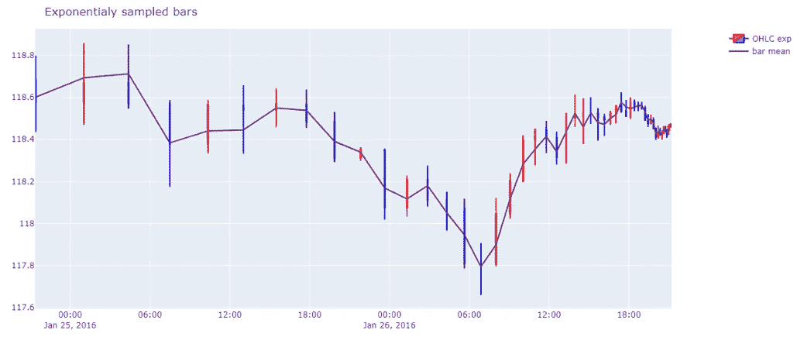

范围呈指数增长的条形

# 链接

*   [金融机器学习的进展](https://www.amazon.com/Advances-Financial-Machine-Learning-Marcos/dp/1119482089) —马科斯·洛佩兹·德·普拉多
*   [金融机器学习第一部分:标签](https://towardsdatascience.com/financial-machine-learning-part-1-labels-7eeed050f32e) —马克斯·伊万诺夫
*   数据来源—dukascopy.com
*   [为什么 Log 返回](https://quantivity.wordpress.com/2011/02/21/why-log-returns/) — Quantivity

# 感谢阅读！

感谢阅读。如果你有任何评论、批评或想法想要分享，请在 Linkedin 上写下评论或发送消息。[https://www.linkedin.com/in/istvanveber/](https://www.linkedin.com/in/istvanveber/)