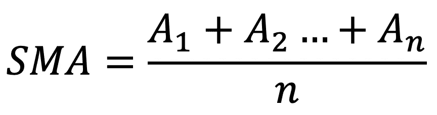
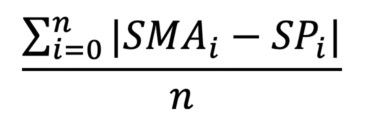
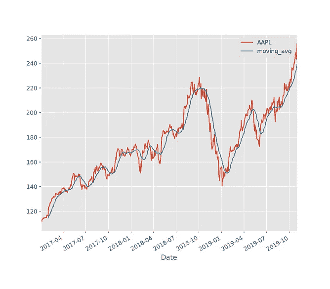
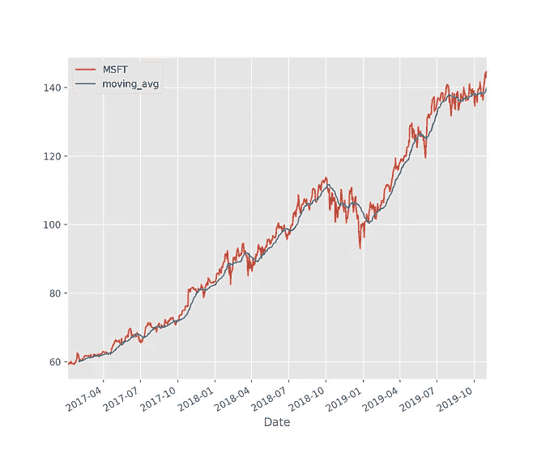
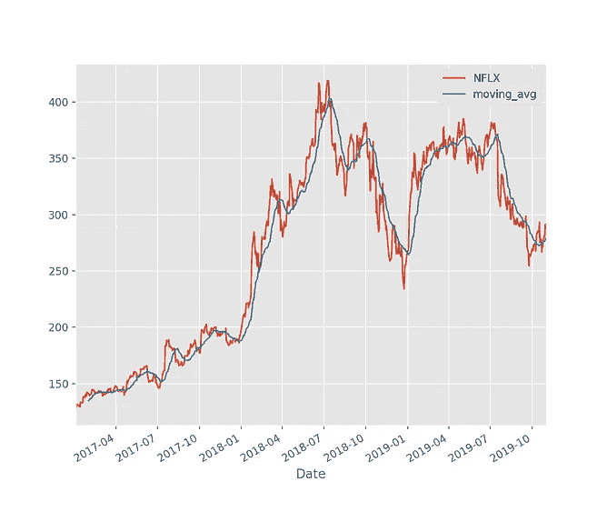

# 用 Python 进行金融风险评估

> 原文：<https://medium.com/analytics-vidhya/financial-risk-assessment-with-python-e2e736c9b5d7?source=collection_archive---------4----------------------->

在本文中，我将逐步介绍我编写的 Python 代码，以帮助分析竞争对手的公司股票。

我用 Python 版的 PyCharm。两者都可以从以下网址免费下载:

[](https://www.jetbrains.com/pycharm/download/#section=mac) [## 下载 py charm:JetBrains 为专业开发人员提供的 Python IDE

### PyCharm 现在也可以作为快照包使用。如果你使用的是 Ubuntu 16.04 或更高版本，你可以从…

www.jetbrains.com](https://www.jetbrains.com/pycharm/download/#section=mac) [](https://www.python.org/downloads/) [## 下载 Python

### 发布时间表关于特定端口的信息，开发者信息来源和二进制可执行文件由…

www.python.org](https://www.python.org/downloads/) 

# 金融

## 简单移动平均线:

正在使用的策略不会准确地告诉你选择哪只股票，或者股票未来的价格。这只是一种比较相似公司的方式。

我们将使用 SMA(简单移动平均线)来确定股票的波动性。简单移动平均线的计算方法是取任意数量的连续收盘价，然后除以你选择的时间段。



SMA 的周期可以是任何自然数(N > 0)，但是最有用的 SMA 值在 20-200 之间，取决于使用的时间框架。SMA 值越低，对基础价格的变化反应越快。

需要注意的是，因为我们的每日收盘价数量有限，所以会出现无法计算 SMA 的情况(即:没有足够的未来基础价格来计算适当的 SMA)。我们在编写代码时必须考虑到这一点。

## 剩余:

为了将计算出的 SMA 值转化为可解释的数据，我们将计算基础值和 SMA 值在两者均被定义的每个点处的差异。

然后，我们可以将这些差异相加，并将总和除以我们找到的值的数量。这将为我们提供一个原始价值，可以与其他类似的公司进行比较。



# 代码

在最高级别，我们需要:

1.  决定我们将分析谁，以及何时分析他们。
2.  建立数据源以检索所选期间内每天的调整后收盘价。
3.  为可视化绘制底层与 SMA 的对比图。
4.  如前所述，计算残差的平均值。

让我们从导入必要的包开始:

日期时间将允许我们的程序读取我们指定的时间段。

**Pandas _ datareader . data as web**帮助**us 从 Web 中提取数据。**

Matplotlib 的所有三个变体将允许我们实际绘制和可视化我们正在解释的数据。

**Functools** 将让我们将残差数组减少到一个总和。

```
import datetime
import pandas_datareader.data as web
import matplotlib.pyplot as plt
from matplotlib import style
import functools
import matplotlib as mpl
```

接下来，我们可以初始化并设置我们想要分析的时间段。我选择了两年的时间进行更简单的数据可视化:

```
# Initialize and set the time periods that we want to analyze
start = datetime.datetime(2017, 1, 1)
end = datetime.datetime(2019, 11, 2)
```

接下来，我们应该选择我们想要比较的公司。我选择了苹果、微软和网飞。在本文发表之日，这些公司的基础价格相对相似:

```
# make a list of companies that should be tested
# Apple: AAPL, Microsoft: MSFT, Netflix: NFLX
stock_tickers = ['AAPL', 'MSFT', 'NFLX']
```

现在我们将进入绘制股票图表和简单移动平均线的主循环。我为我的 SMA soely 选择了 20 天的时间进行数据可视化:

```
# Iterate over each company in the list and produce:
# 1\. Graph of Moving average vs stock price
# 2\. Average of the residual for each day moving average can be calculatedfor i in range(len(stock_tickers)): # Read our data from Yahoo Finance
    df = web.DataReader(stock_tickers[i], 'yahoo', start, end)
    df.tail()

    # Create a list of the closing prices for each day 
    close_price = df['Adj Close']

    # Calculate the SMA for each ticker with a 20 day period
    moving_avg = close_price.rolling(window=20).mean()
```

现在我们必须绘制出我们已经计算出的值(这仍然包含在原始的“for”循环中)。我使用 **plt.show()** 来物理显示我的图表。如果你用的是 Jupyter 这样的 Collab 笔记本，可以用 **%matplotlib inline** 到显示图形**。**

```
# Adjusting the size of matplotlib
mpl.rc('figure', figsize=(8, 7))

# Adjusting the style of matplotlib
style.use('ggplot')

# Plot the Moving Average vs. Closing Price
close_price.plot(label=stock_tickers[i])
moving_avg.plot(label='moving_avg')
plt.legend()
plt.show()
```

我们从 Matplotlib 接收这些图形。蓝线代表为期 20 天的简单移动平均线:



现在，为了利用这个 SMA 数据，我们将计算残差的平均值(它仍然包含在原始 for 循环中)。需要注意的是，因为我们可以收集收盘价的天数是有限的，所以某些值将导致“NaN ”,这意味着不是一个数字。这些值通过一个名为 **lambda 的迷你函数从解析列表中删除。**这可与 Java 中的 Lambda 函数符号或 JavaScript 中的 Arrow 函数相媲美。

```
# Finally, Sum the the Residuals of Moving Average ~ Closing Price
differences = []
# Iterate over each list and calculate differences
for j in range(len(close_price)):
    x = abs(moving_avg[j] - close_price[j])
    differences.append(x)

# Eliminate the values that are of type 'nan'
cleanedList = [x for x in differences if str(x) != 'nan']

# Use the Reduce method and a short form function 'lambda' combine all elements of the list
combined_value = functools.reduce(lambda a, b: a + b, cleanedList)

# Calculate the average of the residuals
average = combined_value / len(cleanedList)
print("The residual average of " + stock_tickers[i] + " is: " + str(average))
```

最终输出结果为:

```
The residual average of AAPL is: 5.875529758261265
The residual average of MSFT is: 2.0096710682601384
The residual average of NFLX is: 12.446982918608967
```

# 分析和结论

这个程序和这篇文章的目的不一定是帮助人们交易，而是向人们展示他们如何利用 Python 来分析大量数据。

根据我的结果，波动性最小的股票是微软，平均残值大约为 2。这能很好地转化为市场吗？…我一点头绪都没有哈哈。

**潜在的改进:**

1.  **我的数字没有归一化！我得出的数字没有比例……因此我选择了基础价格相对相似的股票。您可以通过找到残差的标准差来解决这个问题。**
2.  **已经有更复杂的方法可以解决这个问题:布林线(约翰·布林格)是在 20 世纪 80 年代根据这个确切的概念发明的。你可以将这种方法与布林线进行比较，或者训练一个模型来反映布林线。**

## 如果你有任何批评或者交易策略需要帮助，请随时联系我。

## **领英:**[**https://www.linkedin.com/in/charlie-mackie-749ba314b/**](https://www.linkedin.com/in/charlie-mackie-749ba314b/)

## 邮箱:Cmacki43@uwo.ca