# 金融时间序列及其在 R — ARIMA 模型中的随机游走

> 原文：<https://medium.com/analytics-vidhya/financial-time-series-and-your-random-walk-in-r-arima-model-a6461da78ecc?source=collection_archive---------2----------------------->

*查看财务时间序列中最重要的统计特征是什么，以便进行预测分析。*


S 股票市场价格高度不可预测和波动，因此其经验时间序列也有不确定因素。没有必要知道未来股票的确切价值，但我们可以对其股票价格的变动进行建模。

在这篇文章中，我将展示一个使用 ARIMA 模型的股票价格时间序列模型

这篇文章涉及的主要话题是:

*   ACF 和 ADF 测试
*   平稳性检验
*   ARIMA 模型和容格盒测试
*   模型预测

用于预测分析的金融时间序列的最重要的统计特征是:

*   时间趋势——价格是上升还是下降？
*   没有回复到平均价格
*   变化率的表观恒定性
*   随时间变化的波动性

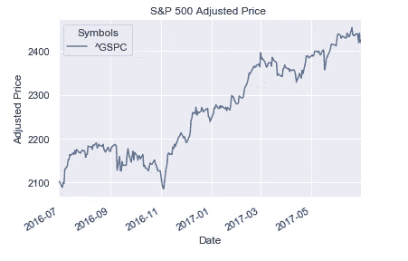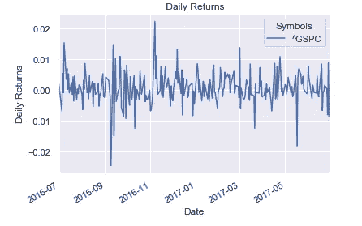

**左** : S & P 500 价格—有趋势的时间序列；**右** : S & P 500 价格收益——平稳时间序列

左上图是一个具有趋势(随机游走)的金融时间序列示例，显示了股票价格随时间的变化。这是这个系列的一个区别，它变成了右上方。右图是左图的价格回报，是平稳时间序列的一个例子(不是随机游走)。

许多金融时间序列可以用一个叫漂移随机游走的模型来表示。

# 时间序列建模

首先，如果你的 r 上已经有了以下所有的包，那么它已经被加载了。否则，使用函数 *install.packages()* 为每个包安装它们。

```
 #load packages
library(IRdisplay)
library(magrittr)
library(tidyverse)
library(scales)
library(gridExtra)
library(forecast)
library(tseries)
library(ggthemes) 
```

然后，加载了 *nflx* 文件。包含网飞从 2013 年 1 月 1 日到 2018 年 1 月 1 日的股价。所有模型中使用的数据对应于 *Adj_Close* 列，该列的股票价值在考虑任何公司行为后进行调整。

```
nflx <- read_csv("NFLX.csv")
head(nflx)
```

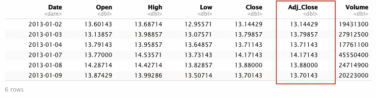

函数 summary 允许了解一些关于值的统计信息。

```
summary(nflx$Adj_Close)
```

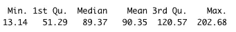

*dim()* 函数设置对象的尺寸。数据帧有 1259 行和 7 列。

```
dim(nflx)
```

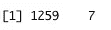

## 随机漫步是平稳的吗？

大多数股票价格遵循随机漂移，因为它的特点是一系列的上升或下降趋势，并在方向上发生不可预见的变化。股票的价格有以下表达式:

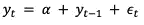

yt =当前价格

yt-1 =以前的价格

α= E(yt yt-1)。它代表对数价格 yt 的时间趋势，是模型的*漂移*。

ε =白噪声(零均值随机数)

今天的价格是昨天的价格，加上一些随机噪声。

下一个块显示了绘制价格的代码，它们的趋势线，这样我们就可以检查它的平稳性。􏰨􏰛􏰙􏰯􏰩􏰧􏰩􏰘􏰙􏰩􏰧􏰡􏰨􏰡􏰦􏰗􏰧􏰙􏰧􏰉􏰛􏰑􏰙􏰧􏰡􏰧􏰧􏰤􏰯􏰖􏰛􏰙􏰕􏰨􏰙􏰧􏰣􏰨􏰕􏰄􏰨􏰡􏰧**􏰧􏰛􏰡􏰛􏰙􏰕􏰨􏰡􏰘􏰙􏰛􏰗**􏰉􏰄􏰑􏰙􏰢􏰑􏰘􏰩􏰱􏰤􏰙􏰘􏰩􏰧􏰛􏰑􏰡􏰛􏰛􏰑􏰩􏰙􏰨􏰛􏰩􏰘􏰨􏰡􏰦􏰧􏰛􏰘􏰤􏰢􏰛􏰤􏰘􏰩􏰧􏰕􏰮􏰛􏰑􏰩􏰧􏰩􏰘􏰙􏰩􏰧􏰫􏰕􏰨􏰕􏰛􏰢􏰑􏰡􏰨􏰚􏰩􏰕􏰪􏰩􏰘􏰛􏰙􏰯􏰩􏰬

```
#check time series plotggplot(nflx, aes(Date, Adj_Close)) + geom_line(colour='blue') + ggtitle("Netflix Closing Stock Prices")+ geom_smooth(method = "lm", formula = y ~ x, colour='black', linetype = "dashed")
```

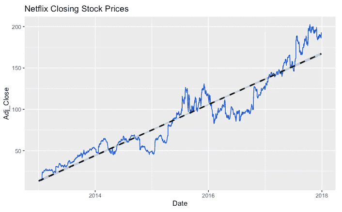

收盘股价-系列趋势

正如之前所说，股票价格很难预测。上图显示了网飞价格的时间序列(蓝线)及其趋势(黑色虚线)。趋势是线性增加的，序列显示趋势线以上和以下的值，并且不具有回复到平均值的属性。因此，该序列是具有漂移的*非平稳序列，具有*正斜率α(漂移)。

## 平稳性

一个*严格平稳* 时间序列是一个每个值集合的概率行为与时移集合的概率行为相同的时间序列。

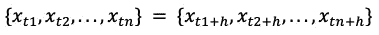

*弱平稳性*时间序列模型在一段时间内均值不变，方差和自相关也不随时间变化。我们将使用术语*静止* 来表示*弱静止*；

让我们检查价格的自相关性(随机游走)，这意味着检查当前股票价格和不同时间的价格之间是否存在相关性。为此，我们将使用 *ggAcf()* 函数。

```
# check ACF plot
ggAcf(nflx$Adj_Close, type='correlation')
```

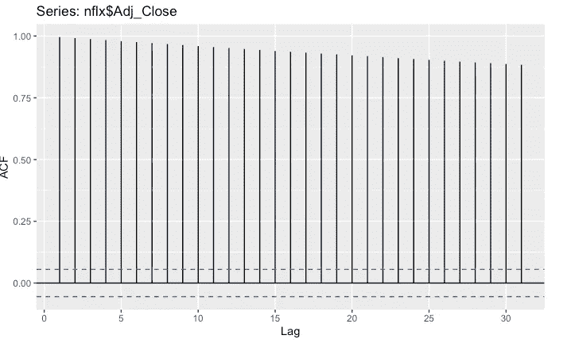

自相关函数(ACF)值随着滞后减小，而不是快速衰减，并且显示出滞后之间的显著相关性(前一时间的自相关几乎保持不变)。这是典型的包含趋势的时间序列。

## ADF 测试

扩充的 Dickey-Fuller 检验检验非平稳性的零假设。另一个假设是平稳性。

```
#run ADF test
adf.test(nflx$Adj_Close)
```

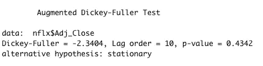

对于 ADF 检验，零假设是序列遵循随机游走。因此，低 p 值 0.432(大于 0.05)意味着我们不能拒绝序列是非平稳(随机游走)的零假设。

## 为什么选择 ARIMA？

ARIMA 代表阶(p，d，q)的自回归综合移动平均，其中:

*   p —自回归滞后的数量
*   d——差分阶
*   q —移动平均滞后的数量

我们的时间序列具有非平稳性(趋势)的特征，那么有必要进行微分，以产生一个新的更符合平稳性假设的序列。

自回归项对应于变换序列的滞后(p)(即通过微分获得的平稳序列)，移动平均对应于随机误差的滞后(q)。“整合”一词指的是对原始序列进行微分以使其稳定的过程(d)。
在 R 中， *auto.arima()* 函数根据 AIC( *Akaike 信息标准*)、AICc ( *小样本量的 AICC*)或 BIC( *贝叶斯信息标准*)返回最佳 arima 模型。

```
# fit ARIMA model
arima.model <- auto.arima(nflx$Adj_Close, allowdrift = T)
arima.model
```

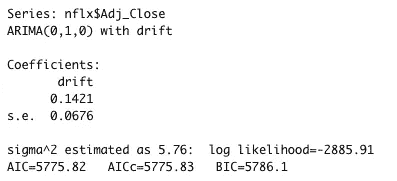

ARIMA 方法已经确定 p 和 q 的最大指示值是 0-ARIMA(0，1，0)。然而， *auto.arima ()* 函数使用 max.p = 5 和 max.q = 5，因此 p 和 q 可能有其他更合适的值。

## 模型拟合的残差

*resid()* 函数从建模函数返回的对象中提取模型残差。

```
# calculate residuals of each model

arima.residual <- resid(arima.model)# plot PACF of each models residuals

ggAcf(arima.residual, type = 'partial')
```

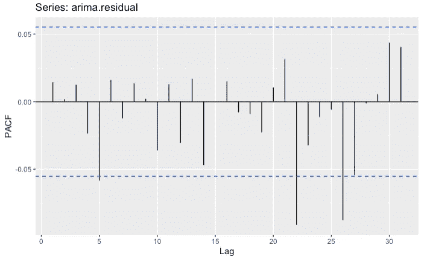

蓝色虚线表示自相关明显不同于零的地方，即不存在自相关。PACF 图衡量一个值与另一个值之间的相关性，该相关性是在之前的四个周期中发现的。

## 永盒测试

Ljung-Box 检验可以定义为数据独立分布的零假设(即没有自相关)

```
#run the Ljung Box test on the residuals

Box.test(arima.residual, type='Ljung-Box', lag=1)
```

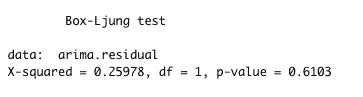

容格检验表明残差是不相关的。

## 预报

*forecast()* 函数将预测未来 60 天的价格走势。

提前预测的周期数= 60，置信区间宽度= 90

```
# make forecast for model

arima.forecast <- forecast(arima.model, h=60, level= 90)# plot forecast for model

g1 <- autoplot(arima.forecast)
g1
```

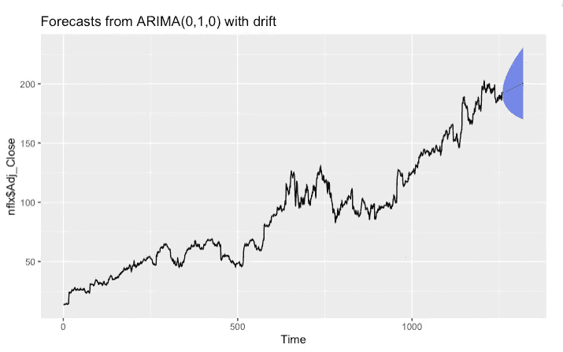

蓝色带显示所需的预测。随机趋势有更宽的预测区间，因为误差是非平稳的。

```
forecast(arima.model, h=60, level=90)
```

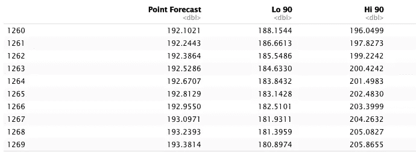

上面，我们可以找到总共 60 个预测值中的前 10 个值。预测从第 1260 行开始，继续原始数据帧中的值，有 1259 行。

在这里我完成了这篇文章的例子。你可以在这里找到代码。