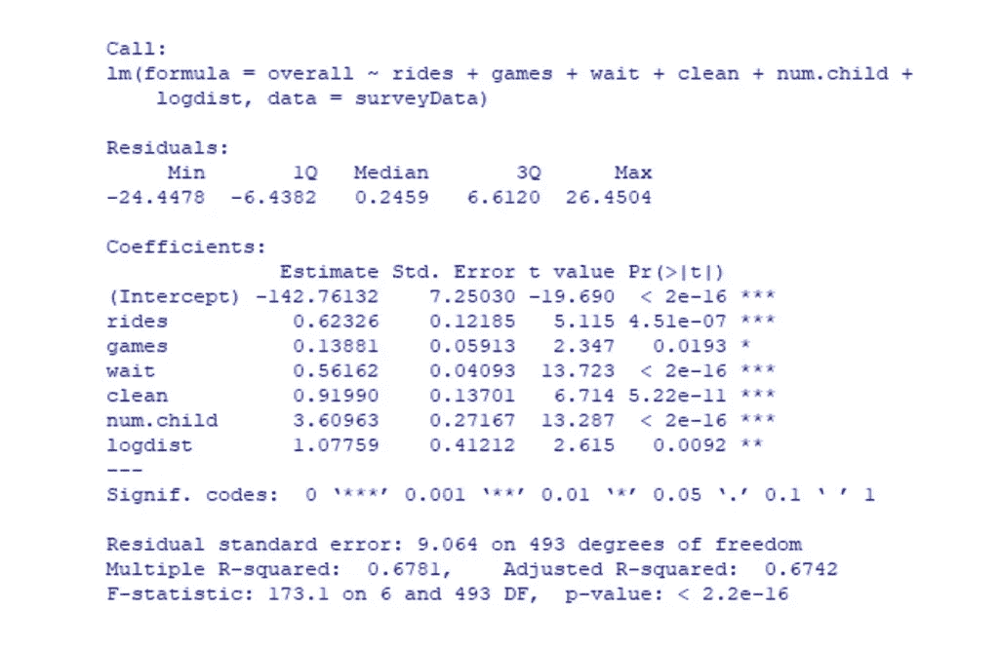
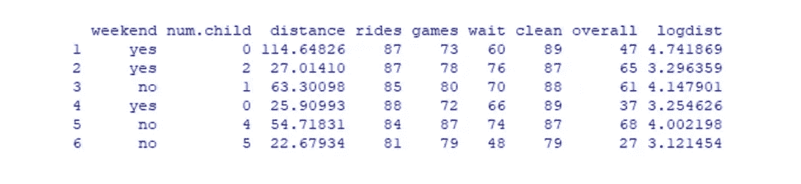
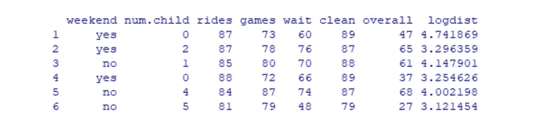
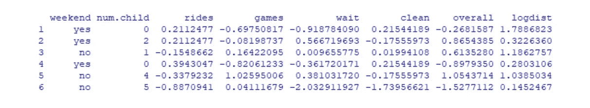
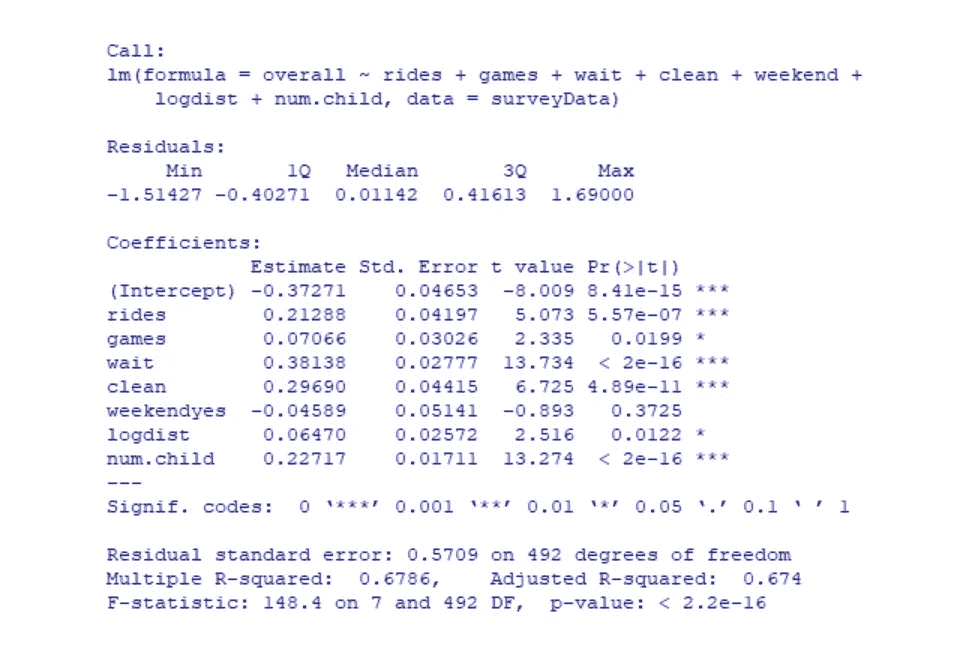
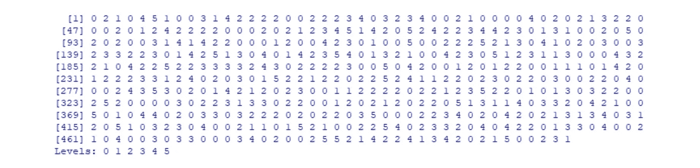
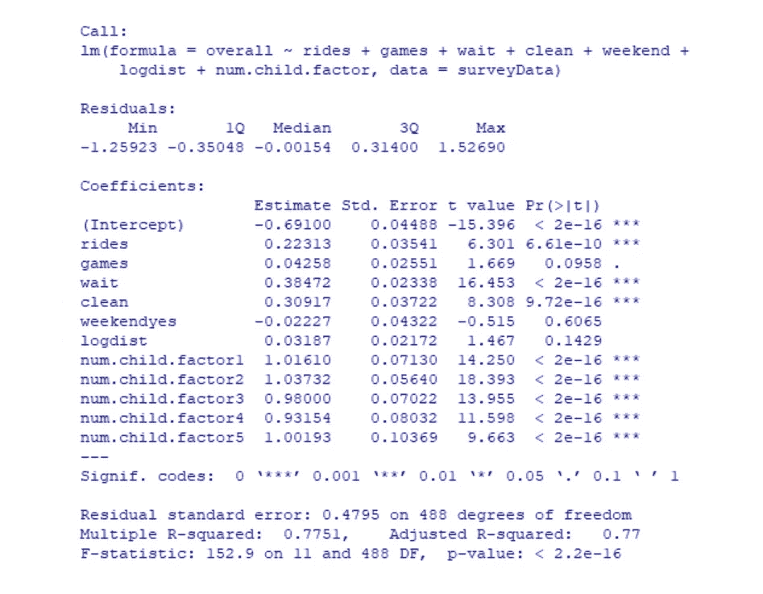
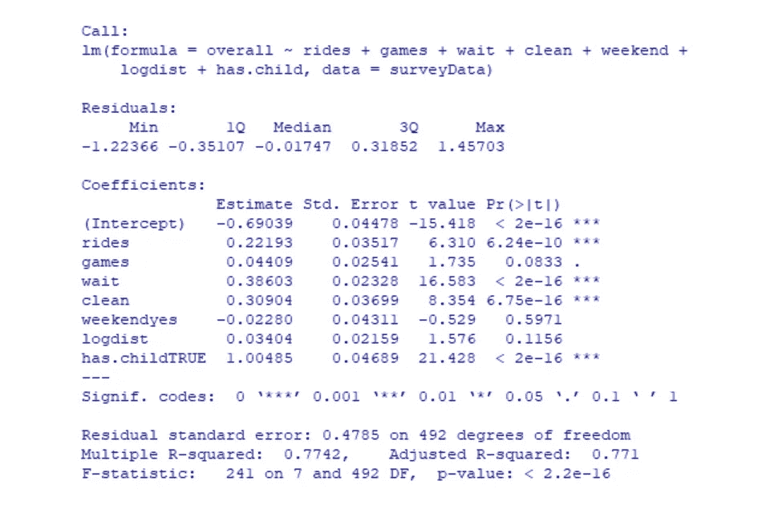
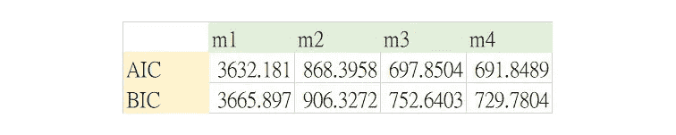

# 利用 R-游乐园调查寻找更好的线性回归模型(2)

> 原文：<https://medium.com/analytics-vidhya/find-a-better-linear-regression-model-by-using-r-amusement-park-survey-case-2-864cf6ae81df?source=collection_archive---------19----------------------->


克里斯蒂娜·温特在 [Unsplash](https://unsplash.com?utm_source=medium&utm_medium=referral) 拍摄的照片

从上一篇文章《[利用 R-游乐园调查案例(1)](/@sct.k/create-a-linear-regression-model-by-using-r-amusement-park-survey-case-1-e6f6d974db79) 建立线性回归模型》开始，我们通过改变一个自变量建立了第一个模型(m1)，得到了与数据拟合度为 68%的回归方程。

```
m1 <- lm(overall ~ rides + games + wait + clean + num.child + logdist, data=surveyData)#create the report
summary(m1)
```



然而，这个模型仍然有一些改进，因为我们总是想找到一个性能更好的模型。在本文中，我将介绍我所使用的数据预处理思想以及模型选择的标准。

# 数据预处理

## 删除列

我们上次创建了一个名为 logdist 的新列，以避免信息失真，因此可以删除原来的距离列(如果有其他无用或不相关的列，我们也可以删除它们)。

```
head(surveyData) #show the original data
surveyData <- surveyData[,-3]
head(surveyData) #show the data after dropping the third column
```



## 标准化/规范化数据

要看 DV 和 IVs 的关系，最好是同一个尺度。考虑到 logdist 显示了与其他不同的标度，我们必须进行归一化:(x-mean(x))/STD(x)。r 已经为我们提供了这个功能。

```
surveyData[,3:8] <- scale(surveyData[,3:8])
head(surveyData)
```



归一化后，我们建立一个新的模型(m2)，看看有没有变化。

```
m2 <- lm(overall ~ rides + games + wait + clean + weekend + logdist + num.child, data=surveyData)#create the report
summary(m2)
```



通过稍微改变模型，我们得到了 0.6786 的 R 平方得分和 0.647 的调整后 R 平方得分，几乎与模型 1 中的值相同。仍然有一些改进的空间。

## 更改数据类型

不同类型的数据也会影响模型。在这里，我们关注子列。它可以被视为连续(数字)和离散(因子，二进制)数据。

```
is.numeric(surveyData$num.child)
```

对于前面的数据，我们认为孩子的数量是数字。执行上述代码将返回“TRUE”，这意味着 surveyData 中的列“num.child”是数字。现在，我们试着把它变成因子，看看它是如何影响我们的结果的。

```
surveyData$num.child.factor <- actor(surveyData$num.child)
surveyData$num.child.factor
```



当我们打印出这个新栏目时，它似乎与旧栏目没有什么不同。但是看看输出的最后一行，它显示“级别:0 1 2 3 4 5”，这意味着它的数据类型是一个因子，在 5 个级别中。此后，我们再次运行回归模型(m3)。

```
m3 <- lm(overall ~ rides + games + wait + clean + weekend + logdist + num.child.factor, data=surveyData)#create the report
summary(m3)
```



在报告中，我们可以看到模型的大幅度增强。它给了我们 0.7751 的 R 平方得分和 0.77 的调整后 R 平方得分，比以前的尝试高出约 10%。

最后，我们通过将列“num.child”更改为二进制变量来创建一个新列“has.child ”,并测试其工作原理。

```
surveyData$has.child <- factor(surveyData$num.child > 0)
head(surveyData$has.child)
```

输出给我们“真”或“假”取决于条件。然后，我们使用新变量运行模型(m4)。

```
m4 <- lm(overall ~ rides + games + wait + clean + weekend + logdist + has.child, data=surveyData)#create the report
summary(m4)
```



结果是显著的。R 平方等于 0.7742，调整后的 R 平方等于 0.771，都与模型 3 相似。

# 型号选择信息标准

R 平方或调整后的 R 平方只是一个参考，除此之外，我们还必须检查其他一些模型信息标准，如 AIC、BIC，以更近距离地了解模型的真实拟合程度。

**AIC** (阿凯克的信息准则)和 **BIC** (贝叶斯信息准则)是估计统计模型拟合优度的度量，也可用于模型选择。

```
AIC(m1); AIC(m2); AIC(m3); AIC(m4) 
BIC(m1); BIC(m2); BIC(m3); BIC(m4)
```



# 结论

对于模型比较，具有最低 AIC 和 BIC 分数的模型是优选的。因此，我们得出结论，在这种情况下，模型 4 是最佳模型。这种二进制数据类型可能会成功处理过度拟合问题。而且我们也可以从报告中解读出，乘车满意度、等待、清洁、有/没有孩子是影响整体满意度得分的四个关键组成部分，并且都与它有正相关关系。

# 关于我

嗨，我是 Kelly，一名具有新闻和传播背景的商业分析研究生，喜欢分享探索数据和有趣发现的生活。如果您有任何问题，请随时联系我，电话:【kelly.szutu@gmail.com】T5