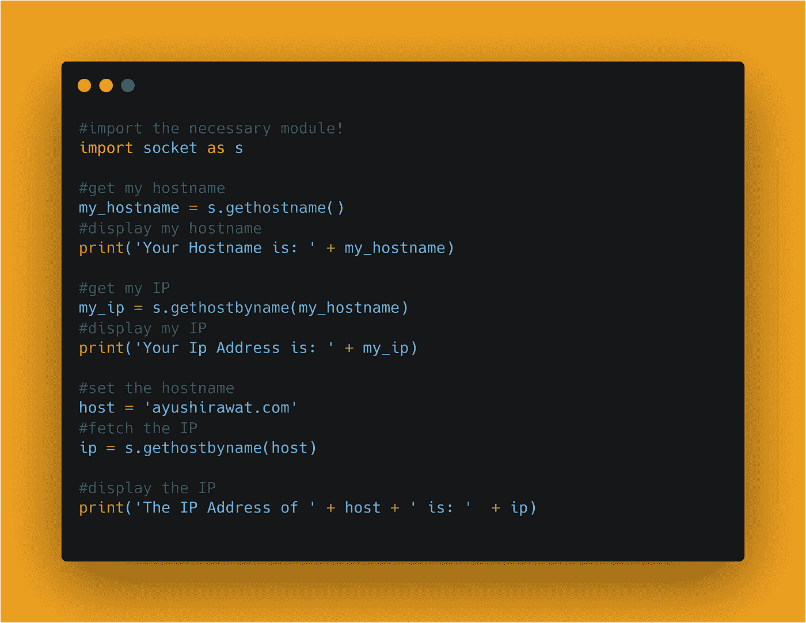

# 使用 Python 查找任何网站的 IP 地址

> 原文：<https://medium.com/analytics-vidhya/find-ip-address-of-any-website-using-python-e9dd0a54672d?source=collection_archive---------3----------------------->

# 你好世界！


IP 地址有助于将我们的计算机连接到网络上和世界各地的其他设备。在这篇博客文章中，我们将学习如何找到任何网站的 IP 地址。我们将看到 Python 中的实现。

[查看 python 的终极资源库](https://github.com/ayushi7rawat/Ultimate-Python-Resource-Hub)。发现有用就掉颗星！有什么要补充的吗？开个 PR 就一样了！

你可以参考我的 YouTube 视频教程，看一个工作教程来更好的理解和一步一步的指导。

# 这个博客将会涵盖什么

```
1\. What is IP address?
2\. Find IP Address of any Website
```

*我们开始吧！*

# 什么是 IP 地址？：

字典定义:

> IP 地址代表互联网协议地址，是分配给连接到使用[互联网协议](https://en.wikipedia.org/wiki/Internet_Protocol)进行通信的[计算机网络](https://en.wikipedia.org/wiki/Computer_network)的每个设备的数字标签。

IP(互联网协议)地址是网络硬件的地址。IP 地址由数字或字符组成。所有连接到互联网的设备都有一个唯一的 IP 地址

有两种 IP 版本:

*   IPv4
*   IPv6。

还有一些其他类型的 IP 地址，如私有 IP 地址、公共 IP 地址、静态 IP 地址和动态 IP 地址。

如果你想了解更多，可以参考 [IP 地址维基百科页面](https://en.wikipedia.org/wiki/IP_address)。

现在您已经熟悉了 *IP 地址基础知识*，我们可以前进到*编码部分。*

# 该编码了！

你可以在我的 [GitHub 库](https://github.com/ayushi7rawat/Youtube-Projects/tree/master/Find%20IP%20Address)找到所有代码。发现有用就掉颗星。



为了访问 Python 库，我们需要在 Python 脚本中导入包。

```
import socket as s
```

我们将利用`socket`模块获取任何网站的 IP 地址。既然我们已经在 python 脚本中导入了它，让我们从获取主机名开始。

```
my_hostname = s.gethostname()
```

我们将利用 socket 中的`gethostname`方法，并将其存储在`my_hostname`中。让我们使用`print`方法显示我们的主机名。

```
print('Your Hostname is: ' + my_hostname)#OUTPUT:
--> Your Hostname is: AyushiRawat
```

是时候获取 IP 地址了。同样，我们将使用`gethostbyname`方法，并传入我们的主机名`my_hostname`。让我们将它存储在`my_ip`中

```
my_ip = s.gethostbyname(my_hostname)
```

完成后，让我们显示 IP 地址。

```
print('Your Ip Address is: ' + my_ip)#OUTPUT:
--> Your Ip Address is: 192.168.1.3
```

现在，让我们获取[我的博客网站](https://ayushirawat.com/)、`https://ayushirawat.com/`的 IP 地址。我们将主机名存储在`host`中。

```
host = 'ayushirawat.com'
```

让我们使用`gethostbyname`方法获取 IP 地址，并传入`host`。

```
ip = s.gethostbyname(host)
```

最后，让我们显示一下[我的博客网站](https://ayushirawat.com/)的 IP 地址！

```
print('The IP Address of ' + host + ' is: '  + ip)#OUTPUT:
--> The IP Address of ayushirawat.com is: 192.241.200.144
```

有了这些步骤，你就可以使用 python 成功获取任何网站的 IP 地址。就是这样！

很简单，不是吗？希望这篇教程有所帮助。我强烈推荐你去看看同样的 [YouTube 视频](https://www.youtube.com/watch?v=v7JYwG5hdYs)，别忘了订阅我的频道。

您可以使用套接字库，甚至探索更多的特性。您甚至可以使用 Tkinter 来利用 Python GUI。

你可以在我的 [GitHub 库](https://github.com/ayushi7rawat/Youtube-Projects/tree/master/Find%20IP%20Address)找到所有代码。发现有用就掉颗星。

感谢您的阅读，我很乐意通过[Twitter](https://twitter.com/ayushi7rawat)|[LinkedIn](https://www.linkedin.com/in/ayushi7rawat/)与您联系。

请分享您的宝贵建议，感谢您的真诚反馈！

你绝对应该看看我的其他博客:

*   [Python 3.9:你需要知道的一切](https://ayushirawat.com/python-39-all-you-need-to-know)
*   [终极 Python 资源枢纽](https://ayushirawat.com/the-ultimate-python-resource-hub)
*   GitHub CLI 1.0:你需要知道的一切
*   [成为更好的程序员](https://ayushirawat.com/become-a-better-programmer)
*   [如何制作自己的谷歌 Chrome 扩展](https://ayushirawat.com/how-to-make-your-own-google-chrome-extension-1)
*   [使用 Python 从任何 pdf 创建您自己的有声读物](https://ayushirawat.com/create-your-own-audiobook-from-any-pdf-with-python)
*   你很重要，你的心理健康也很重要！

# 资源:

*   [en.wikipedia.org/wiki/Password](https://en.wikipedia.org/wiki/Password)
*   【docs.python.org/3/library/socket.html#socket 号

在我的下一篇博客文章中再见，保重！！