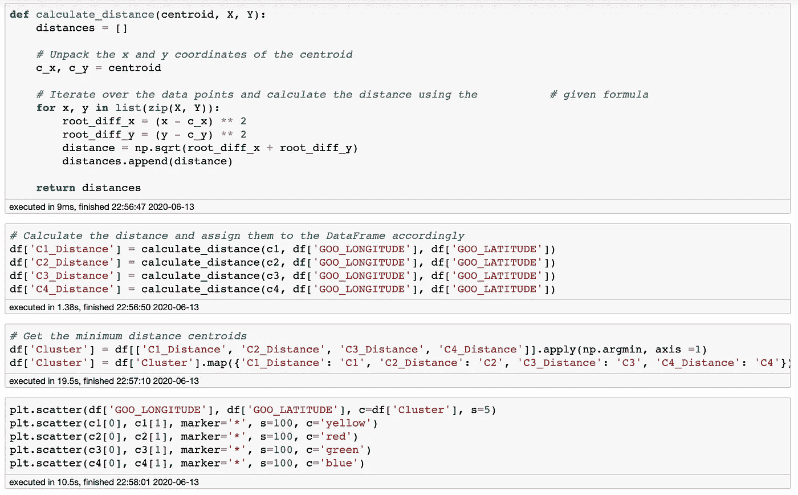

# 用 K-均值聚类法寻找最佳客户服务中心位置

> 原文：<https://medium.com/analytics-vidhya/find-the-best-customer-service-centre-location-by-using-k-means-clustering-fcc05eb7ab0f?source=collection_archive---------15----------------------->

## k-意味着集群及其对业务的益处

塞巴斯蒂安·赫尔曼在 [Unsplash](https://unsplash.com?utm_source=medium&utm_medium=referral) 上的照片

# 介绍

一家大型香港保险公司希望开设一系列客户服务中心。但如何选择地点成了最大的问题。在我完成一门机器学习课程后，我决定使用数据来解决问题，并使用无监督学习 k 均值聚类来找到客户服务中心的位置。

**什么是 k-means 聚类？**

K-means 聚类是一种无监督的算法，它寻找一种规则来将相似的数据分组在一起。它可以用来组织大量未标记的数据，以生成关于您的业务的竞争洞察。有许多用例可以帮助您在业务中实施这一实践，例如下面的视频，比萨饼店想要在城市中开设分店。如何找到为客户提供服务的最佳位置？

Luis Serrano 在 youtube 上的视频

# 关于数据

我们将使用的数据来自一家大型保险公司。该数据列出了客户 ID、客户地址的纬度和经度。让我们使用 pandas 导入数据，并检查前 5 个条目。

# 数据准备

现在，我们将检查这些变量的值是否是我们想要的。缺失值和带有异常值的变量表示不遵循变量模式的值，这将极大地影响模型的准确性。通过查看描述信息，我们看到在 **GOO_LATITUDE** 和 **GOO_LONGITUDE** 列上有一个大纲视图。

我们需要找出有问题的数据并改正它。香港的纬度是 22.302711，经度是 114.177216。因此，我们对 **GOO_LATITUDE** 应用过滤器，发现有 3 行有异常值。

参考内部 CRM 系统，在谷歌地图上查询这三个客户的地址，并修正他们的地址经纬度。

我们试图绘制一个散点图。**惊艳！**绿点画出一幅类似香港地图的图画。是时候找出客户服务中心的数量了。

# 如何找出最佳聚类数？

在开始 k-means 分析之前要执行的重要步骤是确定聚类的数量。但是我们需要设置多少个集群呢？因此，我们需要使用 elbow 方法，该方法可以在数据集中提供推荐的最佳聚类数。

在上面的图中，肘部位于 k=4 处，表明该数据集的最佳 k 为 4。正如我们可以看到的，随着集群数量的增加，WCSS 值下降。我们可以根据 WCSS 的下降率来选择 K 的值。例如，从上图中的星团 1–2–3–4，我们可以看到 WCSS 突然急剧下降。4 之后，下降幅度很小，所以我们选择 4 作为 k 的最佳值。

# 建模

我们将展示 K-means 算法如何处理客户地址的经度和纬度数据集。

下图显示了结果。从视觉上，您可以看到， *K* -means 算法根据距离特征将两个组分开。每个群集质心都标有一颗星。

*   第一组质心= (22.43797896，114.18428292)
*   第二组质心= (22.30146589，114.21442467)
*   第三组质心= (22.4148498，113.99272852)
*   第 4 组质心= (22.33590727，114.14365898)

使用数据集的领域知识，我们可以推断第 1 组靠近大埔司机，第 2 组靠近北角，第 3 组靠近屯门，第 4 组靠近荔枝角。

下图显示了结果聚类。我们看到算法已经识别了四个不同的组；

感谢阅读！如果你喜欢这篇文章，请通过鼓掌来感谢你的支持(👏🏼)按钮，或者通过共享这篇文章让其他人可以找到它。

我希望你能学会如何使用 k-means 聚类技术。因为数据隐私政策，dataset 此时无法提供，但是您也可以在 [GitHub](https://github.com/kindersham/100DaysDS/tree/master/Customer_Service_Centre) 资源库中找到源代码。