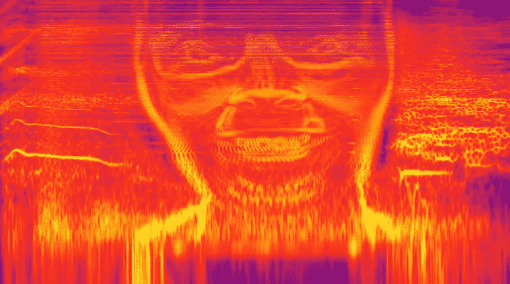
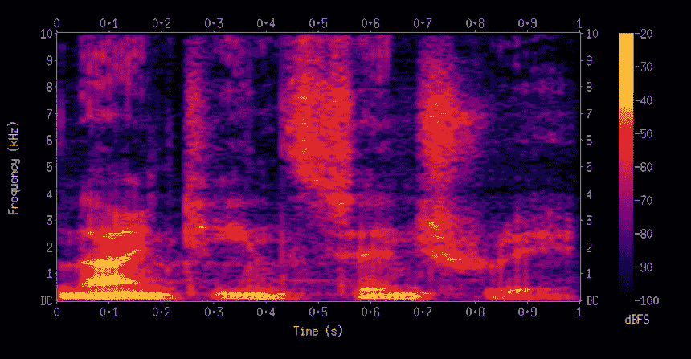
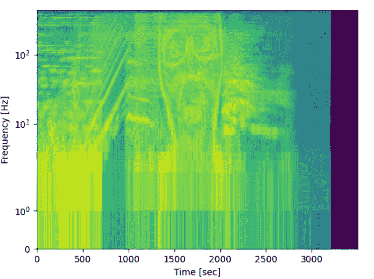

# 在 Aphex Twin 的著名歌曲《与蟒蛇》中寻找隐藏的面孔

> 原文：<https://medium.com/analytics-vidhya/find-the-hidden-face-in-aphex-twins-famous-song-with-python-cca8a9864284?source=collection_archive---------19----------------------->

起初听起来可能有点奇怪，但 Aphex Twin 的一首著名歌曲的名字 ision editor 已经审核了你的δmi 1 = −∂σn=1ndi[n][σj∈c{i}fji[n 1]+fexti[[n1]]。这个名字显然是一个方程，然而，这个方程是否有意义却是一个谜。

还有比歌名更有趣的东西。这位艺术家在歌曲中隐藏了一张脸，通过创建一个**声谱图**并以对数标度分析它，可以看到这张脸。但是什么是声谱图呢？

**频谱图**可以称为 **v** 给定信号的频率随时间**变化的直观表示。**在谱图表示图中，一个轴代表时间，第二个轴代表频率，颜色代表在特定时间观察到的频率的幅度(振幅)。一个示例频谱图表示示例如下。明亮的颜色代表强频率。

我们现在将创建一个声谱图，并显示歌曲中隐藏的脸。为此，我们将执行以下步骤:

*   阅读的左立体声。wav 文件(隐藏面所在歌曲的最后 36 秒)借助 scipy.io.wavfile 库的 read 功能，取左立体声。
*   根据信号的最大值对信号进行归一化。
*   定义两个参数:
    –窗口大小:矩形窗口的大小。
    –步骤:不需要计算每个数据点的 FFT。因此，从第 0 个数据点开始，你应该根据步长值决定下一个数据点。
*   提取窗口并使汉宁窗口乘以幅度，然后将其传递到 FFT 以处理小信号的不连续性。
*   处理 FFT 的前半部分，并计算绝对值。
*   使用 10 * log10(x + c)平滑数据以获得更好的表示。
*   创建最终的 2D 谱图矩阵，其行和列表示窗口帧数和频率点，值表示频率的强度。
*   使用 matplotlib 的 pcolormesh 函数是为了从数据中获得一个可视化。
*   艺术家将人脸隐藏在对数刻度中。因此，选择“y 刻度”作为
    符号。

就这样，现在我们可以展示艺术家隐藏的脸了。

以下是 Python 实现:

*如果你喜欢这篇文章，难道你不想鼓掌并与他人分享吗？通过评论给我反馈，让我很开心。*

您也可以通过以下渠道与我联系，提出批评、意见、问题或寻求帮助。

[**GitHub**](https://github.com/emrebalak)**|**[LinkedIn](https://www.linkedin.com/in/emrebalak/)