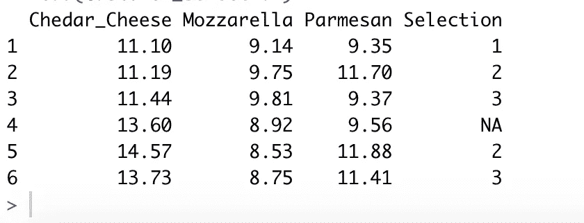
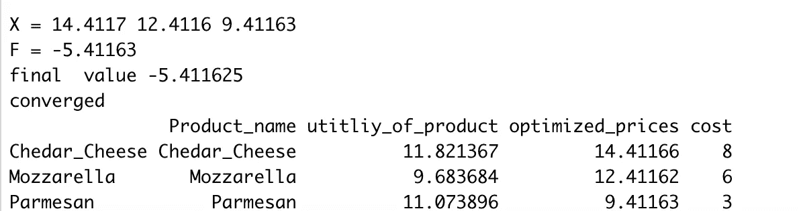
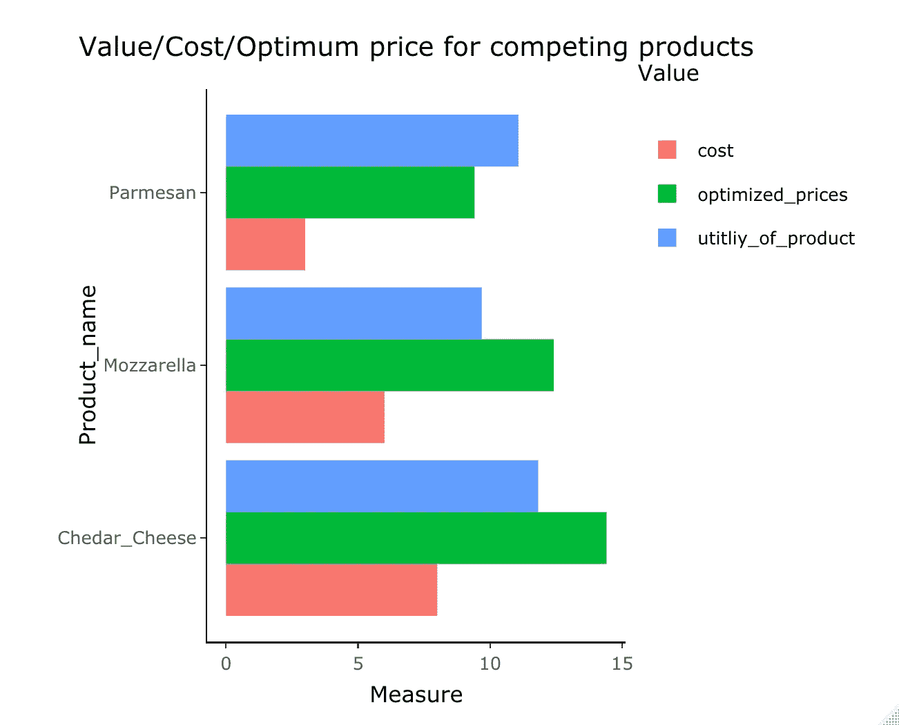

# 为您的竞争产品找到合适的价格！

> 原文：<https://medium.com/analytics-vidhya/find-the-right-cheese-for-your-competing-prices-8cbc662f4f85?source=collection_archive---------22----------------------->

# 供应链数据科学:第 1 集

## 在 R 中使用清单包

> 哇，太贵了！！我在购物的时候说过多少次了？实际上，这是我有多看重这部智能手机，以及我愿意为它支付多少钱之间的自我争论。如果我在智能手机展台前停留一小会儿，那么很可能智能手机的吸引力/价值几乎等于我愿意为它支付的价格。如果我不离开。嗯，是的…智能手机赢了！


当我们在超市时，人们会想是什么推动了竞争产品的价格。我们都知道供应链成本在决定我们要为切达奶酪、帕尔马干酪或马苏里拉奶酪支付多少钱时起着重要的作用。在我们的餐桌上制作这些可爱的马厩所花费的劳动时间、质量和物流成本(运输-清关-中间商)。

不仅仅是我们可能会想到的，还有其他无形的因素，我们可能会考虑客户的偏好、品牌形象、我们有多喜欢吃披萨，这些你在发票上看不到的东西。零售商和收益经理的任务是为这些竞争产品定价，以获取成本和这些无形因素。

比方说，我是一个渴望奶酪的人，我有 6 美元，我愿意为任何类型的奶酪支付，但因为我是一个披萨爱好者，我会将马苏里拉奶酪估价为 7 美元，帕尔马干酪肯定也会满足我的渴望，但我会将其估价为 5 美元。我不喜欢切达干酪，所以它对我的价值可能是 3。所以对我来说，如果我找到一包 5 美元的马苏里拉奶酪，那就很划算了！

零售商现在通过经验和长期的业务工作了解这些动态，他们知道顾客喜欢什么，他们如何评价产品，当然也知道将各种奶酪放到货架上的相关成本。你看，如果我是零售商，我只提供一种奶酪，我就不必担心这个问题，我会简单地尝试不同的价格，看看在哪个价格我的利润最大化。但是因为在我们的例子中，产品不是相互独立的，它们实际上是相互竞争的。这个问题变成了分类定价问题。

简单地说，如果我是零售商，我选择降低切达干酪的价格，这不仅会增加对切达干酪的需求，而且很可能会减少对马苏里拉奶酪和帕尔马干酪的需求。这将最终影响我一天结束时的总利润。

我在 R 中开发了一个名为“inventorize”的包，处理供应链和收入经理每天都要处理的这类决策，这将是“使用 Inventorize”的第一集。希望在这个“供应链数据科学系列”的后面的故事中会有这个包中所有功能的解释。该计划的第一个版本只解决了供应链的成本问题。但是后来我做了一些更新，加入了针对这些情况的收入管理分析工具。

因此，对于这种问题，我们将使用离散选择模型，因为该模型可以根据我们为竞争产品设定的价格来观察消费者的选择，并说，好吧，您的客户对这些差异的感知价值是如此如此，这是基于您向我展示的内容。与线性回归不同的是，这里不汇总销售额，而是每笔销售都是一个发生的事件，一位顾客来了，她看了看选择，她选择了马苏里拉奶酪，因为她对这种产品的重视超过了它的定价。

不仅如此，她特别选择了马苏里拉奶酪，因为她对马苏里拉奶酪的感知价值与马苏里拉奶酪的报价之间的差异高于其他两种产品的相同差异。

现在让我们从 R 中的一个简单例子开始，正如我们所说的，每笔销售都是一个事件:

```
### randomize ExampleCustomer_selection<- data.frame(Chedar_Cheese= round(runif(300,10,15),2),
              Mozzarella=round(runif(300,8,10),2),
              Parmesan=round(runif(300,9,12),2),Selection = as.numeric(rep(c(1,2,3,NA,2,3),50)))head(Customer_selection)
```

输出将是在给定的一天发生的事件，其中价格被设定，并且客户选择购买或不购买其中一种产品。请注意，要使该函数正常工作，选择必须是一个整数或 NA，并且对应于产品的列号。



例如，对于第一天发生的事件，一位顾客选择了切达奶酪，而第二天另一位顾客选择了马苏里拉奶酪。你可以有许多价格相同的活动，但要确保其他日子有不同的价格，这样消费者选择模型就能获得信息。

第二步是我们使用 Inventorize 包函数' Multi_Competing_optimization '，这个函数实际上有四个参数:

1- X:每个事件中产品价格的数据框架。

2- y:每个事件中客户选择的整数向量，例如，如果竞争产品只有三个，可能的选择是 NA，1，2，3。作为消费者的那在这次活动中没有购买任何东西，他选择了走开。

3- n_variables:相互竞争的产品数量。

4-initial_products_cost:每个产品的当前成本的向量，例如，如果我们有三个产品，它可能是 c(1.8，2.5，3.9)。或者

如果没有成本，它将是 c(0，0，0)

```
## run inventorize::Multi_Competing_optimization
sample_product<-Multi_Competing_optimization(X= Customer_selection[,1:3],
                             ### the product prices at every event
                             y= Customer_selection[,4],
                             ### a customer choice at an event
                             n_variables = 3,
                             #### no of products
                             initial_products_cost = c(8,6,3)) ###Cost of each Product
```

该功能在幕后所做的是利用多项式 logit 模型，根据对每个事件的观察来计算每个产品的内在价值。然后使用产品的价格作为非线性优化问题的变量，以最大化每个可能事件的利润。该函数将返回数据框和绘图。如下图所示:



还有以下情节:



这让你思考为什么为了使利润最大化，它选择了廉价的帕尔马干酪，同时提高价格超过了马苏里拉奶酪和切达奶酪的吸引力。如果我们看看以前的平均价格，我们可以看到它们有很大的不同。

```
> comparison<- data.frame(Average_prices= colMeans(Customer_selection[,1:3]),                                      + optimized_prices=sample_problem$optimized_prices)
> comparison
              Average_prices optimized_prices
Cheddar_Cheese       12.40240         14.41166
Mozzarella           9.03370         12.41162
Parmesan            10.50523          9.41163
```

我很想听听你对这个功能的想法，以及它对你的日常活动是否有用。“盘点”中会有更多关于不同功能的解释，从库存计算到最大化服务水平。

感谢哥伦比亚大学和 Daniel Guetta 教授，因为这项工作大量引用了他们的课程“供需分析”

这个功能在 Inventorize 1.0.3 中，因为我今天更新了它，它可能需要一段时间才能出现在 CRAN 中。此外，当产品/事件数量增加时，该功能需要相当长的时间来运行。

谢谢您，祝您愉快！

海瑟姆·奥马尔

[https://www.linkedin.com/in/haythamomar/](https://www.linkedin.com/in/haythamomar/)