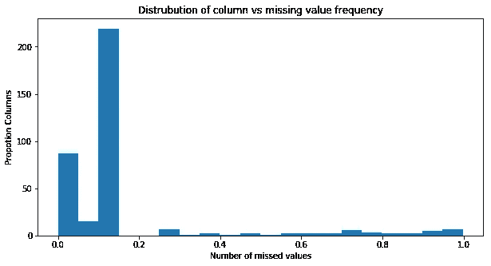
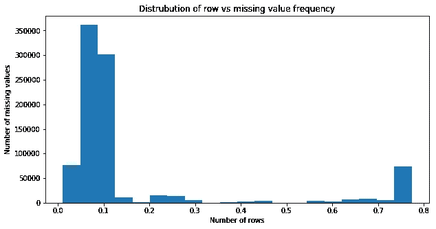
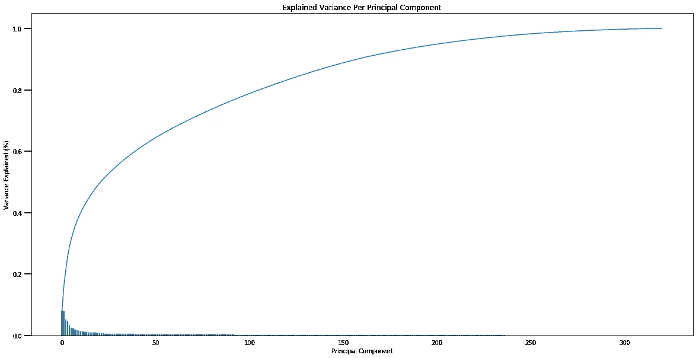
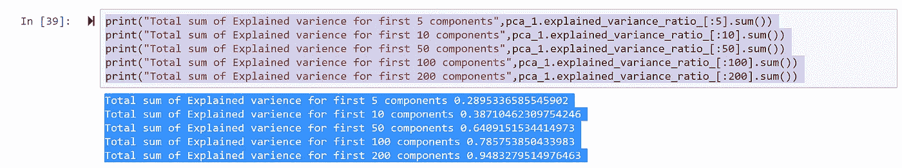
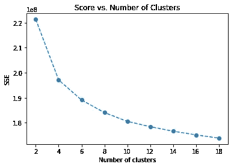
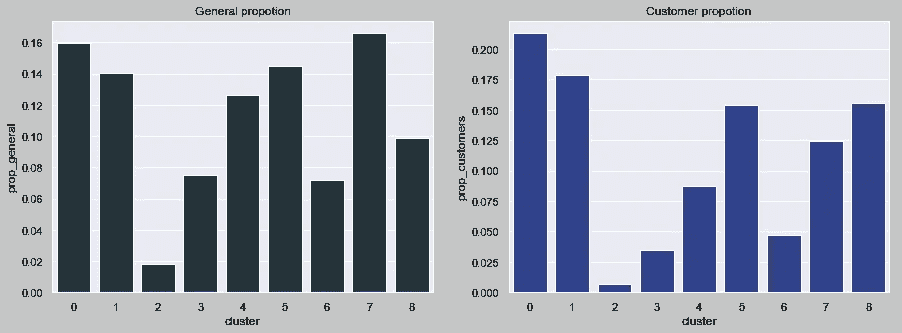
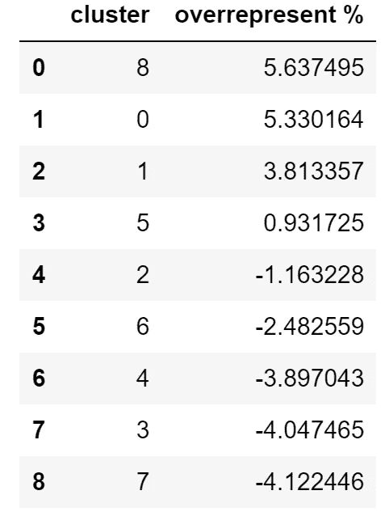
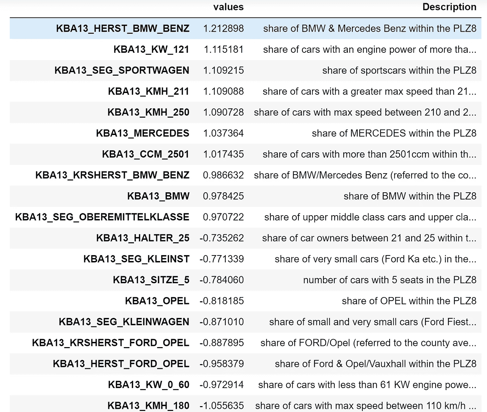

# 使用机器学习找到您的客户！！！

> 原文：<https://medium.com/analytics-vidhya/find-your-customers-using-machine-learning-f83e28e2efa1?source=collection_archive---------29----------------------->

一种机器学习技术，用于识别您的客户并预测他们是否可能成为您的未来客户。

[https://ecommerce einsiders . com/5-ways-convert-potential-customer-3461/](https://ecommerceinsiders.com/5-ways-convert-potential-customer-3461/)

*这个项目的源代码可以在我的*[***Github***](https://github.com/alssalo/Arvato-Project)中找到。

# 介绍

这篇文章展示了如何利用机器学习来**识别客户细分**(谁更有可能成为客户)**预测某个潜在客户**(来自已识别的细分)**是否会成为某个营销活动的客户**。

## 了解我们的数据…

数据和问题陈述*(代表现实生活中的数据科学任务)*由贝塔斯曼子公司 Arvato Financial Services 提供。我们拥有的数据是德国一家邮购销售公司的客户人口统计数据 ***和普通人口统计数据*** 。

对于本文，有三个数据文件与这个项目相关联:

*   `AZDIAS_052018.csv` : *人口统计* ***数据为德国一般人口****；891 211 人(行)x 366 个特征(列)。*
*   `CUSTOMERS_052018.csv` : *邮购公司客户* *的人口统计数据****；191 652 人(行)x 369 个特征(列)。***
*   `MAILOUT_052018_TRAIN.csv` : *作为营销活动* *目标的个人* ***的人口统计数据；42 982 人(行)x 367 人(列)。***

## 行动计划…

*   我们将分析客户的**人口统计数据，**将**数据与普通人群的**数据进行比较，并为下一步准备数据(数据预处理/数据清理)**。**
*   我们将使用 [***无监督学习***](https://en.wikipedia.org/wiki/Unsupervised_learning) 技术来执行客户细分，**识别最能描述公司核心客户**基础的人群部分。
*   然后，我们将把我们从 ***无监督学习*** 中学到的知识应用于公司营销活动目标的人口统计信息，并使用 [***监督模型***](https://en.wikipedia.org/wiki/Supervised_learning#:~:text=Supervised%20learning%20is%20the%20machine,a%20set%20of%20training%20examples.) **来预测哪些个人(目标中)最有可能转变为公司的客户**。

# **第一部分:分析数据(数据探索)&清洁数据**

我们将分析和清理`AZDIAS_052018.csv`。通过创建一个单独的 clean 函数，对`CUSTOMERS_052018.csv, MAILOUT_052018_TRAIN.csv, MAILOUT_052018_TEST.csv`执行相同的步骤。

***第一步:将缺失值转换为 float(NaN)类型***

在 python 中表示缺失值的一种标准化方式是通过 ***float(NaN)类型。***

某些特征(列)中的许多缺失值具有非标准化值，例如“未知”、“无”、“无”等..。我们需要将这些值转换成标准化的***float(NaN)type***以便进一步分析。

***步骤 2:删除缺失值百分比高的(要素/列&行/记录)。***

机器学习模型不能注入缺失值。所以我们必须填入合适的值或删除列/行。丢弃信息意味着丢失信息。缺少太多的值将很难建模，在许多情况下，如果我们没有以正确的方式建模，将会导致剧烈的

准确度下降。因此，在我们的例子中，我们为每行/每列的缺失信息数量设置了一个任意的阈值。我们已经为每列/行的缺失百分比设置了 20%的阈值。

***第三步:重新编码特征***

机器学习模型只能接受数值。因此，所有其他类型的数据都必须转换成数字表示。根据数据，我们可以使用几种方法来达到这个目的。

我们已经从数据中确定了下列(非数字)列:

*   OST_WEST_KZ '(值-W '，' O')-可以用[标签编码](https://scikit-learn.org/stable/modules/generated/sklearn.preprocessing.LabelEncoder.html)为 1 和 0 的分类数据。
*   " EINGEFUEGT_AM "(日期类型)-因式分解为整数类型。
*   ' CAMEO _ DEUG _ 2015 ' & ' CAMEO _ INTL _ 2015 '(混合类型)-格式为数字类型。

***第六步:输入和缩放***

作为数据清理的最后一步，我们将使用相应列的中值估算所有其他缺失值，并换算成标准化形式。

# 第二部分:我**识别客户群(*无监督学习)***

我们分析的主要部分将出现在项目的这一部分。这里我们将使用**无监督学习技术** ( [**K-means 聚类**](https://en.wikipedia.org/wiki/K-means_clustering) )来描述公司现有客户的人口统计数据与一般人群之间的关系。在这一部分结束时，我们将能够描述普通人群中哪些人更有可能成为邮购公司的主要客户群的一部分，以及普通人群中哪些人不太可能成为主要客户群的一部分。

***第一步:应用*** [***主成分分析***](https://scikit-learn.org/stable/modules/generated/sklearn.decomposition.PCA.html)

应用 [**K-means 聚类**](https://en.wikipedia.org/wiki/K-means_clustering) **、**[***PCA***](https://scikit-learn.org/stable/modules/generated/sklearn.decomposition.PCA.html)*不一定是前提条件，但它减少了噪声，因此聚类方法能够更好更有效地区分不同的聚类([参见参考文献【1】](http://www.dataminingblog.com/combining-pca-and-k-means/))。*

*PCA 本质上将列/特征分解成更少的有意义的成分/特征。 ***我们的目标是找到解释最大可变性或解释最少约 90%数据的最佳组件数量。****

*这里我们将使用`AZDIAS_052018.csv`(一般人群数据)来应用 PCA 变换。*

**

*该图显示了 PCA 成分数与可解释度的关系*

**

*代码片段*

*我们为我们的 PCA 模型选择了 200 个成分，解释了约 94%的方差。*

****第二步:应用 K 均值聚类****

*在 K-means 聚类 ***中，我们的主要目的是找到最优的聚类(组)数量*** 。理想情况下，我们将使用 [***【肘状图】***](/analytics-vidhya/how-to-determine-the-optimal-k-for-k-means-708505d204eb) 的方法来得到最优的聚类数。这里，我们将应用 PCA 变换`AZDIAS_052018.csv`(一般群体数据)来建模 k 均值。*

**

*肘图*

*在肘图中，我们使用来自 kmeans 模型的“分数”对聚类数进行绘图。理想情况下，选择绘图创建弯头的值是聚类的理想值。*

****从肘形图中，我们选择了 9 作为理想的聚类数。****

****第三步:将客户数据与普通人群数据进行比较****

*从总体上，我们已经确定了 9 个集群(段)。现在让我们调查客户数据集中的个体(`CUSTOMERS_052018.cs`)在这些集群中所占的比例。*

**

****我们可以看到，聚类 8，0 在客户数据集中表现过度，而聚类 3，7 在客户数据集中表现不足。****

*下表包含了客户数据集中的聚类和多/少表示。*

**

****第四步:整群调查****

*   *聚类#8:它主要与包含中上阶层车主的列相关联。*
*   *第 0 类:第 0 类没有解释明确的共同特征，但它与家庭财务和依赖成员的数量有关。*
*   *聚类#3:聚类 3 与中下阶层的车主相关。*
*   *聚类#7:聚类 7 更偏向于金融类型相关的特征。*

**

*聚类#8 列-权重表。*

# *第三部分:监督学习模式*

*在这一部分，我们将使用`MAILOUT_052018_TRAIN.csv`和`MAILOUT_052018_TEST.csv`文件。“邮寄”数据文件中的每一行代表作为邮寄活动 目标的 ***个人。理想情况下，我们应该能够使用来自每个个体的人口统计信息( ***从上面的*** )来决定是否值得将那个人包括在活动中。****

*在这里，我们将使用此**活动数据来预测目标个人(*邮寄活动)*是否会成为客户。***

## ****关于数据的一点点信息..****

*包含 42 982 人，367 个特征。包括一个**列“响应”**，说明一个人是否在活动后成为公司的客户。我们将使用这些数据来 [*训练/建立我们的监督学习模型。*](https://www.quora.com/What-is-training-learning-and-testing-in-machine-learning)*

## *履行*

****第一步:数据准备/数据清理****

*在这里，我们将准备数据以输入到 ML 模型中。*

*   *由于“邮寄”包含与“一般人群数据”相似的特征符合性，我们只需使用与本文第一部分相同的程序([函数](https://www.w3schools.com/python/python_functions.asp))(步骤 1-6)。*
*   *将“MAILOUT”分为' **X'** (包含特性)和 **'y'** (包含目标变量“**列‘响应”**)。*

****第二步:将数据拟合到模型中****

*   *选择一个模型——在我们的例子中， [**AdaBoost 分类器。**](https://scikit-learn.org/stable/modules/generated/sklearn.ensemble.AdaBoostClassifier.html)*
*   *实施交叉验证和评分指标— [**AUC 指标**](https://scikit-learn.org/stable/modules/generated/sklearn.metrics.auc.html) **。***
*   *使用 [**网格搜索**](https://towardsdatascience.com/grid-search-for-model-tuning-3319b259367e) 调整模型。*

*一旦我们完成了第 2 步，如果我们对模型分数满意，我们就有了一个可以使用的模型。在我们这里有一个模型******~ 72 分。*******

# *****结论*****

*****在第一部分中，我们已经看到了如何为建模分析和清理数据。*****

*****在第二部分，我们看到了如何建立一个无监督学习来识别客户群。*****

*****在第三部分中，我们利用监督学习来预测某个潜在客户是否会因为某个活动而成为客户。*****

*****关于这个项目的详细技术报告可以在 [***这个***](https://github.com/alssalo/Arvato-Project) GitHub 资源库中找到。*****