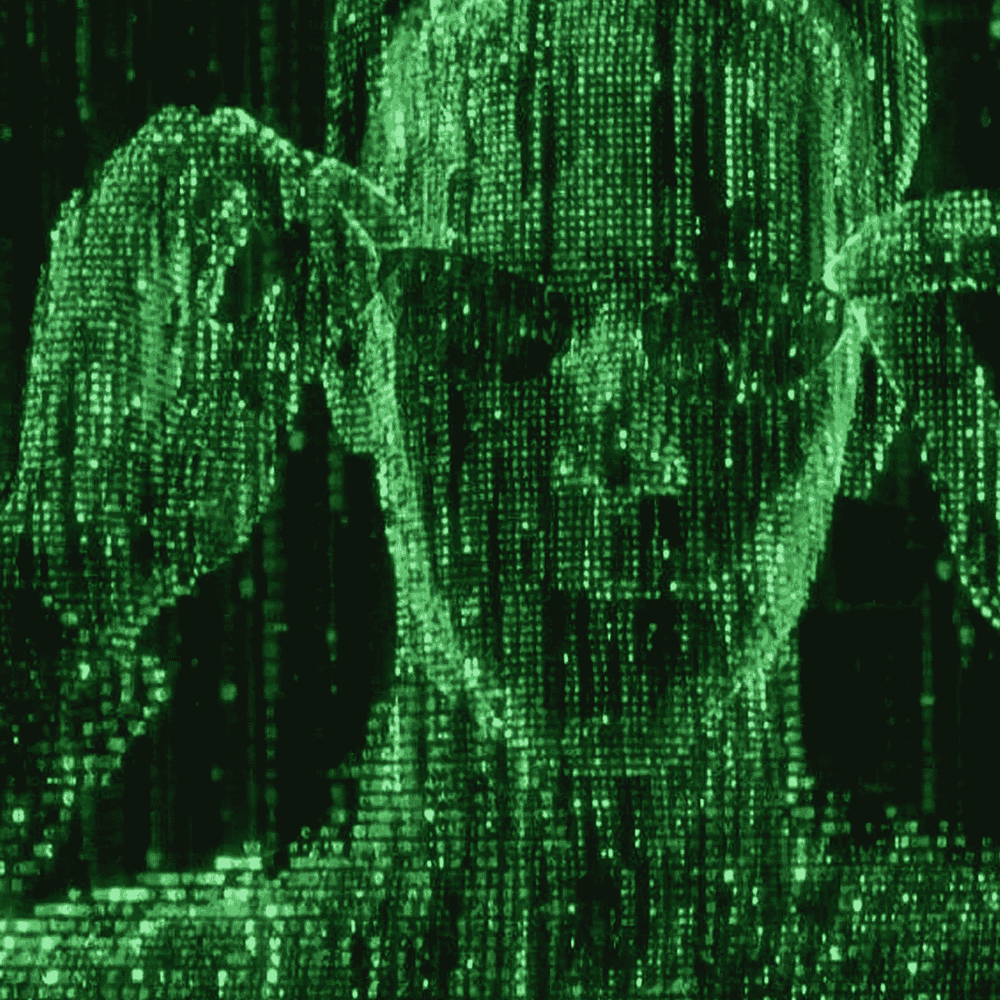
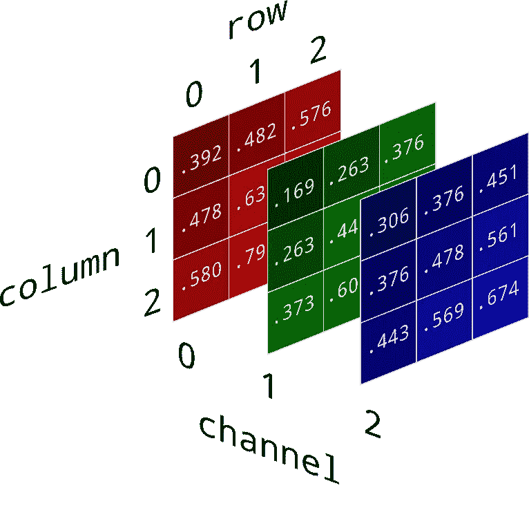
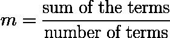
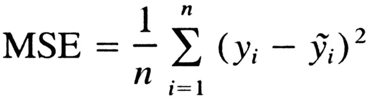

# 在没有复杂的深度学习算法的情况下找到相同的图像？

> 原文：<https://medium.com/analytics-vidhya/finding-identical-images-in-a-directory-without-sophisticated-deep-learning-algos-5da67702059c?source=collection_archive---------22----------------------->

我知道这很不重要，但在大多数情况下这是可行的。


这样更容易搞清楚。什么事？

# 当谈到图像时，唯一冲击我们大脑的概念是深度学习。因此，在这篇博客中，我将分享一种复杂的算法，不像深度学习那样方便和强大。

在编写一个关于计算机视觉的程序时，我遇到了一个关于图像复制的问题。后来我谷歌了一下，发现大部分文章都是在机器学习和深度学习概念的基础上定义的。

有没有想过，计算机是如何存储图像的？毕竟，电脑只是一块焊接在集成电路上的硅片。嗯，很简单。如你所知，图像是一系列像素合并在一个边界区域，在数学术语中称为“矩阵”。



不是这个。

但是这些微小的像素是什么呢？计算机是如何理解这些像素的？是的，像素只是数字。

**不知所措？**你没看错。像素通常被表示为整数，其范围取决于它们的通道的不同值。

**这些渠道是什么？**这些通道是颜色编码，用于表示不同的颜色组。例如，一幅图像(如下图所示)表示为 m×n×c 矩阵，其中， **m** 代表**行，n** 代表**列**，c**代表**矩阵**的**高度**。(在这种情况下，“高度”被视为“通道”)。**



上面的例子是一个 RGB 图像。每个通道对应其各自的颜色。为了调整，第**个**通道对应于**红色的值。**同样，**第一**通道代表**绿色**和**第二**蓝色的数值。

因此，矩阵形式的这些颜色值被用于在不可理解的机器中表示图像数据。

# 但是，我如何找到相似或重复的图像？

是的，的确令人兴奋！如前所述，图像通常被表示为它们各自通道中的一系列整数。因此，我们将评估整数/像素值，以找到图像之间的相似性。

首先要了解一个统计学概念，这个概念大家非常熟悉，经常用在各种数学统计问题中。其定义为“**意为**”。

但是你可能想知道，在处理图像时，**的意思是**？是吗？你可能会在这篇文章的最后回答你自己！。

**平均值**被定义为观察中术语的总和除以术语的总数。它由以下等式给出:



均值方程

在这种情况下，我们将使用一个重要的等式，通常称为**均方误差**或缩写为 **MSE。**它衡量的是观测值的**误差平方和**或者准确地说，它被定义为估计值和实际值之间的**平均平方差。**这里，估计值和实际值是两个图像。它的方程式如下所示:



均方误差

# **但是，我怎么编码呢？**

为了演示这一点，我们将使用 **Python，**因为它有许多内置的库来执行统计和数学问题。

所需的库:

1.  NumPy
2.  OpenCV
3.  Matplotlib

首先， **NumPy** 是一个广泛使用的库，在计算大数据时非常高效。NumPy 数组是一个数值网格，由一组非负整数索引。

OpenCV 是一个用 C++编写的库，主要针对计算机视觉领域。但是，计算机视觉的概念将不会被涵盖，而是它将被用来处理图像。

# 我们开始吧。

首先，导入以下库，

```
import cv2import numpy as np
```

NumPy 简称为 **np。**

使用 **CV2** 对象加载图像。它是这样写的:

```
image1 = cv2.imread(r"<path>")image2 = cv2.imread(r"<path>")
```

设**图像 1** 和**图像 2** 为 **CV2** 的两个对象进行评估。cv2 的两个对象都是矩阵形式，其中包含以数组形式的值列表捕获的图像，可以通过打印来查看。

```
print(image1)
print(image1.shape)#returns image dimensions(mxnxc)
```

> **注意:**“r”后面是 path，因为它表示为字符串。“r”可以用来克服路径冲突，使阅读图像更容易。

装载操作已完成。接下来，需要将图像转换成**灰度模式。**这样做是为了方便评估图像，因为在灰度中，图像的大小保持为 **m x n x 1，**即**三通道(RGB)** 集成到一个通道(黑色)。

下面的代码将 3 层 Mat 转换为 1 层。

```
image1_gray = cv2.cvtColor(image1,cv2.COLOR_BGR2GRAY)
image2_gray = cv2.cvtColor(image2,cv2.COLOR_BGR2GRAY)
```

下一个任务是调整图像的大小，使两个图像匹配尺寸。这是强制性的，因为不对称尺寸的简化可能导致数值误差，在任何情况下都必须避免。

```
image1_gray_resized = cv2.resize(image1_gray,(224,224))
image2_gray_resized = cv2.resize(image2_gray,(224,224))
```

唷…..那是一个艰难的过程。

现在，是时候处理图像并到达岸边了。

还记得最初导入的一个名为 NumPy 的库吗？它将用于预处理输入到 numpy 数组的图像。为此，

```
image1_gray_resized_np = np.asarray(image1_gray_resized)
image2_gray_resized_np = np.asarray(image2_gray_resized)
```

下面的对象是一种类型的 **NumPy，**因此它的预处理会超级快。

现在，为了计算图像之间的 **MSE** ，以上面给出的等式的形式编写代码。因此，代码是

```
mse = np.square(image1_gray_resized_np - image2_gray_resized_np).mean()
```

这里， **np** 是 **NumPy 的别名，np.square()** 是 NumPy 的对象，它计算传递的实例的平方， **mean()** 是计算结果 NumPy 数组的平均值的对象。

打印出计算出的值，你会发现它对应的 MSE。

```
print(mse)
```

太棒了。！，**计算 MSE** 。发现数字是用小数表示的。

好的，让我们设定一个阈值，低于该阈值的图像被认为是**重复**或**相同。**

> 在各种观察中，我发现如果一幅图像 MSE 低于 100.00，就可以说它是相似的

考虑一下，门槛是 100。因此，如果图像的 MSE 低于 100，则认为它是重复的或相似的。

哇！！，那太好了，希望你已经得到了使用 **Mean** 寻找相同图像的答案。

# 恭喜你！

现在你知道如何使用一个简单的数学方程来识别相同的图像。这种算法的缺点是对变换后的图像分类不正确，也就是说，如果图像旋转、模糊等。

因此，这篇文章是与深度学习相对照而写的。我在从事一个关于计算机视觉的项目时发现这很有趣，在这个项目中，独特的图像在执行过程中被同时保存。网上的大多数文章都是基于复杂的深度学习和机器学习概念。但是 DL 模型可能是无关紧要的，可能会降低我的代码的效率。

## 为了在更短的时间内过滤很多图片，在我的 GitHub Repo 中找到它

[https://github.com/mohammedhashim790/idetical-images](https://github.com/mohammedhashim790/idetical-images)

# 继续你的旅程

如果你是一个有抱负的程序员，打算给世界带来奇迹，那么不要止步于此，超越限制，到达星星，如果你在代码中有严重的错误，也不要失去希望。向后倾斜，思考，再思考，瞧！你已经得到它了。

编码快乐！