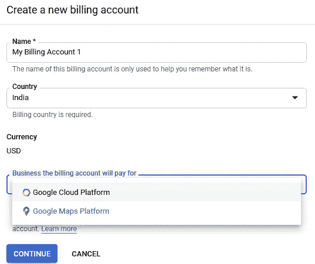
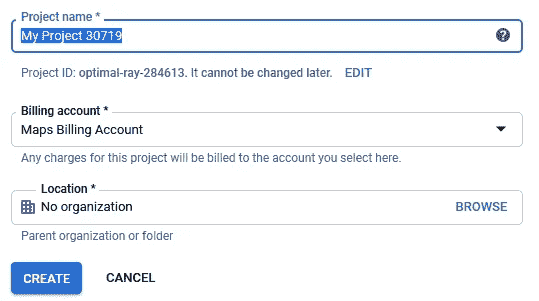
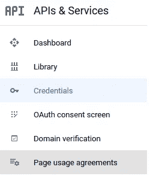

# 查找地点的纬度和经度

> 原文：<https://medium.com/analytics-vidhya/finding-latitude-and-longitude-of-places-b6d94fdd8b4e?source=collection_archive---------23----------------------->

我想在地图上显示特定地区的统计数据。第一步是找到该地区的纬度和经度，这样就可以在地图上显示图钉。基于大头针，我想显示与该地区相关的各种数据。

在本文中，我将讨论使用 Google 的地理编码 API 获取纬度和经度的步骤。

# 获取 API 密钥

在我们编写获取地区纬度和经度的脚本之前，我们必须为 Google 地理编码 API 获取一个 API 键。要获得 API 密钥，首先用你的电子邮件 id 和密码登录谷歌开发者账户[https://console.developers.google.com](https://console.developers.google.com)。

下一步是为 Google 创建计费帐户，以收取 API 的使用费。别担心，谷歌有很多灵活的计费方案。要创建计费账户，请转到*计费*部分和*创建账户*。

在下一个屏幕中，提供计费详细信息并启用计费。

付费账户可以为谷歌云平台或谷歌地图平台付费，但不能同时为两者付费。对于谷歌云平台，所有使用都将计入该计费账户。对于谷歌地图平台，超过 **$200 每月免费等级**限额的使用将被记入该账户。

地理编码 API 计费信息可以在[这里](https://developers.google.com/maps/documentation/geocoding/usage-and-billing)找到。有关谷歌地图平台所有产品的信息，请参考此处的。

**对于使用地理编码 API，选择谷歌地图平台作为计费账户。**创建计费账户后，我们将创建项目，API 将在该项目下注册。从项目顶部创建一个新项目。

在新屏幕中提供项目详细信息并创建一个项目。

我已经用我的地图付费帐户标记了该项目。由于这是一个个人项目，我没有创建一个组织。

创建计费帐户和项目后，下一步是为项目启用 API。点击*启用 API 和服务*以启用地理编码 API。

在下一个屏幕中搜索地理编码，并通过单击*启用*按钮启用 API。启用后，您应该会看到下面的屏幕。

请参考地理编码 API 定价计划的定价标签。截至 2020 年 7 月，谷歌每月为地图、路线和地点提供 200 美元的免费使用权。

到目前为止，我们已经创建了一个新的计费帐户，创建了一个新的项目并将计费帐户附加到项目，并为项目启用了地理编码 API。启用 API 后，我们现在需要一个可以用来从 python 脚本调用 API 的键。最后一步是创建 API 密钥。

要创建 API 密钥，请转到*凭证*选项卡并点击*创建凭证。*

单击 API 密钥创建新密钥。

请注意 API 键。这将在 python 脚本中使用。

这一步完成了获取 API 密钥的设置过程。现在，我们将在 python 脚本中使用这个新生成的键来获取地区的经度和纬度。

我从维基百科搜集数据，创建了一个地区和州的列表。(参见[本文](/@divij.sharma/web-scraping-dealing-with-ftp-servers-and-other-things-all-in-one-a07b61421d14)了解网页抓取详情。)区文件上传[这里](https://github.com/divijsharma/Blog/blob/master/district_lat_lng.csv)。

# 获取纬度和经度

首先，我们将导入库。我们将使用 3 个库。`pandas`读取存放区的 csv 文件，`requests`进行 API 调用，`json`将响应从 API 转换为 JSON 格式

为 API 创建 URL。我们将使用上一步中生成的 API 密钥。

读取地区数据并创建新列。在此上传地区数据[。](https://github.com/divijsharma/Blog/blob/master/district_lat_lng.csv)

循环读取文件，获取经纬度信息。在调用 API 之前，我们必须进行 URL 百分比编码。它用于在通常不允许的 URL 中放置字符。编码是百分号后跟一个 ASCII 值(十六进制)。(详情请参考[百分比编码](https://en.wikipedia.org/wiki/Percent-encoding)。)所以数据中的空格被替换为%20。纬度和经度信息存在于 JSON 中，因此我们必须导航到正确的标签来捕获数据。

最后一步是保存带有经纬度的文件。