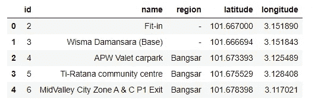
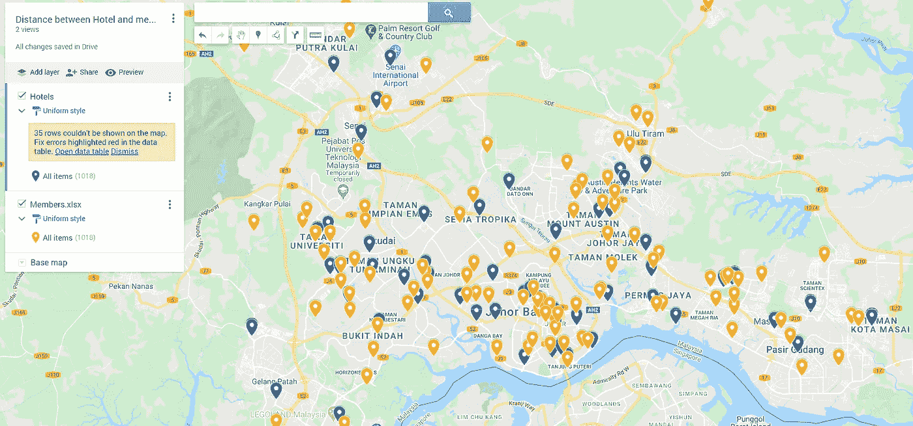

# 使用 Python 查找最近的经纬度匹配对

> 原文：<https://medium.com/analytics-vidhya/finding-nearest-pair-of-latitude-and-longitude-match-using-python-ce50d62af546?source=collection_archive---------0----------------------->

使用哈弗辛距离方程，这里是一个 python 代码，找到最近的位置匹配的基础上的距离为任何给定的 2 CSV 文件，其中有纬度和经度


安德鲁·斯图茨曼在 Unsplash 上的照片

**业务需求**

如今，深入研究用户统计数据变得越来越普遍。尤其是在以客户为中心的公司和像优步、OYO、GRAB、SWIGGY 这样的独角兽，在这些公司中 App 在理解用户行为方面起着至关重要的作用。年龄、性别、位置、平均购物篮大小、活跃时间段、生命周期价值被认为是业务的关键驱动因素。

**最近出现的重要性(距离)**


会员到酒店的距离(Socar 的 UI/UX 设计师 Sai Kiran Gottala)

像优步这样的公司，总是找到用户和优步汽车之间的有效距离，并引导他们的司机开车到高需求(激增)地区。同样，像 SWIGGY 这样的食品配送公司计算用户和酒店位置之间的距离，以维持他们的准时配送体验，并相应地指导乘客。

在本教程中，我们在马来西亚的酒店(餐馆)位置和会员之间执行**哈弗线距离公式分析**。数据集由两个独立的文件组成。第一个是酒店位置，第二个是会员。我们**想要确定哪个酒店离第二个数据集中的任何给定成员**最近

*(不强制理解后面的数学方程，我们在这里是为了理解在 Python 上复制公式的过程)*

# **维基百科上有什么关于哈弗线距离的内容**

给定经度和纬度，哈弗辛公式确定了球体上两点之间的**大圆距离。**


来源:[https://en.wikipedia.org/wiki/Haversine_formula](https://en.wikipedia.org/wiki/Haversine_formula)

不需要担心这一点，因为我们只需要使用一段代码来复制 python 中的相同公式。只要记住地球的无线电距离是 6371 公里

**从 Python 中的 ula 复制哈弗辛距离:**

```
from math import radians, cos, sin, asin, sqrt
def dist(lat1, long1, lat2, long2):
    """
Replicating the same formula as mentioned in Wiki
    """
    # convert decimal degrees to radians 
    lat1, long1, lat2, long2 = map(radians, [lat1, long1, lat2, long2])
    # haversine formula 
    dlon = long2 - long1 
    dlat = lat2 - lat1 
    a = sin(dlat/2)**2 + cos(lat1) * cos(lat2) * sin(dlon/2)**2
    c = 2 * asin(sqrt(a)) 
    # Radius of earth in kilometers is 6371
    km = 6371* c
    return km
```

就是这样！！

**现在该打开木星笔记本了**

> **A 部分—为 CSV 中的每个成员查找最近的酒店名称**

从 CSV 文件中读取数据

```
hotels = pd.read_csv(“data/hotels.csv”)
hotels.head()
```



```
members = pd.read_csv(“data/members.csv”)
members.head()
```


更改列名，以减少代码中需要输入的字母数量

```
# Renaming the column names 
members=members.rename(columns = {'latitude':'lat','longitude':'lon'})hotels=hotels.rename(columns = {'latitude':'lat','longitude':'lon'})# To make sure that there are no null values and All are either integers/ Float values members.info() 
print('\n XXXXXXXXXXXXXXXXXXXXXXX\n')
hotels.info()
```


**使用哈弗辛方程，我们可以找到会员位置与酒店数据框中所有坐标之间的“距离”。**

现在，让我们把这些值传递给我们的**哈弗辛方程**，来计算距离

*(只是复制粘贴上面的等式)*

```
from math import radians, cos, sin, asin, sqrt
def dist(lat1, long1, lat2, long2):
    """
    Calculate the great circle distance between two points 
    on the earth (specified in decimal degrees)
    """
    # convert decimal degrees to radians 
    lat1, long1, lat2, long2 = map(radians, [lat1, long1, lat2, long2])
    # haversine formula 
    dlon = long2 - long1 
    dlat = lat2 - lat1 
    a = sin(dlat/2)**2 + cos(lat1) * cos(lat2) * sin(dlon/2)**2
    c = 2 * asin(sqrt(a)) 
    # Radius of earth in kilometers is 6371
    km = 6371* c
    return km
```

以上计算了到所有酒店的距离。使用`**idxmin**`您可以找到最近的酒店名称，

```
def find_nearest(lat, long):
    distances = hotels.apply(
        lambda row: dist(lat, long, row['lat'], row['lon']), 
        axis=1)
    return hotels.loc[distances.idxmin(), 'name']
```

一旦我们有了最接近的酒店名称，现在只需使用，

```
members['name'] = members.apply(
    lambda row: find_nearest(row['lat'], row['lon']), 
    axis=1)# To check the data frame if it has a new column of hotel name (for each and every member's location in the list)members.head()
```


> **B 部分—查找会员所在地到最近酒店的“距离”**

获取单个表中的所有数据，对于上面的数据集，合并酒店名称的纬度和经度

```
members = pd.merge(members,hotels[['name','lat','lon']],on='name', how='left')# Rename the new columns as both the columns has same name, and python gets confused members=members.rename(columns = {'lat_x':'m_lat','lon_x':'m_lon','lat_y':'h_lat','lon_y':'h_lon'})members.head()
```


再次找出两对纵坐标之间的距离，让我们再次使用**哈弗森距离**公式(在最新的表上)

```
from math import radians, cos, sin, asin, sqrt
def haversine(lon1, lat1, lon2, lat2):
    """
    Calculate the great circle distance between two points 
    on the earth (specified in decimal degrees)
    """
    # convert decimal degrees to radians 
    lon1, lat1, lon2, lat2 = map(radians, [lon1, lat1, lon2, lat2])
    # haversine formula 
    dlon = lon2 - lon1 
    dlat = lat2 - lat1 
    a = sin(dlat/2)**2 + cos(lat1) * cos(lat2) * sin(dlon/2)**2
    c = 2 * asin(sqrt(a)) 
    # Radius of earth in kilometers is 6371
    km = 6371* c
    return km# Creating a new column to generate the output by passing lat long information to Haversine Equationmembers['distance'] = [haversine(members.m_lon[i],members.m_lat[i],members.h_lon[i],members.h_lat[i]) for i in range(len(members))]
members['distance'] = members['distance'].round(decimals=3)# Printing the data table 
members.head()
```


我们在上一栏中得到的**距离**是酒店和会员所在地之间的距离，单位为“千米”

**将您的结果打印到您的 CSV 文件中**

```
members.to_csv("output.csv", sep='\t', encoding='utf-8'
```

> **C 部分——在地图上绘制结果**

请将您的 output.csv 分成两个文件，一个给会员(Id，Lat，Long)，另一个给酒店(name，Lat，Long)

请点击:[https://www.google.com/maps/about/mymaps/](https://www.google.com/maps/about/mymaps/)并创建新地图

然后导入两个 Members.csv 和 Hotel.csv。我的地图会帮你规划坐标



**结论:**利用距离信息你可以

1.  定义和利用新的扩张机会
2.  管理您的地面车队并降低运营成本
3.  根据运营效率管理您的 SLA，并在 CX 方面保持较高的 NPS 分数。

最后，非常感谢您抽出宝贵的时间阅读本文，我希望您喜欢在您的数据集上复制相同的内容。

# 参考

[https://en.wikipedia.org/wiki/Haversine_formula](https://en.wikipedia.org/wiki/Haversine_formula)