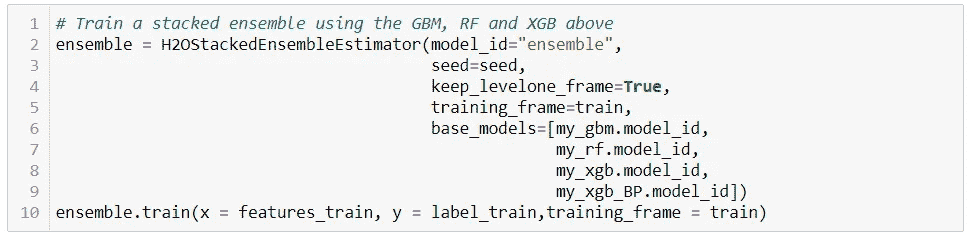

# 使用机器学习寻找新客户

> 原文：<https://medium.com/analytics-vidhya/finding-new-customers-using-machine-learning-f03857c7f965?source=collection_archive---------7----------------------->

为 Arvato Financial Services 创建客户细分报告。


# 目录

1.  简介和问题陈述
2.  项目结构和数据
3.  项目组成部分
4.  丰富
5.  结论部分

# 介绍

对贝塔斯曼-阿瓦托数据集的分析将是一次客户细分，将从一家邮购公司收集的客户数据集与从德国一般人群中取样的数据集进行比较…

本项目中的数据由贝塔斯曼 Arvato Analytics 提供:

*   德国一家邮购销售公司的顾客的人口统计数据，
*   并与一般人群的人口统计信息进行了分析和比较。

## 问题陈述

感兴趣的主要问题是预测在邮寄活动中最有可能成为其产品客户的人群。

应用监督和非监督学习来达到这个目标。

**无监督学习**帮助我们找到聚类内的相似性。我将应用 **H2O 均值**来发现聚类。在预测&分析**聚类**之后，我将能够从 **Azdias** 数据集预测潜在客户。

虽然无监督学习帮助我们找到相似的记录，但**监督学习**将让我们直接预测每个记录类。我们的问题是一个分类问题，因为目标值[0，1]分别代表非潜在客户和潜在客户。我会用 **Lightgbm，XGBoost，CatBoost，Random Forest，Logistic 回归** **分类器**算法配合 **sklearn** 库来预测每个人是不是潜在客户。

# 项目结构

本项目计划在 **4 主要**部分流程中:

*   **数据清理**和**数据处理**
*   在对用于客户细分的**重要特征**进行调查之后，实施**无监督学习**
*   实施**监督学习**
*   卡格尔竞赛

**第 0 部分:数据清理和数据处理**
在使用原始数据集进行分析之前，需要做几件事情:

*   探索性数据分析，以根据统计特征
*   缺失值的处理
*   转换功能和重构代码

**第 1 部分:客户细分报告**
这一部分的目的是为邮购公司找到描述典型客户的特征，并找到公司尚未关注的那部分人群。
正因为如此，我们对现有客户和普通人群的特征进行了分析，以便通过使用无监督学习方法来创建客户细分。

**第 2 部分:监督学习**
这一部分的目的是训练一种算法，能够找到对邮寄活动做出积极响应的客户。
Did 应用监督学习来调查 **MAILOUT-TRAIN** 和 **MAILOUT-TEST** 数据集，以预测一个人在活动后是否成为邮购公司的客户。

借助于学习曲线和最佳参数来选择算法的模型。

**PART 3:Kaggle Competition** 将从 **part 3** 中训练和参数化得到的**模型**应用于实现，**Kaggle**中的测试数据集，并加载和评级。

**数据汇总**

*   `**Udacity_AZDIAS_052018**`
    德国总人口**人口统计数据:**
    891 211 人(行)x 366 个特征(列)
*   `**Udacity_AZDIAS_052018**`
    邮购公司**客户的人口统计数据:** 191 652 人(行)x 369 个特征(列)
*   `**Udacity_MAILOUT_052018_TRAIN**`
    作为营销活动目标的个人的人口统计数据:
    42 982 人(行)x 367(列)
*   `**Udacity_MAILOUT_052018_TEST**` 作为营销活动目标的个人的人口统计数据:
    42 833 人(行)x 366(列)

**功能概述**

*   数据属性文件中有关于 314 列的信息。在这些信息中，只有数据集 368 列中的 233 列的信息。来自德国，对这个项目感兴趣的人在论坛上为其中的 24 个人写了附加信息。
*   观察到 **Azdias** 和客户数据集之间有 3 列差异。

# 项目组成部分


*   导入文件是为了做一些探索性的数据分析。开始时，对数据集中缺失值的描述性统计和计算分布进行分析。
*   两个数据集的特征是同步的。


*   **80%为空的行**已被删除。
*   检查了**列**的缺失值。观察到在“**高**级别具有缺失值的列在 Azdias 和 Customers 的数据集中具有相同的列。相同列的数量是 8。


*   **编码一些列:** 无监督学习技术只对数字特征起作用。因此，进行一些编码更改或附加假设，以便能够继续。
    此外，客户数据集包含目标数据集作为我们客户的源数据。因此，我们将对这个数据集进行列调查。当我们开始这项工作时，这是编码的初步准备，我们将在实现模型之前使用它，我们将从具有高' **nunique** '值的列开始。

> 这里的目的是识别重要的列并显著减少这些特性的唯一值。

> **‘RAEGENDE _ jugendjhre’feu ture 的编码**
> **RAEGENDE _ jugendjhre**，在这一栏中给我们提供了两种不同的信息。一种是时间序列，另一种是两种类型(主流-前卫)
> 必须将混合信息代码转换成**两个不同的列。**

```
1 : 40ies - war years (Mainstream,O+W)
2 : 40ies - reconstruction years (Avantgarde,O+W)
3 : 50ies - economic miracle (Mainstream,O+W)
4 : 50ies - milk bar / Individualisation (Avantgarde,O+W)
5 : 60ies - economic miracle (Mainstream,O+W)
6 : 60ies - generation 68 / student protestors (Avantgarde,W)
7 : 60ies - opponents to the building of the Wall (Avantgarde,O)
8 : 70ies - family orientation (Mainstream,O+W)
9 : 70ies - peace movement (Avantgarde,O+W)
10 : 80ies - Generation Golf (Mainstream,W)
11 : 80ies - ecological awareness (Avantgarde,W)
12 : 80ies - FDJ/communist party youth organisation (Mainstream,O)
13 : 80ies - Swords into ploughshares (Avantgarde,O)
14 : 90ies - digital media kids (Mainstream,O+W)
15 : 90ies - ecological awareness (Avantgarde,O+W)
```


> 对‘GEBURTSJAHR’future
> **GEBURTSJAHR**进行编码和调查，在这一栏中给出我们的出生年份。该列类型为**数字**。

**结果:**我们使用此列 **GEBURTSJAHR** 经过以下过程:

*   在这一栏中它有`0`(零)。这意味着**错误**或**没有进入**。我们应该用 **NaN** 代替 **zero**
*   用{190:193，191:193，192:193，200:199，201:np 对值进行分类。NaN}


> **对‘EINGEFUEGT _ AM’特性**
> ’**EINGEFUEGT _ AM**的研究，在此栏中为我们提供了年月日信息。我们将年份索引从 **EINGEFUEGT_AM** 特征转换成 **EINGEFUEGT_ind**


最有可能的是，第一次记录是在 22 年前取得的，那一年包含了**几乎 60%的数据**。**同样持续 16 到 21 年包含了~ 90%的数据**。

**结果:**由于偏度过大，我们删除了此列。删除创建新的 **EINGEFUEGT_idn** 和 **EINGEFUEGT_AM** 的列。


分别检查了上述每个特征。删除不必要的功能。对其他每一个进行标签编码。

*   如果用平均值填充*缺失值会将小数引入数据集，这种情况会影响效率*。因此，每个列的缺失值都用 MODE 替换。正因为如此，**缺失值在移除**重复行**后被替换为每列的模式**。


使用 4 种不同的模型，我们试图识别 366 个特征中的重要特征。使用了来自 **H2o 库**的 **GBM、RF、XGBoost** 和 **StackedEnsemble** 。在检查了我从每个模型中获得的列的分数之后，我发现了 57 个重要特征。在下一阶段，将使用这 57 项功能。



在这一节中，我将讲述我如何处理无监督学习来分析客户细分的特征。

首先，我们不要忘记，我们的数据集存在不平衡问题。(Azdias-Customers ~ 17%，Mailout Train- 1.1%)我在探索性数据分析中观察到了这一点。在应用 **PCA** 之后，我发现**代表 90–95%数据的组件**的数量**超过了 200 个组件**。因此，我决定使用我在上一节中通过特性工程获得的**重要特性**。

应用主成分分析后，我从 XGBoost 获得的特征重要分数比的分数好。这就是为什么我选择只使用的**重要特性。**

决定之后，下一步是确定最佳的集群数量。通过 **Yellowbrick** 库的 **KElbowVisualizer** 使用肘方法。


计算并绘制了跨方差 K 个聚类的平均聚类内距离。决定了 4 个集群将是一个好的结果。

现在是实现和集群的时候了。在这里，由 **H2o** 在 h2o.estimators 内部使用**h2okmeanseestimator**算法，并由 **Matplotlib** 库用 **Pyplot** 绘制。让我告诉你，在应用 Azdias-Customers 数据集之后，我立即应用了 Mailout-Train 和 Mailout-Test 数据集的聚类。


Azdias-客户数据集的聚类


邮寄数据集的集群

为了获得客户，如果在集群选择中遵循下面的顺序**，就可以**快速获得正面结果**。**

*   集群 3 和集群 1 是客户的最佳细分市场
*   集群 0 可能也不错
*   第二组很糟糕。


数据清洗阶段变成了**流水线**，并应用于 Mailout-Train 和 Mailout-Test。然后根据**重要特征**排列数据。
建模**randomversampling**之前通过**做了 sk learn**(sampling _ strategy =**0.25**)的库来解决不平衡问题。


由于这个过程是分类器，我选择并尝试了 Sklearn 的**库的 Lightgbm、XGBoost、CatBoost、Random Forest、Logistic Regression **分类器模型**。**


在将 VotingClassifier 算法应用于集成建模之前，我对不平衡问题进行了调整。我将客户数据集中的一些记录添加到 Mailout-Train 数据集中，而不是人为地进行过采样。第二个模型产生了更好的结果，尽管不如第一个模型。


当我比较**基础模型**、**改进模型**和**改进控制**时，我看到`**VotingClassifier**`和`**LGBMClassifier**`将会给我们最好的结果。因此，微调后的`**VotingClassifier**` **将与邮寄测试**集一起使用。
LGBM 的**改进模型最佳模型得分** d 在 **0.815448 左右，VotingClassifier** 的**0.871796。使用此**投票分类器**模型**预测测试标签。****


现在，将使用根据训练数据训练的最佳模型对邮寄测试数据进行分类。在这里，所有的模型都将被估计。但是 will 提交的只是微调后的 VotingClassifier 模型的预测。


# 改进

从数据清理到模型训练，有许多不同的方法和解决方案可以应用。由于这是一个现实生活中的问题，如果特征知识是已知的，结果会更好，因为列的选择将是不同的。综上所述，提高监督学习模型的性能，可以执行以下部分:

*   了解有关功能的更多信息以改进功能工程，
*   处理不平衡数据:欠采样或过采样，
*   增加特性或 PCA 组件。
*   LightGBM 模型可以通过运行更广泛的超参数调优来改进。尝试迄今为止最佳分类器的更多超参数调整，并使用最佳优化的分类器模型。

# 结果

*   用**k 均值**获得 4 个聚类。如果在集群中选择**集群 3** 和**集群 1** ，可以很快得到正面结果。集群 3 和集群 1 是潜在客户的最佳细分市场**。**
*   **这个过程就是分类器。正因为如此，我选择并尝试了 Sklearn 库的 **Lightgbm、XGBoost、CatBoost、Random Forest、Logistic Regression** 分类器模型。*基于树算法的分类器模型对异常值具有鲁棒性。树算法在相同值的基础上分割数据点，因此离群值不会对分割产生太大影响。”(6)
    *“voting classifier”背后的思想是在概念上组合不同的机器学习分类器，并使用* ***多数*** *投票、* ***加权*** *，或* ***平均*** *预测概率(软投票)来预测类别标签。这种分类器可以用于一组同样表现良好模型，以平衡它们各自的弱点(3)****

*   **我从这些模型中得到的 ROC-AUC 得分的最好结果是来自 Lightgbm 的 0.79613。
    对数据集进行新的过采样后**改进的最佳 ROC-AUC 得分**来自 Lightgbm 约为 **0.8063，另一个来自 VotingClassifier** 为**0.8588。使用该投票分类器模型来预测测试标签。****
*   **此外，邮寄测试结果为{1: 3531，0 : 33669}，使用**投票分类器**型号。**

****

# **结论**

*   **在普通客户群体数据集上训练了一个 **K 均值模型**。使用该模型对客户数据进行聚类以进行客户细分，然后**比较聚类的分布**。**
*   ****堆叠**和**投票**比单一模型结果更有用。**
*   **如果我们能向客户展示我们的发现并获得反馈，那就太好了。**
*   **这个项目的两个挑战是大数据量和数据不平衡。清理这些大数据并将 GridSearcheCV 应用于模型也需要大量的时间和机器性能。对于解决方案，应该多花一些时间去了解列，在不禁用重要列的情况下寻求高性能。**
*   **对我来说，**用**10–128 种变化**实现 GridSearchCV 是一个错误**。更明智的做法是只关注 **LGBM** 和 **XGBoost** 车型。**
*   **这个分析的公共代码可以在它的 Github 库中找到。**

**本项目使用的一些资源:
(1) [可视化](http://python-graph-gallery.com/barplot/)
(2) [H2O.ai 文档](http://docs.h2o.ai/)
(3) [集成投票分类器](https://scikit-learn.org/stable/modules/generated/sklearn.ensemble.VotingClassifier.html)
(4) [用于 GridSearch](https://mlfromscratch.com/gridsearch-keras-sklearn/#/)
一些文章:( [6](https://datascience.stackexchange.com/questions/37394/are-decision-trees-robust-to-outliers#:~:text=Yes%20all%20tree%20algorithms%20are,depending%20upon%20their%20house%20size.) ，( [7](https://www.analyticsvidhya.com/blog/2016/03/complete-guide-parameter-tuning-xgboost-with-codes-python/) )，( [8](https://queirozf.com/entries/one-hot-encoding-a-feature-on-a-pandas-dataframe-an-example) ，( [9](https://towardsdatascience.com/understanding-auc-roc-curve-68b2303cc9c5#:~:text=AUC%20-%20ROC%20curve%20is%20a,degree%20or%20measure%20of%20separability.&text=By%20analogy,%20Higher%20the%20AUC,with%20disease%20and%20no%20disease.)**