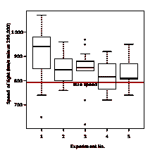
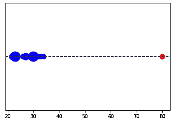
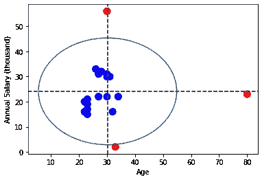
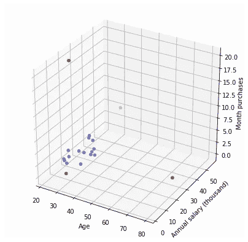
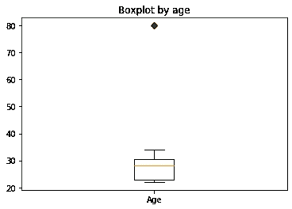
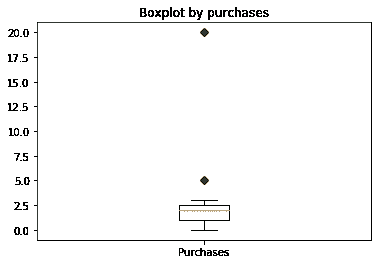
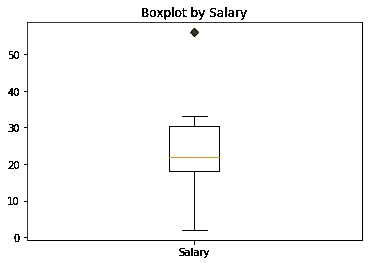
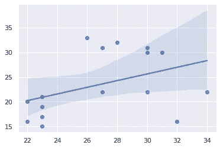

# 离群点检测

> 原文：<https://medium.com/analytics-vidhya/finding-outliers-4694572f7801?source=collection_archive---------20----------------------->

在统计学中，异常值是与其他观察值显著不同的数据点。异常值可能是由于测量中的可变性造成的，或者它可能表明实验误差；后者有时被排除在数据集之外。异常值会在统计分析中引起严重的问题。


在这篇新文章中，我们将解释什么是离群值，为什么它们如此重要，我们将看到一个在 Python 中的一步一步的实际例子，1、2 和 3 维显示，以及通用库的使用。

## # #有哪些异常值？

有趣的是，根据上下文，我们可以看到“离群值”的英文翻译:

*   非典型的
*   作为特色的
*   例外的
*   反常的
*   极值，异常值，异常值！

这给了我们一个想法，不是吗？

也就是说，我们数据集中的离群值将是“逃离大多数样本集中的范围”的值。根据维基百科，它们是远离其他观测的样本。



## 异常值的检测

为什么我们对检测这些异常值感兴趣？因为它们会极大地影响机器学习模型所能获得的结果…不管是好是坏！这就是为什么我们必须检测它们，并考虑它们。例如，线性回归或组合算法会对您的预测产生负面影响。

## 好的异常值与坏的异常值

异常值可能意味着很多事情:

*   错误:如果我们有一个“人的年龄”组，我们有一个 160 岁的人，这可能是一个数据加载错误。在这种情况下，检测异常值有助于我们检测错误。
*   限制:在其他情况下，我们可以有从“中间组”逸出的值，但是我们希望保持数据被修改，以便它不会损害 ML 模型的学习。
*   兴趣点:也许“异常”案例是我们想要检测的，它们是我们的目标(而不是我们的敌人！)

很多时候，识别图形中的异常值是很容易的。让我们看看 1 维、2 维和 3 维中异常值的例子。

## 一维中的异常值

如果我们要分析一个单一变量，例如“年龄”，我们将看到大多数样本集中在哪里，以及可能的“极端”值。

```
import matplotlib.pyplot as plt
import numpy as np

age = np.array([22,22,23,23,23,23,26,27,27,28,30,30,30,30,31,32,33,34,80])
age_unique, counts = np.unique(age, return_counts=True)

sizes = counts*100
colors = ['blue']*len(age_unique)
colors[-1] = 'red'

plt.axhline(1, color='k', linestyle='--')
plt.scatter(age_unique, np.ones(len(age_unique)), s=sizes, color=colors)
plt.yticks([])
plt.show()
```



蓝色的是我们大多数等级集中的值。红色表示异常值或“极端值”。在代码中，我们导入库，用 Numpy 创建一个年龄数组，然后计算出现的次数。

在作图时，我们看到大多数年龄集中的地方，在 20 岁到 35 岁之间。以及值为 80 的孤立样本。

## 二维中的异常值

现在假设我们有两个变量:年龄和收入。让我们做一个二维图表。此外，我们将使用一个公式来绘制一个圈定异常值的圆:超过“平均值加 2 个标准偏差”(圆的面积)的值将显示为红色。

```
from math import pi
import numpy as np

annual_salary_thousands = np.array([16,20,15,21,19,17,33,22,31,32,56,30,22,31,30,16,2,22,23])
media = (annual_salary_thousands).mean()
std_x = (annual_salary_thousands).std()*2
media_y = (age).mean()
std_y = (age).std()*2

colors = ['blue']*len(annual_salary_thousands)
for index, x in enumerate(annual_salary_thousands):
    if abs(x-media) > std_x:
        colors[index] = 'red'

for index, x in enumerate(age):
    if abs(x-media_y) > std_y:
        colors[index] = 'red'

plt.scatter(age, annual_salary_thousands, s=100, color=colors)
plt.axhline(media, color='k', linestyle='--')
plt.axvline(media_y, color='k', linestyle='--')

v=media     #y-position of the center
u=media_y    #x-position of the center
b=std_x     #radius on the y-axis
a=std_y    #radius on the x-axis

t = np.linspace(0, 2*pi, 100)
plt.plot( u+a*np.cos(t) , v+b*np.sin(t) )

plt.xlabel('Age')
plt.ylabel('Annual Salary (thousand)')
plt.show()
```



在蓝色圆圈内，是平均值，红色是异常值:3 个值是标准偏差的 2 倍以上。

通过这一点，我们可以了解在有或没有这些异常样本的情况下，训练机器学习模型可能会有多么不同。

## 在 3D 中可视化异常值

我们看到初始数据集中的一些样本被遗漏了！

如果我们向数据集添加第三维度，会发生什么？比如每个用户“每月购买量”这个维度。

```
from mpl_toolkits.mplot3d import Axes3D
fig = plt.figure(figsize=(7,7))
ax = fig.gca(projection='3d')

month_purchases = np.array([1,2,1,20,1,0,3,2,3,0,5,3,2,1,0,1,2,2,2])
media_z = (month_purchases).mean()
std_z = (month_purchases).std()*2

for index, x in enumerate(month_purchases):
    if abs(x-media_z) > std_z:
        colors[index] = 'red'

ax.scatter(age, annual_salary_thousands, month_purchases, s=20, c=colors)
plt.xlabel('Age')
plt.ylabel('Annual salary (thousand)')
ax.set_zlabel('Month purchases')

plt.show()
```



我们在三维空间中看到，有些值逃脱了<>。红色的异常值。在每月购买的情况下，我们看到一个新的“红点”出现在 Z 轴上。我们必须思考，如果是我们想要丢弃的用户，或者相反，我们对分析感兴趣。

## N 维中的异常值

现实情况是，我们工作的模型有很多维度，我们可以有 30、100 或数千个维度。因此，将离群值可视化似乎不再那么容易了。

我们仍然可以“盲目地”检测异常值并处理它们。或者通过一个库(在本文的后面)。

我们可以通过主成分分析或 T-SNE 降低维数来绘制多维图形。

注意:我们不得不认为——假设数据中没有错误——在一维中分析的值是异常值，在“多维”中一起分析可能不是。然后，孤立地分析变量的策略并不总是有效的。

## 一个简单的检测图:箱线图

一个非常有趣的图表是箱线图，在金融界非常常用。在我们的例子中，我们可以将变量可视化，在那个“小盒子”中，我们将看到 50%的分布集中在哪里(百分位数 25 到 75)，最小和最大值(“T”线)，当然还有异常值，那些“奇怪”和遥远的值。

```
green_diamond = dict(markerfacecolor='g', marker='D')
fig, ax = plt.subplots()
ax.set_title('Boxplot by age')
ax.boxplot(age, flierprops=green_diamond, labels=["Age"])
```



```
green_diamond = dict(markerfacecolor='g', marker='D')
fig, ax = plt.subplots()
ax.set_title('Boxplot by purchases')
ax.boxplot(month_purchases, flierprops=green_diamond, labels=["Purchases"])
```



```
green_diamond = dict(markerfacecolor='g', marker='D')
fig, ax = plt.subplots()
ax.set_title('Boxplot by Salary')
ax.boxplot(annual_salary_thousands, flierprops=green_diamond, labels=["Salary"])
```



## 它是如何影响欧利耶的

```
import seaborn as sns

#WITH OUTLIERS

sns.set(color_codes=True)
sns.regplot(x=age, y=annual_salary_thousands)
```


```
# WITHOUT OUTLIERS

age_fix=[]
annual_salary_thousands_fix=[]

for index, x in enumerate(annual_salary_thousands):
    y= age[index]
    if abs(x-media) > std_x or abs(y-media_y) > std_y:
        pass
    else:
        age_fix.append(y)
        annual_salary_thousands_fix.append(x)

sns.regplot(x=np.array(age_fix), y=np.array(annual_salary_thousands_fix))
```



## 一旦被发现，我该怎么办？

根据商业逻辑，我们可以采取这样或那样的行动。

例如，我们可以决定:

年龄不符合正态分布的，剔除。超出限额的工资，分配最大值(平均值+ 2 sigmas)。每月的购买量，保持不变。

## PyOD:用于异常值检测的 Python 库

在代码中，我使用了一个已知的方法来检测异常值:分布的平均值加上 2σ作为边界。但是还有其他策略来界定异常值。

强烈推荐的库是 PyOD。它有几种策略来检测异常值。它提供了不同的算法，其中 Knn 很有意义，因为它分析样本、PCA、神经网络之间的接近度，让我们看看如何在我们的例子中使用它。

安装库

```
!pip install pyodfrom pyod.models.knn import KNN
from pyod.models.pca import PCA
import pandas as pddf = pd.DataFrame(data={'age':age,'salary':annual_salary_thousands, 'purchases':month_purchases})clf = KNN(contamination=0.18)
#clf = PCA(contamination=0.17)
clf.fit(df)

X=df
clf.fit(X)
scores_pred = clf.decision_function(X)
y_pred = clf.predict(X)scores_predarray(
[ 4.12310563,  5.19615242,  5.19615242, 19.33907961,  4\.        ,       3.74165739,  5\.        ,  6.70820393,  3.60555128, 3.74165739,
25.3179778 ,  4.12310563,  7.68114575,  3.60555128,  5.09901951,
9.05538514, 18.13835715,  8.77496439, 50.009999  ])y_predarray([0, 0, 0, 1, 0, 0, 0, 0, 0, 0, 1, 0, 0, 0, 0, 0, 1, 0, 1])df[y_pred == 1] 
```


PyOd 库检测异常寄存器。

对于现实生活中的多维问题，依靠像这样的库是很方便的，它将有助于检测和清理/转换数据集的任务。

## 结论

我们生活在一个数据每秒都在变大的世界里。

如果使用不当，数据的价值会随着时间的推移而降低。

发现数据集中的异常对于识别业务中的问题至关重要。

构建主动解决方案，在问题发生前发现问题。

发表的参考文献和链接对发展这一领域很有意义。

我希望它能帮助你发展你的训练。

# 永不放弃！

[Linkedin 见！](https://www.linkedin.com/in/oscar-rojo-martin/)

## 参考资料:

*   [https://www . aprendemachinehlearning . com/detec cion-de-outliers-en-python-anomalia/](https://www.aprendemachinelearning.com/deteccion-de-outliers-en-python-anomalia/)
*   github:[https://github . com/jbag NATO/machine-learning/blob/master/ejerciio _ outliers . ipynb](https://github.com/jbagnato/machine-learning/blob/master/Ejercicio_Outliers.ipynb)
*   PyOD 库离群点检测[https://github.com/yzhao062/pyod](https://github.com/yzhao062/pyod)
*   如何识别数据中的异常值[https://machine learning mastery . com/how-to-Identify-Outliers-in-your-Data/](https://machinelearningmastery.com/how-to-identify-outliers-in-your-data/)
*   机器学习中有效的离群点检测技术[https://medium . com/@ mehulved 1503/effective-Outlier-Detection-Techniques-in-Machine-Learning-ef 609 b 6 ade 72](/@mehulved1503/effective-outlier-detection-techniques-in-machine-learning-ef609b6ade72)
*   如何让你的机器学习模型对离群值具有鲁棒性[https://www . kdnugges . com/2018/08/Make-Machine-Learning-Models-Robust-Outliers . html](https://www.kdnuggets.com/2018/08/make-machine-learning-models-robust-outliers.html)
*   机器学习|离群值[https://www.geeksforgeeks.org/machine-learning-outlier/](https://www.geeksforgeeks.org/machine-learning-outlier/)
*   处理离群值的三种方法[https://www . neural designer . com/blog/3 _ methods _ to _ deal _ with _ outliers](https://www.neuraldesigner.com/blog/3_methods_to_deal_with_outliers)
*   使用机器学习的异常值检测和异常检测[https://medium . com/@ mehulved 1503/使用机器学习的异常值检测和异常检测-caa96b34b7f6](/@mehulved1503/outlier-detection-and-anomaly-detection-with-machine-learning-caa96b34b7f6)