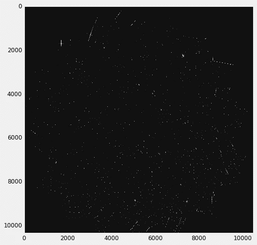
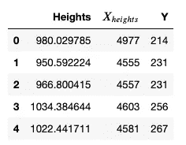
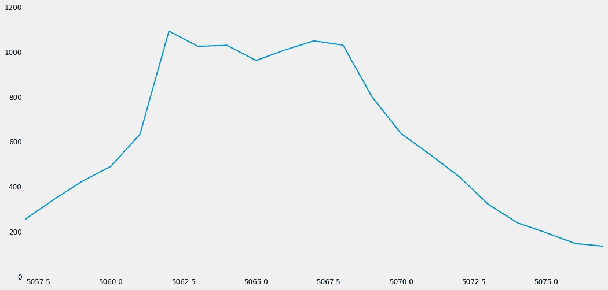
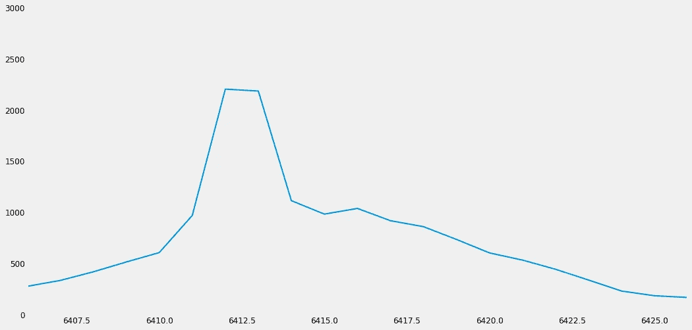
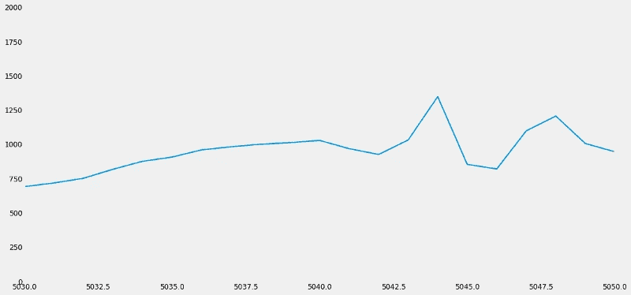
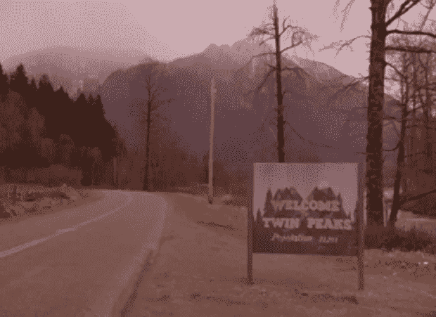

# 用 SciPy 和一些常识提示找到信号中的(真实)峰值

> 原文：<https://medium.com/analytics-vidhya/finding-real-peaks-in-your-signal-with-scipy-and-some-common-sense-tips-a62c55cd387d?source=collection_archive---------6----------------------->


如果你是一名数据科学家，你的典型任务之一就是分析某个信号并找到它的峰值。这可能是你的目标，原因有很多，但更大的原因是峰值以某种方式倾向于显示信号的某种属性。毫不奇怪，Python 中已经有一个帮助您找到峰值的库，它就是 [SciPy(带有 find_peaks 函数](https://docs.scipy.org/doc/scipy/reference/generated/scipy.signal.find_peaks.html))。尽管如此，明智地使用这个强大的库来获得我们想要的东西是很重要的**我们需要让我们对“峰值”的定义更加明确**。

## 您在找什么？

在这个例子中，我将展示一个峰值是一颗星:)

在天体物理学领域，[哈勃望远镜提供了 Tucanae 星](https://archive.stsci.edu/prepds/deep47tuc/)的图像文件数据。看起来是这样的:



从数学上讲，它只是一个 N 行 M 列的矩阵。矩阵的每个数字代表像素的强度。因为我们希望星形尽可能靠近像素，所以我们希望:

**A)如果两个峰值过于接近，我们可能希望将它们视为一个单独的峰值**

**B)不要让更高的强度值过于接近我们正在考虑的峰值(即，如果我们的峰值接近 1000，我们不想让 2000 峰值接近这个峰值)**

**C)我们可能希望峰值衰减到我们正在研究的范围两端的某个值(本例中为 0)**

正如有可能看到的那样，在这些条件下没有天体物理学，因为它们是关于什么是真正的“高峰”的常识性考虑。它们可能听起来微不足道，但是在我们的代码中考虑它们是很重要的。说到这里，我们先从 Python 说起！

## 导入你的巫师，给你的精灵命名。

在此特定示例中，您可以使用此设置:

```
import astropy
from astropy.io import fits
import pandas as pd
import matplotlib.pyplot as plt
import matplotlib.pyplot as plt
import matplotlib.colors as mcolors 
from matplotlib import cm
import numpy as np
import math 
import seaborn as sns
from scipy.misc import electrocardiogram
from scipy.signal import find_peaks
hdu_list= fits.open('imagefilepath')
img_data=hdu_list[0].data
```

## 使用查找峰值

假设我们对检测 1000 高度峰值感兴趣。寻找峰值是一个强大的工具来做到这一点，但它确实包括 A，B 和 C 邪恶的峰值。不管怎样，这是一个好的开始。在你的图像上固定某个 Y，用 find_peaks 找到你的峰值。一般来说，您可能希望对所有 Y-es 都这样做。

```
HEIGHTS_fixed_y=[]
X_HEIGHTS=[]
Y=[]
for y in range(len(img_data)):
    x = img_data[y]
    peaks, _= find_peaks(x,height=(950, 1050))
    if len(peaks)!=0:
        for i in range(len(peaks)):
            HEIGHTS_fixed_y.append(x[peaks].tolist()[i])
            X_HEIGHTS.append(peaks.tolist()[i])
            Y.append(y)
#X_HEIGHTS save all the x coordinates of the peaks
#HEIGHTS_FIXED_y save all the heights of the peaks (they will be between 950 and 1050)
#Y save all the y coordinates of the peaksthousand=pd.DataFrame()
thousand['Heights']=HEIGHTS_fixed_y
thousand['$X_{heights}$']=X_HEIGHTS
thousand['Y']=Y
```



## a)删除彼此过于接近的峰值

假设 Y=400。在这个坐标上，X=20 是一个峰值，X=9800 也是一个峰值，这没问题。但是如果 X=20 是一个峰值，X=24 也是一个峰值，那么我们就没有做对事情！假设固定 Y 的 x 必须被至少 10 个像素分隔开，如果不是这样，就删除它们。



A 级不可乘高峰)

```
y_unique_values=list(set(thousand.Y.tolist()))
wrong_y=[]
for y in y_unique_values:
    wrong_x=thousand[thousand['Y']==y]['$X_{heights}$'].tolist()
    differences=[]
    if len(wrong_x)!=1:

        for x in range(len(wrong_x)-1):
            first_value=wrong_x[x]
            for j in range(x+1,len(wrong_x)):
                difference=abs(first_value-wrong_x[j])
                differences.append(difference)
    for d in differences:
        if d<=10:
            wrong_y.append(y)
for y in wrong_y:
    thousand=thousand[thousand.Y!=y]
thousand=thousand.reset_index().drop(columns=['index'])
```

## b)如果有更高的值，它就不是峰值



B 级不可乘高峰)

如果你希望峰值高度接近 1000，你不能接受高度接近 2000 的峰值太接近你的峰值的 x。用下面的代码摆脱它们:

```
not_peak_index=[]
for i in range(len(thousand)):
    y_values=img_data[thousand.Y.tolist()[i]].tolist()
    x_min,x_max=thousand['$X_{heights}$'].tolist()[i]-10,thousand['$X_{heights}$'].tolist()[i]+10
    range_values=y_values[x_min:x_max]
    binary=0
    for value in range_values:
        if value > thousand['Heights'].tolist()[i]:
            binary=binary+1
    if binary!=0:
        not_peak_index.append(i)
```

## c)好了，匹克，你已经说完了，现在回去睡觉吧。

您可能希望您的峰值在范围的两端衰减到 0(即，像下面这样的情况是不可接受的)



C 类，不得服用

使用以下代码检测实际达到 0 的峰值:

```
not_zeros_index=[]
for i in range(len(thousand)):
    y_values=img_data[thousand.Y.tolist()[i]].tolist()
    x_min,x_max=thousand['$X_{heights}$'].tolist()[i]-10,thousand['$X_{heights}$'].tolist()[i]+10
    if abs(y_values[x_min])>10 and abs(y_values[x_max]>10):
        not_zeros_index.append(i)
```

我们设置 10 是因为不删除更大的一组点是一个可以接受的妥协，但当然你是老板！

## **结论:**

**SciPy(以及一般的 Python 库)是一个非常强大的库，但是它需要被明智地使用，因为如果我们不指定它，它就不知道我们想要什么**。在这篇文章中，给出了 3 个技巧来清除 find_peaks 产生的数据帧中不需要的峰，当然，您可能希望对紧急情况开发更多的条件:)



如果你喜欢这篇文章，你想知道更多关于机器学习的知识，或者你只是想问我一些你可以问的问题:

A.在 [**Linkedin**](https://www.linkedin.com/in/pieropaialunga/) 上关注我，在那里我发布我所有的故事
B .订阅我的 [**简讯**](https://piero-paialunga.medium.com/subscribe) 。这会让你了解新的故事，并给你机会发短信给我，让我收到你所有的更正或疑问。
C .成为 [**推荐会员**](https://piero-paialunga.medium.com/membership) ，这样你就不会有任何“本月最大数量的故事”，你可以阅读我(以及成千上万其他机器学习和数据科学顶级作家)写的任何关于最新可用技术的文章。

再见:)