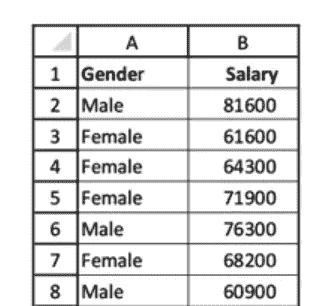
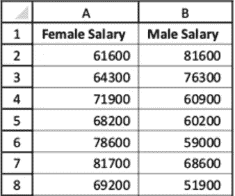
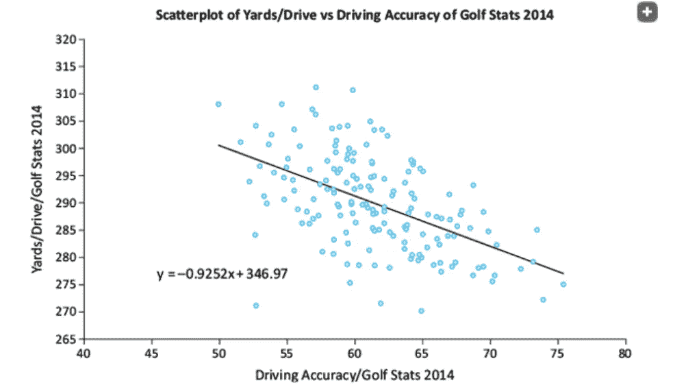
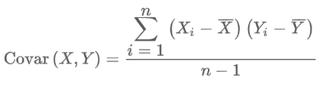
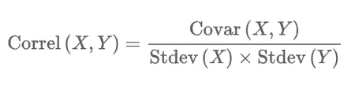

# 寻找变量之间的关系

> 原文：<https://medium.com/analytics-vidhya/finding-relationships-among-variables-76ac5e477295?source=collection_archive---------15----------------------->

> **分类变量之间的关系**

考虑一个至少有两个分类变量的数据集，吸烟和饮酒。每个人被分为三类吸烟者:不吸烟者、偶尔吸烟者和重度吸烟者。类似地，每个人被分为三类饮酒者:不饮酒者、偶尔饮酒者和重度饮酒者。数据表明吸烟和饮酒习惯相关吗？例如，不喝酒的人倾向于不吸烟吗？烟瘾大的人倾向于酗酒吗？
描述分类变量最有意义的方式是计数，可能表示为行总计的百分比或列总计的百分比，以及相应的图表。

使用交叉表(Cross-table)来发现两个分类变量之间的关系。这有时也被称为列联表。

> **分类变量和数值变量之间的关系**

比较问题，即在两个或多个子群体中比较一个数值变量，是所有研究领域中数据分析师面临的最重要的问题之一(比较问题)

以下是一些例子:

*   亚人群是男性和女性，数字尺度是工资。
*   亚人群是国家的不同地区，数字尺度是生活成本。

堆叠数据

未堆叠数据

您将看到两种可能的数据格式，堆叠和非堆叠

创建并排的箱形图，另一种可能是创建并排的直方图，每个类别一个直方图。但是，您不应该接受默认的 bin，因为它们会因类别而异，从而妨碍公平的比较。所以请确保您进入自己的垃圾箱。第三种可能是使用数据透视表和相应的数据透视图。通过图表和/或数字汇总方法，您可以快速了解两个或多个类别的比较情况

> **数值变量之间的关系**

例如，您可能想要检查人的身高和体重之间的关系，或者员工的工资和工作年限之间的关系。我们看相关性和协方差，以及散点图。

一般来说，不要使用涉及编码分类变量的相关性，如 0-1 虚拟变量*。*

***散点图*** 是点的分散，其中每个点表示两个选定变量的观察值。这两个变量通常被统称为 *X* 和 *Y* ，因此散点图有时被称为 X-Y 图。散点图的全部目的是使关系(或缺乏关系)变得明显。这些点是否倾向于从左到右向上上升？它们倾向于从左向右向下吗？图案倾向于线性、非线性还是没有特定的形状？是否有任何点落在一般模式之外？这些问题的答案提供了关于这两个变量之间可能关系的信息。

***趋势线*** 是一条尽可能“符合”散点图的线或曲线。这可能是一条直线，也可能是几种曲线中的一种，这是量化散点图中明显关系的一种简单方法。

你看到的方程是一个回归方程。它表示驱动长度(y)为 346.97 减去 0.9252 倍驱动精度(x)。这条线当然不是完美的拟合，因为有许多点远在线上，而其他点在线下。不过，它相当好地量化了向下的关系。

***相关性和*** 协方差，涉及两个变量。具体来说，每种方法都衡量两个数值变量之间线性关系的强度和方向。直观上，如果散点图中的点紧紧围绕某条直线，那么这种关系就是“强”的。如果这条直线从左向右上升，则关系为正，度量值为正数。如果从左到右下降，关系为负，度量值将为负数。

为了测量两个数值变量 *X* 和 Y 之间的协方差或相关性——实际上，为了形成一个 *X* 对 Y 的散点图——X 和 *Y* 必须是“成对”变量。也就是说，它们必须具有相同数量的观测值，并且任意观测值的 *X* 和 *Y* 值应该是自然配对的。例如，每个观察可以是特定人的身高和体重、在商店的时间以及为特定顾客购买的数量，等等

协方差

它本质上是均值偏差乘积的平均值。如果 X 和 Y 的变化方向相同，那么当 X 高于均值时，Y 将倾向于高于均值，当 X 低于均值时，Y 将倾向于低于均值。在任何一种情况下，偏差的乘积都将是正的，即正乘以正，或者负乘以负，因此协方差将是正的。当 X 和 Y 的变化方向相反时，情况正好相反。那么协方差将是负的。

协方差对 X 和 Y 的测量尺度过于敏感，使其无法解释，所以最好依赖相关性，相关性不受测量尺度的影响。由 Correl( *X，Y* )表示的相关性解决了这个问题。它是一个不受测量标度影响的单位减少量。例如，无论变量是以美元、千美元还是百万美元来衡量，相关性都是相同的

相互关系

相关性不仅不受两个变量测量单位的影响，而且始终在 1 和+1 之间。越接近这两个极端，散点图中的点越接近直线，无论是在负方向还是正方向。另一方面，如果相关性接近 0，散点图通常是没有明显关系的点的“云”。然而，虽然这种情况并不常见，但也有可能这些点接近于一条曲线，并且相关性接近于 0。这是因为相关性仅与测量线性关系相关。

重要的是要记住，相关性是两个数值变量之间线性关系的单一数值度量。虽然相关性是一个非常有用的度量，但是很难想象像 0.3 或 0.8 这样的相关性实际上意味着什么。相反，两个数值变量的散点图非常清楚地表明了两个变量之间的关系。