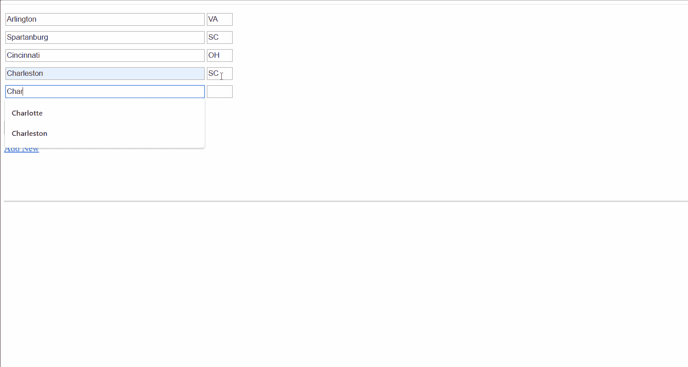
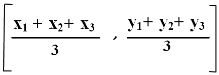

# 为我们和 Django 和 Python 的下一个假期寻找中间地带

> 原文：<https://medium.com/analytics-vidhya/finding-the-middle-ground-for-our-next-vacation-with-django-and-python-36158b469471?source=collection_archive---------15----------------------->

## 将朋友的想法付诸实践:


今天早上开始像世界上任何其他的新冠肺炎隔离。我刚刚遛完我的狗托比，开始喝我的咖啡，我运行我的早晨查询来刷新我每天为工作做的报告。在我的标准晨会后，我看着窗外，回想起简单的外出似乎并不危险的时候。就在那时，我接到了我朋友博伊德的电话，要求办理标准入住手续。你知道，大学毕业后，我所有的朋友都搬到了全国各地。我在南卡罗来纳州的斯帕坦堡有一个，在俄亥俄州的辛辛那提有一个，在南卡罗来纳州的查尔斯顿有两个，其他的分布在纽约、旧金山、波士顿。我问博伊德“当科罗娜完成它的使命时，你有什么计划？”“我们应该聚在一起，”他说。但是在哪里？去查尔斯顿旅行似乎很简单，因为博伊德和另一个大学室友住在那里，但对除了他们以外的所有人来说，那是一次很远的旅行。"为什么我们不在每个人的中间弄个小木屋什么的，这样才公平"博伊德告诉我。多好的主意啊。让我们找到我们所有人之间的中间地带，在那里找一个 Airbnb

我们简单讨论了如何用数学方法确定不同点之间的质心。下班后，我告诉 Boyd——我将尝试用 Python 来做这件事，让事情变得简单。因此产生了我的家酿黑客马拉松…下班后几个小时，我已经建立了一个功能性的 web 应用程序，看起来像这样:



这是我的网站的演示，名为(暂定)FindMid！

我利用了许多开源库和非常有用的 googlemaps api 来实现上述结果。让所有的部分一起工作是一个有趣的挑战，但最终我对结果非常满意。是的，在你批评我糟糕的 UX 之前，让我说，我不是 UX 设计师。我是一名数据科学家和狂热的 python 程序员，有一点 Django 的经验。如果我有我自己的方式，我会把这个传给有更好的 HTML，CSS 和 JS 技能的人。

让我们从库开始:

```
from uszipcode import SearchEngine
import wikipedia
import gmplotimport numpy as np
import matplotlib.pyplot as plt
import datetime
import os
```

**美国邮政编码**:【https://github.com/seanpianka/zipcodes 

*“zipcodes 是 Python 3 和 Python 2.7 的一个包，支持查找和过滤美国的 zip code 数据。”*

我使用 **uszipcode** 下拉我的各个分散点的经度/纬度。通过传递城市和州名，我可以获取搜索引擎生成的邮政编码，并下拉相应的经度和纬度数据。

**维基百科**:[https://github.com/goldsmith/Wikipedia](https://github.com/goldsmith/Wikipedia)

*“Wikipedia 是一个 Python 库，可以轻松访问和解析 Wikipedia 中的数据。*

搜索维基百科，获取文章摘要，从页面获取链接和图片等数据，等等。维基百科包装了[*MediaWiki API*](https://www.mediawiki.org/wiki/API)*这样你就可以专注于使用维基百科的数据，而不是获取它。”*

我对维基百科 api 的利用可能不会立即被认出，但我用它来抓取每个中点城镇的快速摘要。当生成一个城镇时，我将城市/州数据传递给维基百科搜索，为网站生成一个一句话的摘要。

**GM plot:**[https://github.com/vgm64/gmplot](https://github.com/vgm64/gmplot)

*“在谷歌地图上绘制数据，简单易行。一个类似 matplotlib 的界面来生成 HTML 和 javascript，以便在 Google Maps 上呈现您想要的所有数据。有几种绘图方法可以轻松创建探索性地图视图。这里有一个速成班:“*

Gmplot 完成了大部分繁重的工作，根据我在 matplotlib 中的经验，它简化了创建和绘制各种线和点的工作。

我通过为我的中心点建立逻辑来开始我的开发过程。我用了一个简单的质心公式。



为了节省时间，我选择了一些简单的东西，这似乎能完成任务。我开始为我的 lat 填充一些随机数，然后尝试到质心的平均距离，以了解结果。之后，我把它插入到我的 django webapp 的后端(我不会涉及启动 django webapp 的基础知识，但我很乐意指出一些好的资源)

```
points =[]
search = SearchEngine()
cities = request.POST.getlist('feedurl[]')
states = request.POST.getlist('feedurl[1]')

for i in range(len(cities)):
   result = search.by_city_and_state(cities[i],states[i])
   points.append([result[0].lat,result[0].lng])final_x = sum([x[0] for x in points])/ len(points)
final_y = sum([y[1] for y in points])/ len(points)
```

通过利用该请求。我将检索两个填充的城市和州的列表，我可以使用它们通过 uszipcode SearchEngine()函数进行搜索。这个搜索的结果将包含 lat/long 和各种其他数据点，这些数据点可能会有所帮助，但我没有在这个项目中使用。列表如下所示:

```
[[lat1,long1],[lat2,long2],[lat3,long3],...]
```

有了这个列表，我可以确定我们的质心。**太好了！***但是现在呢……*

```
result = search.by_coordinates(final_x,final_y)
```

让我们再次将这些新的数据点插入 SearchEngine()函数，并找出我们的最终结果。在上面的演示中——那是北卡罗来纳州的琼斯维尔。我从没去过琼斯维尔，但我去过北卡罗来纳州，那里很美。也许我们最终会去那里？谁知道呢。现在我们有了一个城市和一个州，我可以从维基百科上获得一些信息..

```
wikipedia.summary(result[0].city+', '+result[0].state, sentences=1)
```

我们从这个 API 调用中得到的结果给出了网页中点公告下的简短广告。使用上面相同的变量，对 Airbnb url 进行了简单的调整，将日期和城市/州名更改为上面的变量，然后将其传递回 django 模板。*瞧，*问题中点的 Airbnb 数据。

完成这些后，让我们在谷歌地图上绘制我们的点。重要提示，Google 需要一个 API 密钥来正确使用 gmaps。您确实需要注册一张信用卡，但是您的 API 调用对于您的第一个 100，000 个静态地图调用是免费的。对于我的朋友来说，这是一个有趣的小项目，没有问题，但扩大到商业化这将是一个考虑因素。

```
gmap = gmplot.GoogleMapPlotter(final_x,
                               final_y, zoom =5, apikey=**yourkey**)gmap.scatter([x[0] for x in points], [y[1] for y in points], size = 10000, color = 'red', marker=False)
gmap.scatter([final_x],[final_y], size = 10000, color = 'blue', marker=False)
```

我们用两个纬度/经度点实例化了以质心为中心的地图，我发现缩放 5 适合美国地图，但这取决于您的使用情况。这也是您提供 API 密钥的地方。

随着 gmap 的实例化，我开始绘制我们的起点/终点。像以前一样，我使用列表理解来传递来自列表的纬度/经度，以生成我们的原点，然后我将我们的质心纬度/经度作为单项列表传递(散点函数需要一个 iterable)。

```
gmap.plot([x[0] for x in points], [y[1] for y in points])
gmap.draw('findmid/media/map.html')
```

现在我们画出每个起点和终点之间的线。Gmplot 在制作这些线条方面做得很好，它超级简单，你可以定制一个合适的数量。最后一步…我们创建我们的 html 文件。

所有的部分都在这里，让我们把它们放在一个前端框架上。下面是 Django 调用来填充页面的 HTML 模板。因为在我们向前端发送数据之前，所有的变量都是空的，所以我可以将它们直接标记到 HTML 中，几乎没有影响。airbnb 链接是个例外，我把它放在一个简单的 if 语句后面。

```
<style>
   .feed {padding: 5px 0}
</style>
<!-- onsubmit="return validate(this)" -->
<form method="post">
    
<table>
<tr>
    <td valign=top>
        <div id="newlink">
            <div class="feed">
               <input type="text" name="feedurl[]" size="50">
               <input type="text" name="feedurl[1]" size="2">
            </div>
            <div class="feed">
               <input type="text" name="feedurl[]" size="50">
               <input type="text" name="feedurl[1]" size="2">
            </div>
        </div>
    </td>
</tr></table>
    <p>
        <br>
        <input type="submit" name="submit1">
    </p>
<p id="addnew">
    <a href="javascript:add_feed()">Add New </a>
</p>
</form>
<h1>
{{ midpoint }}
</h1>{{ wiki }}
<br>

<a href  = "{{ airbnb }}"> See options for stays in the are</a>

<br>
<hr>
{{ map | safe}}<!-- Template. This whole data will be added directly to working form above -->
<div id="newlinktpl" style="display:none">
    <div class="feed">
     <input type="text" name="feedurl[]" value=""  size="50">
     <input type="text" name="feedurl[1]" size="2">
    </div>
</div><script type="text/javascript">
function validate(frm)
{
    var ele = frm.elements['feedurl[]'];
    if (! ele.length)
    {
        alert(ele.value);
    }
    for(var i=0; i<ele.length; i++)
    {
        alert(ele[i].value);
    }
    return true;
}
function add_feed()
{
    var div1 = document.createElement('div');
    // Get template data
    div1.innerHTML = document.getElementById('newlinktpl').innerHTML;
    // append to our form, so that template data
    //become part of form
    document.getElementById('newlink').appendChild(div1);
}
</script>
```

就这样，我启动了 Django 服务器，它开始工作了！

汪汪，好棒的一骑。我试图在同一天完成这一切，所以它仍然新鲜，黑客马拉松的背景似乎不公平，两天后回来。我会尽快动笔，这样我就可以开始这个项目疯狂的原型制作了。我从这个项目和其他类似的项目中获得了很多乐趣，这是一个磨练一些技能和学习新技能的好机会。我今天使用的很多工具都是我从未见过的；GMAP、维基、USZIP 对我来说都是新的图书馆。它告诉你只要有点毅力和创造力就能做什么。感谢阅读*(抱歉任何糟糕的语法)*，我将在接下来的几天里把代码上传到我的公共 github:【https://github.com/tbacas

TRB