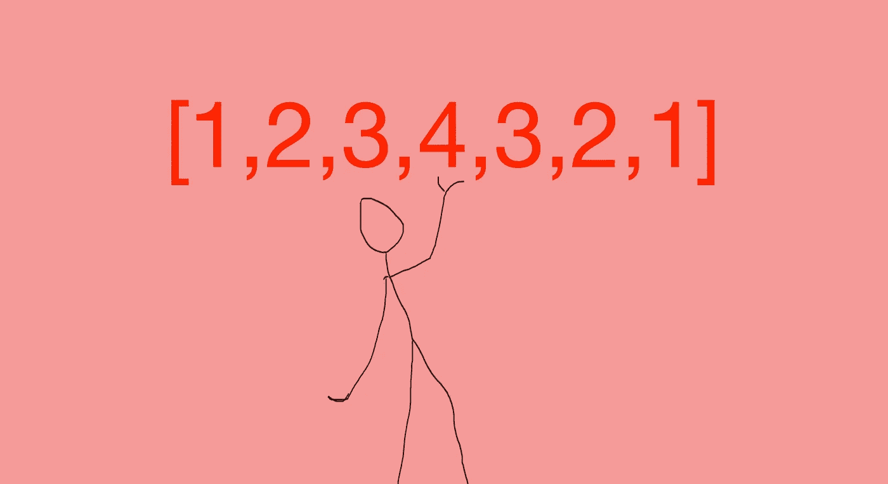
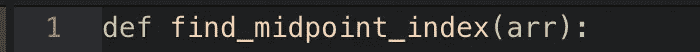
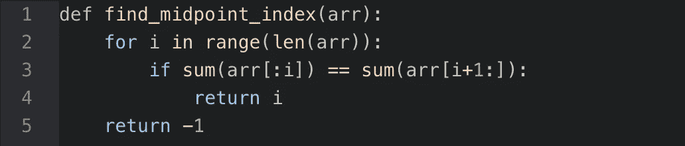
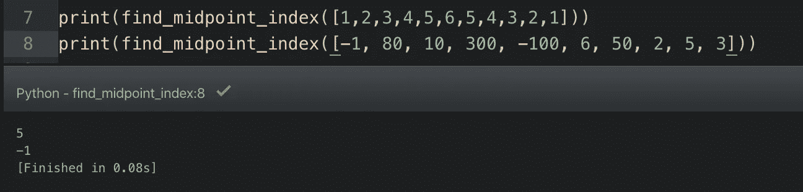

# 寻找左右两边之和相等的数组的最小索引

> 原文：<https://medium.com/analytics-vidhya/finding-the-minimum-index-of-an-array-for-which-the-sum-of-the-left-and-right-sides-are-equal-3feaa7dd7114?source=collection_archive---------21----------------------->

也称为平衡数组索引或数组的平衡索引，这对于初学者来说是一个简单而有趣的问题。我第一次看到它是在 Codewars (6 kyu)上，发现它很有趣。

# 问题是

对于还没有遇到这个问题的人来说，它是这样的:给你一个数组，让你创建一个函数，找到左边整数之和等于右边整数之和的索引。如果没有这样的数字，您的函数应该返回-1 的输出。

首先，在尝试解决问题之前，我们将分析问题。我更喜欢用简单的英语写下每一步，这样我就能知道哪些步骤有意义，哪些没有意义。

# 分析问题

假设给我们以下数组:[1，2，3，4，5，6，5，4，3，2，1]作为输入，并让我们创建一个函数，返回左侧平衡右侧的最小索引。

查看我们的数组，我们可以很容易地判断出我们的输出应该是 5，表示整数‘6’的索引(记住 Python 索引是从 0 开始的)。这很简单，但是如果我们有一个更长的数组或者一个更大的数组呢？现在我们需要一个解决方案！

首先，从我们的问题中，我们知道两件事:

1.  从数组的左侧开始，我们必须沿着数组的全长移动，检查每个数字，直到找到中点的那个数字。
2.  这将意味着获取这些数字的增量总和，并检查左侧是否等于右侧。例如，在我们的数组中，我们将取 0 和 1 的和，将其与 1 右侧数字的和进行比较，将 1 和 2 的和与 2 右侧数字的和进行比较，取 1、2 和 3 的和，将其与 3 右侧数字的和进行比较，以此类推，直到我们找到一个数字，其中它之前的数字的和与它之后的数字的和相等。

# 解决方案

从编写的步骤来看，很明显我们需要一个 for 循环来遍历整个数组。我们将在以下步骤中使用索引切片方法:

1.  定义函数。
2.  创建一个 for 循环来循环访问数组。
3.  编写一个 if 语句，比较我们分析的每个索引之前的索引位置和之后的索引位置，如果两者相等，则返回索引位置。
4.  如果数组中没有左右两边相等的索引，则在 for 循环中返回-1。
5.  测试我们的功能。首先，我们定义函数 find_midpoint_index，它接受一个参数 arr。

接下来，我们将 for 循环设置为遍历整个数组。

现在，我们需要一种方法来告诉计算机在沿着数组移动时比较左右两边的总和。

简单地说，上面的表达式仅仅意味着程序将检查每个索引位置(I)中的数字。如果当前正在检查的索引位置之前的所有数字的总和等于它之后的数字的总和，它将返回该索引作为输出。注意，我们返回的不是整数本身，而是它所占据的索引位置。

现在让我们看看整个事情。

如果 for 循环中的条件没有得到执行的机会，我们将返回-1 作为输出。

现在我们测试我们的功能。

第一个函数调用返回 5，而第二个函数调用返回-1，因为没有找到中点。