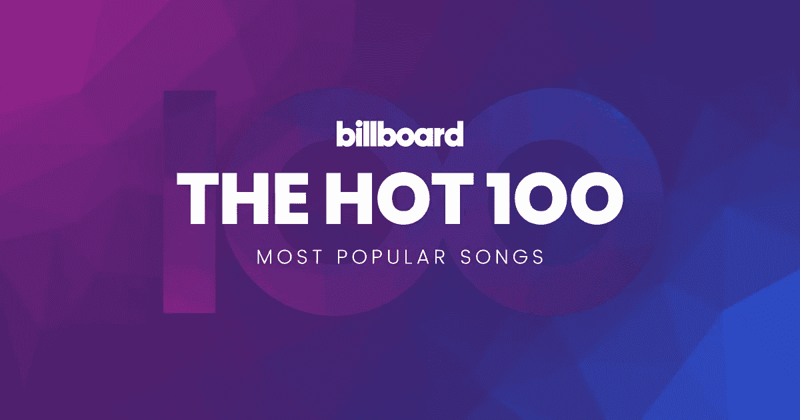
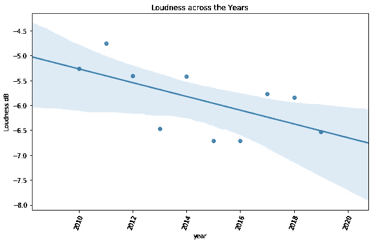

# 寻找下一个广告牌# 1——Spotify API 探索性分析

> 原文：<https://medium.com/analytics-vidhya/finding-the-next-billboard-1-spotify-api-exploratory-analysis-4fb2ba80c9fc?source=collection_archive---------5----------------------->

# 我们的目标

通过音乐发现、生成、推荐引擎等领域，分析和数据科学正以前所未有的方式改变着音乐行业。像 **Spotify** 这样的流媒体平台收集了一系列关于音乐收听的信息，并综合了关于歌曲及其属性的信息。

给定大量的信息，我们能预测下一首大歌是什么样的吗？

在第一部分中，我将收集我们需要的数据，并对这十年的音乐进行一些探索性的分析。

> 或者我们可以称之为“十年包装”

你可以在我的网站 https://sudharshan-Ashok . github . io 上找到代码

# 收集我们需要的数据

## 广告牌#1 曲目

Billboard Hot 100 是美国音乐行业标准的歌曲排行榜，由 Billboard 杂志每周发布。

用于计算广告牌顶部轨迹的因子

1.  销售(实体和数字)
2.  广播剧
3.  在线流数据

我从维基百科的 2010-2019 年排行榜第一名的歌曲列表中搜集了这些数据【https://en.wikipedia.org/wiki/Billboard_Hot_100

过去十年公告牌排名第一的曲目

## Spotify 的魔力

Spotify 是发现新音乐的领导者。该公司使用音频分析模型来提取歌曲的特征——它有多适合跳舞，它有多有活力，等等。他们使用这些功能来增强他们的产品功能，并有力地预测一个人更可能喜欢什么歌曲。

幸运的是，Spotify 在 https://developer.spotify.com/[提供他们的 API](https://developer.spotify.com/)

## API 调用

Spotipy 是一个可爱的 Python 包，可以轻松连接到 Spotify API 并访问它们丰富的信息。

> 安装点

我们将主要使用两个 Spotify API 端点

1.  搜索—接受搜索字符串并输出匹配的歌曲

2.音频特征—接收歌曲 URL 并输出音轨的音频特征

Billboard #1 曲目的音频特征

一些音频功能的描述

## 数据管理

一旦我们收集了 2010 年至 2019 年的 Billboard #1 数据，我们就将其与 Spotify API 的音频功能信息合并，并对其进行清理

*   合并 Billboard 数据和 Spotify API 数据
*   移除空值(Spotify API 搜索找不到的歌曲)
*   工程时间序列特征(年、季、月等)

# 探索性分析

我们现在拥有的数据包含了极其丰富的信息。我们可以对这些特征进行一些有趣的分析，以更好地理解什么构成了一首排名第一的歌曲。

我们首先要分析 116 首歌。我们可以看到，2010 年和 2019 年为我们提供了很多多样性，因为大量歌曲争夺第一名。

每年—1 号曲目的数量

# 艺术家合作

我们可以看到大多数公告牌#1 的歌曲都是独唱的。相当多的二重唱登上了排行榜的首位，但超过 2 个，我们看到的回报就很少了

# 排行榜第一名的顶级艺术家

我们可以看到凯蒂·佩里在 Billboard #1 上有 7 首歌曲，紧随其后的是其他艺术家(魔力红、贾斯汀比伯、布鲁诺·马斯、阿黛尔等)，有 4 首歌曲。

# 凯蒂·佩里——真的是十年女王吗？

我们可以看到，凯蒂·佩里在 2010 年至 2013 年的短时间内有 7 首歌曲，但在这十年的剩余时间里没有排名第一。更像是 2010-2013 年的女王。

你可以宣称凯蒂·佩里在排名第一的歌曲方面没有保持相关性

# 艺术家——保持相关性

让我们试着找出一个艺术家在什么时间线上发布了第一名的歌曲，以及第一名的点击数。

> timeline=df.groupby('艺术家')['年份']。max() — df.groupby('艺术家')['年份']。最小值()

我们可以在这里看到凯蒂·佩里的热门歌曲数量最多，但仅在公告牌排行榜上超过三年。

Lady Gaga 在这里名列榜首，8 年间有两首公告牌冠军歌曲。但是**魔力红**和**布鲁诺·马斯**在 7 年内拥有明显更多的热门歌曲(各 4 首)。我们可以宣称布鲁诺·马斯和魔力红在演唱排行榜首歌曲方面非常可靠

自然，像波斯特·马龙和卡米拉·卡韦略这样的新艺人在排行榜上停留的时间要少一些。但是在很短的时间内，他们已经获得了 3 首顶级曲目，这意味着他们正在上升

# 歌曲和总统选举

> V **alence** 在 0 到 1 的范围内衡量歌曲的快乐程度。

当分析时间序列时，总统选举周期总是产生有趣的结果。在这里我们可以看到，2016 年总统大选，随着急剧下降，人们听到了比以往更多的悲伤音乐。我将把结果的解释留给你。

# 人们在冬天会听更多快乐的歌曲

数据似乎表明，人们喜欢在冬天听更多快乐的歌曲。这似乎有悖直觉，但从心理学的角度来看，人们在冬天更容易悲伤。

人们在冬天听快乐的歌曲更多

音乐通常可以起到解药的作用——在糟糕的日子里，一首快乐的歌真的可以提升情绪。我一直在循环播放加尔文·哈里斯的《感觉》,给自己打气，避免明尼苏达州冬天的危险。

**更直观地说，人们喜欢在夏天听更多“适合跳舞”的歌曲**

# 跟踪响度

音量较低的音乐已经成为一种强烈的回归趋势，在过去的十年里音量下降了-1.5 分贝。在过去的几十年里，艺术家们在音量级别上相互竞争，以便在广播频道上更受欢迎，这通常被称为音量战争。被控制得很响的歌曲，通常没有很好的力度，不适合在好的音频设备上欣赏。

此外，歌曲现在可以在 YouTube、Apple Music 和 Spotify 上播放——它们都设置了音量阈值来优化音频质量。(此处阅读更多内容【https://productionadvice.co.uk/youtube-loudness/ T2)

由于去激励和消费者对音频质量日益增长的偏好，音轨变得不那么响亮了。

# 能量下降

> Spotify 将能量定义为一首歌有多亮多快——有很多高频的歌——想想刺耳的合成器声，或者简单地说是歌手的嘶嘶声(呀！)—在能量谱上烧得相当高。

我们可以看到，在过去的十年中，能源一直在稳步下降，降幅超过 25%，对于音乐制作人来说，这已经不再是一个问题。与此同时，我们可以看到，在过去的十年里，原声音乐有了 100%的提升。人们现在肯定喜欢更温和的音乐

# 可跳舞的歌不应该是充满活力的吗？

尽管活力在下降，但可跳舞性在过去十年中呈显著上升趋势。人们喜欢随着不太有活力的音乐跳舞？我们如何调和这些差异

让我们看看这两个极端的轨迹-

2010-11:凯蒂·佩里的《少年之梦》和蕾哈娜的《粗鲁男孩》统治了排行榜。这些都是高能轨道，其中**亮频率**占主导地位。

2018-19:Lil Nas X 的《老城之路》、乔纳斯兄弟的《吸盘》、哈尔西的《没有我》都是非常**温暖和黑暗的曲目**(如果你能想象音乐的话)——但它们都非常棒。

以前有一种联想，认为有活力的曲目更适合跳舞，但这十年来，在曲目有活力的基础上，流行音乐更受青睐。

## 第 2 部分即将推出

在下一部分，我们将进入问题的预测方面——下一首公告牌歌曲会是什么样子。敬请关注本博客，了解更多更新！

你可以在我的网站上找到代码[https://sudharshan-Ashok . github . io](https://sudharshan-ashok.github.io)