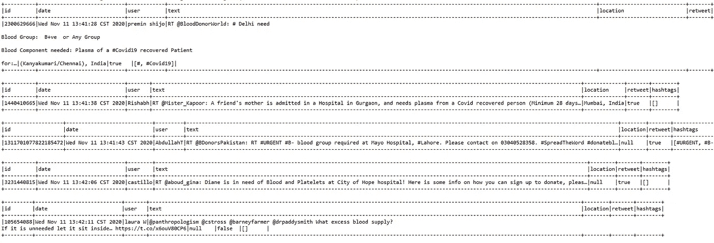
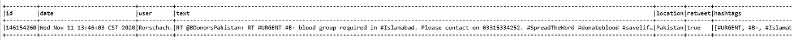

# 使用 Spark Streaming 在 Twitter 上查找紧急血液/血浆需求

> 原文：<https://medium.com/analytics-vidhya/finding-the-urgent-blood-plasma-requirements-on-twitter-using-spark-streaming-959ebb6f5590?source=collection_archive---------12----------------------->

# 简介:

在这段代码中，我使用了 spark 流来

1)确定与血液或血浆需求相关的推文

2)过滤掉推文，以便仅识别与紧急或即时血液或血浆需求相关的推文

3)提取用于这些推文的日期、用户 ID、位置和标签，并将其存储在一个表和一个 parquet 文件中

# 使用的技术:

1) Spark 版本 3.0.1

2) Scala 版本 2.12.10

3) Java 1.8.0_271

# 初始配置:

1.首先，我们将 Spark 流类的名称和一些隐式转换从 StreamingContext 导入到我们的环境中

```
**import** org.apache.spark._
**import** org.apache.spark.SparkContext._
**import** org.apache.spark.sql.functions.{col, lit, when}
**import** org.apache.spark.streaming._
**import** org.apache.spark.streaming.twitter._
**import** org.apache.spark.streaming.StreamingContext._
**import** org.apache.spark.sql.SparkSession
**import** org.apache.spark.sql.SaveMode
**import** org.apache.spark.rdd.RDD
**import** Utilities._
```

2.使用 twitter.txt 配置 Twitter 凭证

```
setupTwitter()
```

setupTwitter 的实现如下。它使用主工作区目录中的 twitter.txt 配置 Twitter 服务凭证。这里，twitter 凭证是通过调用 System.setProperty(Twitter4J 的默认 OAuth 授权)来设置的

```
**def** setupTwitter() = {
**import** scala.io.Source**for** (line <- Source.fromFile(“../twitter.txt”).getLines) {
**val** fields = line.split(“ “)
**if** (fields.length == 2) {
System.setProperty(“twitter4j.oauth.” + fields(0), fields(1))
}
}}
```

3.StreamingContext 是所有流功能的主要入口点。设置一个名为“DonateBlood”的 Spark 流上下文 ssc，它使用所有 CPU 内核和一秒钟一批的数据在本地运行。它接收流数据作为输入，并生成批量数据。

```
**val ssc = new StreamingContext(“local[*]”, “DonateBlood”, Seconds(1))**
```

4.将日志级别设置为错误，以消除火花产生的噪声日志

```
setupLogging()**def** setupLogging() = {
**import** org.apache.log4j.{Level, Logger}
**val** rootLogger = Logger.getRootLogger()
rootLogger.setLevel(Level.ERROR)}
```

5.使用 Spark 流上下文和过滤器从 Twitter 创建一个数据流。数据流是用户可以分析的连续数据流。

```
val tweets = TwitterUtils.createStream(ssc, None, filters)
```

注意:

a)我们将“None”作为 twitter4J 身份验证进行传递，因为已经通过调用 setup witter()
设置了 Twitter 凭证。b)我们已经创建了一个不可变的过滤器关键字列表，在创建 Twitter 流时作为参数进行传递

```
**val filters** = List(“blood”,”plasma”, “#blood”, “#bloodrequired”,”#BloodMatters”,”#BloodDrive”,”#DonateBlood”,”#Blood”,”#NeedBlood”)
```

# 分析推文

## 1.现在使用 map()从每条推文中提取 id、日期、用户、文本、位置、转发和标签。注意，为了提取 hashtags，我们通过使用' '(空格)分割状态文本来创建单词列表，然后只过滤以#开头的单词

```
**val** statuses = tweets.map{status =>
    **val** id = status.getUser.getId
    **val** user = status.getUser.getName
    **val** date = status.getCreatedAt.toString
    **val** text = status.getText
    **val** location = status.getUser.getLocation
    **val** retweet = status.isRetweet() **val** hashtags = status.getText.split(“ “).toList.filter(word =>   word.startsWith(“#”))
(id, date, user,text,location, retweet, hashtags)}
```

## 2.RDD 变换:

a)status . Foreachrdd((rdd，time): Foreachrdd 用于对数据流中的每个 RDD 执行任意操作，还用于将数据流保存到外部存储器，在这种情况下，是一个 parquet 文件和一个临时表。

b) SparkSession.builder():要对流数据使用 DataFrames 和 SQL 操作，我们必须使用 StreamingContext 正在使用的 SparkContext 创建 SparkSession。

c)使用 rdd.toDF()将 RDD[字符串]转换为 DataFrame，并仅过滤出包含诸如紧急、需要、紧急和必需之类的词语的文本。这是为了过滤那些急需血液或血浆的邮件。这作为一个有效的过滤器来过滤一般的献血相关消息，如“我今天献血了”、“组织献血运动”等。

d)使用 dropDuplicates()删除重复项。这将过滤掉由于转发相同状态而出现的重复。

e) rdd.count() > 0 且 bloodonatetweets . count()> 0:过滤出空批次

f)最后，我们将生成的 tweets 保存为一个临时表，以提供 SQL 互操作性，并保存为一个 parquet 文件。

```
statuses.foreachRDD((rdd, time) =>
{
**val** spark = SparkSession.builder().appName(“MyProject”).getOrCreate()**import** spark.implicits._**if** (rdd.count() > 0){ **val** requestsDataFrame =    rdd.toDF(“id”,”date”,”user”,”text”,”location”,”retweet”,”hashtags”) **val** bloodDonateTweets = requestsDataFrame.filter(col(“text”).contains(“urgent”) || col(“text”).contains(“need”) || col(“text”).contains(“emergency”) || col(“text”).contains(“required”)).dropDuplicates(“text”) **if** (bloodDonateTweets.count() > 0){       bloodDonateTweets.createOrReplaceTempView(“BloodDonationTable”)
    **val** solution = spark.sqlContext.sql(“select * from BloodDonationTable order by date”)
    solution.show(**false**)
    solution.coalesce(1).write.mode(SaveMode.Append).parquet(path)}}})
```

## 3.全部踢开！

a)SSC . check point(" C:/check point/")—我们通过在容错、可靠的文件系统(例如，HDFS、S3 等)中设置目录来启用检查点。)来保存检查点信息。

b) ssc.start() —直到此时，代码的实际执行才开始。在 start()之后，JobScheduler 启动，这又会启动 JobGenerator 来创建作业。

c) ssc.awaitTermination()-它只是等待来自用户的终止信号。当它接收到来自用户的信号(即 CTRL+C 或 SIGTERM)时，它的流上下文将被停止。

```
ssc.checkpoint(“C:/checkpoint/”)
ssc.start()
ssc.awaitTermination()
```

# 输出:

我在 Scala eclipse IDE 中运行了这段代码。几分钟后，我终止了进程，这是结果。

如下所示，显示了 ID、日期、用户、文本、位置、转发和推文中的标签。



“solution.show( **false** )的输出



# 结论:

我的完整代码可以在这里找到:[https://github . com/annapooranik/tweetlanasisforblooddonation](https://github.com/annapooranik/TweetAnalysisForBloodDonation)

尽管这个例子非常简单，但我们可以在这些结果的基础上构建一些有趣的仪表板来解决现实生活中的问题，从而确定:

1.如果紧急血型要求和地点之间有模式。该信息将有助于在特定位置安排献血者或血库。

2.在这种场景中，什么标签是常用的，哪些标签提供了最大的可见性和可及性(使用 isRetweet())