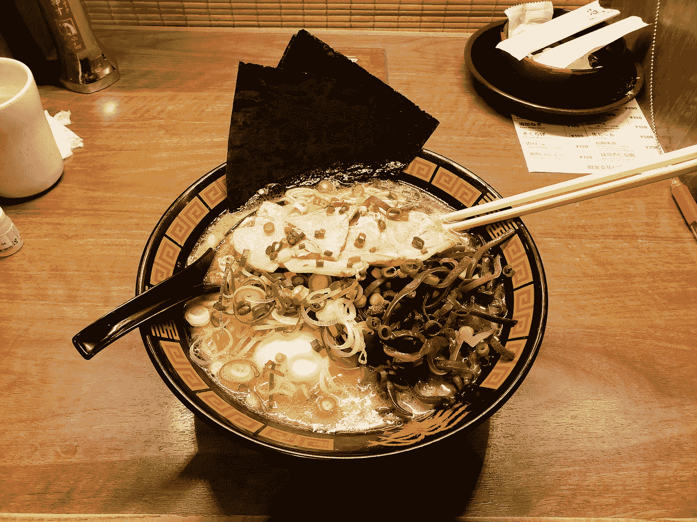

# 用数据寻找世界上最好的拉面

> 原文：<https://medium.com/analytics-vidhya/finding-the-worlds-best-ramen-with-data-1d1bdddc3285?source=collection_archive---------29----------------------->

## 🍜 + 💻 * 🗾 = 😋

[水晶乔](https://unsplash.com/@crystalsjo?utm_source=medium&utm_medium=referral)在 [Unsplash](https://unsplash.com?utm_source=medium&utm_medium=referral) 上拍照

拉面不仅仅是食物。这是一种文化产物，一种生活方式，也是富有同情心的团结的象征。好吧——也许没那么严重，但我在 Kaggle 上偶然发现了[这个](https://www.kaggle.com/residentmario/ramen-ratings)拉面评分数据集，我想找到世界上最好的拉面，使用 [Apteo](http://apteo.co) 等工具分析各种特征。

# 数据