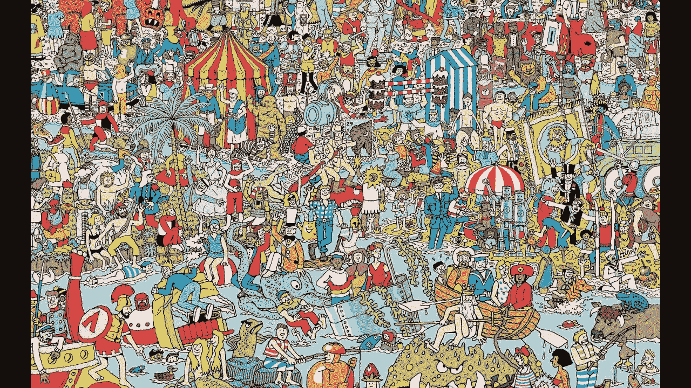
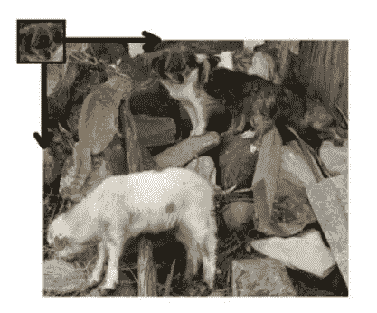
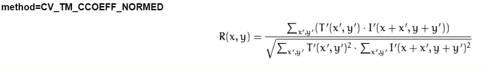
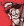
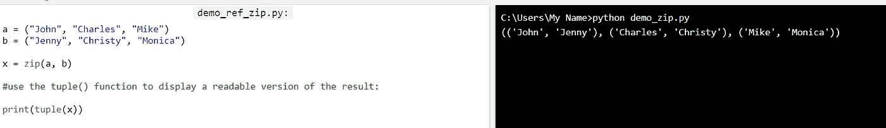

# 寻找 Waldo——Python 中 OpenCV 的特征匹配

> 原文：<https://medium.com/analytics-vidhya/finding-waldo-feature-matching-for-opencv-9bded7f5ab10?source=collection_archive---------0----------------------->

# 1.介绍

在本文中，我们将进行简单的特征匹配，以便在开始通过视频分析进行对象检测之前进行预热。我们将首先用静态图像做一些检测。



《沃利在哪里》是一部很受欢迎的英国系列益智书，引起了儿童和成人的兴趣。找到 Waldo 从来都不容易，OpenCV 有一种方法可以让我们快速找到 Waldo:)

# 2.用于模板匹配的概念

OpenCV 有一个函数， **cv2。MatchTemplate()** 支持模板匹配来识别目标图像。

模板匹配是在源图像(输入)上滑动目标图像(模板)的思想。将模板与输入进行比较。匹配由输入中邻域像素与模板的匹配程度决定。



来源:[https://docs . opencv . org/2.4/doc/tutorials/img proc/histograms/template _ matching/template _ matching . html](https://docs.opencv.org/2.4/doc/tutorials/imgproc/histograms/template_matching/template_matching.html)

关于如何确定相似性的计算，有各种方法。对于这个例子，我们将使用 **TM。CCOEFF_NORMED**



模板补丁在具有该矩阵的输入上滑动，并且它确定将指示是否有匹配的分数。 **TM_CCOEFF_NORMED 找到模板的平均值，并将其与输入**的平均值进行匹配。1 分是完美匹配，-1 分是糟糕匹配，0 分是中性。

# 3.寻找沃尔多

下面是我们将使用的图像，这将形成我们的输入！


这肯定是一团糟

现在，我们需要一个模板图像，当然是瓦尔多本人的照片。



这个人自己

```
import cv2
import numpy as np
```

OpenCV 需要的两个神圣库

```
img_rgb = cv2.imread('find_waldo.jpg')
img_gray = cv2.cvtColor(img_rgb, cv2.COLOR_BGR2GRAY)
template = cv2.imread('waldo.png',0)
#saves the width and height of the template into 'w' and 'h'
w, h = template.shape[::-1]
```

*cv2.imread* 读取图像，而 *cv2.cvtColor* 将彩色图像转换为灰度。这就是我们通常如何在 OpenCV 中执行任何类型的操作，因为我们降低了图像的维度和复杂性。

```
res = cv2.matchTemplate(img_gray,template,cv2.TM_CCOEFF_NORMED)
threshold = 0.6
# finding the values where it exceeds the threshold
```

*cv2.matchTemplate()* 是我们放入输入的函数，模板和我们使用的方法(上面解释过)。**阈值是我们用来确定匹配的值，通常选择值 0.8**。我选择 0.6 是因为 find_waldo 图像中的大多数人看起来是多么的聚集和相似。

```
loc = np.where( res >= threshold)
for pt in zip(*loc[::-1]):
    #draw rectangle on places where it exceeds threshold
    cv2.rectangle(img_rgb, pt, (pt[0] + w, pt[1] + h), (0,255,0), 2)cv2.imwrite('found_waldo.png',img_rgb)
```

对于不熟悉的人来说， *zip()* 是 python 中的一个函数，将 2 个变量合并成 1 个元组。



来源:[https://www.w3schools.com/python/showpython.asp?filename=demo_ref_zip](https://www.w3schools.com/python/showpython.asp?filename=demo_ref_zip)

因此，我们正在尝试将宽度和高度合并成一个称为“pt”的元组。因此，我们将宽度 pt[0]加上 w，高度 pt[1]加上 h。

*cv2。矩形*允许我们通过提供左下角和右上角的坐标来绘制矩形。

我们将这个结果写入一个名为 found_waldo.png 的 PNG 文件(:


我希望你能看到这张照片右上角的绿色矩形！

就这样，我们找到了瓦尔多/沃利，并通过在他周围画一个绿色的长方形来识别他！

完整代码如下，真的很短很甜。

```
import cv2
import numpy as np
from matplotlib import pyplot as pltimg_rgb = cv2.imread('find_waldo.jpg')
img_gray = cv2.cvtColor(img_rgb, cv2.COLOR_BGR2GRAY)
template = cv2.imread('waldo.png',0)
# saves the width and height of the template into 'w' and 'h'
w, h = template.shape[::-1]res = cv2.matchTemplate(img_gray,template,cv2.TM_CCOEFF_NORMED)
threshold = 0.6
# finding the values where it exceeds the threshold
loc = np.where( res >= threshold)
for pt in zip(*loc[::-1]):
    #draw rectangle on places where it exceeds threshold
    cv2.rectangle(img_rgb, pt, (pt[0] + w, pt[1] + h), (0,255,0), 2)cv2.imwrite('found_waldo.png',img_rgb)
```

# 4.附加注释

模板匹配执行起来很有趣，但也有它的缺点。

简单模板匹配无法对旋转图像、翻转图像或任何其他方向的图像进行操作。

我们必须做**多尺度**来考虑这样的影响。

虽然这很有趣，但在动态情况下(如视频)检测物体将被证明更有用。我期待着很快分享复杂的模板匹配，甚至视频中的对象检测。

与此同时，你可以先用一些你自己的图片和玩具进行简单的搭配。

你可以在我的 github 链接中获得带照片的完整代码:

【https://github.com/k-choonkiat/TemplateMatching/tree/master 

# 参考

1.  [https://docs . opencv . org/trunk/DC/dc3/tutorial _ py _ matcher . html](https://docs.opencv.org/trunk/dc/dc3/tutorial_py_matcher.html)

2.[https://pdfs . semantic scholar . org/8 ffd/b 8 a1f 629 a3 bbbd 1426206 e 09 c7d 9115 b 8 f4b . pdf](https://pdfs.semanticscholar.org/8ffd/b8a1f629a3bbbd1426206e09c7d9115b8f4b.pdf)

3.[https://docs . opencv . org/2.4/doc/tutorials/img proc/histograms/template _ matching/template _ matching . html](https://docs.opencv.org/2.4/doc/tutorials/imgproc/histograms/template_matching/template_matching.html)