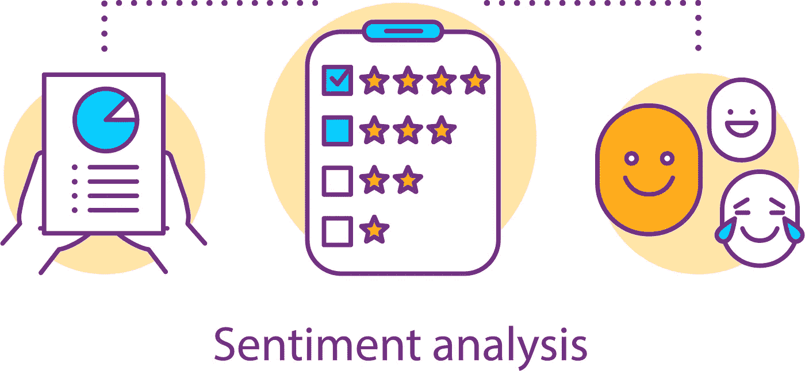
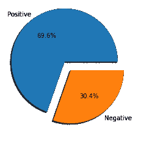
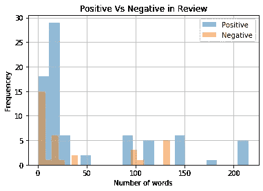
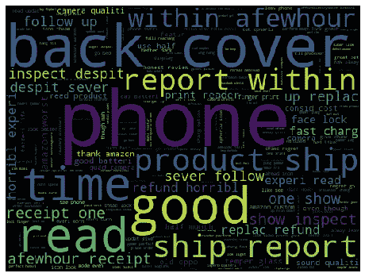
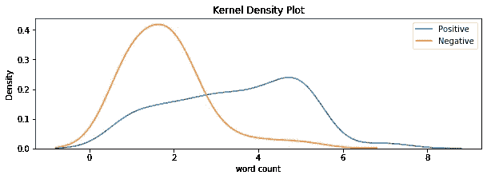

# 智能手机评论的细粒度情感分析

> 原文：<https://medium.com/analytics-vidhya/fine-grained-sentiment-analysis-of-smartphone-review-d9f502a40c36?source=collection_archive---------10----------------------->



[https://www . ntaskmanager . com/WP-content/uploads/2020/01/情操分析. png](https://www.ntaskmanager.com/wp-content/uploads/2020/01/Sentiment-Analysis.png)

**情感分析**或**意见挖掘**是利用**自然语言处理**和**机器学习对文字背后的情感进行分析。**随着一切都转移到网上，品牌和企业对顾客评论给予了最大的重视，因此情感分析在过去 10 年中一直是一个活跃的研究领域。企业正投入巨资开发一种高效的情感分类器。

**为什么要进行细粒度的情感分析？**

在探索中，我主要发现了那些使用二元分类的分类器(只是正面和负面情绪)，我自己面临的一个很好的原因是细粒度的分类器更具挑战性，并且没有太多的资源可用于此。


[https://surensinfotek . com/uploads/media/images/5f 9921672 ebad _ b4d 91 F8 c 870 f 982 a 0e 445 a 21e 7 BBC 151 . jpg](https://surensinffotek.com/uploads/media/images/5f9921672ebad_b4d91f8c870f982a0e445a21e7bbc151.jpg)

对细节的关注决定了普通和惊艳的区别。如果需要更精确的结果，可以使用细粒度分析。简而言之，你不仅可以确定谁在谈论某个产品，还可以确定他们的反馈中到底谈论了什么。例如，对于类似*“1992 年的骗局比米尔札布尔 2 好得多”的比较表达—* 细粒度情感分析可以提供比普通二元情感分类器更精确的信息。除了上述优势，像*这样的双极性评论的位置确实很糟糕…但是那里的人很棒。*“可能混淆二元情感分类器，给出不正确的预测。

我认为上面的优势会给我们足够的动力去进行细粒度的情感分析。

# 如何进行细粒度的情感分析:方法和工具

**资料收集和准备。**为了收集数据，我们使用 **python** 、 **selenium** 和 **beautifulsoup** 库，从 [www.amazon.in](https://www.amazon.in/) 中搜集了前 100 条智能手机评论。如果你不知道如何使用 python 和 beautifulsoup 和请求库进行网络抓取，这里有一个[快速教程](/@akshayakn95/web-scraping-with-beautifulsoup-8cd4e04274d5)。**Selenium**python**bindings 提供了一个简单的 API 来使用 Selenium WebDriver 编写功能/验收测试。**

**让我们现在开始编码吧！！**

```
import requests
from fake_useragent import UserAgent
import csv
import re
from selenium import webdriver
from bs4 import BeautifulSoupfrom selenium import webdriver
```

**我们从导入一些库开始。**请求**库用于向 url 发送请求并接收网页内容。 **BeautifulSoup** 用于将网页内容格式化为可读性更强的格式。selenium 用于自动抓取网页，如果没有 selenium，你必须发送标题和 cookies，我发现这个过程更加繁琐。**

****搜索产品并获取 ASIN(亚马逊标准识别号)****

**现在，我们将创建基于搜索查询的助手函数，获取所有产品的编号。这些数字将帮助我们以后创建每个产品的 URL。我们创建了两个函数 ***searching()*** 和 ***asin()*** ，这两个函数搜索网页并将所有的 **ASIN** 号存储在列表中。我们发现，当我们在 amazon.in 上搜索某个特定产品时，它的 URL 可以分成三个部分。**

***[***https://www.amazon.in/s?k=***](https://www.amazon.in/s?k=)***"+搜索查询+页码*。所以我们搜索了智能手机，直到 7 页，你可以扩展到你喜欢的任何数量的页面。*****

```
*def searching(url,query,page_no):
    """
    This is a function which searches for the page based on the url and the query
    Parameters :
    url = main site from which the data to be parsed
    query = product/word that to be searches
    returns : page if found or else error
    """
    path = url + query +"&page=" + str(page_no)
    page = requests.get(path, headers =header)
    if page.status_code == 200:
        return page.content 
    else:
        return "Error"def asin(url,query,page_no):
    """
    Get the ASIN(Amzon Standard Identification Number for the products)
    Parameters:
    url = main url from where the asin needs to be scraped
    query = product category from which the asins to be scraped
    returns : list of asins of the products
    """
    product_asin = []
    response = searching(url,query,page_no)
    soup = BeautifulSoup(response,'html.parser')
    for i in soup.find_all("div",{"class":"sg-col-20-of-24 s-result-item s-asin sg-col-0-of-12 sg-col-28-of-32 sg-col-16-of-20 sg-col sg-col-32-of-36 sg-col-12-of-16 sg-col-24-of-28"}):
        product_asin.append(i['data-asin'])
    return product_asin*
```

*****获取产品详情*****

***现在，下一步是为每个产品创建一个 url，并转到该 url，抓取该页面所需的所有必要细节。为此，我们使用 selenium 来自动化提取细节的过程。对于 amazon.in，每个产品的 url 可以细分为***

******“***[](https://www.amazon.in/dp/)****”+asin*******

****然后，我们创建了一个函数来访问使用 asin 编号创建的每个 URL，并获取每个产品的*评论、评级和名称*。然后，我们使用 python 中的 **csv** 模块将这些值存储为 csv 文件。****

******预处理和探索性数据分析。******

****使用**熊猫**库和一些 ***EDA*** 加载保存的 csv 文件，如评级分布、评论中的字数以及哪些词在正面评论和负面评论中更占优势，然后完成 ***预处理*** ，如清理评论和标题等。****

********

****数据集中正负分数的分布。****

********

****上图显示了正面和负面评论的字数分布。我们可以看到，正面评论中的字数的*频率大于负面评论，而且负面评论的字数*通常比正面评论的字数*短。*****

******

***正面评价***

***我们可能因为数据集较小而无法了解太多，但我们可以注意到，可能是正面的单词*【good】是正面评论中的主导词之一。****

********

****负面评论****

****在上面的词云中“*不要，买，电话*”是这里的主导词。****

********

****字数****

****对于负字数，正态分布图清晰可见，但是对于正评论，没有清晰的模式。****

******用于细粒度情感分析的文本块:******

******TextBlob** 是一个用于自然语言处理(NLP)的 python 库。TextBlob 积极使用自然语言工具包(NLTK)来完成其任务。NLTK 是一个库，它提供了对大量词汇资源的简单访问，并允许用户进行分类、归类和许多其他任务。TextBlob 是一个简单的库，支持对文本数据的复杂分析和操作。****

****我们将创建一个返回情感极性得分的函数，然后使用该函数从*1–5 预测情感得分。*****

```
**from textblob import TextBlob
def textblob_score(sentence):
    return TextBlob(sentence).sentiment.polarity**
```

****将每次检查传递给上述函数，并存储返回的分数，并将其保存到 dataframe 中。****

****您可以查看我的 GitHub 以获得完整的代码和数据。****

****[](https://github.com/akshayakn13/Fine-Grained-Sentiment-Analysis) [## akshayakn 13/细粒度情感分析

### 这个项目包括:数据挖掘使用硒，美丽的汤，并要求图书馆数据探索使用…

github.com](https://github.com/akshayakn13/Fine-Grained-Sentiment-Analysis) 

请随时在任何平台上与我联系。

也可以看看我的其他文章

[](/analytics-vidhya/k-nearest-neighbor-k-nn-f4418a55b74f) [## k-最近邻

### K-最近邻(K-NN)算法是一种简单、易于实现的有监督机器学习算法。那个“K”…

medium.com](/analytics-vidhya/k-nearest-neighbor-k-nn-f4418a55b74f) [](/analytics-vidhya/support-vector-machines-805a24507f) [## 支持向量机

### 这是一篇两部分的文章，第一部分我将讨论硬边际支持向量机，下一部分我将…

medium.com](/analytics-vidhya/support-vector-machines-805a24507f) 

[https://medium . com/analytics-vid hya/logistic-regression-46 A0 F3 CD ecef](/analytics-vidhya/logistic-regression-46a0f3cdecef)****