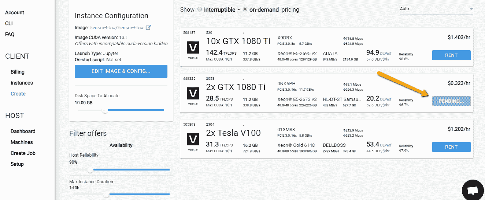
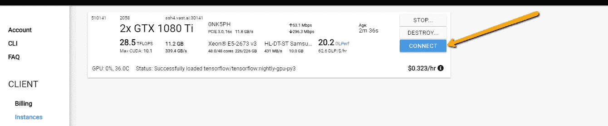
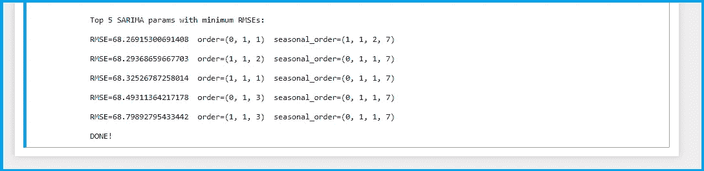
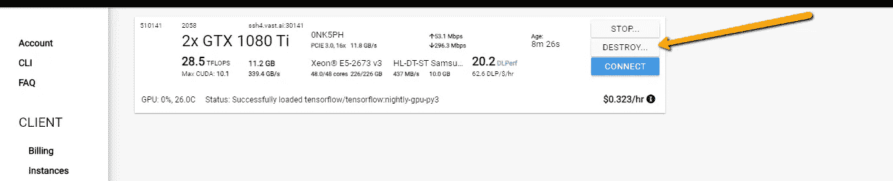

# 使用 joblib 并行处理微调 SARIMA 超参数(逐步 Python 代码)

> 原文：<https://medium.com/analytics-vidhya/fine-tune-sarima-hyperparams-using-parallel-processing-with-joblib-step-by-step-python-code-2037fec1659?source=collection_archive---------8----------------------->

> 在使用大多数机器学习或统计模型时，有时您需要微调算法的各种参数，以获得更准确的结果。有这么多组合需要测试，这是一个耗时的过程。使用并行处理和多线程大大减少了这一时间。这里有一个关于如何在 python 中做到这一点的逐步指南。

# 让我们先了解一下基本情况:

让我们看一段简单的代码，其中有一个`for` 循环:

```
import numpy as npdef square_a_number(a):
    return (a*a)for i in np.arange(1,11):
    print(square_a_number(i))
```

该代码简单地打印从 1 到 10 的每个数字的平方。然而，这是按顺序计算的。所以。输出将是:

```
1
4
9
16
25
36
49
64
81
100
```

我现在希望每个循环都由一个线程单独处理，这样所有 10 个值都可以同时计算。为此，我需要一个多核 GPU，每个内核处理一个线程/进程。因为我没有带，所以我在网上租的。我在谷歌上搜索了最便宜的服务，得到了一个名为 *vast.ai 的服务。*

# 租用多核 GPU:

我去 [vast.ai](https://vast.ai/console) 租了一个 48 核的机器。



当实例就绪时，连接到计算机。



一个 Jupyter 笔记本将会推出，在那里你可以写你的代码。

好了，现在来看看上面循环的并行代码:

```
!pip install joblib
```

joblib 库允许 python 中的并行处理。

```
from multiprocessing import cpu_count
from joblib import Parallel
from joblib import delayedexecutor = Parallel(n_jobs=cpu_count(), backend='multiprocessing') 
tasks = (delayed(square_a_number)(i) for i in np.arange(1,11))
result = executor(tasks)
result
```

输出:

```
[1, 4, 9, 16, 25, 36, 49, 64, 81, 100]
```

1.  我们首先创建一个有`*n_jobs*` 线程的`*executor*` 。在这个特殊的例子中，我们将它设置为`*cpu_count()*`，对于这个 GPU 来说是 48——这是它拥有的内核数。
2.  然后，使用`*delayed*`关键字，我们调用我们的函数。与传统的 for 循环语法不同，我们将它写在如上所示的同一行中。
3.  `*executor*` 运行任务并返回一个列表。

> 请注意，现在输出不是像以前那样打印，而是一个列表。

基本的就这些了。现在让我们继续 SARIMA 超参数调谐。

# SARIMA 调谐:

我们想尝试(P，D，Q)和(P，D，Q，m)的多种组合。如果你想阅读 ARIMA、萨里玛或其他时间序列预测模型，你可以在这里[阅读。](https://otexts.com/fpp2/seasonal-arima.html#)

我们需要多个嵌套循环，比如:

```
for p in p_vals:
  for d in d_vals:
    for q in q_vals:
      for P in P_vals:
        for D in D_vals:
          for Q in Q_vals:
            call_sarima_model_evaluation_function(p,d,q,P,D,Q)
```

这正是我们在将其转换为并行模式后所做的。主要的两个函数如下所示:

如您所见，我们已经使用 `delayed`关键字调用了`evaluate_sarima_model`。

我们称之为:

```
*# specify the range of values we want ot try for the different hyperprameters*
p_values = np.arange(0, 2)
d_values = np.arange(1, 2)
q_values = np.arange(1, 4)
P_values = np.arange(0, 2)
D_values = np.arange(1, 2)
Q_values = np.arange(0, 3)
m_values = np.arange(7, 8)

*# total combinations being tried: 2*1*3*2*1*3*1 = 36*

scor=evaluate_models_parallely(train, valid, p_values, d_values, q_values, P_values, D_values, Q_values, m_values)

scores=[]
**for** tup_list **in** scor:
    **for** tup **in** tup_list:
        scores.append(tup)

*# sort the results on basis of RMSE scores (ascending)*
scores.sort(key=**lambda** x: x[0])

print('**\n**Top 5 SARIMA params with minimum RMSEs:**\n**')
**for** x **in** scores[:5]:
  print(f'RMSE=**{x[0]}**  order=**{x[1]}**  seasonal_order=**{x[2]}\n**')

print("DONE!")
```

> 这里是完整代码的链接，您可以自由使用和定制:
> 
> [并行网格搜索萨里玛](https://github.com/HCGrit/MachineLearning-iamJustAStudent/tree/master/Demo-Parallel_Grid_Search_SARIMAX)

# 输出:

在我的例子中，36 个模型同时被评估，输出如下所示:



# 破坏 GPU:

一旦你完成了，一定要记得销毁租用的 GPU 实例，你每一秒钟都在被收费！



如果你需要以上任何帮助，请大声告诉我，我很乐意帮忙！

再见。