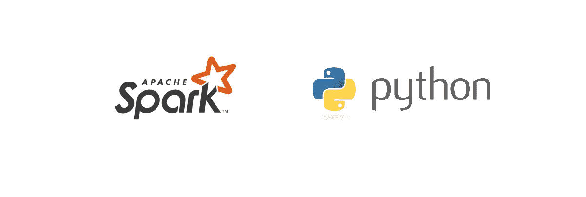
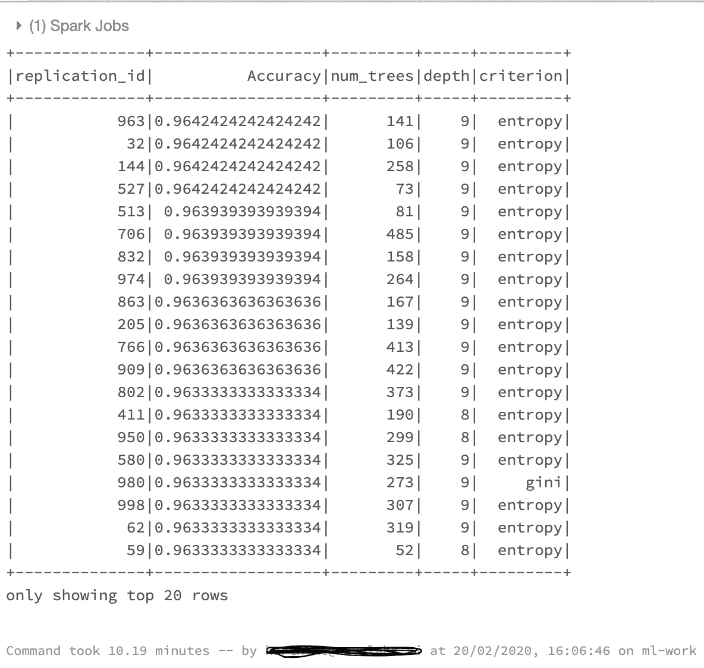

# 请使用 Pyspark 进行超参数调谐，以便尽情观看更多内容

> 原文：<https://medium.com/analytics-vidhya/fine-tuning-at-scale-for-free-2a5c40eedaa2?source=collection_archive---------2----------------------->



## 免费使用 Pyspark 在大规模机器学习模型中进行超参数调整

经过几个月的追踪和审查，您终于获得了一直等待的数据转储。您已经完成了必要的预处理步骤、一些特征工程和一些模型选择。经过一段时间的试验，你选择了你的最佳算法，执行超参数调整部分，装满你的大杯咖啡，然后你等待，等待，等待……然后像一个永无止境的故事一样等待结果。在任何典型的数据科学家/机器学习工程师的日常工作中，这都是一个非常普遍的现象。我确信这被认为是整个 ML 生命周期中最无聊和单调的任务，如果有的话。我偶然发现了一个很酷的方法，可以在很大程度上减少这种等待时间。这是纯粹的魔法。就好像看了这篇《你是巫师哈利！。不管怎样，魔法有个名字，它是…..等着吧…..**并行化**。而且要用的法术是 **Pyspark** 。

**超参数调整**无非是寻找合适的超参数集，以达到高精度和准确度。优化超参数是构建机器学习模型最棘手的部分之一。超参数调整的主要目的是找到模型参数的最佳点，以便获得更好的性能。

在典型的经典(我指的是使用 Scikit-Learn for ML(无意冒犯))机器学习管道中进行超参数调整的两种最常见的方法是

> **网格搜索**
> 
> 在网格搜索中，我们尝试超参数值的预设列表的每个组合，并评估每个组合的模型。
> 
> **随机搜索**
> 
> 随机搜索是一种技术，其中使用超参数的随机组合来为构建的模型找到最佳解决方案。

虽然在机器学习实践中不如网格搜索常见，但对于某些类型的问题，随机搜索已被证明可以在更少的函数评估内找到与网格搜索相等或更好的值。对于我的大多数项目来说，这也是我的选择。所以，我在这篇文章中解释了随机搜索的魔力。

为了那些没有集群网格可供支配的初露头角的数据科学家，我使用了 Databricks 社区版免费服务器，并在帖子中提供了一个玩具示例。[这里的](https://towardsdatascience.com/quick-start-guide-to-spark-with-databricks-d2d24a2f995d)是一个关于如何建立一个免费集群并使用它的便捷教程。谁能想到规模上的微调可以免费实现？

# 如何的想法

Spark 最擅长使用键值对。它实现并行化的方式是通过一个特定的键将所有数据发送到单个节点。键及其相关数据的子集将进入集群中的每个节点进行处理。这对我们数据科学家来说是个问题。我们需要所有节点上的所有数据，以便能够进行随机搜索和拟合模型。或者任何相关的任务。重点关注以下内容，因为这是一个至关重要的技巧。一个街头智能解决方案是多次复制所有数据，并为每个复制分配一个 replication_id。这样，我们可以按 replication_id 分组，并且可以将包含完整数据的每个复制发送到群集的每个节点。这个巧妙的小技巧使我们有可能利用 PySpark 并行化的魔力来大规模执行我们的机器学习任务。你可能会问，我们如何在 spark 集群上使用 pyspark 中的 pandas 和 sklearn 来使用标准的机器学习代码。为了让数据科学家能够利用大数据的价值，Spark 在 0.7 版本中添加了 Python API，支持[用户定义函数](https://docs.databricks.com/spark/latest/spark-sql/udf-in-python.html)。这些用户定义的函数一次操作一行，因此序列化和调用开销很大。放心吧，**熊猫 _udf** 来救援了。构建在 [Apache Arrow](https://arrow.apache.org/) 之上的 Pandas UDFs 为您带来了两全其美——完全用 Python 定义低开销、高性能 UDF 的能力。Spark 版本 2.3.1 中引入了这一功能。更多关于这个[这里](https://databricks.com/blog/2017/10/30/introducing-vectorized-udfs-for-pyspark.html)。

# 密码

以下代码可以在 Databricks community Edition free spark 集群上运行。得到它[这里](https://community.cloud.databricks.com/login.html)。

1.  导入库必需的库。

```
from sklearn import datasets
import pandas as pd
from sklearn.ensemble import RandomForestClassifier
from sklearn.metrics import accuracy_score
import  pyspark.sql.functions as F
import random
from pyspark.sql.types import *
from sklearn.model_selection import train_test_split
```

2.制作一个有 10000 条记录的玩具分类示例。

```
X,y = datasets.make_classification(n_samples=10000, n_features=4, n_informative=2, n_classes=2, random_state=1,shuffle=True)
```

3.将 X 和 y 放入一个熊猫数据框中。

```
training_data = pd.DataFrame(X)
training_data['target'] = y
```

4.将 pandas 数据框架转换为 spark 数据框架。

```
train_spark_df = spark.createDataFrame(training_data)
train_spark_df = train_spark_df.toDF(*['c0', 'c1', 'c2', 'c3', 'target'])
```

5.创建一个只有一列复制 id 的 spark 数据框。

```
replication_df = spark.createDataFrame(pd.DataFrame(list(range(1,1001)),columns=['replication_id']))
```

6.在两个数据帧之间应用交叉连接，以获得完整数据作为值、复制 id 作为键的键-值对。

```
replicated_train_df = train_spark.crossJoin(replication_df)
```

7.为 UDF 函数定义一个输出模式(这是 Pyspark 所期望的)

```
outSchema = StructType([StructField('replication_id',IntegerType(),True),StructField('Accuracy',DoubleType(),True),StructField('num_trees',IntegerType(),True),StructField('depth',IntegerType(),True),StructField('criterion',StringType(),True)])
```

8.现在来看看实际的 UDF 函数。它看起来像一个普通的 python 函数，只是在它的顶部添加了一个额外的装饰器。

```
[@F](http://twitter.com/F).pandas_udf(outSchema, F.PandasUDFType.GROUPED_MAP)
def run_model(pdf): ## this is how we are picking random set of parameters.
    num_trees =  random.choice(list(range(50,500)))
    depth = random.choice(list(range(2,10)))
    criterion = random.choice(['gini','entropy']) replication_id = pdf.replication_id.values[0] # Split X and y
    X = pdf[['c0', 'c1', 'c2', 'c3']]
    y = pdf['target'] # Test train split
    Xtrain,Xcv,ytrain,ycv = train_test_split(X, y, test_size=0.33, random_state=42) # Initilize model and fit    
    clf = RandomForestClassifier(n_estimators=num_trees, max_depth = depth, criterion =criterion)
    clf.fit(Xtrain,ytrain) # Get the accuracies 
    accuracy = accuracy_score(clf.predict(Xcv),ycv) # Return result as a pandas data frame               
res=pd.DataFrame({'replication_id':replication_id,'Accuracy':accuracy,'num_trees':num_trees,'depth':depth,'criterion':criterion}, index=[0])
    return res
```

请在这里阅读一下“**F . pandasudftype . grouped _ MAP**”如何工作[。](https://databricks.com/blog/2017/10/30/introducing-vectorized-udfs-for-pyspark.html)

9.一旦你有了 UDF，现在是时候把它应用到我们的专栏了。

```
results = replicated_train_df.groupby("replication_id").apply(run_model)
```

10.上述语句不会实际处理数据，但会保存要应用于列的指令集。当我们请求对 show()、count()等数据进行操作时，真正的处理就开始了。

```
results.sort(F.desc("Accuracy")).show()
```

输出:



该处理花费了 **10.19 分钟**。为了比较普通 python 有多好，这里有一个纯 Python 的等价物，我们试图使用 sklearn 内置的 RandomizedSearchCV 函数来实现 1000 次迭代。

```
# Load libraries
from scipy.stats import uniform
from sklearn import linear_model, datasets
from sklearn.model_selection import RandomizedSearchCV
import random
from sklearn.ensemble import RandomForestClassifier
import timeX,y = datasets.make_classification(n_samples=10000, n_features=4, n_informative=2, n_classes=2, random_state=1,shuffle=True)n_estimators =  [int(x) for x in range(50,501)]
max_depth = [int(x) for x in range(2,11)]
criterion = ['gini','entropy']hyperparameters = dict(n_estimators=n_estimators, max_depth=max_depth, criterion= criterion)clf = RandomForestClassifier()clf = RandomizedSearchCV(clf, hyperparameters, random_state=1, n_iter=1000, verbose=0, n_jobs=-1)start_time = time.time()
best_model = clf.fit(X, y)
print("--- %s seconds ---" % (time.time() - start_time))
```

输出:


你可以看到**纯 python 花了 38.3 分钟，而 pyspark 花了 10.2 分钟。**这已经是相当大的进步了。Pyspark 的处理时间会进一步减少，而 python 在处理更多数据时会花费更长时间(比如将总记录数从 1000000 增加到 10000)。

以下是所有代码的要点，供您复制粘贴之用。

愿这给你赋予 Pypark 的力量，让你在未来的机器学习中不再浪费不必要的时间。

关于疯狂观看的部分。如果您可以在超参数调优上节省时间，那么您显然可以在网飞上花费更多时间。随便说说；)

> *关于我*

我是 [Wavelabs.ai](https://wavelabs.ai/?source=post_page---------------------------) 的资深 AI 专家。我们 Wavelabs 帮助您利用人工智能(AI)来彻底改变用户体验并降低成本。我们使用人工智能独特地增强您的产品，以达到您的全部市场潜力。我们试图将尖端研究引入您的应用中。

欢迎访问 [Wavelabs.ai](https://wavelabs.ai/?source=post_page---------------------------) 了解更多信息。

嗯，这都是在这个职位。感谢阅读:)

保持好奇！

你可以在 [LinkedIn](https://www.linkedin.com/in/rehan-a-18675296?source=post_page---------------------------) 上联系我。