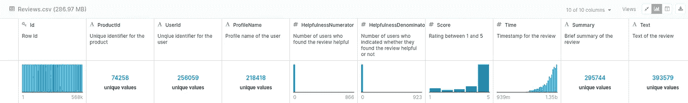
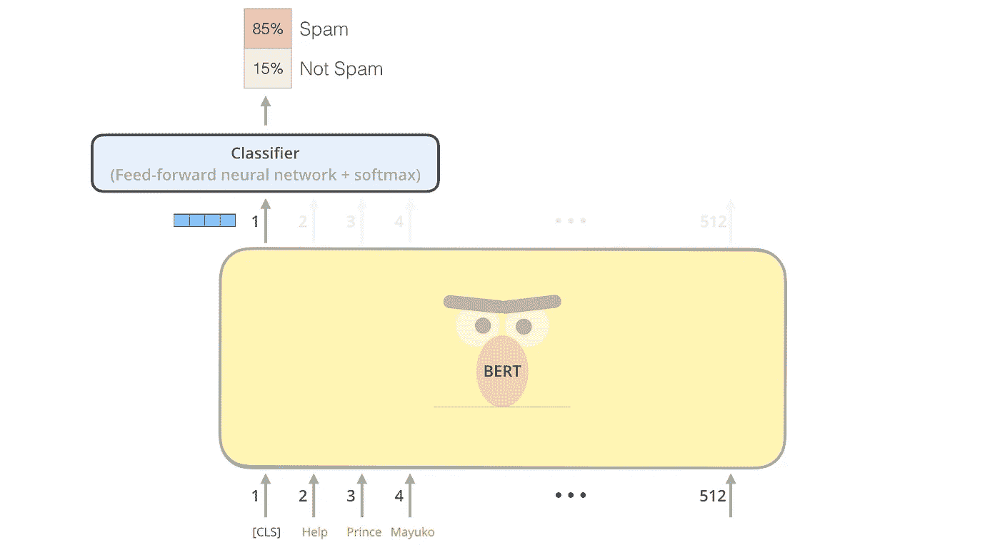

# 为亚马逊食品评论微调 BERT

> 原文：<https://medium.com/analytics-vidhya/fine-tuning-bert-for-amazon-food-reviews-32e474de0e51?source=collection_archive---------2----------------------->


如果在写这篇文章的时候你还没有听说过伯特，欢迎从长达一年的冬眠中醒来。不要费事出去补充你的冰箱了，超市的货架已经被清空了(紧张地看着新冠肺炎)。囤积者可能有足够的食物来等待一群在 CPU 上跋涉的伯特时代。

严肃地说，如果你真的想知道厄尼是否会觉得伯特受到了所有的关注而被冷落，那么就跳到由[杰伊](http://jalammar.github.io/illustrated-bert/)做的这个快速总结吧。如果没有他的精彩文章，深度学习的世界肯定会是一个黑暗而可怕的地方。

# 目标

简单地对大约 50 万条亚马逊美食评论的 BERT 基本模型进行微调，并使用它在 1-5 的范围内预测评级。本教程的代码可以在[这里](https://github.com/naveenjafer/BERT_Amazon_Reviews)找到

# 学习目标

我选择这个简单任务和数据集的决定是为了消除所有令人分心的数据解释和转换，这些往往会冲淡大多数教程中的学习目标。你将学会如何做以下事情。

1.  处理和准备您的数据，以便输入到预先训练好的 BERT 模型中
2.  为您可能拥有的领域特定数据微调 BERT 模型
3.  保存 BERT 模型，以便能够加载和重新用于其他
4.  使用 Google Colab 在 GPU 上运行您的模型

# 设置您的环境

克隆本教程附带的代码

```
git clone [https://github.com/naveenjafer/BERT_Amazon_Reviews](https://github.com/naveenjafer/BERT_Amazon_Reviews)
```

在克隆的 repo 中创建一个 python virtualenv 并激活它。

```
python3 -m venv env
source env/bin/activate
```

下载安装先决条件

1.  `pip install torch`
2.  `pip install transformers`
3.  `pip install pandas`

# 数据集调查



Reviews.csv 的 7 列。我们将只关注 2 个字段，评论的**文本**和**分数。**

你可以从 [kaggle](https://www.kaggle.com/snap/amazon-fine-food-reviews) 下载数据。我们将关注“Reviews.csv”文件。在克隆的 repo 中创建一个文件夹“AMAZON-DATASET ”,并将“Reviews.csv”放入其中。数据集是一个简单的 CSV 文件，完全独立。

# 数据集准备

我们将使用 pandas 处理我们的数据，并将其输入数据加载器。

将数据拆分为定型集和验证集

我们希望预测的目标列是“分数”。让我们看看它的分布情况。

最大长度。与任何 NLP 处理管道一样，我们必须为输入句子设置一个固定的最大长度。这个数据集中最长的句子超过了 500 个单词，为了更快地训练，我将这个 MAX_LENGTH 设置为 100。

# 定义数据加载器

dataLoader.py

这个类继承了 torch 提供的 Dataset 类。在这个练习中，我们使用了基本的预训练 BERT 模型(bert-base-uncased)。对这个模型的架构做一点总结。

```
12-layer, 768-hidden, 12-heads, 110M parameters.
Trained on lower-cased English text.
```

使用来自预训练的 BERT 模型的相同的记号赋予器是非常重要的，因为字符串到记号的转换需要与现有的模型一致。

> 您确实不希望单词“Hello”在您的模型中同时由 token 45 和 75 表示。

关注 __getitem__ 函数。该函数的目标是简单地为数据加载器提供输入令牌、掩码(我们将会谈到)和输出标签。

一个复习句子要经历以下几个转换。我们还将使用 maxlen 为 10 的“我喜欢比萨饼”的示例句子，并查看它是如何被处理的。

1.  **Tokenize** `tokens = self.tokenizer.tokenize(review)`将评论转换成单词列表。**【《我》、《爱过的》、《那个》、《披萨》】**
2.  **追加 CLS 和 SEP 令牌** `tokens = ['[CLS]'] + tokens + ['[SEP]']`。Bert 要求这个特定类“BertModel”的输入具有这种格式的输入。不同的 BERT 类对此要求略有不同，所以如果您打算实现 Bert 提供的任何其他类，请参考它们。**[“[CLS]”、“我”、“爱过的”、“那个”、“比萨饼”、“[九月]”]**
3.  **添加填充和截断**对于长度小于 maxlen 的句子，添加一个填充标记使其长度一致。对于长度超过 maxlen 的句子，我们截断句子，在末尾加上 SEP token。 **["[CLS]"，"我"，"爱过的"，"那个"，"披萨"，"[SEP]"，"[PAD]"，"[PAD]"，"[PAD]"，"[PAD]"]**
4.  **将标记转换为标记 id**字符串列表将被转换为标记器字典内部的数字。词汇之外的单词也由记号赋予器处理。
5.  **屏蔽**一个列表，在填充令牌的相应位置为 0(如果有的话),在所有其他情况下为 1。[1,1,1,1,1,1,0,0,0,0]

标签减去 1，因为在这个多类分类问题中，类从 0 开始。

# 初始化数据加载器

如果你有 4 个双核处理器，我建议将线程数设置为 6。

我们创建了两个加载器，一个用于训练集，另一个用于验证。

# 定义分类器

分类器从 torch.nn.module 继承而来，需要实现一个 forward 函数和 init。

在我们进入分类器之前，让我们试着理解我们将完成什么。预训练的 BERT 模型为我们提供了下图中黄色的整个网络。对于分类任务，在第一个输入标记[‘CLS’]的表示中编码的信息足以进行预测。我们将使用一个带有对数 softmax 的前馈密集线性图层来进行分类。图像是一个二进制分类器，我们将实现多类的情况。



来自 http://jalammar.github.io/illustrated-bert/[的](http://jalammar.github.io/illustrated-bert/)

**init 函数** -我们定义了线性层，它将长度为 768 的向量作为输入，并将其映射到长度为 5 的向量。为什么是 768？这是我们使用的 BERT 模型中隐藏单元的数量，如果您使用不同的模型，请更新它。我们还定义了在这个过程中是否需要训练预训练的 BERT 层。由于我们选择用 Amazon 数据集来微调这个模型，我们将解冻 BERT 层，以便能够下载这个微调后的模型用于未来的任务。

**正向函数**我们将输入前馈到 bert 层，以获得上下文化的表示。从这些表示中，我们选择第一个(“CLS ”)表示来填充线性层。

# 初始化分类器

我们在 main.py 中初始化分类器

```
net = classifier.SentimentClassifier(num_classes, config[“device”], freeze_bert=False)
```

# 损失函数和优化器

我们将使用的损失函数是 [NLLLoss](https://pytorch.org/docs/stable/nn.html#nllloss) 。我们还将在这个损失函数中使用一个称为权重的可选输入。我们数据集中的类是高度不平衡的。等级 5(等级 4)占所有示例的 60%以上，其他等级徘徊在 10%左右。需要这种权衡来减轻损失计算中不平衡训练集的影响。

`loss_func = nn.NLLLoss(weight=weights)`

优化器是一个 Adam 优化器。`optim.Adam(net.parameters(), lr = 2e-5)`如果您有资源，可以随意调整学习率。

# 训练循环

我们在历元上循环一次，在每个历元中，数据被分成大小为 64 的批。我们使用之前定义的损失函数来计算 logits `logits = net(seq, attn_masks)` 和计算损失`loss = loss_func(m(logits), labels)` 。损失被反向传播。

我们每 100 批计算一次训练精度，保存网络模型(下一个检查点只是更新上一个)。在一个时期结束时，我们计算验证损失和准确性。如果来自这个时期的模型比前一个表现得更好，则它被替换。

考虑到这种训练需要多长时间，明智的做法是定期保存模型，这样，在发生崩溃时，可以从最后保存的检查点重新加载模型并继续。你不会想每次都重启 GTA 5 吧。

保存微调后的模型还可以让您重用该模型来完成与不同领域的食品评论相关的任务。利用这个微调过的模型来分析 Zomato 领域的食品评论可以构成迁移学习。

> 注意:验证集非常庞大，评估验证集需要很长时间。为了适应我的用例并减少循环的运行时间，我在 config 中引入了一个“validationFraction”参数。这是“evaluate”函数实际使用的验证集的一部分。要获得准确的结果，请增加该分数。

完整的 main.py 文件

# 在 GPU 上进行培训(如果您没有物理 GPU，请跳过)

在浏览代码时，您会注意到出现了“.至(设备)”。我们确定是否支持 CUDA 设备，并将其用于 GPU 计算。BERT，Transformers 的发展基于高效的并行化和对 GPU 的高效利用。在 GPU 上运行时，不需要修改代码。

> 注意:如果在 GPU 上运行出现错误，请执行以下操作。
> 
> 1)将配置中的`forceCPU`设置为 True 并运行模型，如果它运行时没有任何错误，则在此处留下注释，我们将不得不找出 GPU 版本的问题。
> 
> 2)您的 GPU 空间可能不足。将批量大小从 64 减少到合适的 2 的倍数。

# 关于 Google Colab 的培训

在 CPU 上为如此大的数据集训练 BERT 模型可能不是最好的主意(除非你能负担得起更换一个烧坏的处理器)。按照目前的配置，一个 6 核 8 线程的 i7 处理器可能需要 72 小时才能完成训练。如果您无法访问 GPU，Google colab 会免费提供一个 GPU(不间断持续 12 小时)。

1.  前往 https://colab.research.google.com/[的头](https://colab.research.google.com/)
2.  创建新笔记本。
3.  点击文件->上传笔记本。上传回购附带的[BERT _ Amazon _ reviews . ipynb](https://github.com/naveenjafer/BERT_Amazon_Reviews/blob/master/BERT_Amazon_Reviews.ipynb)文件。
4.  打开你的 google drive，在最顶层创建一个名为`Bert`的文件夹。将 AMAZON-DATASET 文件夹上传到其中。
5.  回到 google colab，运行第二个单元主机 google drive 到 colab。您将被要求验证您的帐户，完成它。使用 google drive 的优势在于，由检查点保存的输出模型即使在 12 小时的会话结束时也会保持完整(如果您将文件直接上传到 colab，它会被清除)
6.  运行其余的细胞。
7.  最后一个细胞开始训练过程。

> 注意:如果 google colab 抱怨空间不足，那么将 config 中的批处理大小从 64 减少到 2 的倍数。分配的 12 GB GPU 内存不是专用的，并且在初始分配期间表现得相当不稳定。

# 加载经过训练的模型并在验证集上进行测试

简单运行 `python3 main.py eval`而不是`python3 main.py train`它从放置的检查点中选取最后一个模型。如果您想从每个时期结束时完成的验证中挑选最佳模型，只需将名为`AmazonReviewClassifier.dat_valTested_tensor(0.6484)`的模型替换为`AmazonReviewClassifier.dat`并运行程序。记住，我们评估的是验证集的子集，因为它太大了，可以随意改变`validationFraction`来增加或减少验证数据集的抽样部分(大约 120000 个数据项)。

# 结果

我获得了大约 92%的训练准确率。该模型还没有完成它的第一个纪元，一旦完成，将更新验证的准确性，但初步运行看起来很有希望。

# 前进

您可以尝试不同的 BERT 类。BERT 有用于任务的类，例如句子预测、分类、屏蔽词预测(这将是一个很好的例子，可以简单地对来自某个领域的未标记语料库的预训练模型进行微调，此时没有固定的目标)。

如果你在评论中有任何问题，请告诉我。

# 要讨论的要点

1.  伯特的灾难性遗忘呢？是怎么处理的？或者是？

# 参考

1.  [http://jalammar.github.io/illustrated-bert/](http://jalammar.github.io/illustrated-bert/)
2.  [https://medium . com/swlh/无痛-微调-Bert-in-py torch-b91c 14912 CAA](/swlh/painless-fine-tuning-of-bert-in-pytorch-b91c14912caa)
3.  [https://arxiv.org/abs/1905.05583](https://arxiv.org/abs/1905.05583)
4.  [https://gluon-NLP . mxnet . io/examples/sentence _ embedding/Bert . html](https://gluon-nlp.mxnet.io/examples/sentence_embedding/bert.html)