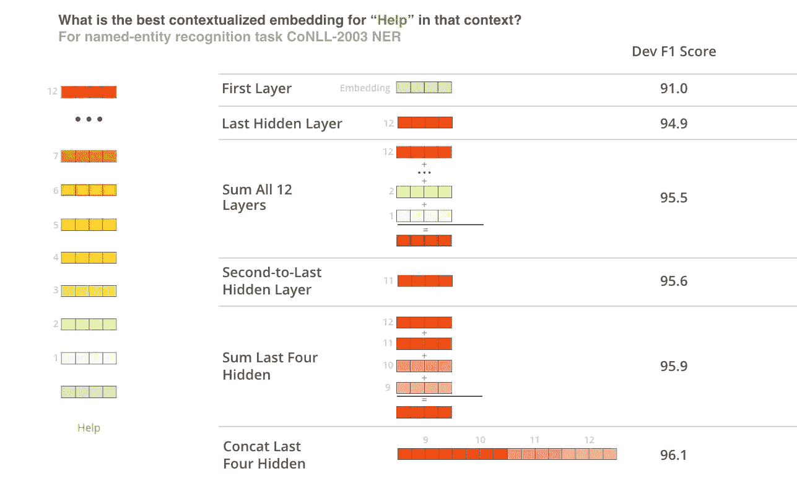

# 使用 TF 2.0 在 CoNLL 2003 数据集上为 NER 微调 BERT

> 原文：<https://medium.com/analytics-vidhya/fine-tuning-bert-for-ner-on-conll-2003-dataset-with-tf-2-2-0-2f242ca2ce06?source=collection_archive---------0----------------------->

这篇博客详细介绍了为句子的命名实体识别(NER)标记微调 BERT 预训练模型的步骤( [CoNLL-2003 数据集](https://www.clips.uantwerpen.be/conll2003/ner/))。如果你刚到 NER，我推荐你先浏览一下这个 [NER 的 Tensorflow 2.2.0](/analytics-vidhya/ner-tensorflow-2-2-0-9f10dcf5a0a) 博客。

让我们看看如何使用 BERT 预训练模型来完成 NER 任务。在这篇博客中，我不打算深入探讨 BERT 的基础知识。要了解更多关于伯特的信息，请阅读这个[博客。](http://jalammar.github.io/illustrated-bert/)

杰瑞米·霍华德和塞巴斯蒂安·鲁德在[文本分类通用语言模型微调](https://arxiv.org/abs/1801.06146)中展示了迁移学习如何应用于 NLP 任务并显著提高性能。我们使用 BERT 预训练模型，在其上添加一个神经网络层，并针对我们的 NER 任务对其进行微调。

**CoNLL 数据集:** [CoNLL-2003](https://www.clips.uantwerpen.be/conll2003/ner/) [数据集](https://www.clips.uantwerpen.be/conll2003/ner/)包括 1393 篇英语和 909 篇德语新闻文章。我们将会关注英国的数据。CoNLL-2003 数据文件包含由一个空格分隔的四列。每个单词都被放在单独的一行，每个句子后面都有一个空行。每行的第一项是单词，第二项是词性(POS)标记，第三项是语法块标记，第四项是命名实体标记。我们将在任务中使用命名实体标记。组块标签和命名实体标签具有 I-TYPE 格式，这意味着单词在 TYPE 类型的短语内。只有当两个相同类型的短语紧随其后时，第二个短语的第一个单词才会有标签 B-TYPE，以表明它开始了一个新短语。标签为 O 的单词不是短语的一部分。


**为 BERT 预处理数据**:让我们看看将我们的数据转换成 BERT 模型所期望的格式的步骤。我们再来看 train.txt 中的前两句，第一句是“欧盟拒绝德国号召抵制英国羊肉。”第二句是“彼得·布莱克本”。

```
-DOCSTART- -X- -X- O
EU NNP B-NP B-ORG
rejects VBZ B-VP O
German JJ B-NP B-MISC
call NN I-NP O
to TO B-VP O
boycott VB I-VP O
British JJ B-NP B-MISC
lamb NN I-NP O
. . O OPeter NNP B-NP B-PER
Blackburn NNP I-NP I-PER
```

NERProcessor 类中的 get_train_examples 为 BERT 做了必要的预处理。

```
train_examples = processor.get_train_examples(args.data_dir)
```

在预处理中完成以下步骤:

1.  在句首添加“CLS”标记。
2.  在句尾添加“SEP”标记。
3.  为 max_seq_length 填充序列和标签
4.  input_ids:使用 BERT 记号赋予器将记号转换成 id
5.  input_mask:指示序列中哪些元素是标记，哪些是填充元素
6.  segment_ids : 0 表示第一个序列，1 表示第二个序列。我们有一个单一的序列，因此句子中的所有标记都有 0 作为标记标识
7.  label_ids:每个标签的整数值
8.  label_mask : True 表示哪些元素是标签，False 表示填充元素
9.  valid_ids: BERT 使用单词块标记化。使用 BERT 标记化，句子(“欧盟拒绝德国呼吁抵制英国羊肉。”被标记为

```
['EU', 'rejects', 'German', 'call', 'to', 'boycott', 'British', 'la', '##mb', '.']
```

单词 lamb 被分成两个标记——“la”和“##mb”。在这种情况下，我们为第一次分割添加了标签，而第二次分割没有添加任何标签。该信息在 valid_ids 中捕获。' valid_ids '的标记' la '为 1，标记' ##mb '为 0。填充的令牌在 valid_ids 中被赋予 1。

让我们看看一个输入句子['欧盟'，'拒绝'，'德国'，'打电话'，'抵制'，'英国'，'羔羊'，'.']使用 convert_examples_to_features 方法进行转换。

对于 max_seq_length 为 16(为简单起见选择 16)的上述句子，输入 _ 标识(带有‘CLS’和‘分离’标记)、输入 _ 掩码、段 _ 标识、标签 _ 标识、标签 _ 掩码和有效 _ 标识如下所示:

```
input_ids - [101, 7270, 22961, 1528, 1840, 1106, 21423, 1418, 2495, 12913, 119, 102, 0, 0, 0, 0]input_mask - [1, 1, 1, 1, 1, 1, 1, 1, 1, 1, 1, 1, 0, 0, 0, 0]segment_ids - [0, 0, 0, 0, 0, 0, 0, 0, 0, 0, 0, 0, 0, 0, 0, 0]label_ids - [10, 6, 1, 2, 1, 1, 1, 2, 1, 1, 11, 0, 0, 0, 0, 0]label_mask - [True, True, True, True, True, True, True, True, True, True, True, False, False, False, False, False]valid_ids - [1, 1, 1, 1, 1, 1, 1, 1, 1, 0, 1, 1, 1, 1, 1, 1] # 0 for '##mb' 
```

**将特征转换为 Tensorflow 数据集** : batched_train_data 已混洗大小为:[batch_size，max_seq_length]的训练数据。

```
all_input_ids = tf.data.Dataset.from_tensor_slices(np.asarray
([f.input_ids for f in train_features]))all_input_mask = tf.data.Dataset.from_tensor_slices(np.asarray
([f.input_mask for f in train_features]))all_segment_ids = tf.data.Dataset.from_tensor_slices(np.asarray
([f.segment_ids for f in train_features]))all_valid_ids = tf.data.Dataset.from_tensor_slices(np.asarray
([f.valid_ids for f in train_features]))all_label_mask = tf.data.Dataset.from_tensor_slices(np.asarray
([f.label_mask for f in train_features]))all_label_ids = tf.data.Dataset.from_tensor_slices(np.asarray
([f.label_id for f in train_features]))# Dataset using tf.data
train_data = tf.data.Dataset.zip((all_input_ids, all_input_mask, all_segment_ids, all_valid_ids, all_label_ids,all_label_mask))shuffled_train_data = train_data.shuffle(buffer_size=int(len(train_features) * 0.1),seed = args.seed, reshuffle_each_iteration=True)batched_train_data = shuffled_train_data.batch(args.train_batch_size)
```

**模型建筑:**

我们将使用 bert-base-cased 模型，它有 12 层变换编码器和“cased”序列。


来源:http://jalammar.github.io/illustrated-bert/

在 BertNer 类的 init 方法中，我们创建了一个 BertModel 对象，使用 tf.train.Checkpoint 加载模型权重。因此，我们将从 BertModel 获取 sequence_output。实际上，我们应该选择哪一层来获得最佳表现呢？作者在他们的论文中展示了不同选择的性能。



来源:[http://jalammar.github.io/illustrated-bert/](http://jalammar.github.io/illustrated-bert/)

然而，对于我们的实验，我们将从最后一层的表现。

这些标记然后被馈送到具有 num_label 单元的密集层(除了‘CLS’和‘SEP’标记之外，数据集中存在的标记的数量),以获得每个标记的预测。BERT 使用了单词块标记器，它将一些单词分解成子单词，在这种情况下，我们只需要预测单词的第一个标记。对于子词，valid_ids 为 0，在拆分词的情况下，我们仅使用 valid_ids 来获得对词和第一个子词的预测。

```
class BertNer(tf.keras.Model):
  def __init__(self, bert_model,float_type, num_labels,   
  max_seq_length, final_layer_initializer=None):
    super(BertNer, self).__init__()
    input_word_ids = tf.keras.layers.Input(shape=(max_seq_length,),   
    dtype=tf.int32, name='input_word_ids')
    input_mask = tf.keras.layers.Input(shape=(max_seq_length,),     
    dtype=tf.int32, name='input_mask')
    input_type_ids = tf.keras.layers.Input(shape=(max_seq_length,), 
    dtype=tf.int32, name='input_type_ids')

    bert_config = BertConfig.from_json_file
      (os.path.join(bert_model, "bert_config.json"))
    bert_layer = BertModel(config=bert_config,
      float_type=float_type)
    _, sequence_output = bert_layer(input_word_ids,  
    input_mask,input_type_ids) self.bert = tf.keras.Model(inputs=[input_word_ids, input_mask,  
    input_type_ids],outputs=[sequence_output]) if type(bert_model) == str:
      init_checkpoint = os.path.join(bert_model,"bert_model.ckpt")     
      checkpoint = tf.train.Checkpoint(model=self.bert)
      checkpoint.restore(init_checkpoint).assert_
      existing_objects_matched()

    self.dropout = tf.keras.layers.Dropout(    
    rate=bert_config.hidden_dropout_prob) if final_layer_initializer is not None: 
      initializer = final_layer_initializer
    else:
      initializer = tf.keras.initializers.TruncatedNormal(   
      stddev=bert_config.initializer_range) self.classifier = tf.keras.layers.Dense(num_labels, 
    kernel_initializer=initializer, name='output', dtype=float_type)def call(self, input_word_ids,input_mask=None,input_type_ids=None,
valid_ids=None, **kwargs):
    sequence_output = self.bert([input_word_ids, input_mask,  
    input_type_ids],**kwargs)
    valid_output = []
    for i in range(sequence_output.shape[0]): 
      r = 0
      temp = []
      for j in range(sequence_output.shape[1]):
        if valid_ids[i][j] == 1:
           temp = temp + [sequence_output[i][j]]
        else:
           r += 1
      temp = temp + r * [tf.zeros_like(sequence_output[i][j])]
      valid_output = valid_output + temp
    valid_output = tf.reshape(tf.stack(valid_output)
    ,sequence_output.shape)
    sequence_output = self.dropout(valid_output,  
    training=kwargs.get('training', False)) 
    logits = self.classifier(sequence_output)
    return logits
```

## 优化器、学习率调度器和损失函数:

我们使用 AdamWeightDecay 优化器，具有多项式衰减学习率调度。我们使用稀疏分类交叉熵损失。

## 自定义训练循环:

输入令牌、掩码和标签被传递给模型。使用优化器计算损耗和梯度并更新参数。

```
def train_step(input_ids, input_mask, segment_ids, valid_ids, label_ids,label_mask):
  with tf.GradientTape() as tape:
    logits = ner(input_ids, input_mask,segment_ids, valid_ids, 
    training=True) #batchsize, max_seq_length, num_labels
    label_ids_masked = tf.boolean_mask(label_ids,label_mask)        
    logits_masked = tf.boolean_mask(logits,label_mask)
    loss = loss_fct(label_ids_masked, logits_masked)
  grads = tape.gradient(loss, ner.trainable_variables)
  optimizer.apply_gradients(list(zip(grads,       
  ner.trainable_variables)))
  return lossfor epoch in epoch_bar:
    for (input_ids, input_mask, segment_ids, valid_ids, 
    label_ids,label_mask) in progress_bar(batched_train_data, 
    total=pb_max_len, parent=epoch_bar):
      loss = train_step(input_ids, input_mask, segment_ids,
      valid_ids, label_ids,label_mask)
      loss_metric(loss)
      epoch_bar.child.comment = f'loss : {loss_metric.result()}'
    loss_metric.reset_states()
```

## 对有效数据集的评估:

加载模型，将数据预处理成所需的格式。对有效数据集进行预测。我们使用精确度、召回率和 f1 分数来评估模型的性能。我们使用 seqeval 包。seqeval 是一个用于序列标记评估的 Python 框架。seqeval 可以评估命名实体识别、词性标注、语义角色标注等组块任务的性能。classification_report metric 构建显示主要分类指标的文本报告。

```
if args.do_eval:
  # load tokenizer
  tokenizer = FullTokenizer(os.path.join(args.output_dir, 
  "vocab.txt"), args.do_lower_case)
  # model build hack : fix
  config = json.load(open(os.path.join(args.output_dir,
  "bert_config.json")))
  ner = BertNer(config, tf.float32, num_labels, 
  args.max_seq_length)
  ids = tf.ones((1,128),dtype=tf.int64)
  _ = ner(ids,ids,ids,ids, training=False)
  ner.load_weights(os.path.join(args.output_dir,"model.h5")) # load test or development set based on argsK
  if args.eval_on == "dev":
    eval_examples = processor.get_dev_examples(args.data_dir)
  elif args.eval_on == "test":
    eval_examples = processor.get_test_examples(args.data_dir) eval_features = convert_examples_to_features(
  eval_examples, label_list, args.max_seq_length, tokenizer)
  all_input_ids = tf.data.Dataset.from_tensor_slices(
  np.asarray([f.input_ids for f in eval_features]))  
  all_input_mask = tf.data.Dataset.from_tensor_slices(
  np.asarray([f.input_mask for f in eval_features]))
  all_segment_ids = tf.data.Dataset.from_tensor_slices(
  np.asarray([f.segment_ids for f in eval_features]))
  all_valid_ids = tf.data.Dataset.from_tensor_slices(
  np.asarray([f.valid_ids for f in eval_features]))
  all_label_ids = tf.data.Dataset.from_tensor_slices(
  np.asarray([f.label_id for f in eval_features])) eval_data = tf.data.Dataset.zip((all_input_ids, all_input_mask,        
  all_segment_ids, all_valid_ids, all_label_ids))
  batched_eval_data = eval_data.batch(args.eval_batch_size)

  loss_metric = tf.keras.metrics.Mean()
  epoch_bar = master_bar(range(1))
  pb_max_len = math.ceil(
  float(len(eval_features))/float(args.eval_batch_size)) y_true = []
  y_pred = []
  label_map = {i : label for i, label in enumerate(label_list,1)}
  for epoch in epoch_bar:
    for (input_ids, input_mask, segment_ids, valid_ids, label_ids)
    in progress_bar(batched_eval_data, total=pb_max_len,
    parent=epoch_bar):
      logits = ner(input_ids, input_mask, segment_ids, valid_ids,     
      training=False)
      logits = tf.argmax(logits,axis=2)
      for i, label in enumerate(label_ids):
        temp_1 = []
        temp_2 = []
        for j,m in enumerate(label):
          if j == 0:
            continue
          elif label_ids[i][j].numpy() == len(label_map):     
            y_true.append(temp_1)
            y_pred.append(temp_2)
            break
          else:
            temp_1.append(label_map[label_ids[i][j].numpy()])
            temp_2.append(label_map[logits[i][j].numpy()]) report = classification_report(y_true, y_pred,digits=4)
  output_eval_file = os.path.join(args.output_dir,
  "eval_results.txt")
  with open(output_eval_file, "w") as writer:
    logger.info("***** Eval results *****")
    logger.info("\n%s", report)
    writer.write(report)
```

https://github.com/bhuvanakundumani/BERT-NER-TF2.git 的[有这方面的源代码](https://github.com/bhuvanakundumani/BERT-NER-TF2.git)

参考资料:

【https://github.com/google-research/bert —谷歌伯特源代码

[](https://github.com/kamalkraj/BERT-NER-TF/) [## 卡马尔克拉伊/伯特-NER-TF

### 用谷歌伯特做的 CoNLL-2003 NER！

github.com](https://github.com/kamalkraj/BERT-NER-TF/) [](http://jalammar.github.io/a-visual-guide-to-using-bert-for-the-first-time/) [## 首次使用 BERT 的可视化指南

### 翻译:俄罗斯在机器学习模型方面的进展一直在迅速加快，这种机器学习模型通过语言处理…

jalammar.github.io](http://jalammar.github.io/a-visual-guide-to-using-bert-for-the-first-time/) 

[BERT](https://github.com/tensorflow/models/blob/master/official/nlp/bert) : [BERT:用于语言理解的深度双向转换器的预训练](https://arxiv.org/abs/1810.04805)Devlin 等人，2018

[Transformer for translation](https://github.com/tensorflow/models/blob/master/official/nlp/transformer):[注意力是你所需要的全部](https://arxiv.org/abs/1706.03762)瓦斯瓦尼等人，2017